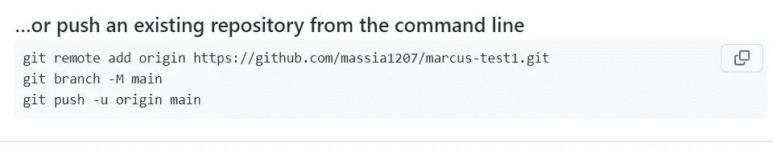
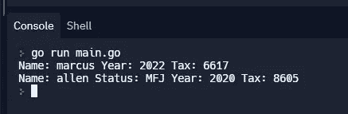

# 创建并托管用于税收计算的 Go 包

> 原文：<https://betterprogramming.pub/go-package-for-taxes-c634924e1ee8>

## 重复使用和共享您的解决方案的超级简单的方法！


雷尼·弗伦奇的《去地鼠》

本文将创建一个 Go 包。Go 标准库附带了大量优秀的包，可以省去重新创建解决方案的麻烦。

需要你的程序打印信息到标准输出？您可以将包“fmt”导入到您的文件中，并通过调用`fmt.Println(“I called fmt”)`来使用 Println 函数。不错！

你******创造的解决方案怎么样？您可能已经意识到您可以在多种场景中重用您的解决方案。

重用 Go 代码的潜在方法:

❌反复将你的解决方案复制粘贴到其他文件中

✔️创建一个可以轻松导入和使用的 Go 包

✔️ ✔️Create 和主机的 Go 包，任何人都可以导入和使用

# 我们的使用案例

作为[纪念碑会计](https://www.monumentcpa.com)的会计，你有时需要计算税金。你的一些客户是负责任的公民，喜欢预测他们的年度税收，并做出估计付款。你想帮助客户确定正确的付款，但是，你知道…数学。

税级和税率每年都在变化。美国的税收制度是累进的。这意味着税率随着收入的增加而上升。它也是一个分级系统。这意味着前 10，000 美元的收入按 10%征税，接下来的 30，000 美元的收入按 12%征税，等等。哦，如果你是已婚、单身或被认为是一家之主，括号的设置会有所不同。嗯，这有点糟糕。

你知道你不能只是告诉你的客户支付 20%的统一费率。你知道你会在很多年里为很多客户清洗和重复这些计算。你知道还有其他会计师和顾问想避免繁琐的税务计算。你知道你已经厌倦了谷歌搜索“[插入年份]税级”。

# 我们的解决方案

*   使用 Go 解决税收问题
*   在 Github 上托管我们的 Go 解决方案
*   每当我们需要计算税收时，导入税收包

注意:本文中使用了以下 Go 概念:结构、函数、方法、接口、映射和切片。查看 https://go.dev/doc/[了解更多信息。](https://go.dev/doc/)

# 我们的 Go 文件

让我们首先在我们的计算机上创建一个名为`taxgo`的文件夹。接下来，我们将在`taxgo`文件夹中创建文件`tax.go`。

我们将根据纳税人信息计算税款。让我们在一个结构中定义我们的`Taxpayer`。注意，这个包被命名为`tax`。

下面是我们到目前为止的`tax.go`:

我们需要每个纳税人的信息

`Taxpayer`结构中的`Status`是报税状态。我们需要选择一组与现状相匹配的税级。

我使用以下缩写来表示归档状态:

*   IND:个人
*   MFS:已婚人士分开申报
*   MFJ:夫妻共同申报
*   HOH:户主

每一组税级都有一个备案状态和一组累进税率的累进门槛(为什么这么复杂！).以下是税级的结构:

现在我们可以创建一个计算联邦税的方法。方法`fedtax`有一个纳税人接收者参数，并返回一个 float64 数字。

```
func (tp Taxpayer) fedTax() float64 {}
```

让我们制作一些地图。我们的第一张地图是税率地图。我们的税率图的关键字是 Year，值是包含税率的一部分 float64。这是`fedTax`方法的一部分。

```
rates := make(map [int] []float64) think: rates[Year] = [tax rates … ]
```

fedTax 方法中的比率映射

我们的收入等级图也将使用年份作为关键字。该值将是类型为`Bracket` ( *提醒:类型括号中有状态和阈值字段)*的切片

```
brackets := make(map[int] []Bracket) think brackets[Year] = {Status, Thresholds … }
```

fedTax 方法中的括号映射

是时候进行数学运算了。我们需要为我们的`taxpayer`找到正确的年份和状态，以便在税收计算中使用正确的一组等级和税率。

让我们定义变量`myBracket`来保存`Taxpayer`接收到`fedTax` 方法中的正确括号。

我们将遍历括号映射，并根据`Taxpayer`信息追加正确的收入括号集(*这就是我们拥有纳税人结构的原因)。*

fedTax 方法中的括号范围

我们的`fedTax`方法现在有了正确的一组括号来计算税收。税款计算将是按每个税率计算的金额总和(基于`Taxpayer`的年份、身份和收入)。

我们宣布可变税，以保持价值，因为它通过每个税级和税率组合增加。我们遍历纳税人的括号。如果纳税人的收入大于其等级的当前迭代(var `myBrackets`)，则加到 var `tax`的税额为:(其收入的出租人和该等级的顶部)*(该等级&年的税率)。

把每个等级的税加起来。仍在 fedTax 方法中。注意:从 Go 标准库导入的数学包

那很容易！但是，有一个问题。我们故意避开最高的税级(嘿，这当然不是我的个人税级！).

如果纳税人处于最高等级(收入>最高起征点金额)，我们会将最高等级的税额添加到`tax`变量中:

顶部支架计算。fedTax 方法返回税收值。

税收现在从`fedTax`方法返回。完事了吗？我们可能完了。

我们也可以把这个`taxgo`方案设置得在未来更加稳健。也许当这个忙碌的会计有空的时候😆

我们的`taxgo`包还可以包含各种州税、资本收益税或个体户税的方法。让我们添加一个`Taxes`接口和一个接受类型`Taxes`的`Calc`函数。

税接口和计算功能

# 推到 GitHub 并测试

1.  本地运行 Git init
2.  添加并提交 tax.go. `git commit -am “initial commit”`
3.  在 GitHub 上创建一个与本地目录同名的存储库`taxgo`
4.  不要选择创建一个自述文件
5.  复制并粘贴下面的终端命令(将为您填充您的用户名和 repo)



6.为测试创建一个新文件。我要跳到 [Replit](https://www.replit.com) 上，有一个干净的环境来测试这个包。

7.创建一个 main.go 文件并在控制台中运行`go get github.com/massia1207/taxgo`。

8.设置一两个试验`Taxpayer`并打印一些结果。

导入 taxgo 包



运行 main.go 的结果

想在电子表格中直接计算税款？在[Google Workspace market place](https://workspace.google.com/marketplace/app/tax_functions/925755930014)中查看[税务功能](https://taxapp.monumentcpa.com)。