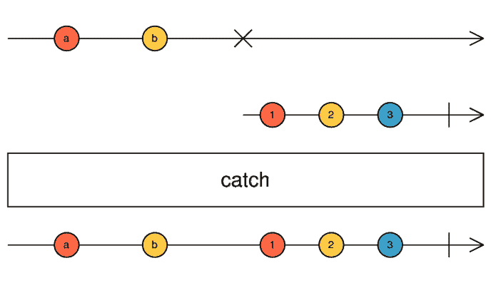
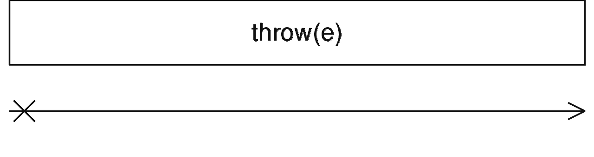

# 与角度异步管道反应

> 原文：<https://betterprogramming.pub/go-reactive-with-angular-async-pipe-b290988f4000>

## [有角度的](https://medium.com/@lorenzozar/list/angular-5496c492a185)

## 订阅模板中的一个`Observable`或`Promise`并获取它发出的最新值


根据 [Roma Kaiuk](https://unsplash.com/@roma_kaiuk?utm_source=unsplash&utm_medium=referral&utm_content=creditCopyText) 在 [Unsplash](https://unsplash.com/s/photos/pipe?utm_source=unsplash&utm_medium=referral&utm_content=creditCopyText) 上拍摄的照片建造的角形管道

我们可以使用 Angular 异步管道从模板中访问一个可观察对象或一个承诺。

[angular 文档](https://angular.io/api/common/AsyncPipe#description)很好地描述了异步管道:“*异步管道订阅一个可观察或承诺，并返回它发出的最新值。*”。

我将在这里展开一点:

*   当组件初始化时，异步管道订阅一个可观察的或承诺。
*   它返回承诺发出的或可观察到的每个值。
*   当发出一个新值时，异步管道标记要检查更改的组件。它运行更改检测来相应地更新 UI。
*   当组件被破坏时，异步管道会自动取消订阅，以避免潜在的内存泄漏。

最后一点特别令人兴奋，因为我们不需要手动退订！

# 实践中的角异步管道

我们来看看下面的角度应用。

## 类别组件

类组件声明了*数字*变量。变量是数字数组类型，它被初始化为`[1, 3, 5, 7, 9]`。

```
import { Component } from '@angular/core';...
export class AppComponent{
  numbers: number[] = [1, 3, 5, 7, 9];
}
```

该模板使用*数字*为*数字*数组中的每个元素显示一个段落。每个段落显示数组中的一个项目。

此时，我们正在模板中使用`*ngIf="numbers"`。这是多余的，但以后会有用的。此外，这是一种处理有条件情况的简单方法。

```
<div *ngIf="numbers"> <p *ngFor="let n of numbers">{{ n }}</p></div>
```

现在，我们将使代码具有反应性。

首先，当组件初始化时，我们导入 OnInit 来初始化新的可观察对象。

```
import { Component, OnInit } from '@angular/core';

...
export class AppComponent implements OnInit{
  numbers: number[] = [1, 3, 5, 7, 9];

  ngOnInit() {}
}
```

其次，我们将变量*的名称数字*改为`Observable<number[]>`类型的`numbers$` 。美元符号`$`是一种惯例，表示变量是可观察的。

最后，我们将由`of`创建的可观察对象分配给可观察属性`numbers$`。简而言之，[内置函数](https://www.vitainbeta.org/hands-on-3-rxjs-of-rxjs-from/) `[of](https://www.vitainbeta.org/hands-on-3-rxjs-of-rxjs-from/)`将参数转换成可观察的序列。

下面是 app.component.ts 中的代码:

## 模板

我们使用模板来使用 Angular 异步管道，并获得由`numbers$` Observable 返回的值。

1.  首先，我们检查是否用`*ngIf=”numbers$”`定义了`numbers$`可观测值，
2.  然后，我们通过异步管道(如`”numbers$ | async”`)传输`numbers$`可观察对象，以访问其发出的值。正如我们上面所说的，angular 异步管道自动订阅可观察对象并处理取消订阅。
3.  通过使用`as numbers`，我们将发出的值赋给一个可以在模板中使用的变量。在我们的例子中，*数字*将是一个数字数组。
4.  最后，我们使用 ngFor 中的 *numbers* 变量，遍历数组中的项目，为每个项目生成一个新段落。

```
<div *ngIf="numbers$ | async as numbers"> <p *ngFor="let n of numbers">{{ n }}</p></div>
```

# 使用角形异步管道的好处

以下是使用异步管道的一些主要好处:

*   不需要订阅
*   无需退订
*   更好的变化检测

变化检测指的是当底层数据发生变化时更新 UI 的能力。由于变化检测，用户界面将始终显示组件的最新数据。

最常见的变化检测策略是

*   **默认**。它使用默认的`checkAlways`策略。当检测到任何变化时，检查每个组件
*   **按下**。它只在`@Input`属性改变、事件发出或 Observables 发出时检查组件的变化。这样，推送策略通过使用 *CheckOnce* 策略来最小化变更检测周期。

通过在模板中绑定一个可观察对象，我们遵循推送策略。为了启用这个变更检测策略，我们需要在组件装饰器中设置它，如下所示:

```
@Component({
  templateUrl: './app.component.html',
  changeDetection: ChangeDetectionStrategy.OnPush,
})
```

# 用 catchError 处理错误

如果我们得到一个错误，可观察的流停止，不再发出任何项目。因此，正确捕捉和处理错误非常重要。

RxJS `[catchError](https://rxjs.dev/api/operators/catchError)` [运算符](https://rxjs.dev/api/operators/catchError)是一个错误处理运算符:

1.  它订阅输入流。
2.  如果出现错误，`catchError`取消订阅输入流，并返回一个替换可观察值。如果没有错误发生，输入流将向输出流发出项。
3.  然后，它根据错误的发生创建一个输出流。它可能会选择性地再次抛出一个错误。

如文档中所述，`catchError`*通过返回一个新的可观察对象或抛出一个错误*来捕获待处理的可观察对象上的错误。[…] *处理来自源可观测值的错误，并将它们映射到新的可观测值。*”。

因此，我们可以推断出两种基本的错误处理策略:

*   捕捉和替换
*   接住并再次抛出

两种策略都使用了`catchError`操作符。

## 捕捉和替换

使用捕捉和替换策略，我们捕捉错误并用更适合继续的内容替换它:

*   发出一些替代数据的可观察值
*   发出空值的可观察对象
*   [空 rxjs 常量](https://rxjs.dev/api/index/const/EMPTY)。`EMPTY`常数定义了一个不发射任何项目并完成的可观察对象。

使用捕捉和替换策略，`catchError`用新的可观测值替换错误可观测值。

```
// Catch & Replace StrategycatchError((err) => { this.errorMessage = err;
    return EMPTY;})
```

[rxjs 文档](https://rxjs.dev/api/index/function/catchError)中的大理石图很好地解释了这个策略。

箭头代表可观察值，而大理石代表发射值。

在下面的`catchError`大理石图中，我们看到一个可观察对象在遇到 X 符号表示的错误之前发出值`a`和`b`。

使用捕捉和替换策略，`catchError`捕捉错误并发出值 1、2、3 和 complete，用|符号表示。



rxjs catchError 运算符的大理石图

由于这种方法，最终的结果将看起来像一个发出 a、b、1、2、3 和 complete 的单个可观察的流。

## 接住并再次抛出

catch & rethrow 策略通过使用 rxjs [throwError 创建操作符](https://rxjs.dev/api/index/function/throwError)返回一个替换可观察值。

throwError 操作符“*创建一个可观察对象，该可观察对象将创建一个错误实例，并在订阅后立即将其作为错误推送给消费者*。该运算符不发出任何项目。

throwError 运算符是一个创建运算符:

1.  它创建并返回一个不发射任何项目的替换可观察对象。从技术上讲，它返回`Observable<never>`
2.  它发出一个错误通知，并停止新创建的可观察对象。

这种策略通常用于错误传播。

```
// Catch & Rethrow Strategy

catchError((err) => {

    return throwError(err);})
```

文档字面意思是“*只是错误，不做其他事情*”。



大理石图(？)的操作符

# 摘要

*   使用角度异步管道来避免手动使用订阅和取消订阅。此外，在 Angular 中使用 [RxJS 声明模式是一个好方法](/rxjs-declarative-pattern-in-angular-cafba3983d21)
*   角度异步管道优化了变化检测
*   通过使用 catch & replace 或 catch and rethrow，用`catchError`处理错误