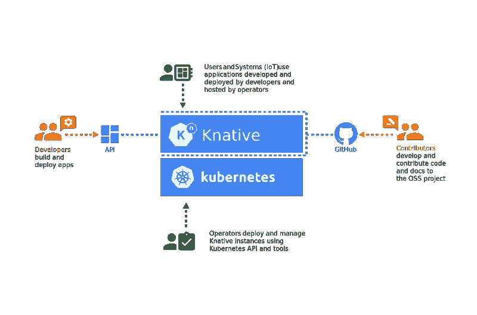
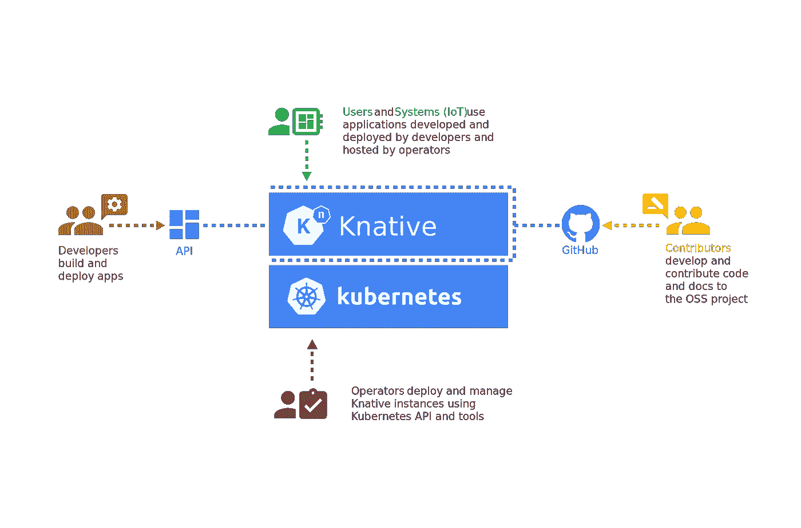
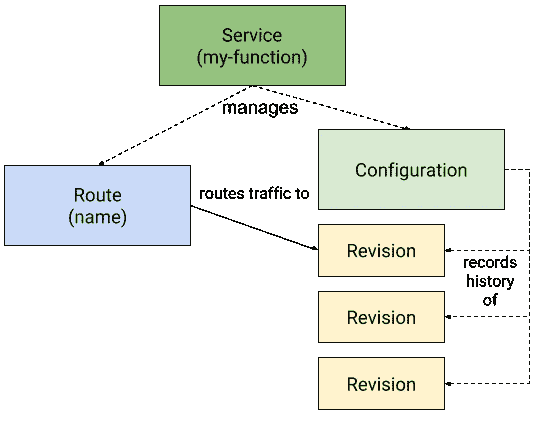

# 使用 Knative 在 Kubernetes 上进行无服务器操作

> 原文：<https://betterprogramming.pub/go-serverless-on-kubernetes-with-knative-b3aff3dbdffa>

## 如何才能两全其美



如果你已经在使用 Kubernetes，你可能听说过无服务器。虽然这两个平台都是可扩展的，但 serverless 更进一步，为开发人员提供运行代码，而不用担心基础设施，并通过从零开始虚拟扩展您的应用程序实例来节省基础设施成本。

另一方面，Kubernetes 提供了零限制的优势，遵循传统的托管模式和先进的流量管理技术，帮助您做一些事情，如蓝绿部署和 A/B 测试。

Knative 试图创造两个世界中最好的一个。作为一个开源的云原生平台，它使您能够在 Kubernetes 上运行您的无服务器工作负载，提供 Kubernetes 的所有功能，以及无服务器的简单性和灵活性。

因此，虽然您的开发人员可以专注于编写代码，并通过一个命令将容器部署到 Kubernetes，但 Knative 可以通过处理网络细节、自动缩放到零以及修订跟踪来管理应用程序。

它还允许开发人员使用其事件框架编写松散耦合的代码，提供事件的通用订阅、交付和管理。这意味着您可以声明事件连接，并且您的应用程序可以订阅特定的数据流。

由谷歌牵头，这一开源平台已被云原生计算基金会采用，这意味着你不会遇到供应商锁定——这是当前基于云的无服务器 FaaS 解决方案的一个相当大的限制。您可以在任何 Kubernetes 集群上运行 Knative。

# 易受骗的观众

Knative 帮助各种各样的受众，每个受众都有特定的专业领域和职责。



图片来源: [Knative docs](https://knative.dev/docs/images/knative-audience.svg)

因此，当您的操作人员可以专注于管理 Kubernetes 集群以及使用 kubectl 安装和维护 Knative 实例时，您的开发人员可以专注于使用 Knative API 接口构建和部署应用程序。

这给了任何组织巨大的权力，因为现在不同的团队可以专注于他们的专业领域，而不会互相影响。

# 为什么你应该使用 Knative

大多数运行 Kubernetes 的组织在管理部署和运行工作负载方面都有一个复杂的运营流程。这导致开发人员关注他们不应该过于担心的细节。开发人员应该专注于编写代码，而不是担心构建和部署。

Kubeless 有助于简化开发人员在 Kubernetes 上运行代码的方式，而无需了解太多 Kubernetes 的内部细节。

Kubernetes 集群占用基础设施资源，因为它要求所有应用程序至少运行一个容器。Knative 为您管理这一方面，并负责从零开始自动扩展集群中的容器。这使得 Kubernetes 管理员可以将大量应用打包到一个集群中。

如果您有多个峰值时间不同的应用程序，或者如果您有一个具有工作节点自动伸缩的集群，那么您可以在空闲时间从中受益匪浅。

这是微服务应用的金矿，这些应用可能需要也可能不需要在特定时间运行微服务。它促进了更好的资源利用，您可以用有限的资源做更多的事情。

除此之外，它与事件引擎集成得非常好，并且为您提供了设计解耦系统的无缝体验。您的应用程序代码可以完全不受任何端点配置的影响，并且您可以通过在 Kubernetes 层中声明配置来发布和订阅事件。对于复杂的微服务应用来说，这是一个相当大的优势。

# Knative 如何工作

Knative 使用 Kubernetes 操作符和 CRD 公开了`kn` API 接口。使用它，您可以通过命令行部署应用程序。在后台，Knative 将创建所有的 Kubernetes 资源(如部署、服务、入口等)。)来运行您的应用程序，而您不必为此担心。

请记住，Knative 不会立即创建豆荚。相反，它为您的应用程序提供了一个虚拟端点并监听它们。如果这些端点有一个命中，它就会启动服务请求所需的 pod。这使得 Knative 可以将应用程序从零扩展到所需的实例数量。



图片来源:[主动发球](https://github.com/knative/serving/raw/master/docs/spec/images/object_model.png)

Knative 使用格式为`[app-name].[namespace].[custom-domain]`的自定义域提供应用程序端点。这有助于唯一地识别应用程序。这类似于 Kubernetes 处理服务的方式，但是您需要创建自定义域的记录，以指向 Istio 入口网关。Istio 在后台管理流经集群的所有流量。

Knative 融合了许多 CNCF 和开源产品，如 Kubernetes、Istio、Prometheus、Grafana 和事件流引擎，如 Kafka 和 Google Pub/Sub。

# 安装 Knative

Knative 是相当模块化的，您可以选择只安装所需的组件。Knative 提供了事件、服务和监控组件。您可以通过应用自定义 CRD 来安装它们。

Knative 对每个组件都有外部依赖性和要求。例如，如果您正在安装服务组件，您还需要安装 Istio 和一个 DNS 插件。

由于安装 Knative 相对复杂，我将在另一篇文章中介绍设置，但是对于演示，让我们从安装服务组件开始。

对于此活动，您需要一个正在运行的 Kubernetes 集群。

安装服务 CRDs 和`serving`核心组件:

```
kubectl apply -f [https://github.com/knative/serving/releases/download/v0.17.0/serving-crds.yaml](https://github.com/knative/serving/releases/download/v0.17.0/serving-crds.yaml)
kubectl apply -f [https://github.com/knative/serving/releases/download/v0.17.0/serving-core.yaml](https://github.com/knative/serving/releases/download/v0.17.0/serving-core.yaml)
```

为 Knative 安装 Istio:

```
curl -L [https://istio.io/downloadIstio](https://istio.io/downloadIstio) | ISTIO_VERSION=1.7.0 sh - && cd istio-1.7.0 && export PATH=$PWD/bin:$PATH
istioctl install --set profile=demo
kubectl label namespace knative-serving istio-injection=enabled
```

通过检查 Kubernetes 是否已将外部 IP 分配给 Istio 入口网关，等待 Istio 准备就绪:

```
kubectl -n istio-system get service istio-ingressgateway
```

定义自定义域，并将 DNS 配置为指向 Istio 入口网关 IP:

```
kubectl patch configmap/config-domain --namespace knative-serving --type merge  -p "{\"data\":{\"$(kubectl -n istio-system get service istio-ingressgateway -o jsonpath='{.status.loadBalancer.ingress[0].ip}').xip.io\":\"\"}}"
kubectl apply -f [https://github.com/knative/net-istio/releases/download/v0.17.0/release.yaml](https://github.com/knative/net-istio/releases/download/v0.17.0/release.yaml)
kubectl apply -f [https://github.com/knative/serving/releases/download/v0.17.0/serving-default-domain.yaml](https://github.com/knative/serving/releases/download/v0.17.0/serving-default-domain.yaml)
```

安装 Istio HPA 附加组件:

```
kubectl apply -f [https://github.com/knative/serving/releases/download/v0.17.0/serving-hpa.yaml](https://github.com/knative/serving/releases/download/v0.17.0/serving-hpa.yaml)
```

# 安装 Knative CLI

安装 Knative CLI 很简单。您需要将最新的 Knative CLI 二进制文件下载到您的 bin 文件夹中，或者设置适当的路径。

```
sudo wget [https://storage.googleapis.com/knative-nightly/client/latest/kn-linux-amd64](https://storage.googleapis.com/knative-nightly/client/latest/kn-linux-amd64) -O /usr/local/bin/kn
sudo chmod +x /usr/local/bin/kn
kn version
```

# 运行一个“你好，世界！”应用

现在让我们运行我们的第一个“你好，世界！”Knative 上的应用程序，了解一旦一切就绪，部署是多么简单。

我们用一个样本“你好，世界！”去申请这个演示。这是一个简单的 REST API，它返回`Hello $TARGET`，其中`$TARGET`是一个可以在容器中设置的环境变量。

运行下面的开始:

```
kubectl get pod
No resources found in default namespace.
```

让我们触发`helloworld`服务。

```
$ curl [http://helloworld-go.default.34.71.125.175.xip.io](http://helloworld-go.default.34.71.125.175.xip.io)
Hello World!
```

过了一会儿，我们得到了回应。让我们看看豆荚。

```
$ kubectl get pod
NAME                                               READY   STATUS    RESTARTS   AGE
helloworld-go-zglmv-1-deployment-6d4b7fb4f-ctz86   2/2     Running   0          50s
```

如你所见，当我们第一次击中时，Knative 在后台旋转了一个吊舱。所以我们从零开始扩展。

如果我们给它一段时间，我们会看到豆荚开始终止。让我们看着豆荚。

```
$ kubectl get pod -w
NAME                                               READY   STATUS    RESTARTS   AGE
helloworld-go-zglmv-1-deployment-6d4b7fb4f-d9ks6   2/2     Running   0          7s
helloworld-go-zglmv-1-deployment-6d4b7fb4f-d9ks6   2/2     Terminating   0          67s
helloworld-go-zglmv-1-deployment-6d4b7fb4f-d9ks6   1/2     Terminating   0          87s
```

这表明 Knative 正在根据需求管理 pod。虽然第一个请求很慢，因为 Knative 正在创建工作负载来处理它，但后续请求会更快。您可以根据自己的要求或更严格的 SLA 来微调关闭 pod 的时间。

让我们更进一步。如果您看一下注释，我们已经限制每个 pod 最多处理 10 个并发请求。那么，如果我们加载的函数超出这个范围，会发生什么呢？让我们找出答案。

我们将使用`hey`实用程序来加载应用程序。以下命令在 30 秒内向端点发送 50 个并发请求。

现在让我们看看豆荚。

正如我们所看到的，Knative 随着函数负载的增加而缩放窗格，当负载不再存在时，它会将窗格旋转下来。

# 结论

Knative 结合了无服务器和 Kubernetes 两者的最佳方面，正慢慢走向实现 FaaS 的标准方式。随着 CNCF 采用这一技术，并继续在技术人员中看到巨大的兴趣，我们很快就会发现云提供商将它实施到他们的无服务器产品中。

感谢阅读——我希望你喜欢这篇文章！