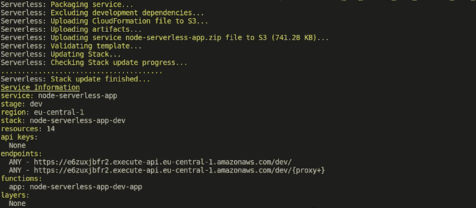

# 使用 Node.js 和 AWS Lambda 实现无服务器

> 原文：<https://betterprogramming.pub/go-serverless-with-node-js-and-aws-lambda-f3c34e1573de>

## 让 Node.js Express API 无服务器运行，并将其部署到 AWS


由[比利·胡恩](https://unsplash.com/@billy_huy?utm_source=unsplash&utm_medium=referral&utm_content=creditCopyText)在 [Unsplash](https://unsplash.com/?utm_source=unsplash&utm_medium=referral&utm_content=creditCopyText) 拍摄的照片。

无服务器架构是高维护、浪费资源的服务器的替代方案。借助无服务器部署，您只需为您所使用的内容付费。它们使您不必处理多个服务器设置及其配置。

因此，毫不奇怪，今天的开发人员正蜂拥而至，让他们的应用程序没有服务器。借助 AWS Lambda 和[无服务器](https://www.serverless.com/)框架，您可以快速部署可扩展的应用程序。

在本教程中，我们将使用 Node.js、AWS Lambda 和无服务器框架来部署一个简单的无服务器 API。

# 关于这些技术

AWS Lambda 是基于云的无服务器服务。Lambda 函数是无状态函数，由事件触发，在执行结束时过期。

鉴于 AWS Lambda 的复杂性，我们使用无服务器框架来简化部署过程。事实上，使用无服务器，只需几个步骤就可以部署节点应用程序。

# 先决条件

要继续学习本教程，您需要设置以下内容:

*   一个 [AWS 账户](https://aws.amazon.com/console/)。如果你只是在尝试 AWS，你可以加入一个免费层，而不必支付一毛钱。
*   在 AWS 控制台中创建 IAM 用户。按照本文中的步骤创建 IAM 用户。在进行下一步之前，请记住保存访问密钥 ID 和秘密访问密钥。

# 安装和设置无服务器

您可以使用 npm 轻松安装无服务器。运行以下命令进行全局安装:

```
npm install -g serverless
```

接下来，使用以下命令用 IAM 密钥配置 Serverless。使用创建 IAM 用户时保存的 ID 和密钥分别作为密钥和机密:

```
sls config credentials --provider aws --key xxx --secret xxx
```

# 创建节点应用程序

我为本教程创建了一个简单的 Hello World 应用程序，但是您可以按照相同的逻辑部署更复杂的应用程序:

正如你在上面看到的，我们使用`serverless-http` npm 包来设置无服务器应用程序，所以确保你已经安装了这个包。您可以使用以下工具安装该库:

```
npm install --save express serverless-http
```

# 创建 serverless.yml 文件

我们使用一个名为`serverless.yml`的文件来传递无服务器配置。对于我们的简单应用程序，它包含以下属性:

这里，`functions`属性列出了应用程序中的所有函数。我们传递一个名为`app`的函数，并使用导出的对`app.js`文件中处理程序的引用作为函数处理程序。

然后，我们需要添加触发给定函数的事件。我们将 HTTP 请求作为触发事件传递。我已经在上面的配置中设置了它，以便在每次发送 HTTP 请求时调用 app 函数。

使用`/{proxy+}`转发每个请求，允许 Express 应用程序自己处理每个请求，而不是在 API 网关级别处理请求。

# 部署应用程序

现在我们已经将配置传递给了`serverless.yml`，部署应用程序只需要一个命令:

```
sls deploy
```

它的输出如下所示:



SLS 部署输出示例

恭喜你！您已经成功地将您的第一个无服务器应用程序部署到 AWS。

您可以通过端点下提供的链接访问部署的应用程序。如果你访问根目录，你会看到“Hello World”的消息

# 特定路径路由

还记得我们如何将所有路由代理到 Express 应用程序吗？虽然这种实现有好处(例如限制冷启动)，但我们错过了从一些无服务器架构特性中受益的机会。

我们可以引入特定于路径的路由，由不同的 Lambda 函数处理，而不是用一个 Lambda 函数路由所有路径。这允许我们使用特定于路径的指标更好地了解应用程序。

在这种情况下，像这样更新`serverless.yml`,以便不同的函数处理每条路径:

# 添加环境变量

如果想将环境变量传递给应用程序，可以使用`environment`属性。

例如，如果你想传递一个`NODE_ENV`变量，你可以这样设置它:

如果你想从一个. env 文件中传递环境变量，你需要使用`serverless-dotenv-plugin`。

首先，将插件作为开发依赖项安装:

```
npm install serverless-dotenv-plugin --save-dev
```

然后，您可以在根目录中创建一个. env 文件，并向其中添加环境变量:

```
STAGE=dev
SECRET=**********
```

一旦在应用程序插件下列出 dotenv-plugin，就可以导入存储的环境变量并在`serverless.yml`文件中使用它们:

# 使用无服务器脱机

到目前为止，我们不得不部署我们的应用程序来执行最简单的路线测试。你只需要在你的应用程序中写 2-3 条新路线，就能意识到这有多烦人。

如果有一种方法可以在将应用程序部署到 AWS 之前对其进行测试，那会怎么样？

通过使用无服务器离线插件，您可以做到这一点。您只需要安装一个新的 npm 包，并在`serverless.yml`文件中添加一行新代码，就可以完成这项工作。

首先，安装软件包:

```
npm install serverless-offline --save-dev
```

然后，更新`serverless.yml`:

```
plugins:
  - serverless-offline
  - serverless-dotenv-plugin
```

现在，您只需运行以下命令来本地启动应用程序:

```
sls offline start
```

它将显示您的应用程序中所有路线的列表。此外，最重要的是，它启动您的应用程序在端口 3000 上本地运行。

现在，您可以通过在浏览器上使用 URL[http://localhost:3000](http://localhost:3000.)访问应用程序路由来测试它们。

# 摘要

与服务器相比，无服务器架构仍处于早期阶段。你可以指望它在未来几年变得更加强大和突出。我希望您第一次使用无服务器和 AWS Lambda 的经历会让您在下次寻找部署选项时尝试一下这项技术。

感谢阅读！