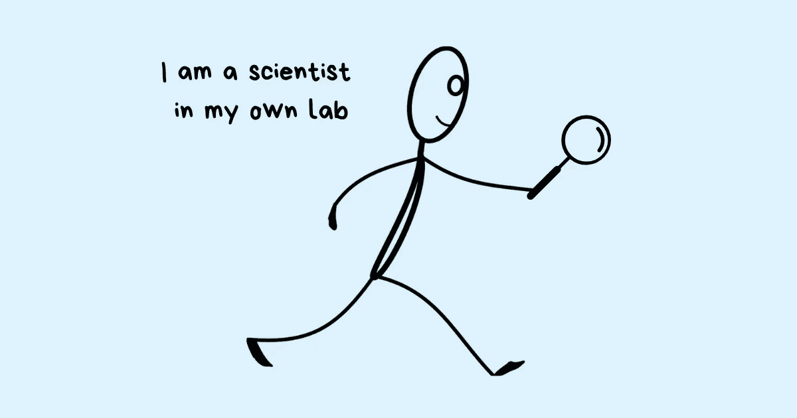
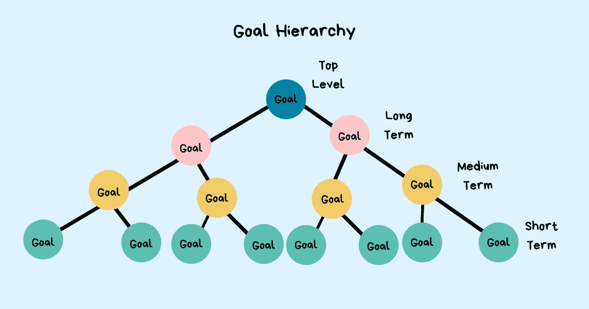

# 目标设定:明确你想去哪里

> 原文：<https://betterprogramming.pub/goal-setting-get-a-clear-fix-on-where-you-want-to-go-c1f9024ea5d6>

## 如何在工作和生活中确定和设定目标

鸣谢:作者

每个人都喜欢在工作中获得成功，但很少有人花时间去定义“成功”对他们意味着什么。它包括加薪或获得一项新技能吗？是因为你的工作得到奖励和认可，还是得到一个大赌注的机会？当你指导他人或者能够独立解决一个棘手的问题时，你会觉得成功吗？

要想成功，你需要首先定义它——驱动你所有行动的东西。给你指引和界限，让你不偏离轨道。一些帮助你计划你的进步的事情。当你感到失落的时候给你指引方向的东西。那是什么东西？最高目标。一个有意识地采纳的目标不仅重要，而且是有目的地行动的唯一方式，而不是对生活抛给你的一切做出反应。

我们大多数人在工作中有很多欲望。我们幻想积极的未来。但是我们总是太忙或者太懒而没有把它们变成目标。没有定义我们想要什么，我们就错过了很多机会。我们未能充分利用每一种情况，让分心的事情侵蚀我们的精力和时间。其中一些分心的事情包括在工作中参与无聊的八卦而不是利用时间学习新的东西，从事无关紧要的任务而不是主动寻找可以帮助我们建立新技能的项目，以及滚动浏览我们的社交媒体订阅源或浪费时间试图进入零收件箱，而这些时间可以用来探索新的想法。

不确定目标还有另一个陷阱——你会陷入“我已经尽力了”的想法

*你知道你的最好成绩是多少吗？*

*如果你还没有定义什么是最好的，你怎么知道这是你最好的？*

在每种情况下都尽力而为，就是报名平庸。这是一个停留在原地的借口，而不是在你能达到的地方付出努力。如果目标设定如此有用，为什么我们如此不愿意去做呢？

因为我们害怕。我们想要没有输入的输出。我们想要回报，却不去面对挑战，不去努力工作以获得回报。我们想要全部，我们想要简单的。毫无疑问，我们生活在梦想中，却无法在现实中执行。

> “目标设定不仅仅是选择你想享受的回报，还包括你愿意付出的成本。真正的挑战不是决定你是否想要这个结果，而是你是否愿意接受实现目标所需的牺牲。你想要随着你的追求而来的生活方式吗？你想要在令人兴奋和迷人的结果之前出现的无聊和丑陋的过程吗？”—詹姆斯·克利尔

# 梦想中的汽车

你梦想中的车是什么样子的？真的，想一想——它是什么颜色，多大，能坐多少人，它有什么特点，那辆车有什么特别之处？

在想象你的梦想汽车时，你是按照老板提供的规格来改装它，还是有自己的版本？你的老板可以帮助你选择梦想中的汽车，并确保你做出正确的投资，但他们不能为你定义梦想中的汽车。你的版本是你自己的。很独特。这对你很重要。目标就像梦想中的汽车。他们是你自己的。它们是你独有的。

想象一年后，回答这些问题:

1.  你想赚多少钱？
2.  你想拥有什么技能？
3.  你想在你的组织中扮演什么角色？
4.  你想解决什么样的问题？
5.  你想和谁一起工作？

如果你的[经理](https://www.techtello.com/what-type-of-manager-are-you/)为你决定这些，你会觉得合适吗？绝对不行。然而，我们大多数人把目标留给了经理。我们让他们限制我们在他们的约束下所能达到的目标。我们做分配给我们的工作，而不是决定如何解决我们想要解决的问题。我们把所有的时间都花在交付一个又一个项目上，却没有确保为我们想要学习的东西创造空间。我们使用项目要求的技能，而不是寻找具有我们想要构建的技能的项目。我们和与项目有关的人一起工作，而不是主动寻找我们想一起工作的人。

说真的，你的经理不能完成他们的工作，也不能对你的成长负责。他们可以为你提供合适的机会，指导你掌握新技能，把你介绍给合适的人，给你指派一个导师，给你想要解决的问题。但是，要做好这一切，你必须首先确定你的目标。你必须管理起来。你必须让他们知道你在追求什么，然后[请求他们的帮助](https://www.techtello.com/how-to-ask-for-help/)把它变成现实。

你需要进行大量的学习和投资。你自己的主动性将决定你的结局。

> “一旦你在自己的实验室里把自己当成一名科学家，你能学到的东西是无限的。重要的不是你在哪里，而是你想去哪里。明确你想去的地方。”
> 
> —大卫·施瓦茨

既然你知道设定目标是你的责任，而不是你的经理的工作——让我们开始设定目标的过程。

# 目标设定的步骤

鸣谢:作者

不要让你的一天成为临时执行的任务，你可以仔细而有目的地组织你的工作，使之成为一个最高目标的一部分——你的最高目标，指导你的行为和所有行动。这个顶级目标位于您的目标层次结构的顶端。安吉拉·杜克沃斯将其描述为“当你不得不将自己的行为划分为许多非常不同的高层次职业目标时，你会非常矛盾。你需要一个内部指南针，而不是两个、三个、四个或五个。”这个内在的指南针是你的最高目标。

下一步是你的长期目标。不像大多数人建议展望未来三到五年，我建议把你的长期目标想成是你想在一年后实现的事情。这是你全年最重要的关注点。

下一个层次是多个中期目标，通常需要 3-6 个月才能完成。你为自己设定的所有中期目标都会融入到你的长期目标中。最后，你的短期目标位于层级的最底层。短期目标需要 1-2 周完成，并与您的中期目标保持一致。

要为自己设定目标:

1.  从你的顶层目标中选择一个你想在下一年完成的子目标。这是你的长期目标(一年目标)。
2.  选择一个你可以在未来 3-6 个月内完成的中期目标。理想情况下，这是你长期目标的一大部分。
3.  找到一个你能在 1-2 周内完成的短期目标。
4.  现在开始工作，集中精力完成这个短期目标。一旦完成，选择下一个短期目标来实现你的中期目标。
5.  一旦中期目标完成，选择一个新的中期目标来实现你的长期目标(一年目标)。
6.  一旦你的长期目标完成，选择另一个长期目标，重复这些步骤。

这里有一个**设定目标的例子**:

长期目标(1 年):将平台指标提高 20%
中期目标(3-6 个月):将平台指标提高 10%
短期目标(1-2 周):将产品的响应时间从[A]提高到[B]
短期目标(1-2 周):将外部 API 调用的失败率从[C]降低到[D]

> “对我们大多数人来说，更大的危险不是我们的目标太高而无法实现，而是目标太低而无法实现。”
> 
> —米开朗基罗·博那罗蒂

在 Edwin Locke 和 Gary Latham 的一项研究中，两位杰出的组织心理学家发现，详细说明需要完成什么(具体的)并为成就设定高标准(挑战性的)的目标会比模糊的或设定低标准的目标产生更好的表现。

在设定这些目标时，不要把目标定得太低。不要以尽力而为为目标。不要因为害怕失败而退而求其次。不要让你的[固定思维](https://www.techtello.com/fixed-mindset-vs-growth-mindset/)限制了你的成就。

> “你对自己的看法深刻地影响着你的生活方式。它可以决定你是否成为你想成为的人，是否完成你所看重的事情。”—卡罗尔·德韦克

设定具体的、具有挑战性的目标。

# 如何选择正确的目标

当你遵循上述过程中的步骤时，你是否努力为自己设定正确的目标？这并不罕见。我们大多数人发现，当这么多其他目标争夺我们的注意力时，很难在一整年内专注于一个长期目标。我们也可能很难将一个长期目标分解成一系列相互匹配的中期和短期目标。但是，现在不是了。

我将帮助您确定目标层次结构中的所有目标。

## 如何确定顶级目标

你的最高目标是你的镜头，引导你在工作中的所有想法、言语和行动。给你指引和界限，让你不偏离轨道。它就像一个指南针，为它下面的所有目标提供方向和意义。它帮助你保持联系，即使在你最困难的时候和挫折。

为了确定你的最高工作目标，问自己以下问题:

1.  你想做什么改变。(对你来说什么是重要的)
2.  为什么要做呢？(您实现此目标的动机)
3.  为了实现这一目标，你愿意付出什么代价？(总会有取舍)

最高层次的目标设定需要一点思考和极大的耐心。你可能不会在第一天就得到答案，但是如果你继续研究这些问题，正确的答案总有一天会出现。

## 如何选择一个长期目标

1.  写下 20-25 个与你的最高目标一致的职业目标。
2.  重温上面创建的列表，确定可以合并成一个主要目标的目标。在这些目标中寻找模式和共同的主题。
3.  对于这些目标中的每一个，在重要性等级上给 1-10 分，1 表示最不重要，10 表示最重要，然后在兴趣等级上给 1-10 分，1 表示最不感兴趣，10 表示最感兴趣。
4.  选择在重要性和兴趣量表上得分最高的目标作为你的长期目标。多个目标不太可能具有相同的重要性和兴趣分数。如果他们这样做，十有八九他们是同一个目标的一部分。重新思考如何将它们结合成一个长期目标。
5.  与您的经理合作，将此设定为您下一年的目标。

## 如何确定短期目标

为了识别和连接适合你长期目标的短期目标，使用一个由马克·乔伊纳发明的叫做逆向规划的简单系统。它是这样工作的:

1.  从一个明确的最终状态开始——一个有明确结果的明确目标。这是你在上一步中确定的长期目标。
2.  然后问你自己，“就在这个最终状态实现之前，我最不想做的事情是什么？”
3.  然后弄清楚在这一步之前你需要做什么，再往前一步。
4.  以此类推，直到第一步。第一步是你的第一个短期目标。

使用这个过程，你可以确定你的短期目标，并将它们组合成多个中期目标，这些中期目标组合在一起形成你的长期目标。

你的目标并不是一成不变的，你需要在前进的过程中根据自己的情况调整它们。目标只是第一步。你需要可持续的、可重复的系统来实现你的目标。系统坚持，工作，给你有用的反馈，这样你就不会对自己的进步视而不见。就像目标一样，你也要对自己的系统负责。如果有些东西不工作，你可能需要检查你的系统，并作出必要的修正。

你很容易将自己无法实现的事情归咎于他人。很难接受你对自己的情况百分之百负责。决定你在工作中想要什么，承担全部责任，尝试，寻求帮助，寻求[反馈](https://www.techtello.com/one-on-one-meetings/)并在过程中做出调整。

小而持续的进步会累积成重大的人生目标。

> “你永远不知道拐角处会发生什么。可能是一切。也可能什么都不是。你一直一步一步地往前走，然后有一天你回头看，你已经爬上了一座山。”—汤姆·希德勒斯顿

# **总结**

设定目标将你的梦想变成现实:

1.  确定你的最高目标。这是你工作的方向。
2.  把你的长期目标定为一年。这是最重要的工作，也是最能激发你兴趣的工作。
3.  确定有助于实现长期目标的中期(3-6 个月)和短期(1-2 周)目标。
4.  保持你的长期目标和所有目标的明确性和挑战性。
5.  为你的目标承担 100%的责任。如果你面临挑战和挫折，试着纠正你的系统，而不是把你的失败归咎于他人。
6.  根据反馈和新的知识调整你的目标。
7.  与您的经理一起努力实现这些目标。

*原载于 2021 年 4 月 22 日*[*【https://www.techtello.com】*](https://www.techtello.com/goal-setting/)*。*