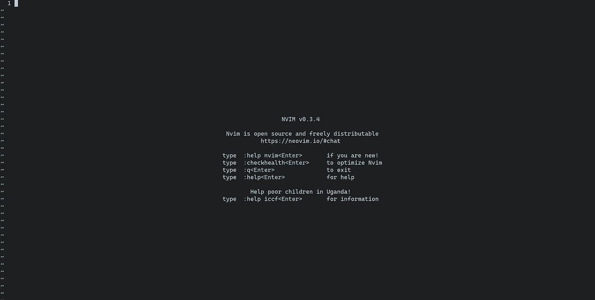
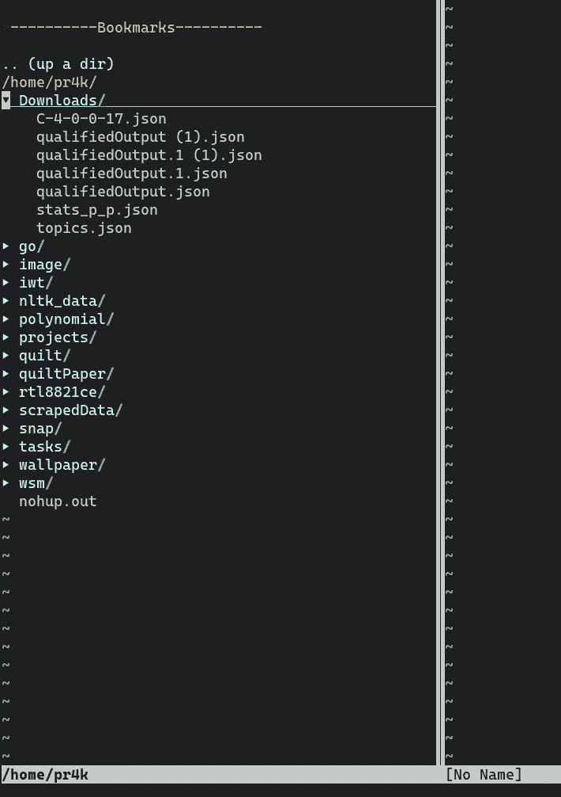
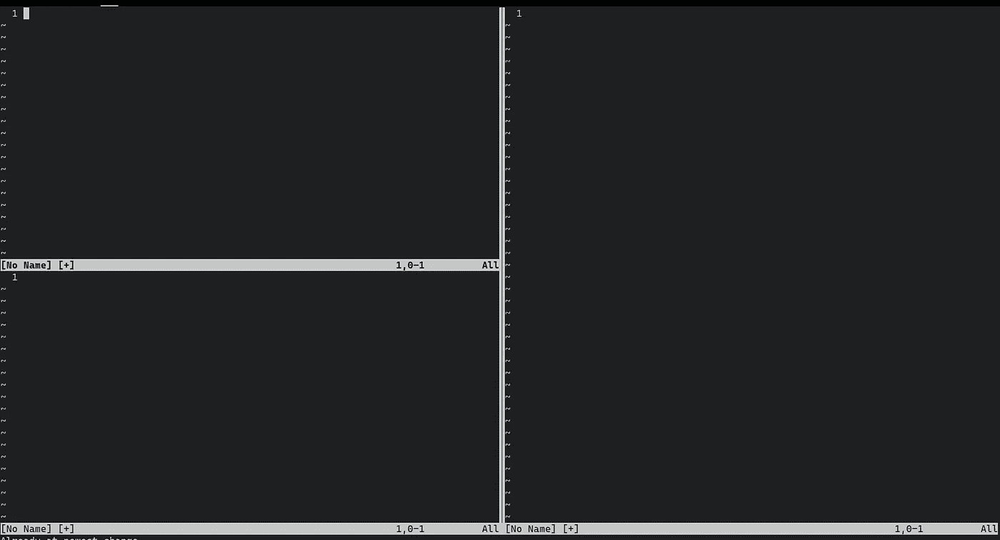

# 以 Neovim 为日常驾驶员继续前行

> 原文：<https://betterprogramming.pub/going-forward-with-neo-vim-as-a-daily-driver-8624489d0143>

## 使用 Neovim 作为日常驱动程序——基于终端的文本编辑器的力量超乎想象


[Paul Zoetemeijer](https://unsplash.com/@paul_1865?utm_source=unsplash&utm_medium=referral&utm_content=creditCopyText) 在[un plash](https://unsplash.com/s/photos/typing?utm_source=unsplash&utm_medium=referral&utm_content=creditCopyText)上拍摄的照片

首先是一个问题:当我们拥有了 [VS Code](https://code.visualstudio.com/docs) 的全部功能以及所有花哨的格式和模块时，为什么我们需要一个基于终端的文本编辑器？

答案很简单。

*   VS Code 以电子为核心，这意味着它需要大量的内存。
*   因为 [Neovim](https://neovim.io/doc/) 是一个基于终端的文本编辑器，它使您能够在任何 Linux 中编码，即使没有显示管理器或云、虚拟机或 Docker 容器，您得到的只是一个终端。
*   由于它是基于终端的，所以您需要的只是一个键盘来完成所有复杂的操作，这意味着一旦快捷方式成为习惯，无论出于什么原因，您都不必将手指从键盘上移开来使用鼠标。

在本文中，我将尝试给出一个工作流程，其中我使用 Nvim 作为我的日常驱动程序，以及所有可以使用的配置，以使 Neovim 的生活更简单。

首先。让我们从安装开始。

# 安装 Neovim

从[官方的 Neovim 安装指南](https://github.com/neovim/neovim/wiki/Installing-Neovim)中可以看出，这里我将只提到一些流行的发行版。

# 人的本质

自 18.04 年以来，通过官方存储库，如同在 Debian 中一样，Neovim 位于 [Ubuntu](https://packages.ubuntu.com/search?keywords=neovim) 中。

```
sudo apt install neovim
```

Python ( `:python`)支持似乎是自动安装的。

```
sudo apt install python-neovim
sudo apt install python3-neovim
```

# macOS / OS X

## 预制档案

[发行版](https://github.com/neovim/neovim/releases)页面提供了 macOS 10.11+的预构建二进制文件。

```
curl -LO https://github.com/neovim/neovim/releases/download/nightly/nvim-macos.tar.gz
tar xzf nvim-macos.tar.gz
./nvim-osx64/bin/nvim
```

## [在 macOS 或 Linux 上自制](http://brew.sh/)

```
brew install neovim
```

或者安装 Nvim 的开发版本:

```
brew install --HEAD luajit
brew install --HEAD neovim
```

# Windows 操作系统

## [巧克力](https://chocolatey.org/)

*   版本(v0.4): `choco install neovim`(使用`-y`自动跳过确认信息)
*   开发(预发布):`choco install neovim --pre`

## [独家新闻](http://scoop.sh/)

*   发布:`scoop install neovim`
*   开发(预发布):

```
scoop bucket add versions
scoop install neovim-nightly
```

# 基础

在我们设置完 Vim 之后，让我们先弄清楚一些基础知识，比如如何开始使用 Vim 和做一些基本的事情。

*   *h* 将光标向左移动一个字符。
*   将光标下移一行。
*   将光标向上移动一行。
*   *l* 将光标向右移动一个字符。
*   *0* 将光标移动到行首。
*   *$* 将光标移动到行尾。
*   *w* 向前移动一个单词。
*   *b* 向后移动一个单词。
*   *G* 移动到文件末尾。
*   *gg* 移动到文件的开头。
*   *`。移动到最后一次编辑。*

同样，这里有一个更长的命令列表，您肯定想从这里开始了解:

*   *d* 开始删除操作。
*   *dw* 会删除一个字。
*   *d0* 会删除到一行的开头。
*   *d$* 将删除到一行的末尾。
*   *dgg* 会删除到文件的开头。
*   *dG* 会删除到文件末尾。
*   *u* 将撤销上一次操作。
*   *Ctrl-r* 将重做最后一次撤销。

以下是您开始时最需要的命令:

*   *v* 一次高亮显示一个字符。
*   *V* 一次高亮一行。
*   *Ctrl-v* 按列高亮显示。
*   p 在当前行后粘贴文本。
*   P 在当前行粘贴文本。
*   y 将文本拉入复制缓冲区。

所以不要强求它们——一旦你开始使用它们，这将成为你的肌肉记忆。

# 自定义 Vim

这是我的 Neovim 现在的样子。



它有一个搜索栏或文件浏览器，就像 VS 代码一样。



Neovim 还允许你拆分你的文本编辑器。



现在我将分享我的 Neovim 配置。复制到你的 Neovim config 文件夹，一般在`.config/nvim`。

如你所见，`Plug`行显示了我正在使用的所有插件。其中最好的是[书呆子树](https://www.vim.org/scripts/script.php?script_id=1658)和 google [vim-codefmt](https://github.com/google/vim-codefmt) ，

书呆子树允许你有掺杂边文件资源管理器和 codefmt 自动格式化代码。

除此之外，还有一些自定义快捷键映射到组合键。例如，ctrl+b 打开一个书呆子树窗口。

# 如何进行切换

相信我，我从 VS 代码转换到 Nvim 的那天，是很艰难的。甚至关闭 Nvim 窗口也成了一个挑战。但是一旦您开始使用它一段时间，在 Vim 环境之外的任何地方编码或编写都变得很困难。我都不知道在 Medium 上打字的时候在这里打了多少次 *:w* :。

我的观点是:不要对自己太苛刻，但是要养成一种习惯，任何小的代码更改都要使用 Vim 来完成。如果要开发一个完整的项目，只需切换到类似于 [Sublime](https://www.sublimetext.com/) 或 VS 代码的东西。

感谢您的阅读，如果您需要任何帮助，请在评论中告诉我。

祝你好运！