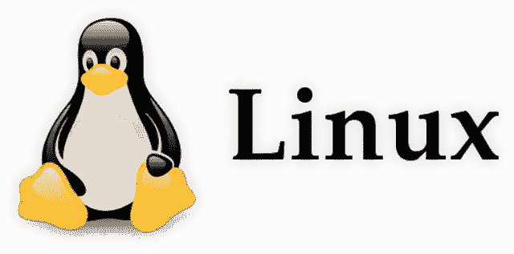
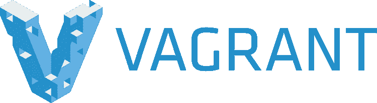
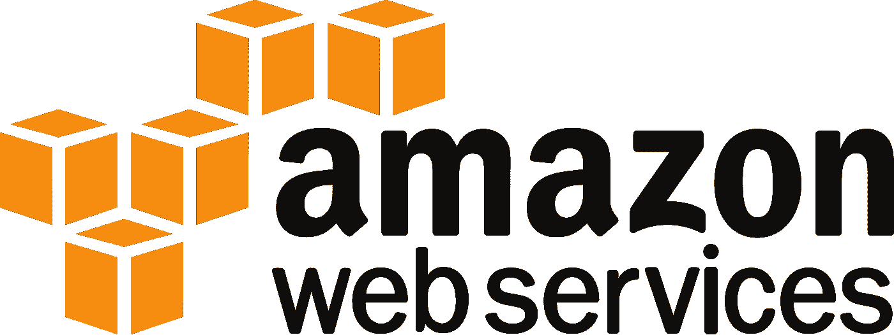

# 从 IT 到 DevOps

> 原文：<https://betterprogramming.pub/going-from-it-to-devops-996192520331>

[Kobu 机构](https://unsplash.com/@kobuagency?utm_source=unsplash&utm_medium=referral&utm_content=creditCopyText)在 [Unsplash](https://unsplash.com/search/photos/programmer?utm_source=unsplash&utm_medium=referral&utm_content=creditCopyText) 上拍摄的照片

# 如果你在 IT 行业工作过，这个故事可能听起来很熟悉…

你从技术支持开始，最终成为一个服务台的角色。在这个职位上，你会获得经验，也许会被提升到二级服务台，成为一名 IT 管理员。

从那里，你获得了足够的经验，开始作为一名系统管理员或系统工程师从事系统工作。这是人们通常在角色中遇到的岔口:“我应该更关注代码还是操作？”

好吧，如果你是一名系统管理员，想从事软件或 web 开发，DevOps 几乎总是下一个自然的步骤。

系统管理员和工程师的主要目标是让不同部门的员工能够更有效地共享信息和一起工作。DevOps 工程师在提供效率和优化方面非常相似，但他们将软件开发团队与部署团队联系起来。

许多人仍然不知道如何进入软件开发，觉得他们一生都被困在重启计算机和修理打印机的炼狱中，但是有一条出路(如果你努力工作。)

## 这是给谁的？

首先，让我们弄清楚两件事:

**1。这不是从 IT/运营转向开发运维的唯一途径。**
也不是确定的最佳方式，但却是*我的*方式。你可能有过不同的经历，你的里程可能会有所不同。但这就是我的做法，虽然它可能不是最有效的，但它就是这样进行的。

**2。我们以前都见过这样的话:“DevOps 不是一份工作**——**它是一种文化！”** 是啊，当然。我们明白了。有人说 DevOps 不是一份真正的工作，你的开发和运营团队应该携手合作。无论你想说什么或相信什么，谁会在乎呢。有人领工资，他们的头衔是 DevOps。原来如此。如果你的公司能请得起 DevOps 工程师，那太好了。如果没有，开始将这些哲学融入你当前的团队。

也就是说，这真的是为任何从事 IT 工作的人准备的，他们希望更多地参与到软件开发、web 开发或其他生产方面的工作中。

# 开发运维工具和技能

不管怎样，现在已经解决了这个问题，下面是我关注的关键技能和技术，让我走上了软件开发的道路。

## **操作系统:Linux**

Linux 主宰世界

如果你想进入 DevOps，开始习惯 Linux 吧。即使你没有使用 DevOps，你也应该使用 Linux，因为全世界超过 90%的计算机和系统都使用它。

如果你使用 Mac 作为日常驱动，这是相当容易的。由于 MAC 是基于 Unix 的，许多(如果不是大多数)Linux 命令可以在 MAC 上使用。当您正在进行 Mac 管理，并且希望将日常任务或 SSH 脚本化和自动化到服务器和机器中以执行支持时，这非常有用。稍后会有更多关于这个话题的内容。

## 网络堆栈:灯

最受欢迎的网络堆栈之一

虽然并不总是适用于每个 DevOps 角色，但是学习 LAMP 堆栈帮助我从操作系统层面理解了 web 应用程序的基本原理。我们每天都在使用应用程序，但了解网络应用程序的这些主要组件是如何协同工作的，有助于我处理到底发生了什么，什么时候，为什么。

还有其他的栈，比如 LEMP (Linux，NGINX，MySQL，PHP/Python)和 MEAN，但是我还是选择了 LAMP，因为它是最受欢迎的(我已经很熟悉它了)。底线是，了解 web 应用程序的不同部分是如何工作的。

## 后端语言:Python

非常适合脚本、web 应用程序等

每当有人决定参与 web 或软件开发时，他们几乎总是花费太多的时间来决定他们应该专注于哪种语言。虽然学习特定的语言对特定的角色肯定有好处，但当你刚刚开始学习如何开发应用程序或软件时，选择任何语言并坚持使用它是最重要的部分。

话虽如此，我个人认为系统管理员和未来的 DevOps 工程师应该真正坚持使用 Python。它可能是最容易学习和使用的语言之一:它对人友好，你会发现许多安全工具和框架都是用 Python 编写的。但实际上，这并不重要。在 DevOps 的第一年，我已经使用过 Ruby、Python、Shell，甚至一些 PHP。只要挑一件事，坚持下去。

## 脚本:Bash

习惯在 CLI 中工作

虽然 Python 很棒，但作为一名 Mac 系统管理员，我利用的一点是 Mac 是基于 Unix 的，并且有一个终端。作为一名 Mac 系统管理员，我编写脚本来帮助配置系统和自动化我发现重复的任务(而且我很懒，不想一遍又一遍地做同样的事情)。

例如，我编写了一些脚本，可以在新用户注册时创建用户、安装应用程序和配置打印机设置。通常这项任务需要几个小时，但是谁有时间做呢？有了 Bash 脚本，我可以通过像 Apple Remote Desktop 这样的工具同时配置 5 台甚至 10 台机器，将我的入职时间减少到几分钟，而不是几小时。

## 自动化:Ansible

将基础设施视为自动化的代码

Ansible 是一个开源的 IT 自动化引擎，它可以从您的工作生活中消除繁重的工作，还可以显著提高您的 IT 环境的可伸缩性、一致性和可靠性。您将需要学习 Ansible 的供应、配置管理以及应用程序测试和部署。

一旦我开始编写像用户入职和应用程序安装这样的脚本，我就开始将我的脚本与像[苹果远程桌面](https://www.apple.com/remotedesktop/) (ARD)和 [AutoDMG](https://github.com/MagerValp/AutoDMG) 这样的工具结合起来，以自动化机器的映像。当我发现 Ansible 时，它将我的更多任务合并到一个我可以执行的剧本中。剧本就像菜谱(想想厨师或木偶),然后由它来配置端点。

[这里有一个 GitHub repo，里面有一些不错的 Mac sysadmin 剧本。](https://github.com/geerlingguy/mac-dev-playbook)

## VirtualBox:流浪者

构建开发环境的最好和最快的方法之一

vagger 是一个在单个工作流中构建和管理虚拟机环境的工具。vagger 提供了易于配置、可复制和可移植的工作环境。

需要 Ubuntu 18.04 实例进行测试？一个 CentOS 实例作为临时服务器怎么样？vagger 为开发和测试基础设施管理脚本提供了一个可任意使用的环境和一致的工作流程。

## CI/CD: Jenkins

Jenkins 是 CI/CD 和 DevOps 的关键组成部分

持续集成(CI)和持续部署(CD)是 DevOps 最重要的部分之一，但也是最难掌握和理解的部分之一。Jenkins 可能不是 CI/CD 的最佳工具，但它肯定是最受欢迎的工具之一，而且肯定是行业的主流，尤其是作为开源工具。

作为一个自动化工具，Jenkins 用于构建、测试和启动应用程序的部署，使开发人员能够更容易地将更改和错误修复持续集成到软件中，从而消除了可怕的“推向生产和祈祷”咒语。

如果你对 DevOps 是认真的，了解詹金斯的里里外外，因为你会盯着它很多。

## 云:AWS

AWS 和云是未来

谈到云基础设施和服务，亚马逊网络服务(AWS)是王者。AWS 无需担心服务器供应和物理资产限制，从而帮助公司降低成本、缩短部署时间并增加运营规模。如果你试图进入 DevOps 或软件开发领域，AWS 是必不可少的(Azure 和 Google Cloud 都存在，但与 AWS 的市场份额相比相形见绌)。

AWS 提供数百种服务，但了解核心服务很重要，如 EC2、S3、RDS、Route53 和 Lambda。

AWS 和 DevOps 项目的一个好资源就在 AWS 网站上。

# 结论和资源

真正理解软件开发和 DevOps 的来龙去脉的最好方法是开始自己的项目。你可以整天看 YouTube 教程，整晚读 Medium 帖子，但是直到你真正开始写一些代码，配置服务器，并推动部署，你学到的东西不会一直跟着你。

如果你正在寻找一些项目和教程的想法，AWS 在他们的[网站](https://aws.amazon.com/getting-started/use-cases/devops/)上有很好的资源。

**我在家做的一些项目对我的学习有帮助:**

*   从全新的 Ubuntu 安装开始，配置一个 LAMP 堆栈，部署你自己的网站
*   安装并构建一个 Jenkins 服务器，并练习为部署推送代码
*   创建一个免费的 AWS 帐户，开始使用 ec2、S3 桶和其他 AWS 服务
*   开始构建脚本来自动化您的一些日常任务。
*   构建按文件扩展名组织桌面上文件的脚本，或者构建自动将文件从一个位置移动到另一个位置的脚本

我在里面呆了五年，学到了很多东西。但是如果我知道我刚才看的是什么，我可以将我的软件开发旅程缩短一半，并极大地减少学习时间。

祝你好运，继续编码！