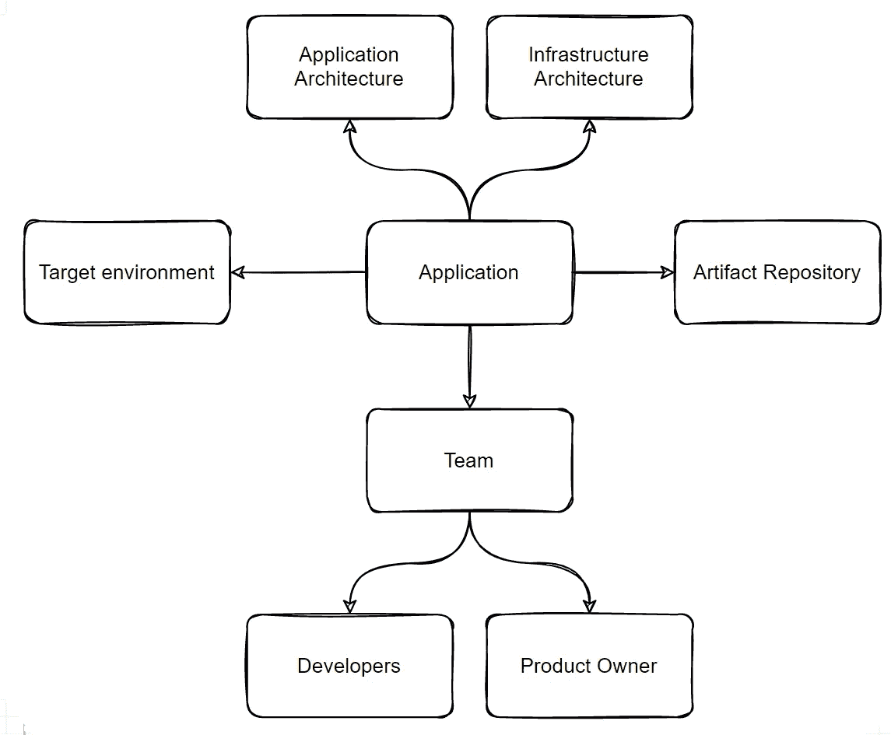
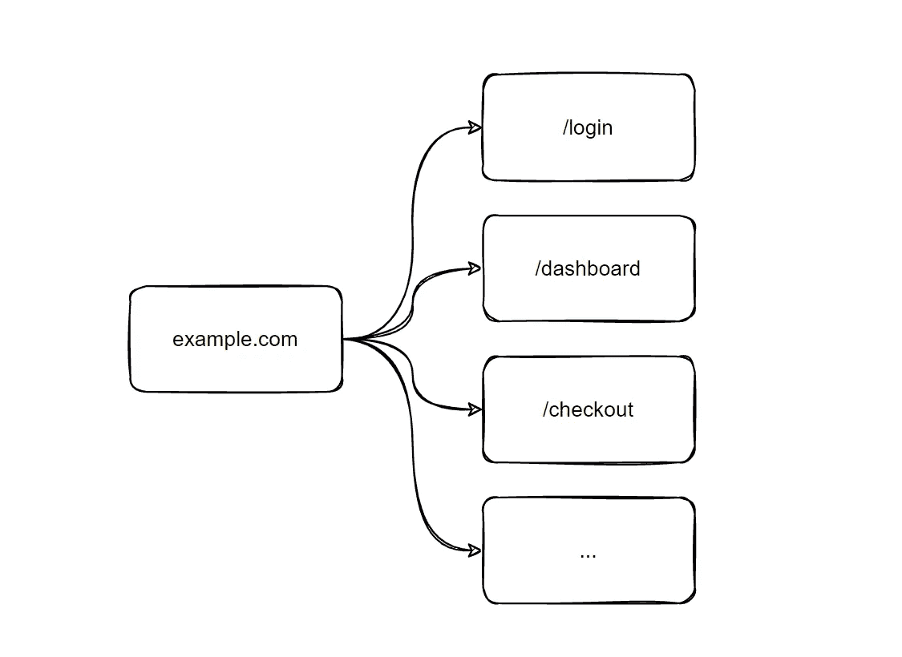
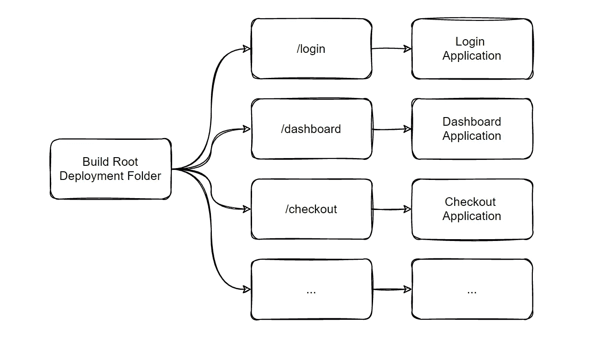

# 通过 Akamai CDN 走向全球，超越无服务器

> 原文：<https://betterprogramming.pub/going-global-and-beyond-serverless-with-akamai-cdn-de91ee6fcf34>

## 第 1 部分:用 GitOps 方法探索未知


照片由[卡斯登·沃斯(➡️@卡斯登.沃斯)](https://unsplash.com/@karsten_wuerth?utm_source=medium&utm_medium=referral)在 [Unsplash](https://unsplash.com?utm_source=medium&utm_medium=referral) 上拍摄

# 新的一年新的挑战

虽然从技术上来说，这与非生产部署没有什么不同，但是生产更改肯定没有那么有趣。显而易见的是，我们拥有的环境越少，管理它们就越容易，因此，涉及的总体风险就越小。

我们主要位于德国，在泰国和印度设有分支机构，我们习惯于为德国市场构建和运行应用程序。然而，我们今年必须面对的挑战之一是将我们的应用程序推广到全球多个组织实体，或者简单地说，多个国家。

在保险行业，我们必须谨慎对待客户数据的存储位置和访问权限。谨慎意味着，

*   物理服务器只有少数授权人员可以访问，
*   数据库和微服务需要来自每个客户端的认证，
*   当然，我们会对传输中的数据和静态数据进行加密。

我们将业务逻辑和数据隐藏在各层防火墙、负载平衡器和微服务之后。需要访问数据的每项新服务都必须经过批准，并部署在安全区域内。

这不是一成不变的，很可能会发生变化，但在可预见的未来，我们最终会在每个国家至少部署一次。

# 全球部署的要求

在我们深入这个主题之前，让我们定义任何生产部署过程的一般需求。

*   它必须得到至少另一个人的批准。
*   它必须需要授权。
*   它必须自动化。
*   它必须在生成服务器上执行。
*   它不能对我们的客户造成干扰。
*   它必须要求发布版本并拒绝快照。
*   它必须要求工件存储在我们的工件库中。
*   它应该存储当前部署的应用程序的版本号。
*   它应该允许回滚。
*   它应该允许分阶段推出。

我们可以将这些要求分为三类:

*   授权(批准、许可)，
*   业务中断(自动化、无停机、回滚、分阶段推出)，
*   合规性(工件存储库、构建服务器、发布版本、版本查找)

仅针对一种环境来遵循这些需求并非不可能。不过，瞄准多个国家让这变得更具挑战性。不同的环境增加了另一个层面，这要求我们提出问题:

*   哪个环境将是第一个收到新版本的环境？
*   一个国家的错误率增加是否会阻止其他国家的部署？
*   我们是否仍能在每个国家自动部署，还是必须手动触发每个部署？
*   我们如何确保新版本与环境兼容？

很多挑战。但是在我们考虑部署之前，让我们先看看如何以及在哪里存储与部署相关的信息，以满足法规遵从性要求。

# GitOps 救援方法

GitOps 专注于多年前被认为没有价值的信息:建立和维护基础设施所必需的数据、工具和脚本。

> GitOps 是一个[运营](https://about.gitlab.com/topics/ops/)框架，它采用了用于应用程序开发的 DevOps 最佳实践，如版本控制、协作、合规性和 CI/CD 工具，并将它们应用于基础设施自动化。
> [什么是 GitOps？| GitLab](https://about.gitlab.com/topics/gitops/)

为什么现在很重要？因为今天的弹性环境根据需求启动和停止服务器和容器，所以我们需要自动复制和重新创建服务器和容器。否则，在最坏的情况下，服务器或容器的重新创建将导致影响客户体验的意外结果。

使用 Git 这样的版本控制系统进行基础设施设置的优势显而易见:它允许我们存储数据、脚本和自动化，并对其进行版本控制。不仅如此，它使我们能够添加任何基于文本的内容，并将其置于 Git 的版本控制之下。

我们确实需要一个地方来存储与部署相关的信息。Git 存储库具有上面提到的优点，并允许开发人员使用他们熟知的 ide 和 web 界面来编辑部署数据。与 confluence pages 相比，将 Git 存储库集成到构建服务器管道中要容易得多。

但是，我们需要在存储库中存储什么数据呢？什么样的存储库结构是合适的？

# 正确的数据和格式

查看我们上面的需求和类别，我们可以使用 GitOps 方法将部署相关的信息存储在 Git 存储库中来满足法规遵从性需求:

*   ✅合规性(构建服务器、发布版本、版本查找)
*   ❌授权(批准、许可)
*   ❌业务中断(自动化、无停机、回滚、分阶段推出)

为了完成我们的任务，我们必须在 GitOps 部署存储库中存储哪些确切的信息？

我们需要应用程序的名称及其发布版本。为了下载工件，我们还需要发布库的名称。关于目标环境/国家的信息将得出部署应用程序所需的最少数据量。

为了有效地管理任何生产或非生产事件，存储联系人非常有用，这样运营团队可以快速与开发人员和产品负责人取得联系。到我们的架构和基础设施文档库的链接可能也是不错的。

下图概述了我们需要存储的数据。它也将作为数据格式的蓝图，我们将在下面描述。



部署所需数据概述。作者图解。

YAML 表示通常非常适合声明性配置文件，因为它对人和机器都是可读的，并且几乎受任何编程语言的支持。

下面的要点展示了我们如何将上面的插图转化为人类和机器可读的文件，其中包含与应用程序、团队和文档相关的信息。

我们可以在 application 键下看到下载工件所需的所有信息，我们还有关于团队的附加信息和到文档的链接。从现在开始，我们将这个文件简称为配置文件。

定义了配置文件格式后，我们可以考虑适合我们多国部署和要求的文件夹结构。

# 一种适合 Akamai CDN 的文件夹结构

Akamai 是一家内容交付和网络安全服务提供商。想象一下 Cloudflare，但只关注企业客户，对个人来说不太容易访问和开放。

> 内容交付网络(CDN)是一组地理上分布的服务器，通过使 web 内容更接近用户来加速 web 内容的交付。
> [..]你可以把 CDN 想象成自动取款机。几乎在每个角落都有提款机可以快速有效地取钱。在长长的银行队伍中没有等待时间，自动取款机被放置在许多方便的位置，可以立即使用。
> [内容交付网络——什么是 CDN？(akamai.com)](https://www.akamai.com/our-thinking/cdn/what-is-a-cdn)

我们计划使用 Akamai CDN 作为我们前端应用的运行时环境。这里的优势是:我们唯一的责任是向 Akamai 提供我们的内容，而 Akamai 负责复制、可用性，并将内容尽可能靠近我们的用户。

就像使用无服务器功能一样，部署和运行应用程序的复杂性对我们来说是完全隐藏的。然而，与 Google Cloud 或 AWS Lambda functions 等无服务器产品相比，它更进了一步，因为我们只提供静态内容。

说到静态内容，我们的应用程序由不同团队开发的许多较小的应用程序组成。然而，对用户来说，它应该看起来像一个集成的应用程序。为了创建一个内聚的应用程序，我们决定将域的维护、路径映射和前端应用程序的部署委托给一个公共的中央 DevOps 团队。

您可以在下图中看到三个示例性的路径和域映射。例如，URL `example.com/login`必须返回登录应用程序，`example.com/dashboard`必须配置为返回仪表板应用程序，等等。



UX 批准的上下文路径示例。作者图解。

Akamai CDN 和底层 [NetStorage](https://www.akamai.com/products/netstorage) 组件的美妙之处在于，我们不仅可以上传单个文件，还可以上传整个文件夹结构。并且上传的文件夹已经可以反映运行时配置。

因此，在准备任何部署时，我们必须将所有相关的工件下载到我们的构建服务器，并将它们放在一个与所需路径映射相匹配的文件夹结构中。



部署文件夹结构的生成时设置。作者图解。

幸运的是，我们已经在前一章中定义了部署配置文件。如上所述，配置文件包含了我们下载工件所需的所有信息。

我们还没有定义的一件事是应用程序版本与国家的关系。我们必须记住，我们不可能总是向所有国家推出最新版本。一个国家可能会在一段时间内停留在旧版本，而其他国家可能总是收到最新版本。

我们最感兴趣的是具体国家的观点。例如，“法国目前部署了哪个版本的仪表板？”是我们希望能够快速回答的一个问题。

因此，将国家作为顶级文件夹是有意义的。此外，每个国家都将收到一部分可用的应用程序。因此，在与可用应用程序相匹配的特定于国家的文件夹中创建嵌套文件夹是合理的。在这些特定于应用程序的文件夹中，我们最终可以存储我们的配置文件。

下面的要点显示了这种文件夹结构如何能够可视化，

*   哪些国家是部署的目标—法国、德国和澳大利亚—以及
*   哪些应用可用— `/checkout`、`/dashboard`和`/login`。

下面是我们查找在法国部署的仪表板应用程序的版本时必须做的事情:

1.  首先，打开名为`france`的文件夹。
2.  然后，打开名为`dashboard`的文件夹。
3.  最后，打开名为`application.yml`的文件。

然后我们会看到之前已经看过的配置文件。

这就是我们使用 Akamai CDN 进行全球部署的 GitOps 方法的基础。在这个故事中，我们讨论了部署面临的挑战，以及带有文件夹结构的标准化配置文件如何解决一些障碍和挑战。

许多问题仍然需要回答。例如:

*   我们如何保证只有授权人员才能开始部署？
*   我们如何确保我们的部署不会导致业务中断？
*   我们能否保留成功部署的日志，以便准确地重建新版本何时可用？

我们将在接下来的故事中回答这些以及更多的问题。

感谢阅读。

```
**Want to Connect?**If you have any feedback or further ideas, you can reach out via Twitter [@stfs](https://twitter.com/stfsy?lang=en)y.
```