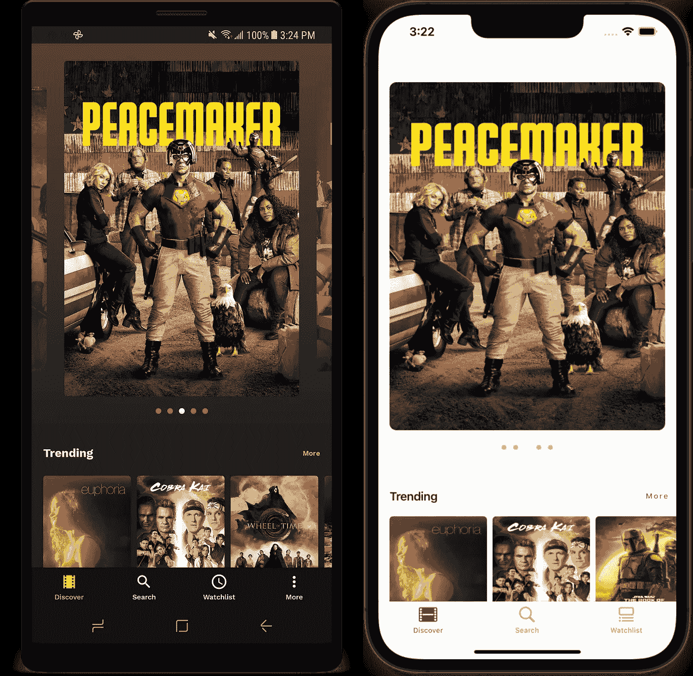
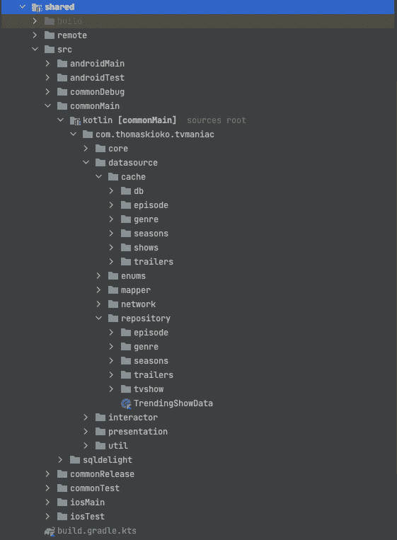
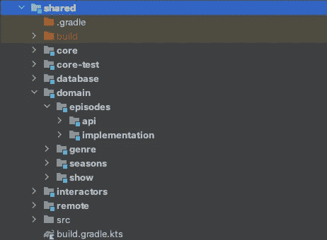
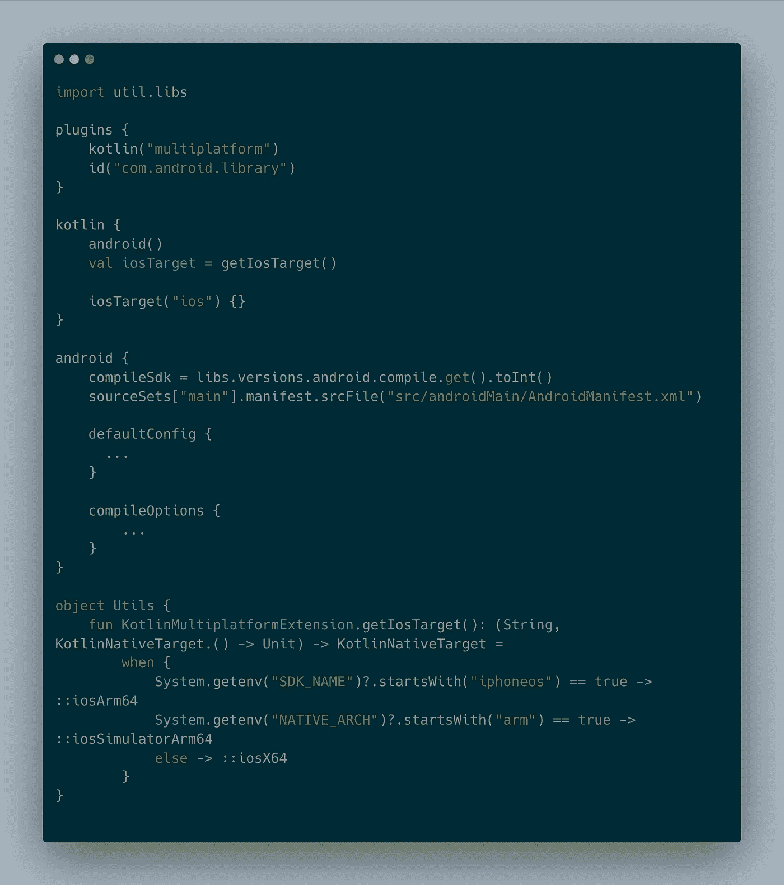
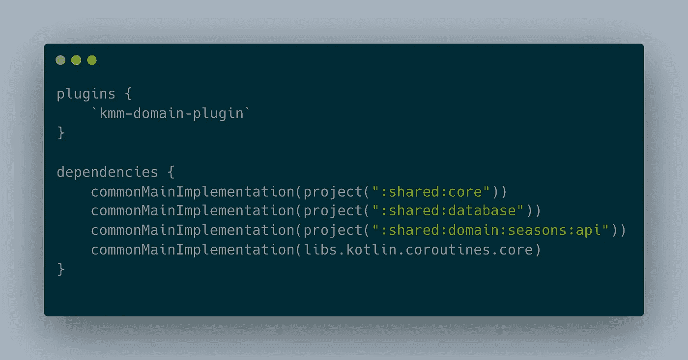
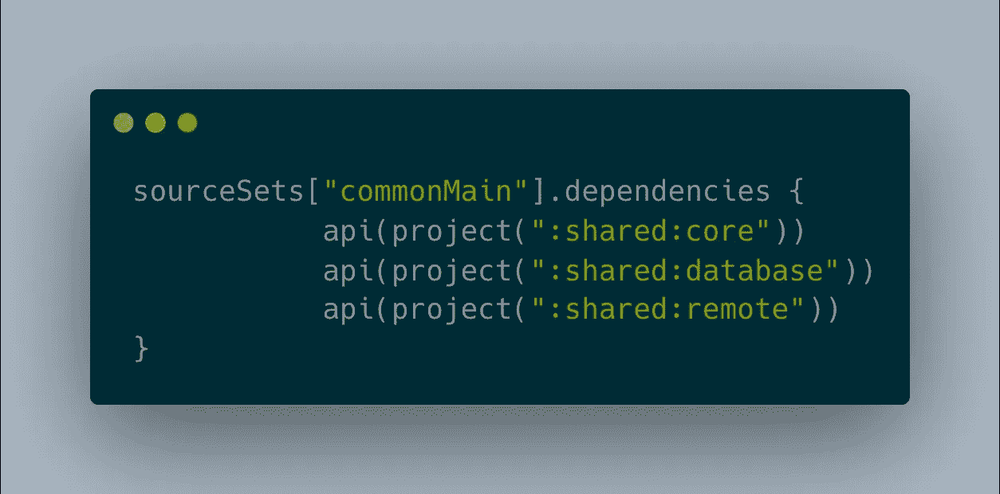
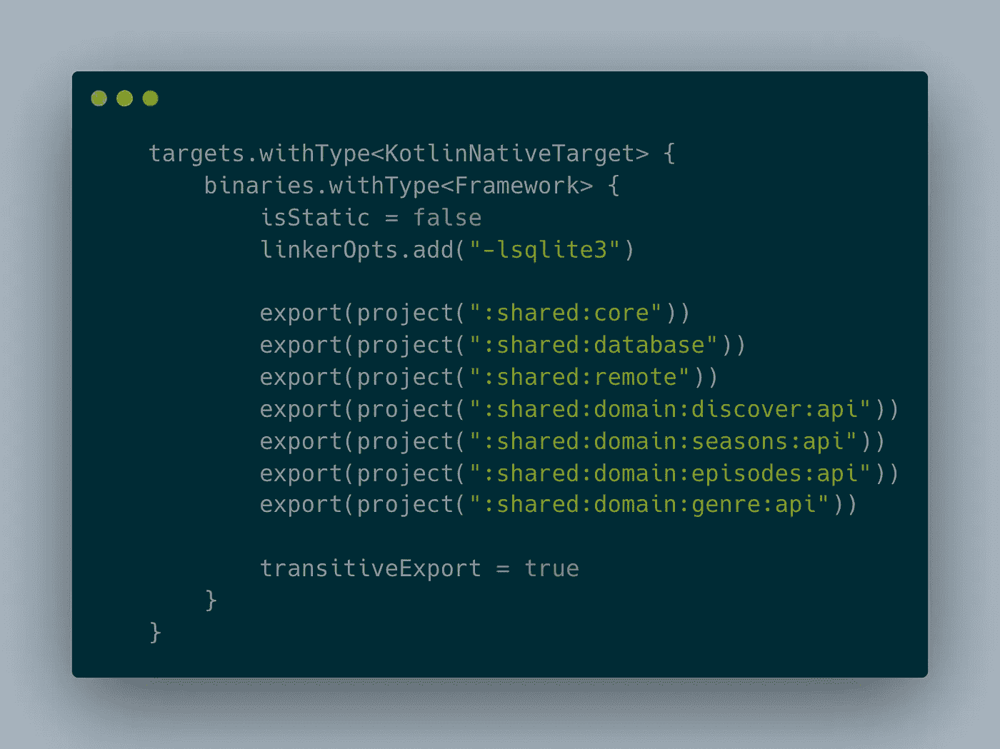
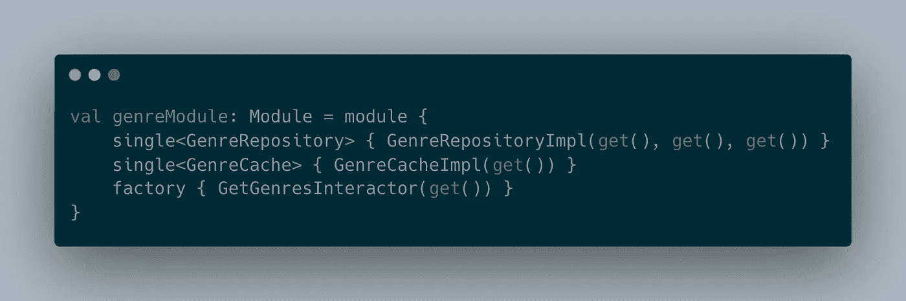
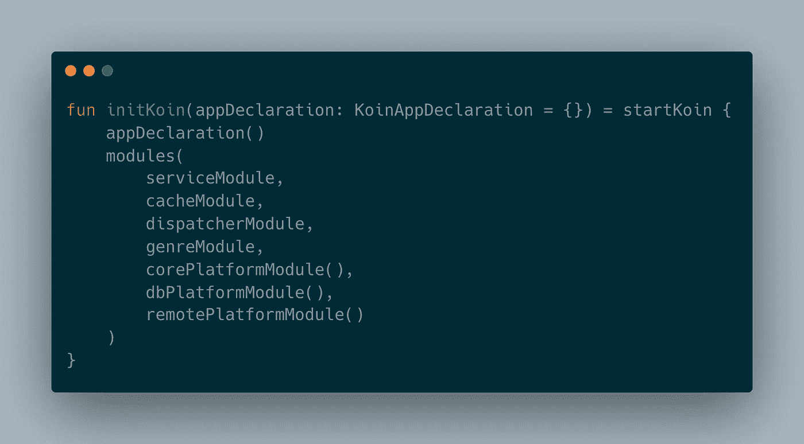
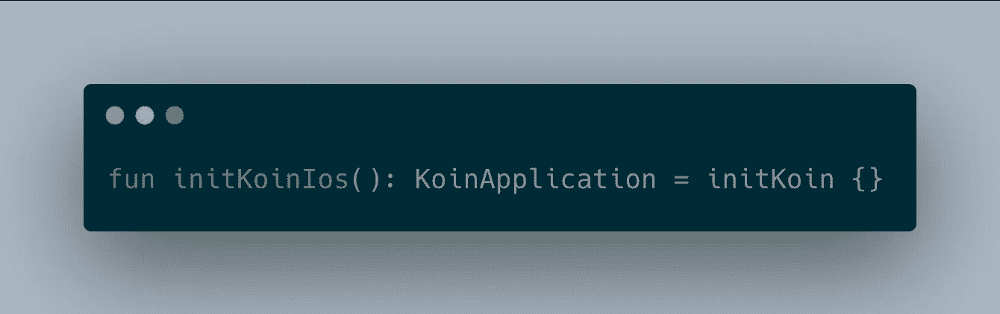

# 走向模块化——kot Lin 多平台方式

> 原文：<https://betterprogramming.pub/going-modular-the-kotlin-multiplatform-way-132c3dee6c95>

## 设置模块化代码库

我最近决定深入 Kotlin 多平台世界。到目前为止，一切顺利。这篇文章的目的是谈论我的旅程模块产生一个我一直在做的项目。

我肯定还有其他的方法，但这是对我有效的方法。

# 电视狂人

我正在使用 [TMDB](https://developers.themoviedb.org/3) 获取电视节目信息。这是它在两个平台上的样子。我在 Android 上做了很多工作，因为那是我的领域。随着我的学习，我正在更新 iOS 方面的内容。你可以在 [Github](https://github.com/c0de-wizard/tv-maniac) 上找到该项目的源代码。

 [## GitHub-c0de-wizard/Tv-Maniac:Tv-Maniac 是一个用于观看电视的多平台应用程序(Android & iOS)…

### TvManiac 是一个多平台应用程序(Android 和 iOS ),用于查看来自 TMDB 的电视节目信息。这个项目的目的是…

github.com](https://github.com/c0de-wizard/tv-maniac) 

# 共享模块

在讨论模块化之前，让我分享一下为什么我决定这样做。共享模块包含两个平台的通用逻辑。(iOS & Android)。

准确地说，我们共享网络和缓存代码。在文章的最后有几篇很棒的介绍文章。下面是最初看到的共享模块。

那么为什么要模块化共享模块呢？

嗯，我最初是用包来构造代码的。它工作了，但是在包中导航是一件痛苦的事情。既然我计划更新这个项目，为什么不把事情做对。伙计们，这就是我们在这里的原因。

另一件事，每当我对共享模块中的一个类进行更改时，整个模块都要重新构建。

# 走向模块化

下图显示了经过几次试验后共享模块的样子。但是，首先，让我们看一下项目结构。

# 项目结构

我们有几个模块，但是我们可以把它们分成四个主要的目录/模块。

*   `core`:包含所有模块使用的所有“公共”类。这些可以是实用类，如抽象类的协同作用域/调度程序。
*   `remote`:带 [Ktor](https://ktor.io/) 实现的模块
*   `database` : DB 实现。我们在这个项目中使用了 [SQLDelight](https://cashapp.github.io/sqldelight/) 。
*   `domain`(特性):领域模块更像特性模块。它们与应用程序中的功能完美匹配。他们有两个模块:
*   `api`:它们包含接口。我们也导出这些模块，所以 iOS 有权限。
*   `implementation`:顾名思义，这个模块包含了 API 模块的实现细节。

我省略了**交互器**模块。我暂时称之为边缘模块。这包含没有域逻辑或者不一定是特性的交互类。随着我们继续添加功能，这将会发生变化并进入领域模块。

# Kmm 预编译脚本

由于大多数模块的`***build.gradle***`文件是相同的，我们可以使用一个预编译脚本来节省大量重复。我们在`**buildSrc**`目录中创建一个文件`***kmm-domain-plugin.gradle.kts***`。

kmm 预编译脚本

然后，我们可以将插件添加到模块中，去掉大量代码。现在，我们需要应用脚本并添加模块依赖项。如你所见，这样做的一个好处是拥有精益模块，不需要不必要的依赖。

API build.gradle.kts

# 暴露对 iOS 的依赖

现在我们有了自己的模块，我们需要将它们添加到共享模块中，因为这是 iOS 的入口点。通过将模块添加到 commonMain，Kmm 将生成一个`Obj-C Framework`。

为了公开依赖关系，我们做两件事

1.  将模块作为 API 添加到`commonMain`源集中

2.导出框架配置中的模块。

您会注意到，我们只是将 API 模块添加到框架配置中。这是因为我们只需要公开接口。

最后一件事，我们可以结束了。让我们看看依赖注入。

# 依赖注入

我正在使用我想称为混合注入的方法，其中 Android 使用[匕首柄](https://developer.android.com/training/dependency-injection/hilt-android)，共享模块使用 [Koin](https://insert-koin.io/) 来初始化图形。我在 shared 中使用 Koin，这样我们可以为 iOS 提供依赖关系。因此，我们将只看如何在共享模块中设置它。

大多数模块都有一个包含模块依赖的`**di**`包。举个例子，这就是流派的样子:

我们现在可以将它们添加到共享模块`koin`类的主依赖图中。

我们需要在`iosMain`目录中添加一个类。这是一个调用主 init 函数的空函数。这样做将允许我们初始化图形。

我可能没有提到我正在创建一个 Swift 包并将其添加到 iOS 应用程序中。John O'Reilly 有一篇关于如何着手的精彩文章。在这里阅读更多。(如果你想迷失在 KMM 的宇宙中，就跟着他。他确实涵盖了很多话题，并分享了宝贵的资源。)

# 摘要

我希望这在我向您介绍我如何应对这一挑战时有用。我知道我没有深究事情。主要是因为我相信还有其他方法。可能更好/更直接的方式。如果你有什么见解，请随时联系。学习是一个永无止境的循环，我准备好了。

我喜欢 Kotlin 多平台的原因是:

*   大部分核心业务逻辑是共享的。这让我可以抽出一些时间，潜入苹果的世界。
*   UI 开发是本机的。因此，我仍然可以跟上 Android 上发生的事情，同时学习一点 Swift。

直到我们再次相遇。再见。

# 资源

*   [了解 KMM 项目结构。](https://kotlinlang.org/docs/kmm-understand-project-structure.html)
*   [生产中的 Kotlin 多平台——Kevin Galligan](https://youtu.be/hrRqX7NYg3Q)
*   [在 Kotlin 多平台项目中使用 Swift 软件包— John O'Reilly](https://johnoreilly.dev/posts/kotlinmultiplatform-swift-package/)
*   [Touchlab — KaMPKit](https://github.com/touchlab/KaMPKit)
*   [应用中的多个 Kotlin 框架——Kevin Schildhorn](https://touchlab.co/multiple-kotlin-frameworks-in-application/)