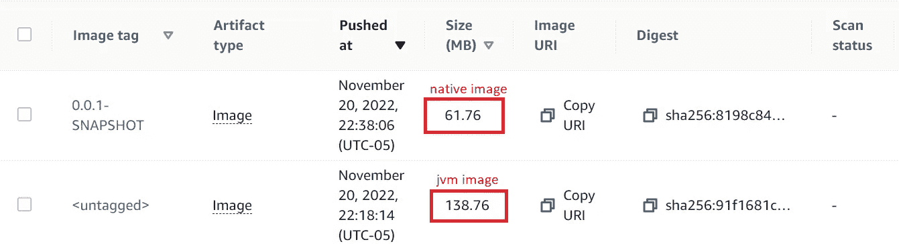
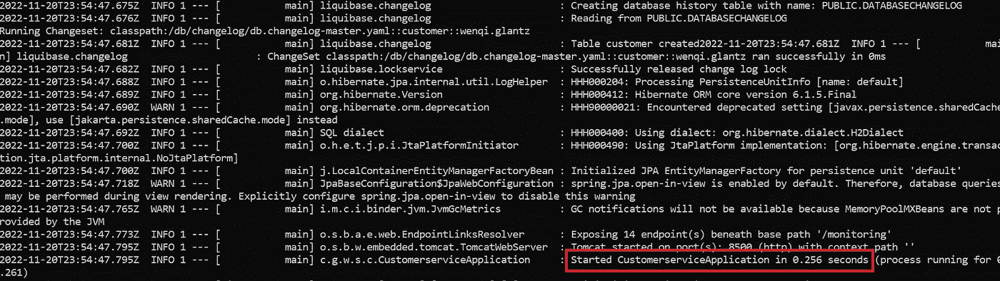
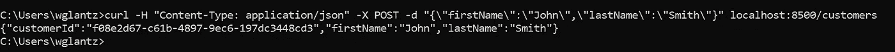
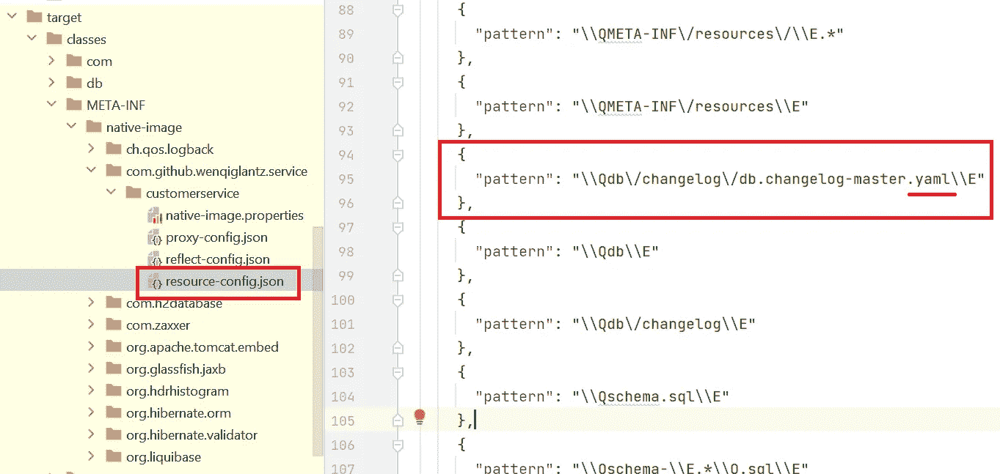
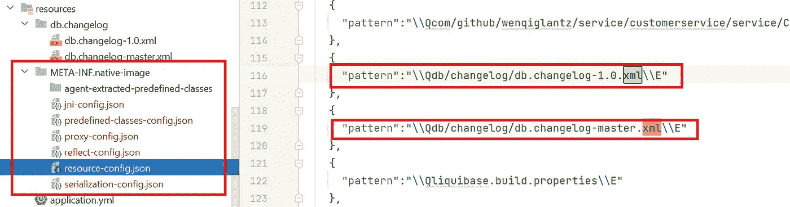
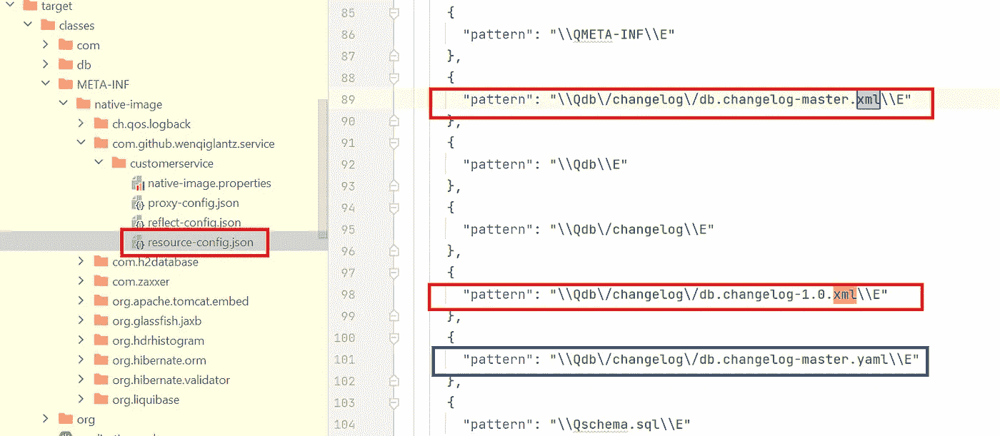

# 与 Spring Boot 3 GA 一起实现本地化

> 原文：<https://betterprogramming.pub/going-native-with-spring-boot-3-ga-4e8d91ab21d3>

## 关于如何使用 Spring Boot 3 原生映像支持的实用指南


作者照片

Spring Boot 3 今天正式上市，2022 年感恩节！对于整个 Spring 社区来说，这的确是一个巨大的里程碑！Spring 和 GraalVM 团队在将原生映像支持引入 Spring Boot 3 方面做了出色的工作。在我将一些微服务升级到 Spring Boot 3 以利用其原生映像支持的 POC 工作中，我亲眼目睹了我在过去一两个月中在 GitHub 存储库中提出的问题是如何得到及时解决和修复的。

几个月前，我出版了 [*春原:让 Spring Boot 飞翔的翅膀*](/how-to-integrate-spring-native-into-spring-boot-microservices-add2ece541b8?sk=6ba4674550db30783f7c5c68ba13c141) 。探索 Spring Native 如何提升基于 Spring Boot 2 框架的应用令人大开眼界。在 Spring Boot 3 中，我们现在内置了 GraalVM 本地映像支持！这对我们应用程序开发人员来说实际上意味着什么？让我们采用一种实用的方法将 Spring Boot 2.7.x 应用程序转换为 Spring Boot 3，并探索 Spring Boot 3 附带的原生图像支持。

# Spring Boot 3 中的本机映像支持

原生映像支持主要是让应用程序及其库能够在构建时进行分析，以配置运行时需要或不需要的内容。我们的目标是以最佳方式做到这一点，以最小的足迹。有了原生映像支持，基于 Spring Boot 3 构建的应用可以即时启动、减少内存消耗，并立即达到峰值性能。有关原生映像支持给基于 Spring Boot 框架的应用程序带来的提升的更多细节，请参考我的文章[*Spring Native:The Wings That Make you flying*](/how-to-integrate-spring-native-into-spring-boot-microservices-add2ece541b8?sk=6ba4674550db30783f7c5c68ba13c141)。

# 升级 Spring Boot

我们将使用一个名为`[customer-service](https://github.com/wenqiglantz/customerservice-spring-boot-3)`的演示应用，构建于 Spring Boot 2.7.5 之上。第一步是将其升级到 Spring Boot 3。跟随我的[*Spring Boot 3 升级笔记*](/notes-on-spring-boot-3-upgrade-a15e16f84862?sk=dd1bcbfe20a3e9a2182340b877c6c4ae) 获取升级的详细说明。请务必将 Spring Boot 升级到正式版 3.0.0。

# 建立你的本土形象

记住，我们必须在我们的根 pom 中添加`spring-native`作为一个新的依赖项，以便在 Spring Boot 2 应用中启用原生支持，并添加`spring-aot-maven-plugin`？在 Spring Boot 3 中，原生支持被嵌入，这意味着你不再需要导入`spring-native`依赖，也不需要添加`spring-aot-maven-plugin`，你所需要做的就是在根 pom 中将`spring-boot-starter-parent`的版本升级到 3.0.0。您的 pom 的`<parent>`部分应该如下所示:

```
<parent>
    <groupId>org.springframework.boot</groupId>
    <artifactId>spring-boot-starter-parent</artifactId>
    <version>3.0.0</version>
    <relativePath />
</parent>
```

`spring-boot-starter-parent`声明了一个`native`概要文件，它配置了创建本地映像所需的执行。您可以在命令行上使用`-P`标志激活概要文件，例如`mvn clean -Pnative spring-boot:build-image`。是的，就是这么简单，调用`native` maven profile！`native` profile 到底是做什么的？根据 Spring 的文档有三件事:

1.  当 Spring Boot Maven 插件被应用到一个项目时`process-aot`的执行。

2.合适的设置，以便[构建图像](https://docs.spring.io/spring-boot/docs/3.0.x-SNAPSHOT/maven-plugin/reference/htmlsingle/#build-image)生成本地图像。

3.[原生构建工具 Maven 插件](https://graalvm.github.io/native-build-tools/latest/maven-plugin.html)的合理默认值，特别是:

*   确保插件使用原始类路径，而不是主 jar 文件，因为它不理解我们重新打包的 jar 格式。
*   验证是否有合适的 GraalVM 版本可用。
*   下载第三方可达性元数据。

为了从`native`档案中获益，你的 Spring Boot 3 应用应该定义两个插件:

```
<plugin>
    <groupId>org.graalvm.buildtools</groupId>
    <artifactId>native-maven-plugin</artifactId>
</plugin>
<plugin>
   <groupId>org.springframework.boot</groupId>
   <artifactId>spring-boot-maven-plugin</artifactId>
</plugin>
```

关于为多模块项目配置插件的细节，请参考 Spring 的文档[使用本地概要文件](https://docs.spring.io/spring-boot/docs/3.0.x-SNAPSHOT/maven-plugin/reference/htmlsingle/#_using_the_native_profile)。

# 使用 GitHub 操作构建 GraalVM 本机映像

有两种方法可以构建本机映像:

*   云原生构建包(Cloud-Native Buildpacks):在[云原生计算基金会](https://www.cncf.io/) (CNCF)中的一个孵化项目，它提供了一种机制，在不使用`Dockerfile`的情况下，将你的应用源代码转换成开放容器倡议(OCI)兼容的容器映像。我们将在下面的示例代码中使用 Buildpacks 来构建我们的客户服务本机映像。
*   原生构建工具:如果想不用 Docker 直接生成原生可执行文件，可以使用 GraalVM 原生构建工具。原生构建工具是 GraalVM 附带的插件。

考虑到生成本机映像需要很长的构建时间，因此无论何时提出 pull 请求或者将代码推送到 main/master 分支，构建本机映像都是不切实际的。那么，我们应该如何处理 JVM 构建和本机映像构建呢？两个工作流程:

*   JVM 的 CI 工作流:没有本机映像支持
*   GraalVM 本机映像的 CI 工作流:具有本机映像支持

让我们仔细看看每个工作流程。

# JVM 的 CI 工作流

这是开发人员的默认 CI 工作流，由 PR 或代码推送自动触发。如果您已经将 GitHub 操作用于您的 CI/CD，那么您的 JVM 工作流应该仍然是您的默认 CI 工作流。请参见下面我的 JVM CI 工作流示例。该工作流程的主要步骤包括:

*   用 Maven 和 Buildpacks 构建
*   标记并将图像推送到 AWS 弹性容器注册表(ECR)
*   用 Trivy 漏洞扫描器扫描图像

根据您的项目需求，您可以添加其他典型的 CI 步骤，例如声纳扫描等。，到此 CI 工作流中。

# GraalVM 本机映像的 CI 工作流

这是 GraalVM 本机映像的 CI 工作流。由于构建本机映像比在 JVM 上构建应用程序需要更长的时间，因此我们可以将此工作流配置为手动触发或运行夜间构建。这个工作流和 JVM CI 工作流的主要区别是 maven build 使用 Buildpacks 添加了一个`-Pnative`参数来启用`spring-boot-starter-parent`的`native`概要文件(第 57 行)，并且它还在这个工作流中安装了 GraalVM(第 38–44 行)。

感兴趣者的作业:我在我的上一篇文章 [*中写过关于 GitHub Actions 的可重用工作流的博客，深入探究 GitHub Actions 的可重用工作流*](/how-to-use-github-actions-reusable-workflow-8604e8cbf258) *。*我鼓励对将这两个工作流转换成可重用工作流感兴趣的读者，并相应地从您的应用程序的 CI 工作流中调用它们。

# 本机映像和 JVM 映像之间的映像大小比较

对于我们的`customer-service`应用程序，我运行了原生映像 CI 工作流和 JVM CI 工作流，两个映像被推送到 ECR。本机映像的大小不到 JVM 映像的一半；Spring Boot 3 原生支持的另一个承诺是产生更小的映像足迹。



**请注意:**

上面的映像比较只是为了探索本机映像和 JVM 映像。您决不能在同一个 ECR 存储库中混合这两个映像。根据您的应用程序，如果它与原生映像支持配合得很好，并且您的团队已经决定将原生映像投入生产，那么请删除您的`ci-jvm.yml`中的最后一步`Tag and push image to AWS ECR`，这样 JVM CI 工作流只进行构建和映像扫描，但不会将映像推送到 ECR。

但是，如果由于某种原因，你的应用遇到了多个问题，主要是处理第三方库与原生支持的兼容性，你和你的团队最终决定你的应用还没有准备好采用原生支持，那么你需要删除你的`ci-native-image.yml`中`Tag and push image to AWS ECR`的最后一步。您可以定期手动触发本机映像配置项工作流，以查看是否已解决任何与第三方本机支持兼容性相关的问题。

# 应用程序启动

一旦我们的本机映像构建成功，让我们启动我们的应用程序:

```
docker run --rm -p 8500:8500 docker.io/library/customer-service:latest
```

耶！`customer-service` app 启动 0.256 秒！



让我们通过创建一个新客户来验证 API:



如您所见，客户创建 POST 调用是成功的，因为从数据库中检索到了`customerId`，并且在响应中成功返回了`customer`对象。因此，我们的应用程序确实如预期的那样运行。

# 故障排除提示

我不得不承认，构建我们的演示应用程序的本机映像并不是一次完全顺利的经历。我遇到了一些困难，这需要我做一些研究来找到解决方法。我想分享一下我的故障排除经验。

`customer-service`的原生映像构建没有问题，但当我尝试启动应用程序时，我遇到了以下错误:


我很困惑，因为该文件存在于正确的目录中。为什么 GraalVM 看不到它？啊！它必须与我们的应用程序的`resource-config.json`在一起，因为`db.changelog-master.xml`是一个资源文件，它是来自我们自己的应用程序的代码。通过追踪目标文件夹的`classes\META-INF\native-image\com.github.wenqiglantz.service\customerservice\resource-config.json`，见下面截图，出入明显！在那个`resource-config.json`文件中，它引用的是`db.changelog-master.yaml`，而不是它的 XML 文件，这就是 GraalVM 找不到 XML 文件的原因。



为什么会这样？本机映像工具依赖于运行时对应用程序可访问代码的静态分析。然而，该分析并不总是能够预测 Java 本地接口(JNI)、Java 反射、动态代理对象或类路径资源的所有用途。这些动态特性的未检测到的使用必须以[元数据](https://www.graalvm.org/22.2/reference-manual/native-image/metadata/)(在代码中预先计算或作为 JSON 配置文件)的形式提供给`native-image`工具。

怎么修？基本上，我们需要一种方法来用正确的资源条目补充为我们的应用程序自动生成的`resource-config.json`，特别是要包括我们的 Liquibase 配置文件`db.changelog-master.xml`和`db.changelog-1.0.xml`。让我们探索两种方法:

*   追踪代理
*   RuntimeHintsRegistrar

# 追踪代理

GraalVM 提供了一个跟踪代理来轻松收集元数据和准备配置文件。代理跟踪应用程序在常规 Java 虚拟机上执行期间动态特性的所有使用情况。对于我们的客户服务应用程序，我使用下面的命令在项目根目录下运行跟踪代理:

```
java -Dspring.aot.enabled=true -agentlib:native-image-agent=config-output-dir=src/main/resources/META-INF/native-image -jar .\target\customerservice-0.0.1-SNAPSHOT.jar
```

***注意*** *:* `*-agentlib*` *前必须指定一个* `*-jar*` *选项或一个类名或任何应用参数作为* `*java*` *命令的一部分。*

运行时，代理查找`native-image`工具需要额外信息的类、方法、字段和资源。当应用程序完成并且 JVM 退出时，代理将元数据写入指定输出目录`src/main/resources/META-INF/native-image`中的 JSON 文件。

可能需要多次运行应用程序(使用不同的执行路径),以提高动态特性的覆盖率。`config-merge-dir`选项添加到现有的一组配置文件中，如下所示:

```
java -Dspring.aot.enabled=true -agentlib:native-image-agent=config-merge-dir=src/main/resources/META-INF/native-image -jar .\target\customerservice-0.0.1-SNAPSHOT.jar
```

在该目录(或其任何子目录)中搜索名为`jni-config.json`、`reflect-config.json`、`proxy-config.json`、`resource-config.json`、`predefined-classes-config.json`、`serialization-config.json`的文件，这些文件将自动包含在构建过程中。

让我们看看运行跟踪代理后会发现什么:



是的，跟踪代理确实生成了 JSON 文件列表，如上面的截图所示，在`resource-config.json`中，我们可以看到我们的两个 Liquibase 配置文件确实已经添加，这意味着它们将包含在我们的本机映像构建中！这个办法管用！现在让我们看看使用`RuntimeHintsRegistrar`的另一种方法。

# RuntimeHintsRegistrar

由于在这种特殊情况下我们需要为资源提供自己的提示，我们可以使用 Spring Boot 3.0 附带的`RuntimeHintsRegistrar` API。我们需要做的就是创建一个实现`RuntimeHintsRegistrar`接口的类，然后对提供的`RuntimeHints`实例进行适当的调用。然后我们可以在任何一个`@Configuration`类上使用`@ImportRuntimeHints`来激活这些提示。请看下面我在`CustomerController`类中的实现。

*   第 3 行:通过`@ImportRuntimeHints`激活提示。
*   第 29–41 行:创建一个名为`CustomerControllerRuntimeHints` 的类来实现`RuntimeHintsRegistrar`。特别要注意第 38 行和第 39 行，这两个 Liquibase 配置文件在这里被“暗示”

现在，让我们通过在本地运行下面的命令再次构建我们的本机映像，然后检查我们的 AOT 编译器在目标目录下生成的文件。见下图。是的，有效！我们的 Liquibase XML 文件现在成功地包含在`resource-config.json`中，还有默认的 YAML 文件，用蓝色突出显示。

```
mvn clean -Pnative spring-boot:build-image -Dmaven.test.skip
```



# Spring Boot 协议 3 的局限性

尽管 Spring Boot 3 围绕其原生支持有许多优势，但 Spring Boot 3 周围的生态系统尚未跟上。Spring 团队对 Spring Boot 3 的局限性相当开放，正如这里记录的[。](https://docs.spring.io/spring-boot/docs/3.0.0-RC1/reference/html/native-image.html#native-image.advanced.known-limitations)

一些流行的测试框架，比如 Mockito 和 WireMock，还没有本地支持。对于那些有兴趣为更新 Spring Boot 3 生态系统做出贡献的人，GraalVM 创建了[可达性元数据存储库](https://github.com/oracle/graalvm-reachability-metadata)，以鼓励开源社区为这一重要工作做出贡献。

# 可达性元数据存储库

当您使用 [GraalVM 本机映像](https://www.graalvm.org/22.1/reference-manual/native-image/)构建本机可执行文件时，它只包括从您的应用程序入口点可到达的元素、它的依赖库以及通过静态分析发现的 JDK 类。然而，由于 Java 的动态特性，包括反射、资源访问、动态代理和序列化，某些元素(如类、方法或字段)的可达性可能是不可发现的。

如果某个元素不可访问，则它不会包含在生成的可执行文件中，这可能会导致运行时失败。为了包含可达性不可发现的元素，本机映像构建器需要外部提供的[可达性元数据](https://www.graalvm.org/reference-manual/native-image/metadata/)。

这个存储库为不支持 GraalVM 本机映像的库提供了[可达性元数据](https://www.graalvm.org/22.2/reference-manual/native-image/ReachabilityMetadata/)。

默认情况下，为本机映像构建启用可访问性元数据。对于本机映像中包含的每个库，插件`native-maven-plugin`将自动在与插件一起发布的存储库中搜索 GraalVM 可达性元数据。

# 摘要

随着 Spring Boot 3 GA 的发布，人们对它的 GraalVM 原生映像支持有了更多的期待。在这个故事中，我们深入探讨了将 Spring Boot 2 应用程序升级到 Spring Boot 3 的步骤，激活其本机映像支持，使用 GitHub Actions 工作流构建本机映像 CI 管道，并探索故障排除技巧，包括如何使用跟踪代理和`RuntimeHintsRegistrar`。Spring Boot 3 原生图像支持有着巨大的潜力，我们还讨论了围绕其生态系统的限制，这一点还没有跟上，并呼吁 Spring 开源社区的贡献和支持。我希望这篇文章对你有所帮助。

请随意在[我的 GitHub 库](https://github.com/wenqiglantz/customerservice-spring-boot-3)中查看我的演示应用`customer-service`的源代码。

编码快乐！

又及:非常感谢 Spring Boot 项目负责人[斯蒂芬·尼科尔](https://twitter.com/snicoll)，回顾了这个故事，并提供了宝贵的意见和指导！在 Spring Boot GA 发布的这个大日子里，他的盘子里肯定有上百万件事情，然而他还是花时间来阅读这篇文章，并提供更正和指导。我是如此的谦卑和荣幸！

# 参考

[](https://docs.spring.io/spring-native/docs/current/reference/htmlsingle/#how-to-contribute) [## Spring 本地文档

### 与 Java 虚拟机相比，本机映像可以为多种类型的虚拟机提供更便宜、更可持续的托管服务

docs.spring.io](https://docs.spring.io/spring-native/docs/current/reference/htmlsingle/#how-to-contribute) [](https://www.graalvm.org/22.2/reference-manual/native-image/metadata/AutomaticMetadataCollection/#tracing-agent) [## 使用跟踪代理收集元数据

### 本机映像工具依赖于运行时对应用程序可访问代码的静态分析。然而……

www.graalvm.org](https://www.graalvm.org/22.2/reference-manual/native-image/metadata/AutomaticMetadataCollection/#tracing-agent) [](https://github.com/oracle/graalvm-reachability-metadata) [## GitHub-Oracle/graalvm-可达性-元数据:包含社区驱动的存储库…

### 当您使用 GraalVM 本机映像来构建本机可执行文件时，它只包含从您的…

github.com](https://github.com/oracle/graalvm-reachability-metadata)  [## GraalVM 本机映像支持

### GraalVM 本机映像提供了一种部署和运行 Java 应用程序的新方法。与 Java 虚拟机相比…

docs.spring.io](https://docs.spring.io/spring-boot/docs/3.0.0-RC1/reference/html/native-image.html#native-image.developing-your-first-application)