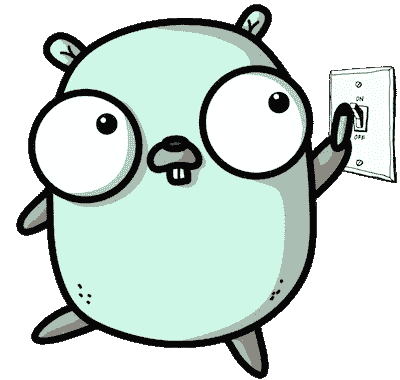
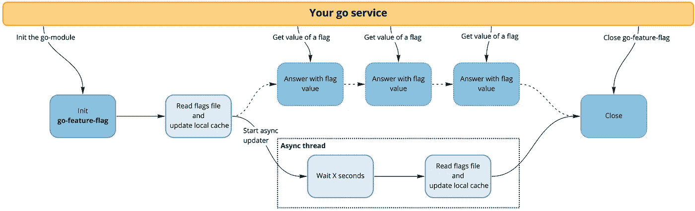
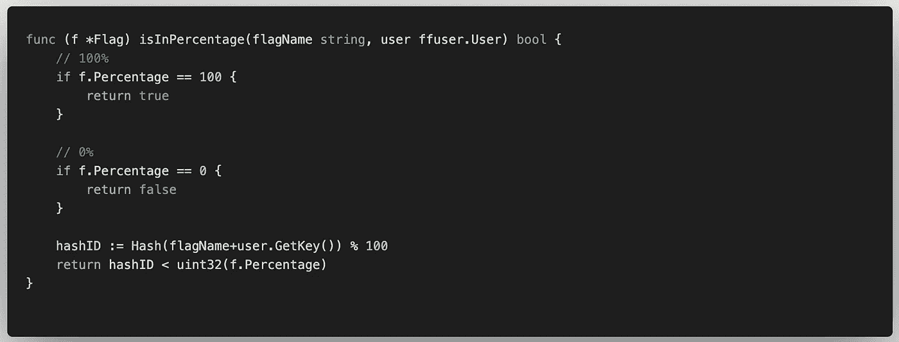

# Golang 特征标志:一个没有后端的简单 Go 实现

> 原文：<https://betterprogramming.pub/golang-feature-flags-a-simple-go-implementation-without-a-back-end-7c5c00078a58>

## 你的后端是一个简单的 YAML 文件


照片由[卡里姆·曼吉拉](https://unsplash.com/@karim_manjra?utm_source=medium&utm_medium=referral)在 [Unsplash](https://unsplash.com?utm_source=medium&utm_medium=referral) 上拍摄

我绝对不认为在代码的编写和发布之间应该有人工/手动的 QA 关卡。为了避免每次都打破东西，并有一个早期的切断系统，你应该使用功能标志。

市场上有很多系统可以用来管理你的旗帜，像[launch darky](https://launchdarkly.com/)或 [UNLEASH](https://unleash.org/) ，它们都支持 Golang 但是这个选项很贵，而且你必须在某个地方托管一个服务器来管理你的旗帜。

从这个出发点，我想到了创建一个简单的库，在后端只有一个文件。这个文件可以存储在不同的地方(AWS S3，GitHub，某处的 HTTP 端点，等等。).这是你唯一需要托管的东西——所有的决策逻辑都在 Go 模块中。



# 为什么选择新的解决方案？

有一些解决方案可用于 Go 管理功能标志。我可以把它们分为两类:

*   你需要运行一个特定的服务:`[markphelps/flipt](https://github.com/markphelps/flipt)`、`[checkr/flagr](https://github.com/checkr/flagr)`、`[Unleash/unleash](https://github.com/Unleash/unleash)`、 `[vsco/dcdr](https://github.com/vsco/dcdr)`、[、](https://github.com/vsco/dcdr)等。
*   你需要有一个数据库:`[xchapter7x/toggle](https://github.com/xchapter7x/toggle)`、`[AntoineAugusti/feature-flags](https://github.com/AntoineAugusti/feature-flags)`、[、](https://github.com/AntoineAugusti/feature-flags)等。

所有这些解决方案都很棒，有很多功能，但我有点担心在对基本服务进行功能标记之前，要进行完整的安装。

如果我的需求很小，我不想托管/维护/监控一个完整的特征标志系统。

所以我决定做 [go-feature-flag，](https://github.com/thomaspoignant/go-feature-flag)一个简单易实现的功能标志系统，除了一个你可以存储在任何地方(S3、GitHub、HTTP 端点等)的共享配置文件之外，根本没有后端。).

目标是在没有复杂解决方案的情况下体验特性标志的使用，如果你最终喜欢它并且需要一个更高级的模式，你可以去任何开源解决方案或 SaaS 解决方案——比如 LaunchDarkly。

[](https://github.com/thomaspoignant/go-feature-flag) [## 托马斯辛酸/去功能标志

### 一个特征标志解决方案，后台有 YAML 文件(S3，GitHub，HTTP，本地文件...).没有要安装的服务器，只是…

github.com](https://github.com/thomaspoignant/go-feature-flag) 

# 它是如何工作的？

这个围棋模块的工作原理很简单。它只是每隔 *x* 秒读取一次共享文件，并给你一个方法来获得你所期望类型的标志值。



go-feature-flag 概述

正如你所看到的，go-feature-flag 提供了一种与 feature-flag 配置文件保持同步的方式。它还允许您为您的用户评估标志。

基于`[nikunjy/rules](https://github.com/nikunjy/rules)`的规则系统允许您指定复杂的规则，以便仅对您的用户子集应用该标志。

百分比允许您选择哪个百分比的用户将获得真实值，但是我敢肯定您想知道重新分配是如何完成的。这真的很简单——我们使用作为 salt 的标志名对用户的键进行哈希运算(这保证了重新分区不总是针对相同的用户)。



[参见 GitHub](https://github.com/thomaspoignant/go-feature-flag/blob/main/internal/flags/flag.go#L40) 中的代码

# 如何使用它

go-feature-flag 的主要目标是超级简单，这样你就不用为了使用它而做太多事情。

*   首先要做的是把你的配置文件放在某个地方(S3，GitHub，等等)。)
*   在应用程序初始化期间，使用配置初始化`go-feature-flag`:

```
err := **ffclient.Init**(**ffclient.Config**{
    **PollInterval**: 3,
    **Retriever**: &ffClient.HTTPRetriever{
        **URL**:    "[https://raw.githubusercontent.com/thomaspoignant/go-feature-flag/main/testdata/test.yaml](https://raw.githubusercontent.com/thomaspoignant/go-feature-flag/main/testdata/test.yaml)",
    },
})
defer **ffclient.Close()**
```

*   现在您已经对`go-feature-flag`进行了初始化，您可以看到您的用户的标志值，如下所示:

```
user := **ffuser.NewUser**("user-unique-key")
**hasFlag**, _ := **ffclient.BoolVariation**("test-flag", user, false)
if **hasFlag** {
    *// flag "test-flag" is true for the user*
} else {
    *// flag "test-flag" is false for the user
}*
```

**注意:**如果出现错误(标志不存在、类型错误等)，您的变量将返回默认值(最后一个参数)。).

*   这是一个基本的例子，但是您可以为您的`User`添加任意多的属性来对您的标志进行复杂的查询

```
user = **ffuser.NewUserBuilder**("user-unique-key").
 **AddCustom**("firstname", "John").
 **AddCustom**("lastname", "Doe").
 **AddCustom**("email", "john.doe@example.com").
 **Build**()
```

这允许你有一个像`email eq "john.doe@example.com"`一样的规则，用你的标志选择一个特定的用户。

# 下一步是什么？

正如你所看到的，go-feature-flag 很简单，我们的目标是让它尽可能简单。但这并不意味着就此结束。

现在，我看到了一条`go-feature-flag`的进化之路:首先，它应该能够在任何地方存储标志配置文件，所以我们必须支持更多的检索器。第二件事是得到更多的反馈。目前，我们正在记录一些东西，但也许有些用户希望有一个 webhook 或 Slack 通知。

go-feature-flag

**所以，请随意在 GitHub 上写[一篇讨论](https://github.com/thomaspoignant/go-feature-flag/discussions)，开[一期](https://github.com/thomaspoignant/go-feature-flag/issues)，或者给我发[邮件](mailto:thomas.poignant@gmail.com)。**