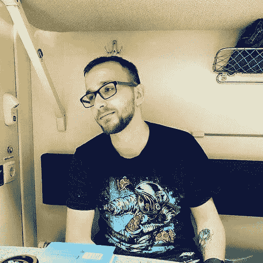
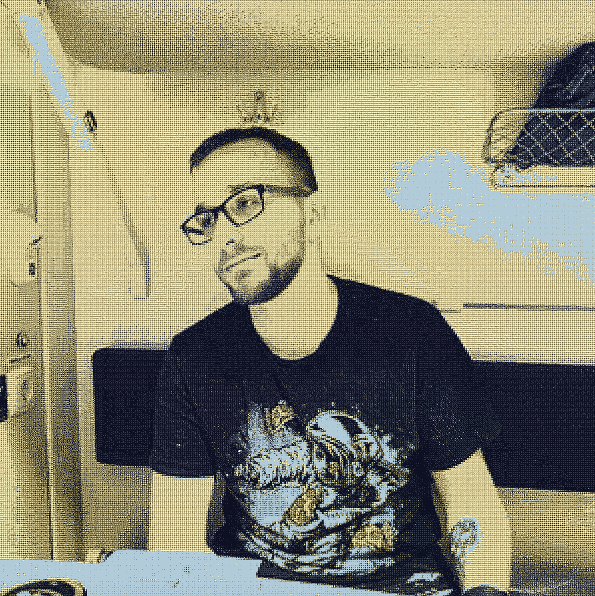
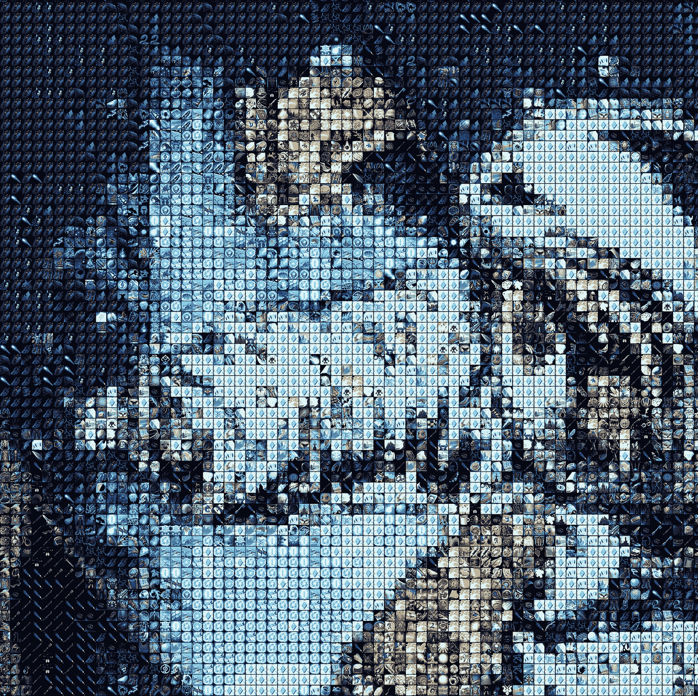

# 围棋中的图像处理

> 原文：<https://betterprogramming.pub/golang-pictures-and-fun-2486d9f1cc29>

## Golang，图片和乐趣

由[拍摄的米琳·特雷莫耶](https://unsplash.com/@mylene1708?utm_source=medium&utm_medium=referral)在 [Unsplash](https://unsplash.com?utm_source=medium&utm_medium=referral)

今天，我想和你们一起写一个小项目，它通过其他图像绘制图像，创建一个马赛克。当然，我们将使用 Golang 来实现这一点(当然，因为它时尚、新潮、快速)。

我们的任务听起来像这样:

> 你需要得到一个图像，然后用一个小图像从这个图像中画出每个像素，所以要得到一个由数百个小图像组成的“马赛克”。

我会用我的头像做源图(比我多，lol)。作为马赛克的一部分，来自 WoW 的图标(因为有相当多的图标来完成调色板)。结果，我们应该得到这样的东西:

正如你所看到的，即使是 WoW 中的图标(有几千个)也不足以覆盖整个色谱。但是我们不需要，我们只是玩玩而已:d。

接近时的结果

所以，我们走吧！

像往常一样，首先我们用构建器的模板创建`main.go`。

# 我们开始吧

接下来，我们需要我们的图标，我们将使用它来布局马赛克。正如我上面所说，这里我们将重点关注来自魔兽世界游戏 **的[图标。你绝对可以使用任何图像，只要它们是正方形的，并且有很多。](https://github.com/AcidWeb/Clean-Icons-Mechagnome-Edition/releases/tag/9.2.5.43971)**

好了，我们已经下载了我们的图标，把它们放在某个地方，但我们需要知道所有的图片，我们将用来建立我们的形象。为此，我们将编写一个函数来遍历包含图片的目录树，并返回图片路径的平面列表。

让我们添加`getPartsPaths`函数，并在我们的收集器中固定图标的路径和大小。

酷，我们可以收集我们的马赛克元素！

要开始挑选图像，我们需要快速访问这些图片的基色，也就是说，当我们在源图像中发现蓝色时，我们需要快速找到与蓝色最相似的图片，并快速完成。要做到这一点，我们需要为我们的图标制作一个地图，其中关键是颜色，图像本身就是值。

让我们写一些函数:

*   **loadImage** —将我们的图像从磁盘加载到内存中，以便快速访问
*   **calculatemodalaveragecolor**—将获取图像的基本颜色
*   **getPartsMap** —将返回我们的地图和图像

# loadImage

因为我们的图标是 TGA 格式的，而内置的 Golang 库不知道如何使用这种格式，所以我们需要安装 github.com/ftrvxmtrx/tga 包。

> 去找 github.com/ftrvxmtrx/tga

此外，这将有利于我们确保我们的图像将有 1 和相同的大小，为此我们将使用 github.com/nfnt/resize 包。

> 去找 github.com/nfnt/resize

# **calculatemodalaveragecolor**

接下来，我们实现`calculateModalAverageColour`，它将计算图像的平均颜色，并返回 RGB 模型中像素的颜色值。

事实上，我们只是计算了每个像素的每个 RGB 参数的平均值，这不是一个精确的模型，但对我们来说已经足够了。

接下来，我们结合上面写的内容，实现 getPartsMap 函数，该函数将返回完成的图像映射。

假设上传图像时出错，那么让我们跳过出错的部分。

让我们回到我们的主构建函数，添加地图的获取。

好像一切都准备好了，可以开始用鲜花布置形象了，但是等等，牛仔，时间还早；)

我们的地图是不够的，因为它没有覆盖图像的整个调色板。我们需要了解哪种颜色(哪个图标)最适合我们。

接下来，我们需要在地图中实现一个搜索功能，计算 RGB 点之间的[欧几里德距离](https://en.wikipedia.org/wiki/Euclidean_distance)，并返回最近的部分。

我们实现了`getClosestPart`函数，它将我们的地图和从源图像中读取的像素作为输入。

一定要提前确保 map size > 0，否则你会在 nil 指针上得到一个恐慌。

很好，我们有机会得到最接近我们像素的图像，剩下的只是创建一个新的图像，通过原来的一个和布局我们的马赛克，前进！

让我们添加最后一部分，我们的“建立”功能，它打开源图像 img.jpg(你可以使用其他内置的解码器，例如 PNG)并创建 res.png。

在这个函数中，我们有意将我们的图像缩小到 300×300 像素，否则它会非常大，因为在我们的例子中它的大小会增加 60×60 倍！

就这些，我们程序的完整清单如下所示。

仅此而已！

这个程序可以优化，但可以是你的作业！

作为优化，您可以:

*   不要在程序开始时重新计算地图，让它延迟加载。也就是说，在 JSON 中编写颜色和文件路径，根据需要沿着 JSON 中的路径加载图像。
*   使图像映射并行加载。
*   平行通过所有像素。

我们在本文中已经介绍过:

*   如何在 Golang 中使用文件
*   使用 Golang 中的内置类型:切片、地图和创建自定义类型。
*   如何在 Golang 中处理图像
*   科学感动！具体来说，求[欧氏距离的算法。](https://en.wikipedia.org/wiki/Euclidean_distance)