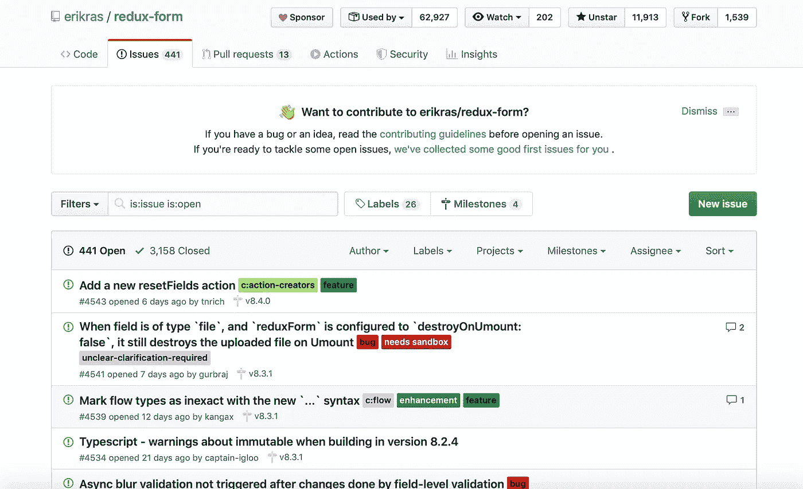

# 叠字的好与坏

> 原文：<https://betterprogramming.pub/good-and-bad-sides-of-redux-form-7a105a3c5b29>

## 验证变得简单


约翰·施诺布里奇在 [Unsplash](https://unsplash.com/s/photos/computer?utm_source=unsplash&utm_medium=referral&utm_content=creditCopyText) 上拍摄的照片

当我面临创建一个表单时，我想知道如何实现它。我可以通过在状态中存储数据来创建输入。但是，当我们不得不处理验证时，我们应该怎么办呢？

这是一个很好的观点。我听说过一些像`redux-form`这样的图书馆。Redux-form 使用`Redux`来存储输入值。有点奇怪。我开始怀疑，为了将输入值保存到应用程序状态中，这样做是否值得。然而，`redux-form`的基本实现很简单。经过深思熟虑，我决定使用它。

`Redux-form`使用 Redux 存储输入值和[高阶分量](https://reactjs.org/docs/higher-order-components.html)。React form 组件通过以下方式与您的 Redux store 连接:

*   Redux Reducer:`formReducer`—告诉如何根据来自应用程序的更改来更新 Redux 存储的函数
*   react HOC`reduxForm()`—接受配置对象并返回新函数的函数
*   `<Field />`组件——位于包装好的`form`组件内部的组件。

让我展示一下我们如何使用`redux-form`:

首先，您应该安装`redux-form`、`redux`和`react-redux`:

```
npm install redux react-redux redux-form --save
```

我们应该将`formReducer`传递给你的商店来处理来自表单组件的动作:

现在我们可以在 Redux 中存储表单值。接下来，我们应该创建一个使用`redux-form`的表单，并将其命名为`UserForm.js`:

我们应该在我们的`UserForm`中添加`Field`组件:

`<Field />`组件将每个输入连接到存储并创建一个`<input/>`元素。还会通过`value`、`onChange`、`onBlur`等附加道具。所以我们可以使用这个表单组件。一看就很容易。

接下来，我们应该改进并使用表单验证。让我们为 redux-form 创建`formValidations.js`。

所以我们有一个简单的 required 输入验证。此外，我们可以为任何输入创建许多验证。如果我们有一个复杂的组件给`Field`呢？在这种情况下，我们应该为任何情况创建一个`FormItem.js`组件:

我们只创建了一个输入组件。另一方面，您可以开发您想要的各种组件(`renderTextarea`、`renderSelect`等)。).有时我们的项目中有`horizontal`和`vertical`表单。在这种情况下，我们可以用一个神奇的`render`函数来实现它:

要显示验证错误:

最后，我们的`UserForm.js`将是:

它绝对是易于阅读和可重复使用的。

# 好的方面

## **易于开发**

正如我上面提到的，您应该只使用 Redux-form 字段并用 HOC 包装您的表单。就是这样。你的替身已经准备好了。

此外，我们可以为表单字段开发输入组件并重用它们。

## **验证**

Redux-form 是一个非常棒的验证库。您可以简单地为不同的情况开发许多验证。因此，它提供了验证功能来一次验证表单中的所有值。您还可以为每个字段或 FieldArray 提供单独的值验证函数。此外，您可以只为应用程序定义一次验证函数，并根据需要在表单中重用它们。很舒服。

# **坏边**

## **在 Redux 中存储表单状态**

第一个问题:Redux 是什么？根据它的文档，Redux 是 JavaScript 应用程序的可预测状态容器。换句话说，Redux 帮助你存储和管理全球 app 数据。我们可以以可伸缩的方式将模型逻辑从视图中分离出来。

在我们的情况下，我们在表单上使用受控输入组件，我们的表单应该立即提供反馈，因为您需要向用户显示更改。

正如丹·阿布拉莫夫所说:

> 对短暂的状态使用 React，这种状态对应用程序没有全局影响，并且不会以复杂的方式变异。例如，某个 UI 元素中的切换、表单输入状态。对全局重要的或以复杂方式变化的状态使用 Redux。例如，缓存的用户或帖子草稿。

对于全局应用数据，我们应该使用 Redux。我不确定对临时表单数据使用 Redux。当您键入时，您必须存储和修改每个击键，并且每当一个字段被触摸、为空或包含不正确的值时，您必须跟踪所有的字段值。看起来很奇怪。您可能会问自己，“我应该在 Redux 中存储所有表单状态吗？”

## **性能**

性能是发展中最重要的一点。但是当使用 Redux 时，每个小的表单状态更新都要经历一个完整的 Redux 周期。每一次击键都要花费我们重新渲染整个应用程序的成本。太费时间了。它将用户界面冻结了几毫秒，这对用户来说完全是显而易见的。当然，如果你不喜欢牺牲你的应用程序的性能，这是一个大问题。

如果您的表单有一个更复杂的模型或多步向导，那么在 redux-form 存储中管理它会困难得多。

## **可用性**

考虑以下示例计算:

```
const total = price + tips;
```

这里，价格和小费值存储在 redux 中。你必须从 redux-form 获得价格和小费，并进行计算。之后用 dispatch 更改 redux 中的合计。很不舒服。此外，如果您想动态地更改 redux-form 中的字段值或类型，您将会有很大的困难。

## **问题**

Redux-form 在 GitHub 中还有进一步的问题。让我展示给你看:



这个图书馆有 441 期开放的期刊，其中许多是旧的。太悲伤了。

# **结论**

Redux-form 是一个非常好的处理简单表单和验证的库。看起来 Redux-form 只是为了验证而创建的。可惜，生活没那么容易。当你有复杂的表单时，它们会变得太复杂，你会在表现上遇到麻烦。但是我们有很多处理表单的库。我想在下一篇文章中与您分享来自 libs 的 [React Hook。这真是一个伟大的解放。去吧。](https://itnext.io/is-react-hook-form-the-future-57c6f94a2665)

我希望这篇文章对你有用。

# 资源

*   [Redux-form 已死](https://matwrites.com/redux-form-is-dead/)
*   [是否应该将表单状态存储在 Redux 中？](https://goshakkk.name/should-i-put-form-state-into-redux/)
*   [还原形式](https://redux-form.com/8.2.2/)
*   [停止使用 Redux 处理表单状态](https://medium.com/@ron.dadon/stop-using-redux-to-handle-form-state-a953e43818da)
*   [Redux 初学者指南](https://www.gistia.com/beginners-guide-redux/)