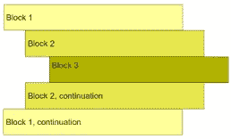
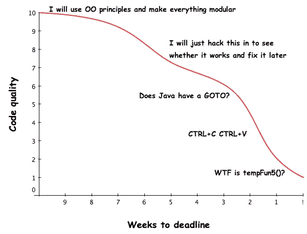
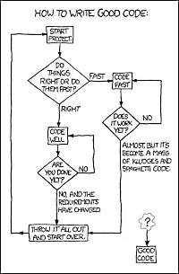

# 好代码与坏代码

> 原文：<https://betterprogramming.pub/good-code-vs-bad-code-35624b4e91bc>

## 为什么编写好的代码很重要，以及如何去做

用任何语言编写代码时，都有好的编码实践——也有不好的。

就编译和运行时间而言，两者都可能是正确的。但是糟糕的代码会在开发、调试和修改中带来一些问题。在工作场所，不管你的程序运行得有多好，总会有人在某个时候阅读或修改你的代码。

他们可能需要添加新功能，纠正一个罕见的错误，或者他们可能只是想阅读它以了解它是如何工作的。同样，你也必须阅读别人的代码来做同样的事情。如果代码是可读和可理解的，每个人都会相处得更好。

要知道高质量代码的重要性，让我们试着理解一个差质量的代码会导致什么。写得不好的代码可能会导致财务损失或浪费进一步维护、增强或调整软件所需的时间。

你写了一次代码，但之后又重复了无数次。因此，记录代码变得非常重要，命名约定也变得非常重要。

很多次，我碰到我的同事开玩笑说他们不记得几天前写的代码或逻辑。现在，再加上糟糕的代码风格，你会花更多的时间去理解你做了什么。

当一个艺术家不能理解他们自己的艺术作品时，事情就开始变得混乱了！

# 编写代码时要记住的要点

## 对救援的评论

大多数现代语言都有声明性的文档注释，它们与单行和多行注释一起使用，使得代码更容易理解，因此也更容易维护。

好的代码注释解释*为什么*事情被完成，而不是做了什么。代码本身解释了所做的事情。对注释的需求应该是最小的。

## **缩进**

如图所示，好的代码结构合理。对于试图理解代码的人来说，代码块在哪里开始，在哪里结束应该是显而易见的，这样遵循代码库的逻辑就变得显而易见和简单明了。

缩进:常规标准四个空格缩进

## **自述文件**

当你面前有一个项目的代码库时，这是很烦人的，但是设置和第一次执行要花几个小时才能完成。这就是 README 派上用场的地方。

在访问代码之前，最好有一个对项目的简要介绍，一个结构合理的自述文件正是这样做的。结构合理的自述文件如下所示:

自述模板，致谢: [PurpleBooth](https://gist.github.com/PurpleBooth)

## **命名约定**

很多时候，我们会碰到一个名字为`Apimanager`的`Class`，但是看名字，上课的目的并不明确。

根据最佳编码实践规范，我们的类应该遵循单一责任原则(SRP)。适当的命名约定，再加上 SRP，使得我们在跟踪项目时更加容易。

如果一个`Class`正在执行一个密集的工作单元，那么对于不同的作用域，命名约定也应该不同。这是为了通过查看代码块来区分变量何时何地超出范围。

除了最短暂的对象之外，对所有对象使用有意义的命名约定。事物的名称可以提供关于何时以及如何使用该对象的信息。

## **避开神奇的数字**

什么是幻数？它是一个常量，完全没有记录，必须是一个特定的值，程序才能正常工作。没有人知道为什么选择 T4 这个数字。

最不可思议的是，没有人真正知道数字是如何影响程序的……除了改变它会破坏程序。

幻数是邪恶的，应该立即废除。

## 适应时间框架

下图不言自明。

截止日期前的代码质量

# 编写干净、高质量代码的常见实践

广泛使用的提高代码质量的步骤

编写高质量的代码是一个动态的过程。在尝试编写好的代码时，还需要考虑以下几点:

*   好的代码是组织良好的。类中的数据和操作放在一起。类之间没有额外的依赖关系。它看起来不像“意大利面条”。
*   好的代码是经过充分测试的。测试作为代码的可执行规范及其使用示例。
*   好的代码并不聪明。它以简单明了的方式做事。
*   好的代码是在小的、易读的计算单元中开发的。这些单元在整个代码中被重用。

感谢阅读！