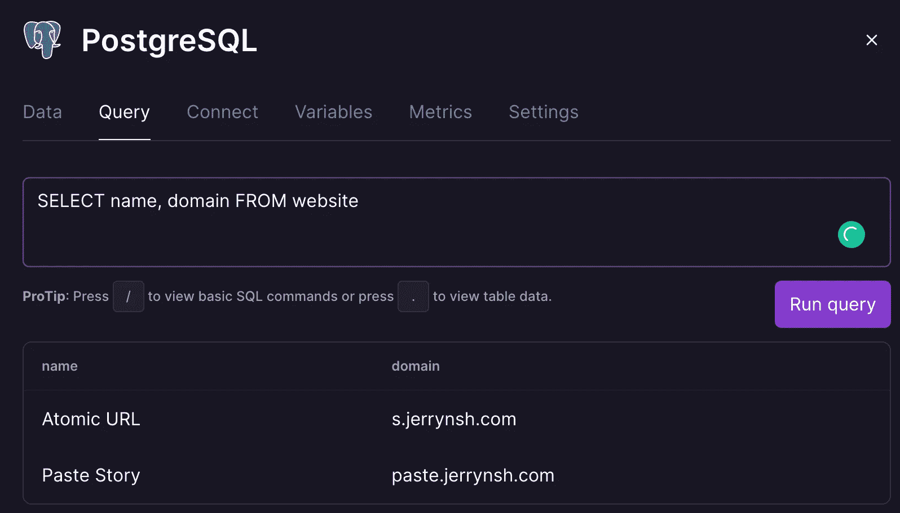
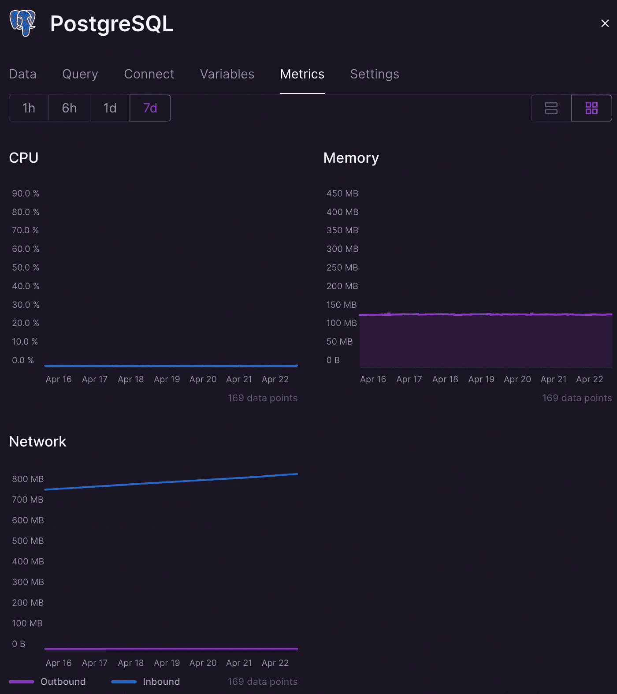
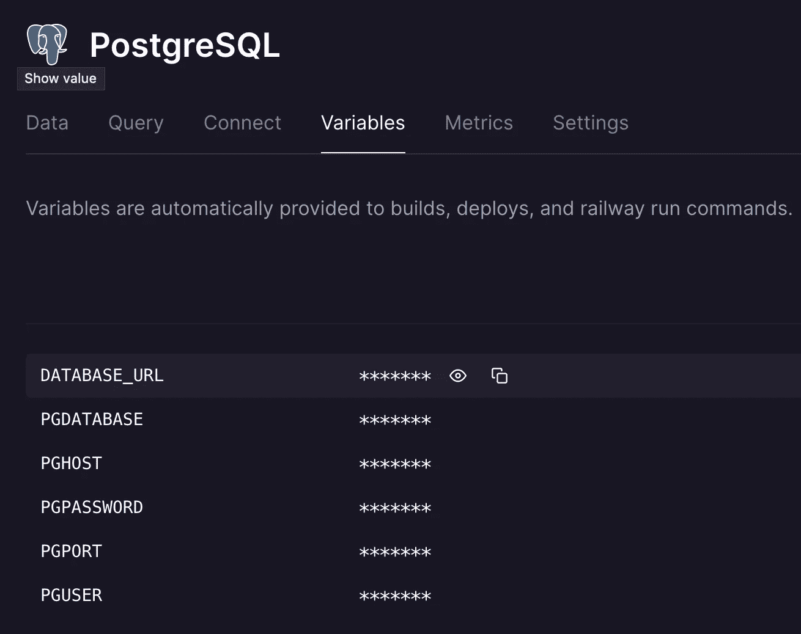

# 再见了 Heroku Postgres。你好，铁路

> 原文：<https://betterprogramming.pub/goodbye-heroku-postgres-hello-railway-b9a7ef9eb88d>

## 我现在要离开 Heroku Postgres。原因如下


丹尼尔·阿巴迪亚在 [Unsplash](https://unsplash.com?utm_source=medium&utm_medium=referral) 上的照片

不到一年前，我创建了 [Burplist](https://burplist.me/) ，这是一个免费的精酿啤酒搜索引擎。为了[尽可能降低我的基础设施成本](https://jerrynsh.com/how-i-built-burplist-for-free/)，我从 [Heroku Postgres 免费层](https://elements.heroku.com/addons/heroku-postgresql)开始。

行数限制为 10，000，存储容量为 1 GB，我以为它至少可以用一年——事实并非如此。

尽管 Heroku Postgres 有一个垃圾收集器服务，每周运行一次来删除过时的行，但它的免费层还是不够。我开始寻找替代品。

*TL；DR:我已经将我的副业项目的 PostgreSQL 迁移到了*[*Railway*](https://railway.app/)*上，因为它的价格和易于迁移。*

# Heroku Postgres 替代方案

在谷歌上搜索了一番后，我发现了几个类似 Heroku 的 PaaS，每个都有自己的 Postgres 服务:

*   [render.com/pricing](https://render.com/pricing)
*   [fly.io/docs/about/pricing/#postgresql-clusters](https://fly.io/docs/about/pricing/#postgresql-clusters)
*   [railway.app/pricing](https://railway.app/pricing)

## 一个脱颖而出

我选择铁路，因为它对我的用例来说是最经济的。以下是我喜欢铁路的一些地方:

*   令人难以置信的慷慨定价，你只需支付 10 美元后的资源使用费。对我来说，这比用 Heroku 便宜多了。
*   他们有一个不和谐的社区，在那里你可以很容易地得到帮助。
*   相当光滑和直观的用户界面。最重要的是，您可以通过仪表板直接查看和执行 SQL 查询。不过，我认为使用像 [TablePlus](https://tableplus.com/) 或 [pgAdmin](https://www.pgadmin.org/) 这样的数据库工具会方便得多。



您只能在默认数据库名称`railway`上查看和执行 SQL 查询

*   仪表板还提供了关于数据库使用情况的 CPU、内存和网络指标；这在 Heroku 的免费等级中是没有的。



铁路 PostgreSQL 仪表板指标

# 如何迁移

迁移是小菜一碟。这很容易成为促使我决定迁移到铁路邮政的推动因素之一。

## 先决条件

1.  在您的机器上本地安装了`postgresql`。例如，如果你在苹果电脑上——`brew install postgresql`
2.  确保您可以运行`[pg_restore](http://www.postgresql.org/docs/current/static/app-pgrestore.html)`命令

## 设置铁路

1.  设置一个[铁路](https://railway.app/)账户
2.  转到您的铁路仪表板，创建一个新项目并提供 PostgreSQL



记下“连接”或“变量”选项卡下的数据库凭据。你以后会需要它们的。

## 5 个迁移步骤

1.  导出 Heroku Postgres ( [参考](https://devcenter.heroku.com/articles/heroku-postgres-import-export))。

```
heroku pg:backups:capture -a <heroku_app_name>
heroku pg:backups:download -a <heroku_app_name>
```

2.在你当前的工作目录下，你应该看到`latest.dump`文件

```
$ heroku pg:backups:capture -a <heroku_app_name>Starting backup of postgresql-encircled-90125... done
Use Ctrl-C at any time to stop monitoring progress; the backup will continue running.
Use heroku pg:backups:info to check progress.
Stop a running backup with heroku pg:backups:cancel.
Backing up DATABASE to b001... done$ heroku pg:backups:download -a <heroku_app_name>
Getting backup from ⬢ <heroku_app_name>... done, #1
Downloading latest.dump... ████████████████████████▏  100% 00:00 309.99KB$ ls
latest.dump
```

3.在与`latest.dump`相同的工作目录中，运行下面的命令将下载的数据库转储文件导入到您的 Railway Postgres 中。使用您自己的 Postgres 证书进行相应更新:

```
# NOTE:
# Keep PGDATABASE as `railway` if you want to view your tables via the Railway dashboard.
# If you insist on another database name, you will have to create your own database via psql command.
#
# E.g.:
# PGPASSWORD=$PGPASSWORD psql -h $PGHOST -U $PGUSER -p $PGPORT -d $PGDATABASE
# CREATE DATABSE your_database_name;PGPASSWORD=$PGPASSWORD pg_restore -h $PGHOST -U $PGUSER -p $PGPORT -d $PGDATABASE < latest.dump
```

4.验证您的数据是否正确导入。为此，您可以使用步骤 4 中的示例所示的`psql`命令，或者通过类似 pgAdmin 的工具连接到您自己的数据库。

5.转到您现有的应用程序，例如 Heroku 应用程序，并相应地更新数据库连接 URL/凭据。

就是这样！

# 我想念 Heroku 数据剪辑

Heroku Postgres 让我非常怀念的一点是它与 [Dataclips](https://devcenter.heroku.com/articles/dataclips) 共享查询结果的能力。Heroku Dataclips 非常有用，因为您可以轻松地:

1.  通过用户界面进行 SQL 查询
2.  通过链接共享 JSON 或 CSV 格式的输出

一旦你有了一个可共享的 CSV 链接，你就可以很容易地把它导入到其他 SaaS，比如 Google Sheets。最重要的是，大多数数据处理 SaaS 支持 CSV 开箱即用；这使得 Dataclip 非常有用。

现在，我要么在另一台服务器上生成自己的 CSV，要么祈祷我使用的 SaaS 集成了 PostgreSQL(提示:大多数没有)。

话虽如此，我还是很乐意做出这样的权衡。

## 其他用途

除了使用 Railway 作为我的项目的 PostgreSQL 数据库服务器，我还使用它来托管我自己的[鲜味](https://umami.is/)分析网站和 [Vercel](https://vercel.com/) 。

我还推荐你去看看他们的其他产品，比如 Redis，MongoDB，还有他们的项目模板。

# 结束语

不，我不会完全离开赫罗库。赫罗库经受住了时间的考验。我希望 Salesforce 旗下的公司能够提供更好的可靠性和稳定性。

除此之外，Heroku 的[附件](https://elements.heroku.com/addons)经常派上用场。附加组件提供了开箱即用的有用集成，例如日志记录、搜索等等！

相反，我不能保证铁路的可靠性和正常运行时间。话虽如此，我正在运行的项目允许我承担这种程度的风险，到目前为止，我的体验非常好。

我支持铁路。我只是喜欢看市场上的竞争。

感谢阅读！

```
**Want to Connect?**This article was originally published at [jerrynsh.com](https://jerrynsh.com/saying-goodbye-to-heroku-postgres/)
```