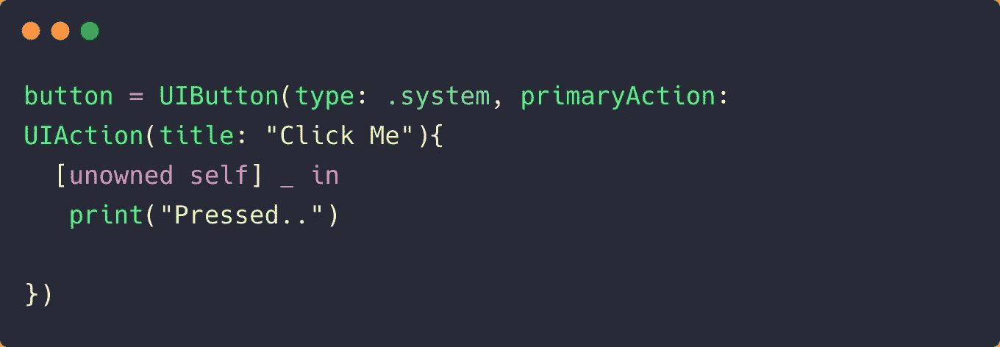
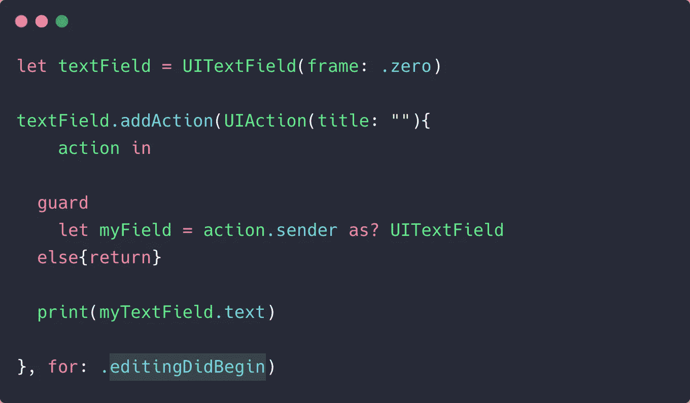

# 再见，目标行动。你好，UIActions

> 原文：<https://betterprogramming.pub/goodbye-target-actions-hello-uiactions-a60e1e2052d5>

## iOS 14 引入了一种在 UIControls 上设置动作的新方法


[曼塔斯·赫斯塔文](https://unsplash.com/@mantashesthaven?utm_source=medium&utm_medium=referral)在 [Unsplash](https://unsplash.com?utm_source=medium&utm_medium=referral) 上拍照。

到目前为止，iOS 开发人员必须使用目标-动作模式来设置 UIKit 控件上的动作。自从选择器在 Objective-C 中诞生以来，这并不是一种设置动作的快捷方式。

在 iOS 13 之前，对于大多数`UIControls`，你必须`addTarget`，设置一个选择器函数名，并在代码中的其他地方定义该函数。这不仅乏味，而且在处理多个按钮或分段控件时，还需要为选择器设置默认动作。如果修改了`UIButton`或`UISegmentedControl`元素，这可能会带来问题，因为我们必须处理选择器处理函数，并确保有一个`default`案例。

iOS 14 通过提供初始化器来设置`UIAction`，改变了我们在一些 UI 元素上设置动作的方式。这样做，我们可以摆脱事件处理程序，因为`UIAction`的处理程序会自动处理它。

所以，是时候告别 iOS 13 和更老的设定目标行动的方式了:

```
button.addTarget(self, action: #selector(test(sender:)), for: .touchUpInside)@objc
func test(sender: UIButton){...}
```

让我们看看在按钮和分段控件上设置`UIAction`的新方法，以及如何用`UIAction`设置控件事件。

# iOS 14 新的 UIAction 初始化器

从`DatePicker`到`ColorPicker`和`UIBarButtonItems`的所有 UI 控件都可以用 iOS 14 中的一个`UIAction`初始化。

`UIButton`现在提供了`primaryAction`作为其初始化器中的附加参数，这让我们可以设置按钮`title`、`image`、`state`、`identifier`和动作处理程序。下面的`UIButton`中的`UIAction`初始化器显示了基本设置:



`UISegmentedControl`引入了一个`actions`参数，让您设置一个`UIActions`数组——每个项目一个:

# 使用 addActions 为控件事件设置 UIActions

关于`UIAction`需要注意的重要一点是它继承自`UIMenuElement`类。

值得注意的是，`UIAction`状态不是`UIControl`事件，它是为在`UIControls`设置`UIMenus`而设计的。

既然我们真的不能在`UIControl`初始化器中设置控制事件，那么如何为特定的控制事件设置`UIAction`？

幸运的是，我们还有一个`addAction`方法，可以让您基于控制事件设置`UIAction`处理程序:

```
button.**addAction**(UIAction(title: "Click Me", handler: { _ in  print("Hi")}), **for: .menuActionTriggered)**
```

`menuActionTriggered`是 iOS 14 的`UIButton`中新增的控制事件。当按下`UIButton`键显示菜单时，它被调用。

# 将 UIAction 与 UITextField 一起使用

对于一个`UITextField`控件，我们想要监听像`editingDidBegin`这样的事件，在初始化器中设置一个`primaryAction`没有帮助，我们必须利用`addAction`方法来监听特定的控件事件:



我们可以遵循相同的方法为不同的控制事件设置动作。

# 结束语

记住，`UIAction`对于在所有`UIControl`初始化器上设置主要动作是有用的。但是如果你想为特定的`UIControl`事件设置动作，实现`addAction`方法是一条可行之路。

`UIAction`基本上是在 iOS 13 的上下文菜单中用来设置菜单动作的。考虑到已经暴露了太多与菜单相关的初始化器，将它暴露给`UIControls`用于 tap 和其他事件是一个值得讨论的设计。无论如何，对于 Swift 开发人员来说，脱离目标-行动模式是一个好的举措和急需的改变。

在实现`UIAction`处理程序时，您需要警惕闭包中可能出现的保留周期。

除了`UIAction`，从 iOS 14 开始的 UIKit 中`UIMenu`也暴露给了所有`UIControls`。我们将在下一篇文章中看到如何做到这一点以及`UIMenu`中的其他变化。敬请关注，感谢阅读。