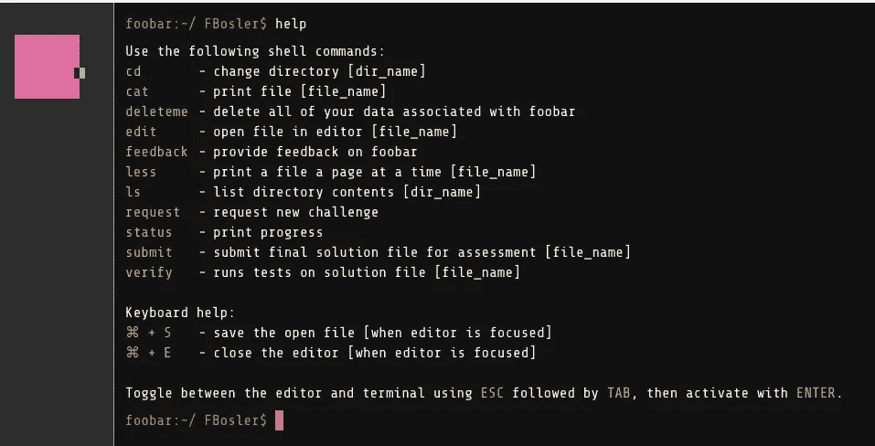
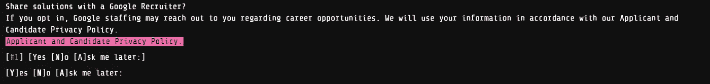
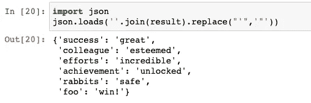
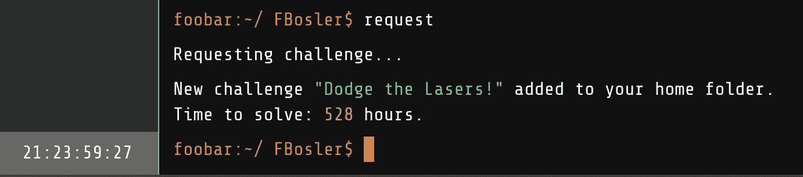

# 谷歌有一个名为 Foobar 的秘密招聘挑战

> 原文：<https://betterprogramming.pub/google-has-a-secret-hiring-challenge-called-foobar-14625bfcea7a>

## 以下是我是如何进入的，以及为什么我喜欢这些问题


Google Foobar 邀请消息

这篇文章概述了我使用 Google Foobar 的经历:我如何获得邀请，问题，我的提交，以及之后发生了什么。请注意，这篇文章包含大量的剧透。

# 介绍

我第一次读到 Google 的 Foobar challenge 一定是在 2019 年的某个时候。我偶尔会上 Codewars，喜欢解决算法问题，所以当我读到 Foobar 时，我想试一试。但首先，让我们退一步，总结一下 Foobar 是什么。

# 什么是 Foobar？

Foobar 是一个半秘密的招聘挑战，谷歌通过一些非传统但合适的方式来寻找有才华的开发人员。Foobar 是一系列**五个级别的算法问题**，难度不断增加，并分配时间来解决这些问题。一旦开发人员提出问题，时间就开始计时。

*   **第一关:**一个问题——48 小时
*   **第二级:**两个问题——每个问题 72 小时
*   **第三级:**三个问题—每个问题 7 天
*   **第 4 级:**两个问题—每个问题 2 周
*   **第 5 级:**一个问题— 22 天

对于每个问题，你可以提交用 Python (2.7)或 Java 编写的解决方案。在提交之前，您还可以验证您的解决方案，并对其进行一系列秘密测试。然而，只有当你的算法通过或者没有通过测试时，你才被告知测试用例。

Foobar 的酷之处在于它发生在一个虚拟服务器上，一旦你被邀请参加挑战，你就可以访问这个虚拟服务器。



Foobar:可用命令

这个场景设置在一艘由指挥官 Lambda 驾驶的虚拟飞船中，Lambda 是一个非常刻薄的杜德特人。Lambda 指挥官捕获了一群太空兔子，你的任务是营救它们。

## 如何进入 Foobar？

关于 Foobar 最有趣的部分是进入。有两种进入方式:一种是上网时直接被谷歌邀请，另一种是通过邀请码。

## A.直接邀请

这种进入 Foobar 的方式要酷得多，因为它通常会让接收者措手不及。通常会发生的是，一个人一直在谷歌搜索(高级)软件工程主题。一旦谷歌足够自信地认为这个人知道他们在找什么，搜索栏就会打开，一个挑战就出现了。

## **B .邀请链接**

谷歌 Foobar 挑战赛的所有参与者在完成第 3 级和第 5 级后都会获得一个个人邀请链接。参与者可以使用邀请链接来邀请朋友/同事。

## 那么我是怎么进入 Foobar 的呢？

2019 年的某个时候，在第一次读到 Foobar 之后，我试图谷歌最晦涩的技术问题，目的是触发邀请。那没用。什么都没发生。所以我差不多把它忘了，直到大约一年前，我在研究下面这篇文章:

[](https://towardsdatascience.com/reimplementing-popular-python-functionalities-in-javascript-b3cfe8e7849f) [## 用 JavaScript 重新实现流行的 Python 功能

### 学习如何在新的世界中应对，并充分利用现有的工具。

towardsdatascience.com](https://towardsdatascience.com/reimplementing-popular-python-functionalities-in-javascript-b3cfe8e7849f) 

当搜索栏打开时，有人问我是否准备好接受挑战，我很清楚会发生什么，然后点了“是”。令人尴尬的是，当时我主要是在谷歌上搜索像`list comprehension`和`dictionary comprehension`这样的东西。

# 问题

**⚠️警告⚠️** 以下部分包含了我在整个关卡旅途中遇到的问题。我考虑不发表这篇文章，因为我不想公开解决方案而“破坏”这个挑战。然而，他们无论如何。一些人已经写了关于这些问题的文章，并且可以在互联网上找到解决方案。此外，我在解决问题的过程中获得了很多乐趣，并意识到一些算法实际上可以应用于我以前遇到的现实生活中的问题。所以我觉得这些挑战不仅很有趣，而且很有启发性。

你可以在这里找到问题和解决方案[。在接下来的部分中，我将描述我的思维过程和对每个问题的实际应用的使用。](https://github.com/FBosler/GoogleFoobar/blob/main/Readme.md)

## 问题 1。

第一个问题要求您执行以下操作:

```
**Problem:**Write a function called solution(data, n) that takes in a list of less than 100 integers and a number n, and returns that same list but with all of the numbers that occur more than n times removed entirely
```

这个问题花了几分钟才弄明白，而且这个问题并没有真正迫使我去学习一些特别新的东西:

```
**Solution:**from collections import Counter

def solution(data, n):
    counted = Counter(data)
    return [k for k, v in counted.items() if v <= n]
```

我们可以利用`collections.Counter`找到解决办法。我的实际提交效率更低，因为我检查了`v>n`，然后再次循环数据。不知道为什么🤷‍♂️.

## 问题 2a。

```
**Problem:**Given a non-empty list of positive integers l and a target positive integer t, write a function solution(l, t) which verifies if there is at least one consecutive sequence of positive integers within the list l (i.e. a contiguous sub-list) that can be summed up to the given target positive integer t (the key) and returns the lexicographically smallest list containing the smallest start and end indexes where this sequence can be found, or returns the array [-1, -1] in the case that there is no such sequence (to throw off Lambda's spies, not all number broadcasts will contain a coded message).
```

有意思，但是解决起来不太复杂(我觉得)。我遍历了这些值，并检查了每个值是否有一个以加起来等于`t`的值开始的子列表。复杂性在最坏的情况下大约在`(n^2)/2 — n/2`左右，这当然不是很好，但是我不觉得性能是个问题，所以我让它保持原样。在此找到完整的问题和解决方案[。](https://github.com/FBosler/GoogleFoobar/tree/main/problem_2/a)

## 问题 2b。

```
**Problem:**Oh no! Commander Lambda's latest experiment to improve the efficiency of her LAMBCHOP doomsday device has backfired spectacularly. She had been improving the structure of the ion flux converter tree, but something went terribly wrong and the flux chains exploded. Some of the ion flux converters survived the explosion intact, but others had their position labels blasted off. She's having her henchmen rebuild the ion flux converter tree by hand, but you think you can do it much more quickly - quickly enough, perhaps, to earn a promotion!

Flux chains require perfect binary trees, so Lambda's design arranged the ion flux converters to form one. To label them, she performed a post-order traversal of the tree of converters and labeled each converter with the order of that converter in the traversal, starting at 1\. For example, a tree of 7 converters would look like the following:

```
   7
 3   6
1 2 4 5
```Write a function solution(h, q) - where h is the height of the perfect tree of converters and q is a list of positive integers representing different flux converters - which returns a list of integers p where each element in p is the label of the converter that sits on top of the respective converter in q, or -1 if there is no such converter.  For example, solution(3, [1, 4, 7]) would return the converters above the converters at indexes 1, 4, and 7 in a perfect binary tree of height 3, which is [3, 6, -1].
```

这是我真正喜欢的第一个问题，因为它让我思考这样的树将如何概括，以及哪些信息将是可用的和容易计算的。

对于高度为`h`的树，我们首先需要找到的是根节点的值，也就是树中值的数量，换句话说:

`base_root = sum([2 ** level for level in range(h)])`

我们需要一个函数，它能为每个给定的数找到根。这个函数需要我们的`base_root`树的`height`和`element`来检查。这个函数将会工作。

1.  检查我们是否越界(即顶部没有节点)`-> -1`
2.  计算`left_leaf = root_value — 2**(height-1)`和`right_leaf = root_value -1`
3.  检查`element not in [left_leaf, right_leaf]`和`else -> root_value`
4.  现在，虽然`element`不是这两片叶子中的任何一片，但我们遍历了元素所在的树枝(有点像二分搜索法)。如果`element`小于`left_leaf`，那么它将位于树的左侧；否则，在树的右边。
5.  将`root_value`设置为`left_leaf`或`right_leaf`并将高度降低一。
6.  冲洗并重复。我们可以递归地或者使用 while 循环来实现。

你可以在这里找到完整的问题和解决方案。

## 问题 3a。

这是一个真正的指甲咬。但也是我最喜欢的第一个，因为它让我重新研究了马尔可夫链。此外，在研究这个问题时，我意识到我遇到了一些现实生活中的应用，这些理论可能会有所帮助。第一个想到的是客户终身价值，在这种情况下，客户可以从一个细分市场转移到另一个细分市场，这种转移可以是隐性的(如他们的购买行为所示)，也可以是显性的(如订阅计划的变化所示)。

现在，如果一个人可以计算新客户的预期终端分布(在细分市场上),并且如果一个人知道某个特定细分市场中某个客户的大概终身价值，那么他就可以非常准确地估计随机新客户的终身价值。

不管怎样，让我们转移到问题上来:

```
**Problem:**Making fuel for the LAMBCHOP's reactor core is a tricky process because of the exotic matter involved. It starts as raw ore, then during processing, begins randomly changing between forms, eventually reaching a stable form. There may be multiple stable forms that a sample could ultimately reach, not all of which are useful as fuel. 

Commander Lambda has tasked you to help the scientists increase fuel creation efficiency by predicting the end state of a given ore sample. You have carefully studied the different structures that the ore can take and which transitions it undergoes. It appears that, while random, the probability of each structure transforming is fixed. That is, each time the ore is in 1 state, it has the same probabilities of entering the next state (which might be the same state).  You have recorded the observed transitions in a matrix. The others in the lab have hypothesized more exotic forms that the ore can become, but you haven't seen all of them.

Write a function solution(m) that takes an array of array of nonnegative ints representing how many times that state has gone to the next state and return an array of ints for each terminal state giving the exact probabilities of each terminal state, represented as the numerator for each state, then the denominator for all of them at the end and in simplest form. The matrix is at most 10 by 10\. It is guaranteed that no matter which state the ore is in, there is a path from that state to a terminal state. That is, the processing will always eventually end in a stable state. The ore starts in state 0\. The denominator will fit within a signed 32-bit integer during the calculation, as long as the fraction is simplified regularly. 

For example, consider the matrix m:
```
[
  [0,1,0,0,0,1],  # s0, the initial state, goes to s1 and s5 with equal probability
  [4,0,0,3,2,0],  # s1 can become s0, s3, or s4, but with different probabilities
  [0,0,0,0,0,0],  # s2 is terminal, and unreachable (never observed in practice)
  [0,0,0,0,0,0],  # s3 is terminal
  [0,0,0,0,0,0],  # s4 is terminal
  [0,0,0,0,0,0],  # s5 is terminal
]
```
So, we can consider different paths to terminal states, such as:
```
s0 -> s1 -> s3
s0 -> s1 -> s0 -> s1 -> s0 -> s1 -> s4
s0 -> s1 -> s0 -> s5
```
Tracing the probabilities of each, we find that
s2 has probability 0
s3 has probability 3/14
s4 has probability 1/7
s5 has probability 9/14
So, putting that together, and making a common denominator, gives an answer in the form of
```
[s2.numerator, s3.numerator, s4.numerator, s5.numerator, denominator] which is
[0, 3, 2, 9, 14].
```
```

我们实际上需要相当多的线性代数来解决这个问题，我们必须自己实现，因为标准 Python 2.7 库中没有线性代数。您可以在回购中找到完整的解决方案，但我将在较高的层次上介绍这些步骤。不过，首先，你应该看看达特茅斯的这个[精彩讲座的第 11.2 章(426 页起)，在那里所有的理论基础及其要求都得到了很好的解释。基本要点是，我们正在寻找计算如下的`terminal_states`:](https://chance.dartmouth.edu/teaching_aids/books_articles/probability_book/amsbook.mac.pdf)

`B = N*R = (I-Q)^(-1) * R`

讲座解释了我们如何得到`Q`和`R`，但本质上，它们只是经过一些排序和规范化后的矩阵的一部分。重新实现反演所需的高斯消去法有点乏味，但一旦理解了理论基础，它最终会变得非常简单。

您可以在此找到完整的问题和解决方案[。](https://github.com/FBosler/GoogleFoobar/tree/main/problem_3/a)

## 问题 3b。

该问题是一个最短路径问题，附加条件是可以忽略一个障碍。像这样的问题很容易转化为现实生活中的应用程序，比如找到从一个城市到另一个城市的最短路线，只需支付一定数量的高速公路通行费。或者最多路过一家麦当劳，因为不想让孩子太难过:)

```
**Problem:**...Unfortunately (again), you can't just remove all obstacles between the bunnies and the escape pods - 
at most you can remove one wall per escape pod path, both to maintain structural integrity of the station and 
to avoid arousing Commander Lambda's suspicions.

You have maps of parts of the space station, each starting at a prison exit and ending at the door to an escape pod. 
The map is represented as a matrix of 0s and 1s, where 0s are passable space and 1s are impassable walls. 
The door out of the prison is at the top left (0,0) and the door into an escape pod is at the bottom right (w-1,h-1).

Write a function solution(map) that generates the length of the shortest path from the prison door to the escape pod, 
where you are allowed to remove one wall as part of your remodeling plans. The path length is the total number of nodes
you pass through, counting both the entrance and exit nodes. The starting and ending positions are always passable (0).
The map will always be solvable, though you may or may not need to remove a wall. 
The height and width of the map can be from 2 to 20\. Moves can only be made in cardinal directions; 
no diagonal moves are allowed.
```

为了解决这个问题，我在我所谓的`double layered graph`上使用了广度优先搜索。我确信我没有发明它，只是在某处读到过，但是最终的实现感觉真的很好。尤其是在最初尝试了蛮力方法之后。

我思考这个问题的方式是创建两个相同的迷宫层，并将它们叠放在一起。在迷宫中穿行时，我们发现相邻的节点，并将它们放入一个双端队列中。然后，我们逐个删除(`visit them`)队列中的节点，并发现新节点。在基础层中，墙可以被发现为可访问的节点。但是，阴影层中的墙不能被发现(即，它们不能被穿过)。

当访问基础层中的节点时，我们将基础层中的节点和阴影层中的对应节点标记为已访问。我们这样做是因为发现一个节点而不先碰壁绝对更好。一旦我们踏入一面墙，我们就转换到阴影层，从而确保这种特殊的遍历不会碰到另一面墙。

你可以在这里找到完整的问题和解决方案[。](https://github.com/FBosler/GoogleFoobar/tree/main/problem_3/b)

## 问题 3c。

这个问题比 3a 简单多了。和 3b。一旦我们考虑二进制表示，这个有趣的问题就变得容易解决了。

```
**Problem:****...**The fuel control mechanisms have three operations: 

1) Add one fuel pellet
2) Remove one fuel pellet
3) Divide the entire group of fuel pellets by 2 (due to the destructive energy released when a quantum antimatter 
pellet is cut in half, the safety controls will only allow this to happen if there is an even number of pellets)

Write a function called solution(n) which takes a positive integer as a string and returns the minimum number of 
operations needed to transform the number of pellets to 1\. The fuel intake control panel can only display a 
number up to 309 digits long, so there won't ever be more pellets than you can express in that many digits.
```

哇，一个 309 位数的数字太大了。大约是 2 的 1026 次方。在这种情况下，我们真的进入了`OverflowError`领域，只是天真地应用试错法会导致一个非常低效的算法。

然而，一旦我们理解了通过将`n`转换为二进制并查看尾随 0 的数量，我们就已经知道我们可以被 2 除多少次。移除这些零相当于除以 2 的零的幂。如果没有尾随零，我们检查下一个循环，添加或删除一个是否会导致更多尾随零(即，更少的操作)。

您可以在此处找到完整的问题和解决方案[。](https://github.com/FBosler/GoogleFoobar/tree/main/problem_3/c)



第 3 级后的招聘人员政策

## 问题 4a。

如果我没记错的话，这是我花了最多时间的问题。这个问题归结为在图上寻找最大匹配。我最开始想用的算法是 [Blossom 算法](https://stanford.edu/~rezab/classes/cme323/S16/projects_reports/shoemaker_vare.pdf)。然而，Blossom 的复杂度为`O(|E||V|^2)`，Blossom 算法有一个变种，复杂度为`O(|E||V|^(1/2))`。希尔维奥·米卡利和维贾伊·瓦齐拉尼开发了这个算法。这里可以找到一个证明。

我稍微研究了一下这个算法，甚至看了 YouTube 上关于它的讨论，但是我觉得我并没有真正理解这个算法，所以我决定不使用它。最终，我使用深度优先搜索来搜索复杂度为 T5 的 T4。

```
**Problem:**...You will set up simultaneous thumb wrestling matches. In each match, two guards will pair off to thumb wrestle. The guard with fewer bananas will bet all their bananas, and the other guard will match the bet. The winner will receive all of the bet bananas. You don't pair off guards with the same number of bananas (you will see why, shortly). You know enough guard psychology to know that the one who has more bananas always gets over-confident and loses. Once a match begins, the pair of guards will continue to thumb wrestle and exchange bananas, until both of them have the same number of bananas. Once that happens, both of them will lose interest and go back to guarding the prisoners, and you don't want THAT to happen!

For example, if the two guards that were paired started with 3 and 5 bananas, after the first round of thumb wrestling they will have 6 and 2 (the one with 3 bananas wins and gets 3 bananas from the loser). After the second round, they will have 4 and 4 (the one with 6 bananas loses 2 bananas). At that point they stop and get back to guarding.

How is all this useful to distract the guards? Notice that if the guards had started with 1 and 4 bananas, then they keep thumb wrestling! 1, 4 -> 2, 3 -> 4, 1 -> 3, 2 -> 1, 4 and so on.

Now your plan is clear. You must pair up the guards in such a way that the maximum number of guards go into an infinite thumb wrestling loop!Write a function solution(banana_list) which, given a list of positive integers depicting the amount of bananas the each guard starts with, returns the fewest possible number of guards that will be left to watch the prisoners. Element i of the list will be the number of bananas that guard i (counting from 0) starts with.

The number of guards will be at least 1 and not more than 100, and the number of bananas each guard starts with will be a positive integer no more than 1073741823 (i.e. 2^30 -1). Some of them stockpile a LOT of bananas.
```

为了解决这个问题，我们首先构建一个图，其中每条边表示两个守卫之间的死锁。我们将该信息存储在一个矩阵中，其中位置`(i,j)`处的 1 表示保护`i`和保护`j`之间的死锁。0 表示终止匹配。

我们将利用[增加路径](https://www.baeldung.com/cs/augmenting-path)的概念来寻找最优解。当我们找到一条增加的路径(并且剩下不匹配的顶点)时，我们将重复以下步骤:

1.  将访问过的数组和路径设置为空数组
2.  当前顶点从我们的不匹配顶点列表中弹出
3.  检查我们是否能找到电流增加路径的交替延伸
4.  如果我们发现一个交替扩展，我们将当前顶点添加到路径中，并移动到邻居
5.  如果我们没有找到交替的扩展，我们回溯
6.  现在，如果当前顶点(或者是邻居或者是前一个顶点)在不匹配顶点列表中，我们将把这个顶点添加到我们的路径中，并更新我们的匹配和不匹配边列表

一旦我们找不到增加的路径，我们就中断循环。通过从守卫数量中减去匹配的数量，我们获得不匹配的守卫数量。

你可以在这里找到完整的问题和解决方案[。](https://github.com/FBosler/GoogleFoobar/tree/main/problem_4/a)

## **问题 4b。**

四级第二题我都快不记得了。

```
**Problem:**You need to free the bunny prisoners before Commander Lambda's space station explodes! Unfortunately, the commander was
very careful with her highest-value prisoners - they're all held in separate, maximum-security cells.
The cells are opened by putting keys into each console, then pressing the open button on each console simultaneously.
When the open button is pressed, each key opens its corresponding lock on the cell. So, the union of the keys in all of
the consoles must be all of the keys. The scheme may require multiple copies of one key given to different minions.

The consoles are far enough apart that a separate minion is needed for each one. Fortunately, you have already freed
some bunnies to aid you - and even better, you were able to steal the keys while you were working as
Commander Lambda's assistant. The problem is, you don't know which keys to use at which consoles. The consoles are
programmed to know which keys each minion had, to prevent someone from just stealing all of the keys and using them
blindly. There are signs by the consoles saying how many minions had some keys for the set of consoles.
You suspect that Commander Lambda has a systematic way to decide which keys to give to each minion such that they
could use the consoles.

You need to figure out the scheme that Commander Lambda used to distribute the keys. You know how many minions had keys,
and how many consoles are by each cell. You know that Command Lambda wouldn't issue more keys than necessary
(beyond what the key distribution scheme requires), and that you need as many bunnies with keys as there are consoles
to open the cell.

Given the number of bunnies available and the number of locks required to open a cell, write a function
solution(num_buns, num_required) which returns a specification of how to distribute the keys such that any num_required
bunnies can open the locks, but no group of (num_required - 1) bunnies can.

Each lock is numbered starting from 0\. The keys are numbered the same as the lock they open (so for a duplicate key,
the number will repeat, since it opens the same lock). For a given bunny, the keys they get is represented as a
sorted list of the numbers for the keys. To cover all of the bunnies, the final answer is represented by a sorted
list of each individual bunny's list of keys.  Find the lexicographically least such key distribution - that is,
the first bunny should have keys sequentially starting from 0.
```

我记得的一件事是，我看的时候发现这个问题很混乱。我花了一些时间才真正理解我们应该发现什么。然而，一旦问题陈述清楚了，解决方案就是一个简单的组合学应用(更准确地说是组合)。

```
from itertools import combinations**def solution(num_buns, num_required):** *"""
Number of copies per key:
-------------------------
Select any group of "num_required - 1" bunnies. By specification they can not open the door.
However, if we were to add any one of the remaining "num_buns - (num_required - 1)" bunnies,
we would be able to open the door.

=> every one of the remaining "num_buns - num_required + 1" bunnies has exactly one key that
   is not in the union of keys of the selected "num_required - 1".

This means that every key has exactly
num_buns - num_required + 1
copies (called copies_per_key)

Total keys:
-----------
Based on the above logic, there are exactly
/      num_buns    \
\ num_required - 1 /
different sets of bunnies that miss one key to being able to open the door.

=> there is a total number of distinct keys =
/      num_buns    \
\ num_required - 1 /
=
/            num_buns         \
\ num_buns - num_required + 1 /
= len(combinations(range(num_buns), copies_per_key))
"""*key_sets = [[] for _ in range(num_buns)]

copies_per_key = num_buns - num_required + 1

for key, bunnies in enumerate(combinations(range(num_buns), copies_per_key)):
    for bunny in bunnies:
        key_sets[bunny].append(key)

return key_sets
```

你可以在这里找到完整的问题和解决方案[。](https://github.com/FBosler/GoogleFoobar/tree/main/problem_4/b)

## **问题 5。**

这个问题来自群论领域，我在大学期间非常喜欢这个领域。然而，在阅读《基础》时，我也发现了 Foobar 问题的解决方案。[解决方案](https://github.com/franklinvp/foobar/blob/master/foobar2020/solutionProblem1.py)和[对应的博客帖子](https://franklinvp.github.io/2020-06-05-PolyaFooBar/)相当精彩，所以我直接复制了解决方案并引用了原作者，因为我觉得我无论如何也无法改进算法。

```
**Problem:**... There's something important to note about quasar quantum flux fields' configurations: when drawn on a star grid, configurations are considered equivalent by grouping rather than by order. That is, for a given set of configurations, if you exchange the position of any two columns or any two rows some number of times, youll find that all of those configurations are equivalent in that way - in grouping, rather than order.

Write a function solution(w, h, s) that takes 3 integers and returns the number of unique, non-equivalent configurations that can be found on a star grid w blocks wide and h blocks tall where each celestial body has s possible states. Equivalency is defined as above: any two star grids with each celestial body in the same state where the actual order of the rows and columns do not matter (and can thus be freely swapped around). Star grid standardization means that the width and height of the grid will always be between 1 and 12, inclusive. And while there are a variety of celestial bodies in each grid, the number of states of those bodies is between 2 and 20, inclusive. The solution can be over 20 digits long, so return it as a decimal string.  The intermediate values can also be large, so you will likely need to use at least 64-bit integers.
```

你可以在这里找到完整的问题和解决方案[。](https://github.com/FBosler/GoogleFoobar/tree/main/problem_5)

# 那么我提交了 Google 的 Foobar 之后发生了什么？

紧接着级别 5，显示了 base64 编码的字符串。对这个字符串进行解码，然后对我的个人用户名进行按位异或运算，然后将结果转换回 Unicode，得到我认为是某种形式的最终分数。



来自 Foobar 的最终解密信息

嗯，这有点令人失望。但是后来什么都没发生。据我所知，有时招聘人员会主动联系被邀请到 Foobar 的开发人员。这里没有发生这种情况。我很好奇接下来会发生什么。

也许我不应该在最后一个问题上作弊😂。

也可能是因为我的代码没有通过一些内部测试，或者是因为我的简历不符合典型的谷歌申请人。不管怎样，我从挑战中获得了无穷的乐趣，并且刚刚意识到 Foobar 服务器中有新的问题。我的登录仍然有效，所以我要解决更多的问题！敬请关注更多内容。



我刚刚提出了一个新问题。时钟又开始滴答作响了。

**更新:**解决了新问题。我也很喜欢那个。查看相应的文章:

[](https://towardsdatascience.com/dodge-the-lasers-fantastic-question-from-googles-hiring-challenge-72363d95fec) [## 避开激光——来自谷歌招聘挑战的奇妙问题

### 谷歌有一个名为 Foobar 的秘密招聘挑战。我喜欢这些问题，因为它们让我再次使用数学。

towardsdatascience.com](https://towardsdatascience.com/dodge-the-lasers-fantastic-question-from-googles-hiring-challenge-72363d95fec)