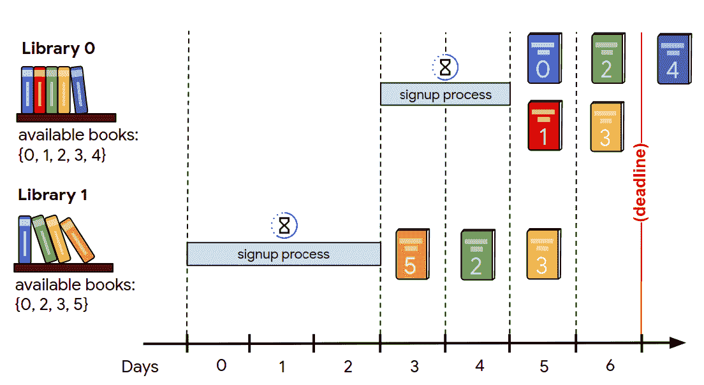
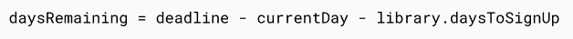
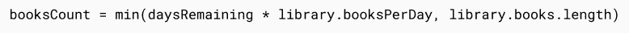
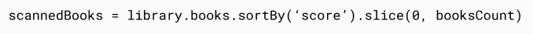
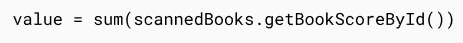
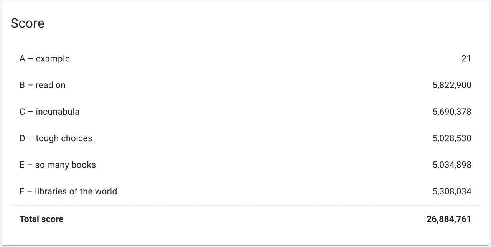

# 谷歌哈希代码 2020:我们如何取得 98.5%的最好成绩

> 原文：<https://betterprogramming.pub/google-hash-code-2020-how-we-took-98-5-of-the-best-score-e5b6fa4abc1b>

## 我们在乌克兰排名第 53 位，在世界排名第 530 位


照片由[米切尔罗](https://unsplash.com/@mitchel3uo?utm_source=medium&utm_medium=referral)在 [Unsplash](https://unsplash.com?utm_source=medium&utm_medium=referral)

由于我们没有机会参加今年的谷歌哈希代码，我们决定在扩展赛中尽力而为。下面是结果:世界排名第 530，乌克兰第 53。

# 什么是谷歌哈希码？

自 2016 年以来，谷歌一直在组织一场名为[哈希代码](https://codingcompetitions.withgoogle.com/hashcode)的程序员竞赛。两到四人的团队可以参加比赛，他们必须解决一个优化问题。每年它都吸引了成千上万来自世界各地的人们。

它有两个回合:主回合和扩展回合。主回合只持续四个小时，而延长回合可持续两周。当然，延长赛不计入记分牌，但这仍然是检验你的知识和技能的好机会。

正如我们提到的，我们没有机会参加主轮，但也许我们的解决方案会让你感兴趣。或者，它可能会促使您尝试实现自己的解决方案。

# 今年的任务描述

今年，参与者面临的问题是扫描不同图书馆的书籍。

你必须从首先注册的图书馆中选择得分最高的书。这件事必须在规定的期限内完成。相同的书籍可以在多个图书馆中获得，但是每本书只能获得一次分数。此外，每个图书馆每天可以提供不同数量的书籍。

这是我们得到的原始数据:

*   一次只能有一个图书馆注册。
*   只有签约的图书馆才能为你提供扫描的书籍。
*   你有一个总的截止日期。
*   你的目标是在所有提供的书籍中获得尽可能高的分数。

听起来可能有点复杂，至少用我们的话说是这样！希望这张图片能帮助你弄清事情的真相:



如果你还没有解决这个问题，我们建议你推迟阅读这篇文章的其余部分，试着先自己解决。

# 我们的解决方案

分析任务描述，我们得出的结论是，基本上只有一个问题需要解决:每次注册过程是空的，我们必须找到最合适的库，我们将通过它来注册。

为了找到这个图书馆，我们决定按照以下标准对它们进行评估:两个正面——图书馆书籍的分数和我们每天可以扫描的书籍数量；还有一个负面因素——注册一个图书馆需要多少天。

我们停下来的第一个算法非常简单。它基本上计算了如果我们现在开始注册，图书馆将产生多少分数。

*   计算注册完成后还剩多少天。



*   乘以每天扫描的书籍数量。



*   根据分数对书籍进行排序，并获得排名靠前的书籍。



*   扫描书籍的累积分数就是图书馆价值。



之后，我们只选择具有最高值的库。如果有多个库具有最大值，我们选择注册时间最短的一个。

结果如下:

```
a         |             21b         |      5 822 900c         |      1 480 105d         |      5 028 530e         |      3 310 023f         |      1 197 503**total     |     16 839 082**
```

这个解决方案相当不错，但仍远非完美。所以我们继续尝试。

经过进一步的头脑风暴，我们发现负标准(注册图书馆的天数)在我们的等式中没有得到恰当的体现。

在我们的公式中引入这个标准的许多方法中(为标准定义一些系数，等等。)，我们选择了下面这个——用计算值除以报名天数。这样我们就可以得到好的输入和坏的输入之间的比率。

我们得到的结果非常令人吃惊，结果比当时的最佳结果只差 1.5%。



这是我们的源代码(不要评价我们，我们做得太匆忙了！):

# 我们从这次经历中学到了什么

*   用算法思考
*   找到问题的根源——即使这个任务乍看起来很复杂，但真正的问题可能很简单。
*   考虑方程的所有变量。
*   不要停止改善结果——如果某样东西有效，并不意味着它不能更好地发挥作用。
*   使用 TypeScript 而不是 JavaScript。我们花了很多时间调试 JavaScript 问题，这些问题本可以通过使用 TypeScript 来避免。

## 团队成员的积分:

Yelysei Lukin ( [LinkedIn](https://www.linkedin.com/in/yelysei/)

[奥莱赫·扎波罗热茨](https://medium.com/u/262dcfc8102b?source=post_page-----e5b6fa4abc1b--------------------------------) ( [领英](https://www.linkedin.com/in/oleh-zaporozhets/))