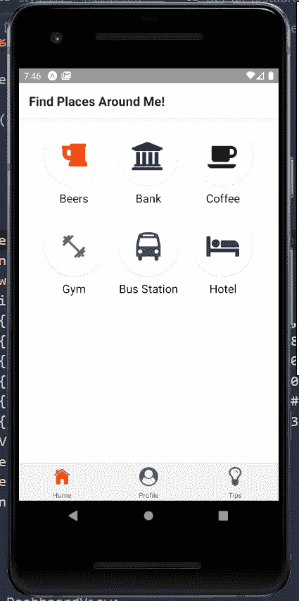
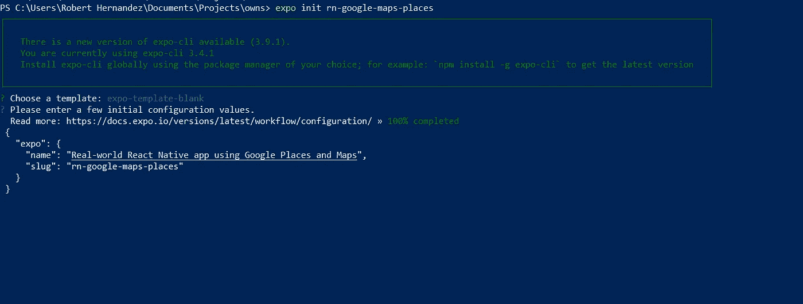
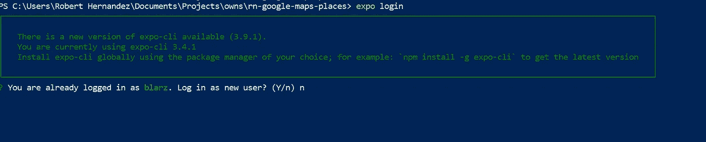
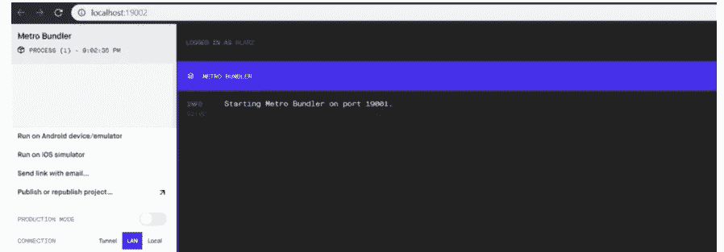
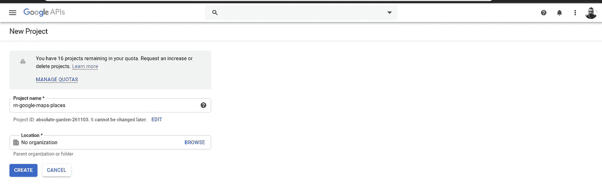
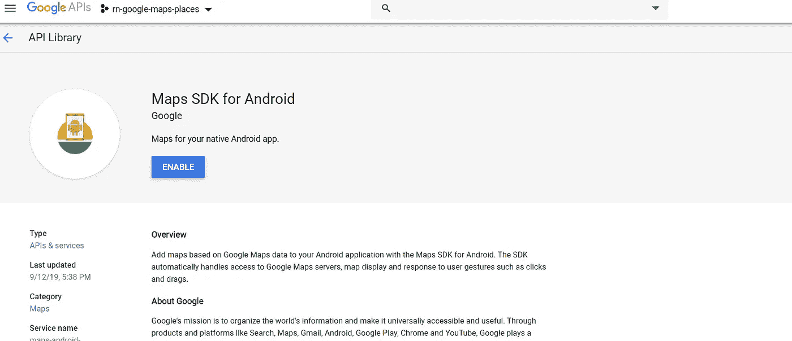
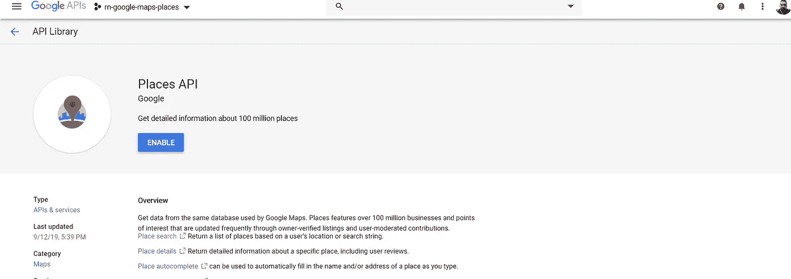
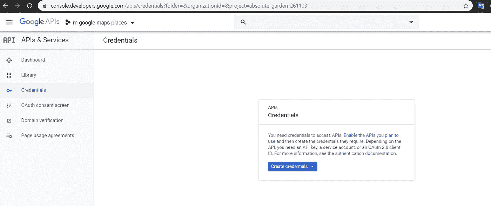
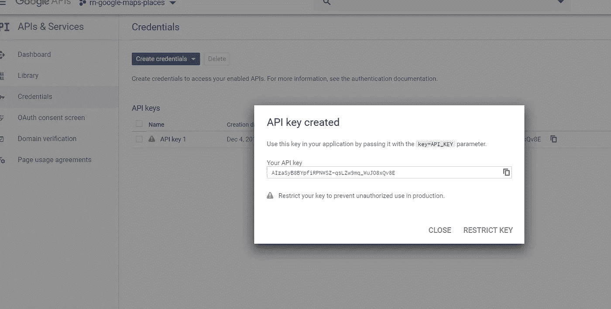

# 真实世界中的 Google 地图和地点 React 本地应用程序(第 1 部分)

> 原文：<https://betterprogramming.pub/google-map-and-places-in-a-real-world-react-native-app-83540430ee36>

## 一个完整的 React 原生指南，用于在 Android 上使用 Expo 从头开始构建应用程序



React 本机应用程序—要构建的仪表板

这是关于使用 Expo 在真实世界 React 原生应用程序中集成谷歌地图和地点的系列帖子的第一篇。

# 原因

我最近的副业项目中需要的一个功能是使用 Expo 在真实世界的 React 原生应用程序中实现谷歌地图和地点。我找了几个教程，但是都没用，至少对我来说是这样。实施它是一场艰苦的战斗。

我花了很多时间尝试实现谷歌地图和地点，得到了很多错误。我还花了大量时间搜索堆栈溢出，但没有任何成功的结果。经过这场艰苦的斗争，我终于达到了目的。然后我想，我应该写一个帖子系列，在那里我将详细介绍如何实现这个特性的所有步骤，甚至更多。所以在这篇文章中，我们将创建一个集成了谷歌地图和地点的 React 原生应用。

# 要求

让用户能够寻找他们附近的地方，并获得他们的所有信息，如照片，邻近地区，地址，评级，评论，营业时间，最后，在新版本中，添加功能来寻找过滤器。除此之外，添加允许用户点击特定餐馆并获得与该餐馆相关的菜肴的功能。这部分不是这篇文章的目的——我们将在以后的另一篇文章中讨论它。

# 将问题分解成称为用户故事的小块

## 我们的 MVP(最低可行产品)

**先规划，再编码。**

所以，让我们把需求分解成更小的部分，称为用户故事，看看我们作为一个可交付成果要完成什么。接下来的每个故事都可以被分解成更具体的任务，但我认为现在这样就可以了。

*   作为一个最终用户，我希望看到一个带有菜单选项的仪表板，可以找到银行、ATM、酒吧、咖啡馆、酒店、公交车站和健身房等地方。
*   我想在底部有一个选项卡导航菜单:主页，个人资料和设置。
*   我想有能力点击银行，酒吧，咖啡，酒店，公交车站，或健身房，并得到我点击的当前位置的结果列表。
*   我想看到每个地方的评级，位置，名称，描述，明星，和附近地区。
*   我想有一个搜索栏来寻找一个地方的关键字，名称，或城市。
*   我想了解一个地方，并获得它的详细信息。

**注意:***我假设你已经有了一点使用 React 原生应用和 React.js 主要概念的经验*

我们将在 Expo.io 工具的帮助下从头开始构建应用程序，为您提供一步一步的指导。

**那么，让我们开始动手干脏活吧。**

# 举办世博会

要使用 Expo，您需要两样东西:一个本地开发(Expo CLI)工具和一个移动客户端(Expo client)来打开您的应用程序。

## 先决条件:

*   ***Node.js***
*   ***Git***

## **安装世博 CLI**

```
 npm install -g expo-cli
```

## 在您的 Android 设备上安装 Expo 客户端工具

这是启动世博会项目的最快方式。我们需要这个工具，因为它允许我们运行应用程序，并显示我们正在开发的变化的预览。

您可以从 Play Store[下载世博客户端 app](https://play.google.com/store/apps/details?id=host.exp.exponent) 。然而，如果你喜欢在本地机器上运行 Expo 应用程序，你需要安装一个[模拟器或仿真器](https://docs.expo.io/versions/latest/workflow/android-studio-emulator/)。

如果你需要更多关于世博会设置的信息，我强烈推荐你去官方网站。

## 创建 Expo 帐户

你需要在 Expo.io 上注册。所以，去 [Expo 登录页面](https://expo.io/login) e 并创建你的账户。下一步你会用到它。

现在我们已经安装了 Expo CLI，所以下一步是通过 Expo 命令创建应用程序。

## 创建项目

我用的是 Windows Powershell。如果使用 Gitbash，在非交互模式下需要额外的参数。

```
expo init rn-google-maps-places
```

运行该命令后，选择一个模板—您可以使用箭头键上下导航。之后在`name`属性中添加一个世博名 app。这将是最终输出:



`Expo init rn-google-maps-places`

按下`ENTER`后，你将进入下一个屏幕。键入`Y`接受通过 `Yarn`下载所有项目的依赖关系**。并且只需等待一段时间，直到它们全部下载完毕！**


下载依赖项

现在，打开一个命令提示符(我用的是 Powershell)登录 Expo。系统会提示您输入刚才创建的用户名和密码。

```
expo login
```



Expo 登录命令

## 启动开发服务器

完成这些之后，现在我们需要启动开发服务器。您只需要运行下一个命令。不要忘记进入您在前面的步骤中刚刚创建的项目的根目录。

```
npm start
```

之后，你会看到这个屏幕。



## Google 云平台设置

我们必须建立谷歌云平台。登录[谷歌](https://console.developers.google.com/apis/dashboard?project=rock-sublime-142804&angularJsUrl=)，然后，创建项目。您应该能够看到类似下一个屏幕的内容。



Google 项目创建

现在我们需要启用两个 API:`Maps SDK for Android`和`Places API`。进入`library`菜单，搜索这些 API，然后启用它们。



为 Android 启用地图 SDK



启用地点 API

一旦您确定两者都已启用，就该创建凭证了。由此，我们将需要 API 密钥来将我们的应用程序与这两个服务连接起来。所以请把它保存在某个地方——我们以后会需要它。



凭据创建



Google API 密钥

到目前为止，我们已经设置了 Expo 应用程序及其工具，我们还创建了 Google 项目来获取 API 密钥。在下一篇文章中，我们将开始动手编程。

[谷歌地图和真实世界中的地点 React 本地应用(第二部分)](https://medium.com/better-programming/google-maps-and-places-in-a-real-world-react-native-app-100eff7474c6)

感谢阅读！