# 真实世界中的谷歌地图和地点 React 本地应用(第 2 部分)

> 原文：<https://betterprogramming.pub/google-maps-and-places-in-a-real-world-react-native-app-100eff7474c6>

## 实现导航、搜索栏和 MapView


使用谷歌地图和地点对原生应用做出反应

这是关于使用 [Expo](https://expo.io/) 将谷歌地图和地点整合到现实世界 React 原生应用的系列文章的第二部分。在第一部分，我们做了所有的设置工作:Expo 和 Google 账户设置，以及 API 密匙生成。

# 安装 react-native-maps

让我们通过运行以下命令来安装`react-native-maps`。请记住，此应用程序是由*管理的* Expo 应用程序。这意味着我们正在使用 Expo CLI。Expo 尽可能地为您管理构建应用程序的复杂性。

```
expo install react-native-maps
```

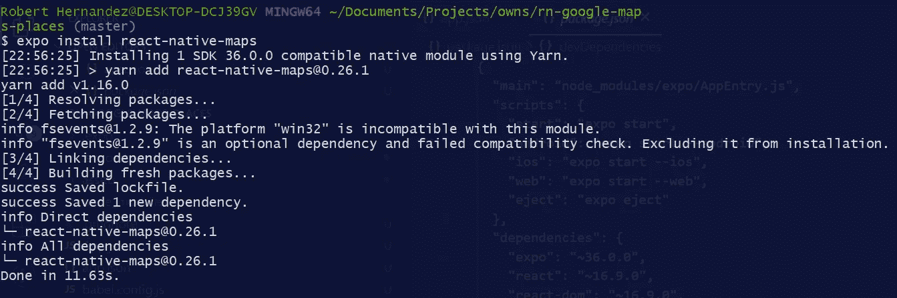

安装 React 本机地图

请记住，我们使用的是 Expo SDK 36，它基于 React Native 0.61.4。这意味着`react-native-maps`不需要额外的设置就可以在 Expo 客户端应用**中使用。**然而，对于作为独立的应用程序的部署，我们将需要本文未涉及的额外设置。

# 文件夹结构

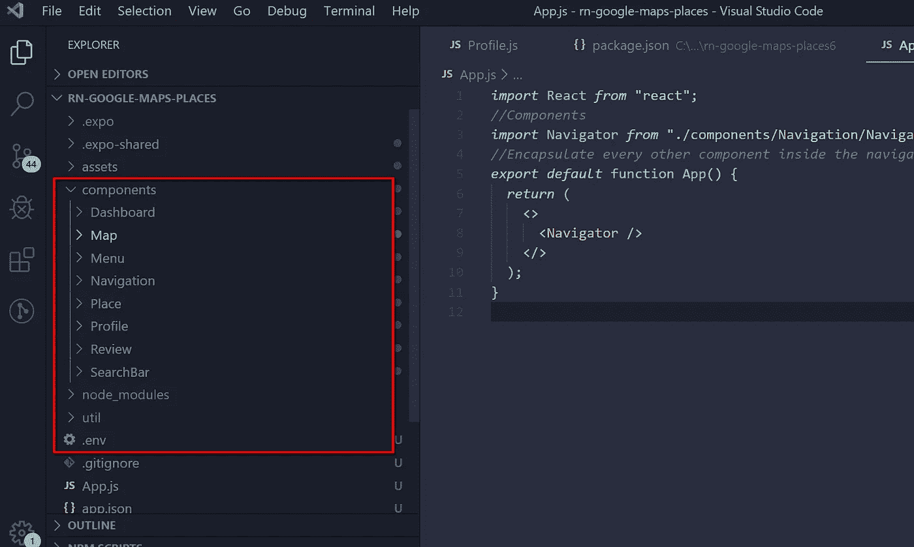

项目结构

# 设置环境变量

在这个系列的第一部分中，我们为我们的项目创建了一个 Google API 密匙，正如你可能知道的，API 密匙和所有的秘密数据包含了由于明显的风险我们不愿意公开的信息。所以最好的办法是把它们安全地保存在某个地方。最受欢迎和最安全的地方之一是在一个`.env`文件中。让我们安装一个模块来解决这个问题。

## 安装 react-native-dotenv

这个模块允许你从一个`.env`文件中导入你的环境变量。运行下一个命令来安装它。

```
yarn add react-native-dotenv
```

一旦安装完毕，我们需要通过添加如下模块来修改`babel-config.js`文件。

```
module.exports = function(api) {api.cache(true);*return* {
        presets: ["babel-preset-expo", "module:react-native-dotenv"]
       };};
```

现在，让我们创建`.env`文件并添加密钥。

```
GOOGLE_API_KEY = "YOUR_API_KEY"
```

完成后，您只需要在需要的地方导入它。

```
*import* { GOOGLE_API_KEY } *from* "react-native-dotenv";
```

# UI 工具包:本机基础和反应本机元素

原生基础和 React 原生元素都为我们的 React 原生应用提供了一体化 UI 套件。出于个人爱好，我会两者都用，但特别是 React Native Element 的一些内置元素，让我们的 UI 更酷。

## 安装 React 本机元素和本机基础

```
yarn add react-native-elements
yarn add native-base
```

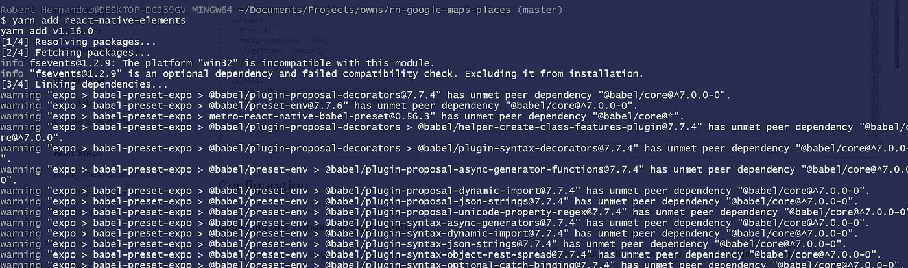

添加 native-base 和 react-native 元素

## 启动开发服务器

如果你现在运行(如果你还没有运行)`yarn start`，你应该会看到下一个屏幕。

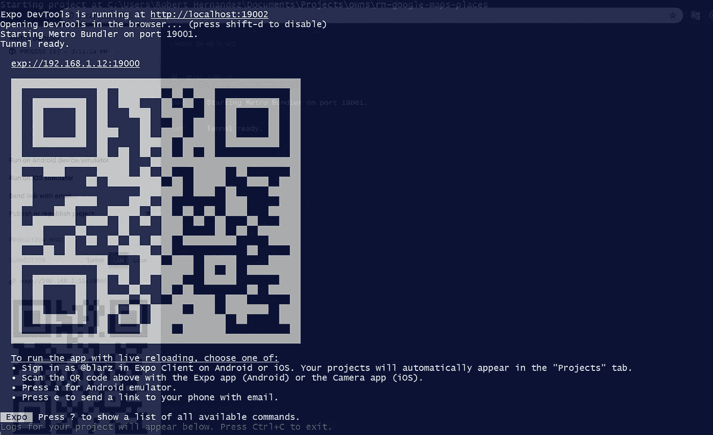

开发服务器已启动

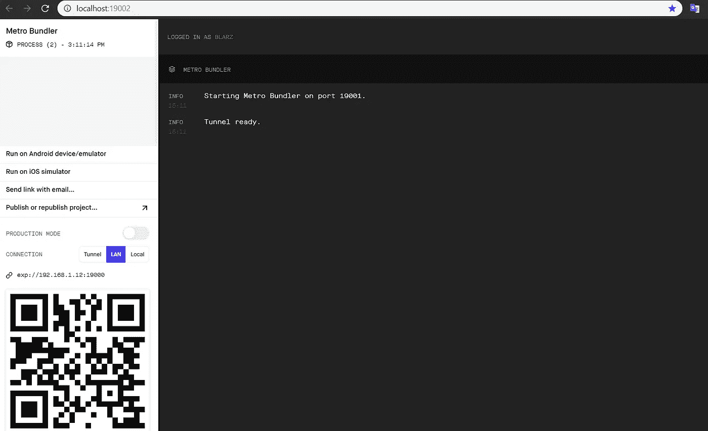

浏览器地铁捆绑器

# 设计屏幕和组件

让我们来构建应用程序的屏幕:

*   应用程序(入口点)
*   仪表盘
*   轮廓
*   搜索
*   地图视图/地点列表

所以，让我们来创造它们…

# 搜索栏组件

`/components/SearchBar/SearchBar.js`

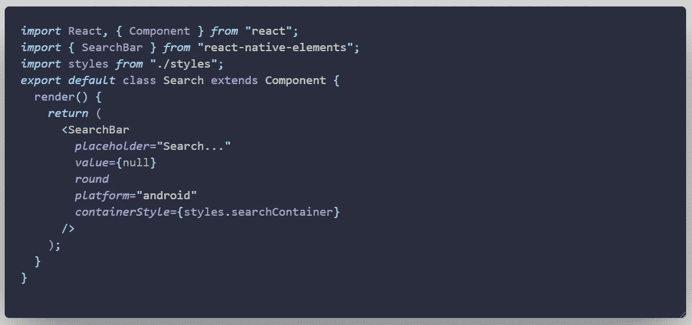

搜索栏组件

我们正在使用提供 React 本地元素的`SearchBar`组件。我们给它添加了一些样式，位于同一个文件夹的`styles`文件中(`/components/SearchBar/styles.js`)。

# 菜单组件

`/components/Menu/Menu.js`

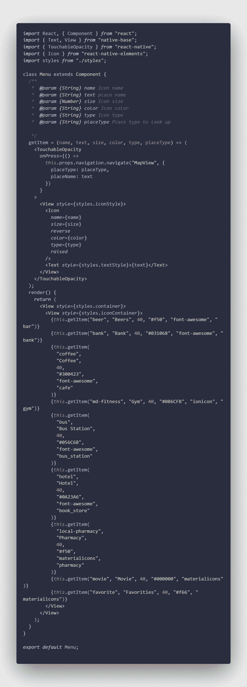

菜单项

# 仪表板屏幕

`/components/Dashboard/Dashboard.js`

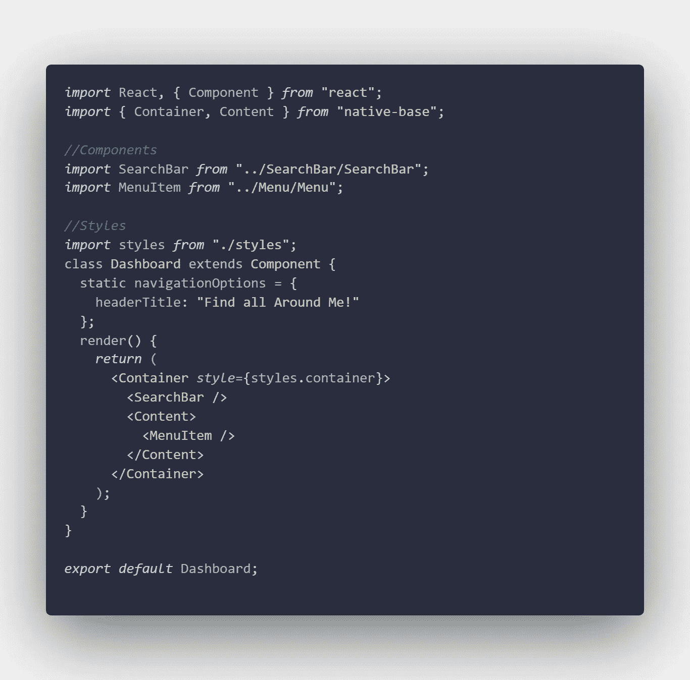

仪表板屏幕

上面，我们用 Native Base 提供的一些 Native Base 内置组件创建了一个 based-class 组件:`Container`和`Content`。此外，我们添加了`SearchBar`和`Menu`组件。这里没问题，对吧？

让我们更新我们的入口点。

## App.js ->入口点

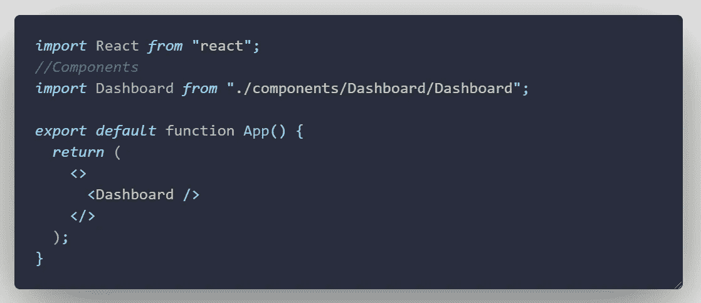

`App.js`文件是 Expo 在你创建 app 的时候生成的。然而，正如你所看到的，我们用新的元素更新了它。我们已经添加了刚刚在上面创建的`Dashboard`组件和最短路径的片段`<> </>`。

注意:该组件将在本教程中不断更新。

如果现在您运行下一个命令，然后转到浏览器或您的 Android 设备运行该应用程序，您将看到以下屏幕。

```
yarn start
```

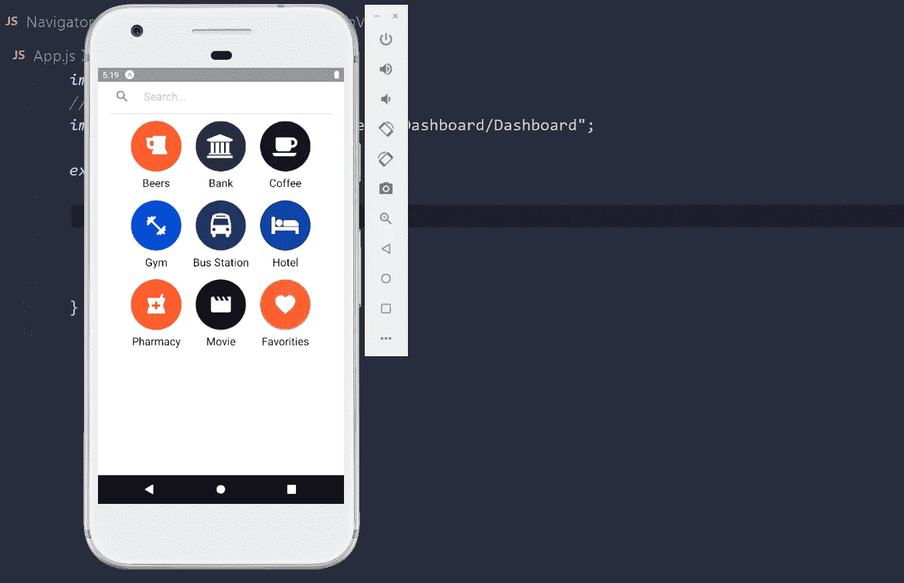

`App.js`文件是 Expo 在你创建 app 的时候生成的。然而，正如你所看到的，我们已经用新的组件更新了它。我们增加了`Container` 和`Content`。我们导入了`Dashboard`组件，然后在`Content`组件中使用它。如果现在你正在跑(如果你还没有跑的话)`npm start`，你应该会看到下一个屏幕。

## React 导航 4.x

我们需要安装`react-navigation,`、`react-native-reanimated`和`react-native-screen`。

```
expo install react-navigation react-native-gesture-handler react-native-reanimated react-native-screens
```

查看[官方 React 导航](https://reactnavigation.org/docs/en/getting-started.html)站点，获取更多与一个裸露的 React 原生项目相关的参考资料。

# 导航组件

`/components/Navigation/Navigator.js`

让我们从安装`react-navigation-tabs`和`react-navigation-stack`依赖项开始。

```
yarn add react-navigation-tabs
yarn add react-navigation-stack
```

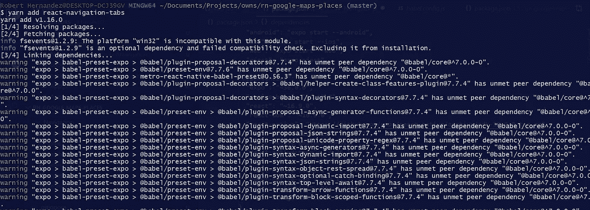

我们的应用程序需要一种屏幕之间的过渡方式。

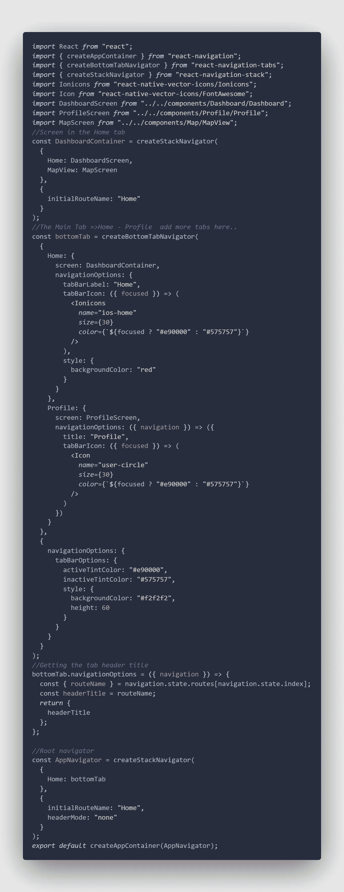

导航组件

在上面的代码中，我们创建了两种类型的导航元素。第一个是`stackNavigator`，它允许我们将每个新屏幕放在一个堆栈的顶部。第二个是屏幕底部的一个简单的标签栏，可以让你在不同的路线之间切换。

注意:在上面的代码中，唯一缺少的屏幕是 MapView 和 Profile。现在我们将创建它们。

此时，您应该会看到类似这样的内容。

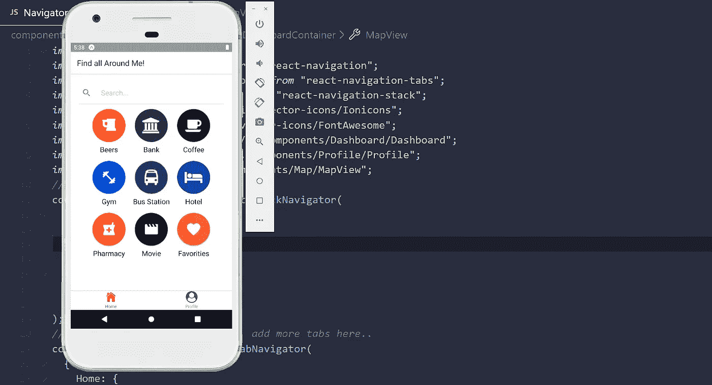

# ReviewStart 组件

`components\Review\ReviewStars.js`

这个组件将允许我们渲染这个地方的星星。

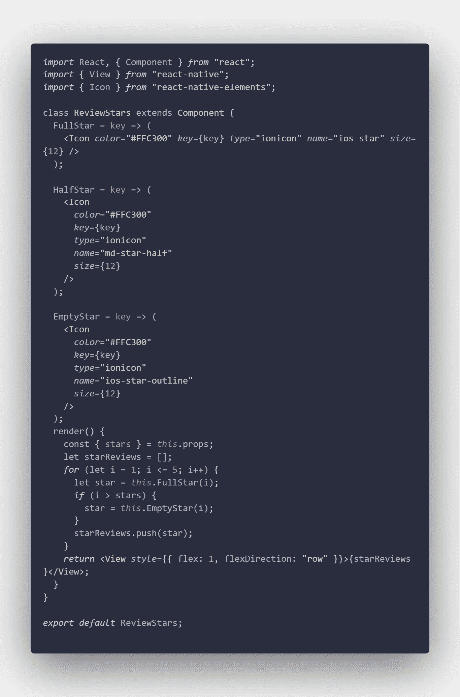

# 位置列表组件

`components\Place\PlaceList.js`

该组件将呈现以下屏幕。

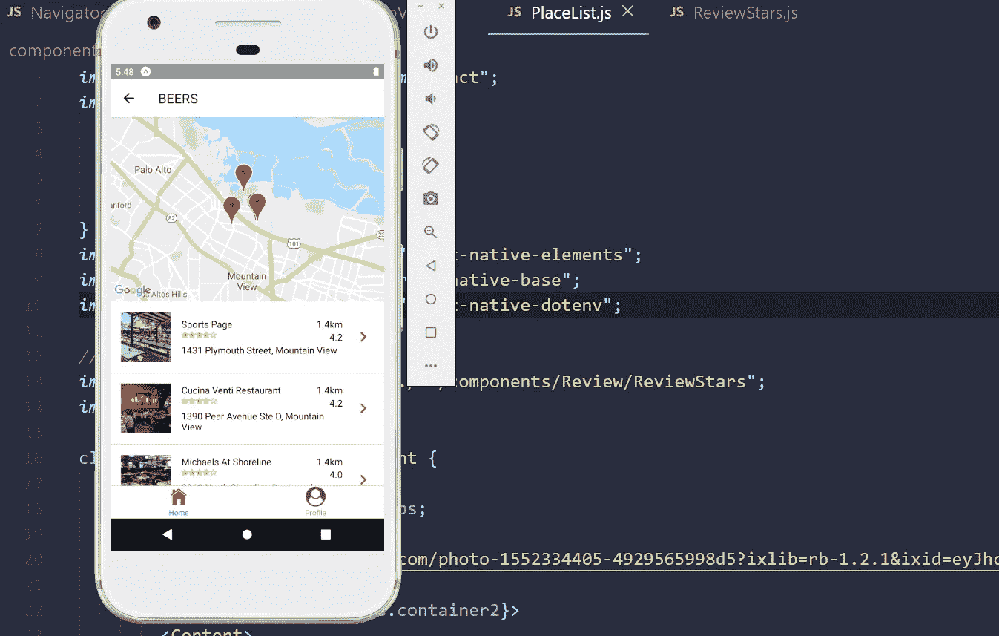

## 密码

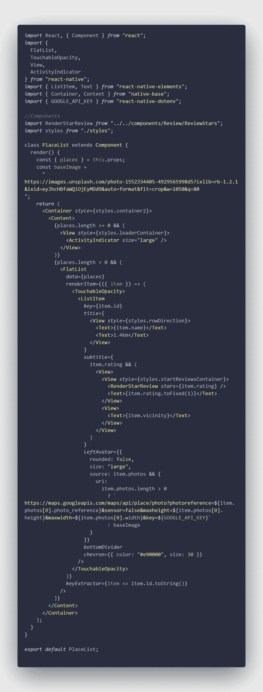

# MapView 组件

`\components\Map\MapView.js`

注意:不要忘记给地图添加一些样式。没有样式，您将看不到地图。

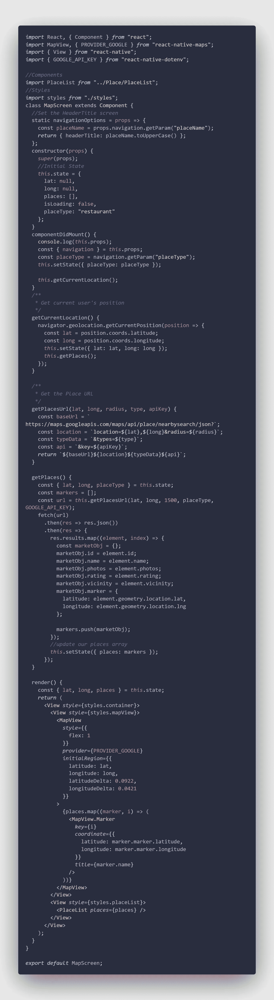

MapView 组件

# 分学科实现目标

最后，我们将创建概要文件组件。

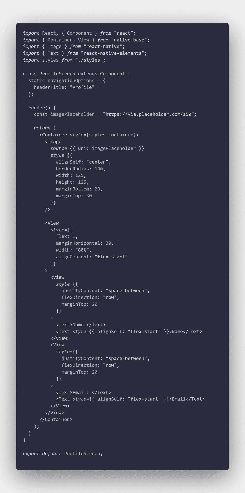

分学科实现目标

就这些，朋友们。您的应用程序应该如下图所示。

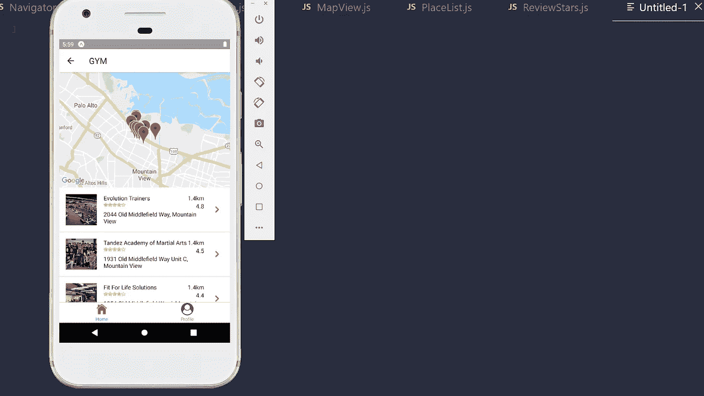

最终输出

缺少两样东西:搜索组件功能和位置细节。我们将在一篇新文章中介绍这些内容。

# Github 代码

如果您有任何问题，请随时留下您的评论。全部代码在 [GitHub](https://github.com/blarzHernandez/react-native-google-map) 上。

感谢阅读！