# 如何使用谷歌电子表格作为应用程序的后端

> 原文：<https://betterprogramming.pub/google-spreadsheet-as-a-backend-b6b51541f1e1>

## 有时电子表格可以作为轻量级数据库。以下是如何做的


卢卡斯·布拉塞克在 [Unsplash](https://unsplash.com?utm_source=medium&utm_medium=referral) 上的照片

如果你有一个简单的应用程序，你不需要非常复杂的后端，你可以使用谷歌电子表格来存储你的数据。我们后端的数据库是什么？是表格，谷歌电子表格也是表格。让我们看看如何将这些表用作应用程序的后端。

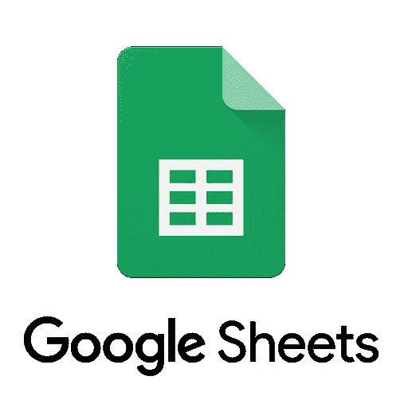

# **初始化**

让我们开始设置 Google API 凭证，因为我们将需要它们在前端和后端之间传输数据。

显然，我们将需要一个谷歌开发人员帐户。你可以去[这里](http://console.developers.google.com)创建一个，它是免费的。

接下来，让我们创建一个新项目:

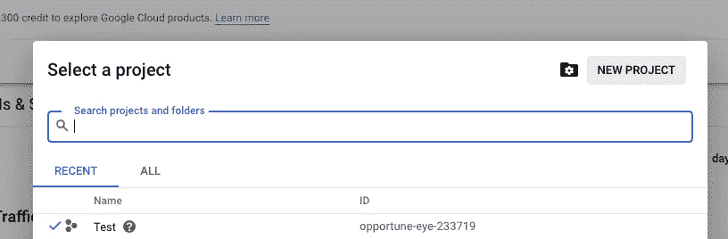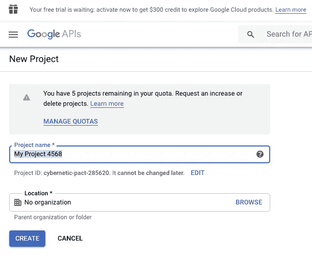

在我们创建一个新项目之后，让我们为这个项目生成凭证——访问 Google 服务所需的 API 密钥。如果您只想读取表，您可以只生成 API 键，这就足够了。但是我们想要执行所有的 CRUD，为此我们需要一个服务帐户。

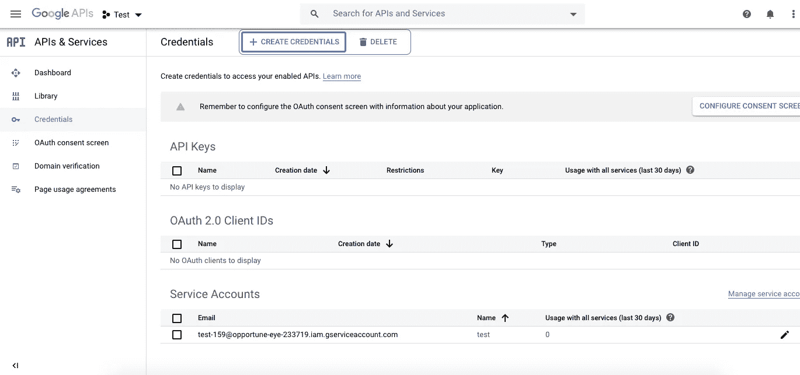

只需给新的服务帐户一个名称，并跳过角色和用户对此帐户的访问。现在我们有了一个服务帐户。让我们打开它并为它生成一个密钥。

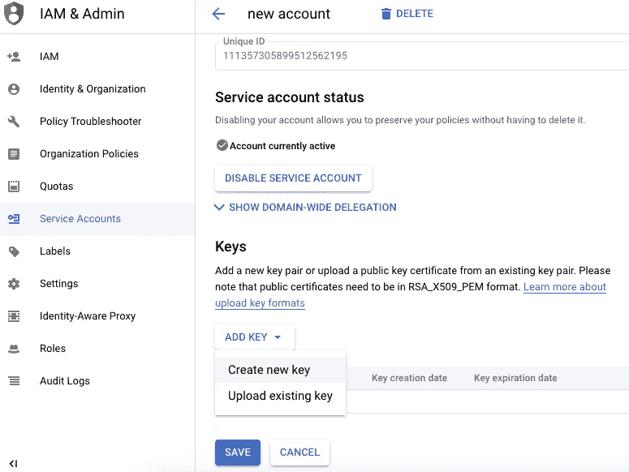

选择 json:

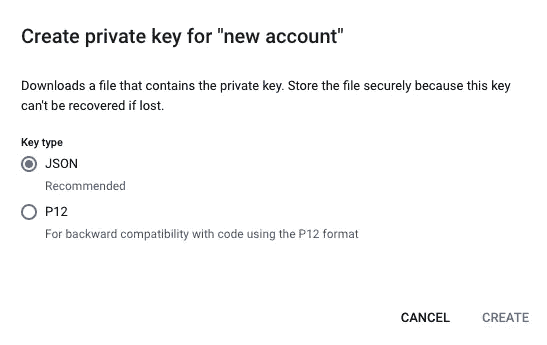

单击“create”后，它将下载一个. json 文件，文件名很长，包含我们需要的所有凭证。

接下来，让我们创建一个我们将要使用的电子表格。只需打开这个[链接](https://docs.google.com/spreadsheets/u/0/)并创建一个电子表格。在 URL 中，您可以找到电子表格 ID:

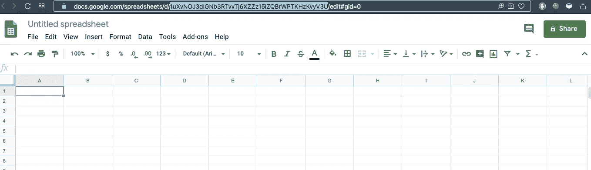

我们将需要这个 ID 来访问特定的电子表格。

我们需要做的最后一件事是配置共享选项。点击绿色大按钮 SHARE，让每个有链接的人都可以编辑这个电子表格。

# **前端设置**

当我们的证书准备好了，让我们在前端工作。第一步是创建一个简单的 React.js 项目。请阅读此处的[以了解如何操作。](https://medium.com/swlh/full-stack-app-with-react-and-node-express-b62e45aa33c7)

为了更容易与 Google API 通信，我们将使用[**Google-spread sheet**](https://www.npmjs.com/package/google-spreadsheet)库。让我们安装它:

```
yarn add google-spreadsheetOrnpm i google-spreadsheet — save
```

现在我们准备开始编码。

# **前端设计**

首先，我们需要确保我们可以安全地使用 API 密钥。为此，让我们创建一个**。env** 文件放在 react 项目的根目录下。打开文件并创建三个变量；我们将把它们作为环境变量:

```
REACT_APP_SHEET_ID = ‘’REACT_APP_GOOGLE_PRIVATE_KEY = ‘’REACT_APP_GOOGLE_SERVICE_ACCOUNT_EMAIL = ‘’
```

我们已经在某个地方保存了电子表格 ID，对吗？如果是这样，将这个 ID 分配给 REACT_APP_SHEET_ID 变量。接下来，让我们用 API 密匙打开 **longname.json** 文件，将 private_key 赋给 REACT_APP_GOOGLE_PRIVATE_KEY，将 client_email 赋给 REACT _ APP _ GOOGLE _ SERVICE _ ACCOUNT _ EMAIL。

很好，现在我们可以转到 React 代码，描述应该如何发送对 Google API 的请求。

目前，我们有一个空的应用程序组件。让我们导入**谷歌电子表格**库。我们还需要一个 **useState** 钩子，因为我们使用功能组件，我们需要在这里管理状态。

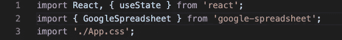

这里是在输入数据被发送到后端之前存储输入数据的变量。

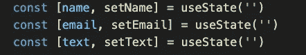

下面是将显示给用户的 JSX 表单:

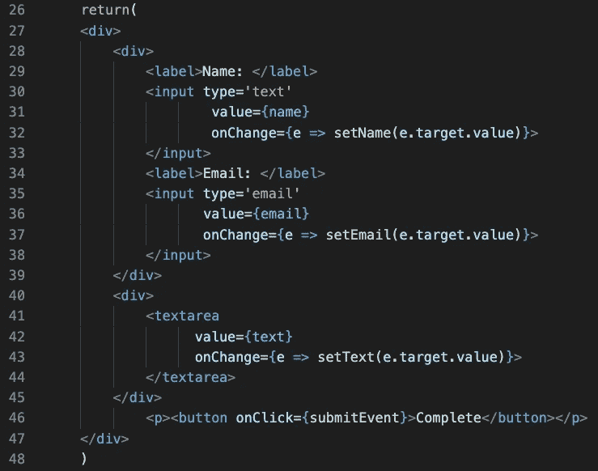

最后，让我们创建一个向后端发送请求的函数。看起来是这样的:

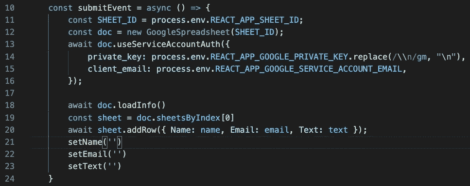

我们来分解一下。

首先，我们需要从. env 中获取一个电子表格 ID。我们可以用 **process.env、**来完成，这是在启动应用程序时由 Node.js 注入的。

```
*const SHEET_ID = process.env.REACT_APP_SHEET_ID;*
```

接下来，让我们创建一个新的 GoogleSpreadsheet 实例，并将工作表 ID 传递给它。

```
const doc = new GoogleSpreadsheet(SHEET_ID);
```

现在，我们需要授权给自己。我们将使用 useServiceAccountAuth 方法来进行授权。这个方法将接受一个对象作为参数(或者它可以接受一个带有凭证的 json 文件，但是这种方式更安全)。

```
private_key: process.env.REACT_APP_GOOGLE_PRIVATE_KEY.replace(/\\n/gm, “\n”),
```

私钥是一个很长的多行字符串。为了使它工作，我们需要用新行替换所有的“\n”字符。**替换(/\\n/gm，" \n")** 就行了。

万岁，我们授权了！现在让我们加载关于我们正在连接的电子表格的数据。

```
await doc.loadInfo()
```

接下来，我们应该选择要使用的工作表。我们可以通过索引或 id 来实现。最初，我们只有一张表，所以我只选择索引 0。

```
const sheet = doc.sheetsByIndex[0]
```

现在，让我们用这张纸做点什么。增加新的一行怎么样？我们可以做到。假设电子表格中有**姓名**、**电子邮件、**和**文本、**等列，我们可以这样做:

```
await sheet.addRow({ Name: name, Email: email, Text: text });
```

如果一切都正确，那么当您单击 complete 按钮时，您在字段中键入的任何内容都应该出现在电子表格中。

## 最终代码:

# **结论**

对于不需要复杂后端的简单应用程序，我们可以使用简单的免费工具。谷歌电子表格就是其中之一。在我的例子中，我只发送 post 请求，但是您可以在那里存储数据并发送 GET 请求来在 DOM 上呈现某些内容。

不断学习，不断成长！