# 我从开源 Noob 到谷歌 2020 年代码之夏的旅程

> 原文：<https://betterprogramming.pub/google-summer-of-code-2020-837b262aa581>

## 如何开始使用开源软件

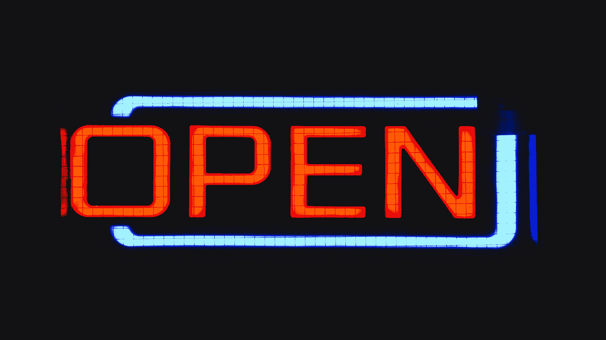

由[亚历克斯·霍利奥克](https://unsplash.com/@stairhopper?utm_source=unsplash&utm_medium=referral&utm_content=creditCopyText)在 [Unsplash](/s/photos/open-source?utm_source=unsplash&utm_medium=referral&utm_content=creditCopyText) 上拍摄的照片

# 贡献意味着什么

如果你是一个新的开源贡献者，这个过程可能会令人生畏。如何找到合适的项目？不知道怎么编码怎么办？出了问题怎么办？

放心吧！参与开源项目有各种各样的方式——你不需要知道所有的事情就可以开始。

除了修复打字错误，为开源做贡献就像在聚会上走向一群陌生人。如果你开始谈论骆驼，而它们正在深入讨论金鱼，它们可能会有点奇怪地看着你。

在盲目地提出自己的建议之前，先学会如何解读房间。这样做会增加你的想法被注意和听到的机会。

# 介绍

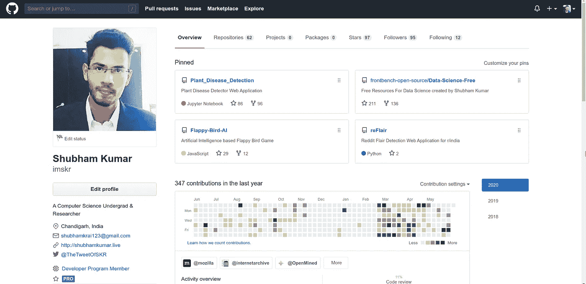

吉图布:https://github.com/imskr

2018 年 12 月本科一年级的时候开始了我的开源之旅。这一切都是从项目存储库的自述文件中的一行修改开始的。我打开我的[第一个 PR](https://github.com/codeuino/website-www.codeuino.org/pull/106) 在 README 中添加一个许可证徽章。它被合并了。

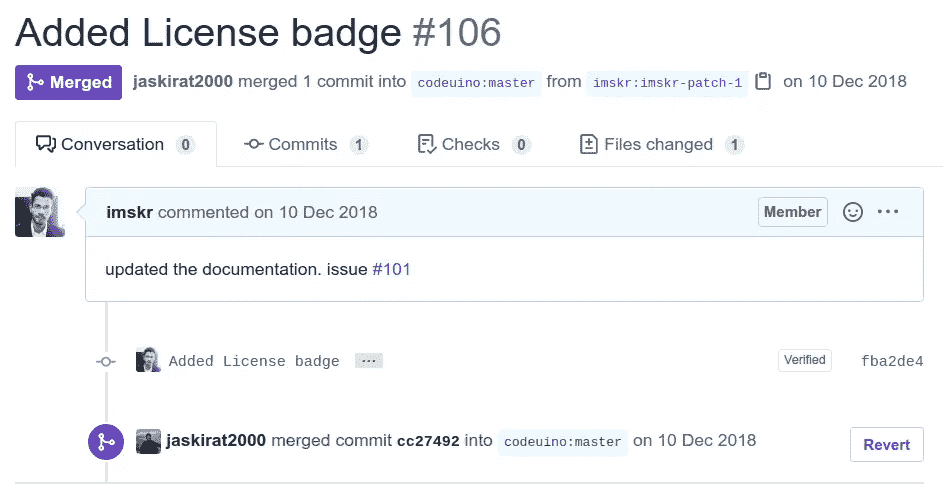

我不太了解开发工具或其他任何东西。我完全是个新手。但是感觉棒极了！之后，我开始发现一些更适合初学者的问题。以下是一些寻找`good first issue`的绝佳资源:

*   [https://up-for-grabs.net/#/](https://up-for-grabs.net/#/)
*   [https://24pullrequests.com](https://24pullrequests.com)
*   [https://hacktoberfest.digitalocean.com](https://hacktoberfest.digitalocean.com)
*   [https://firsttimersonly.com](https://firsttimersonly.com)
*   [http://yourfirstrpr . github . io](http://yourfirstpr.github.io)
*   [https://codetriage.com](https://codetriage.com)
*   [https://opensourcefriday.com](https://codetriage.com)

或者，去 Github 搜索`good first issue`:

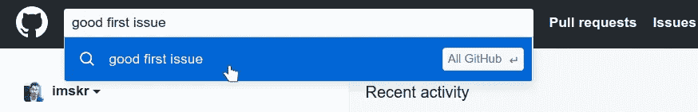

然后，您可以根据需要选择或过滤存储库:

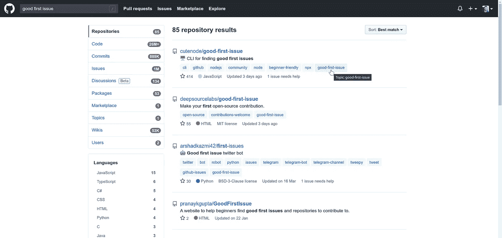

# 为开源项目做贡献的两种方式

*   **自上而下的方法:**先学习技能，再贡献。
*   **自下而上的方法:**边做贡献边学习技能。

我使用了自下而上的方法，它非常适合我。抓住你认为你能解决的问题，然后了解需要什么，并去解决它！

# 我的武器

*   **谷歌**

> 21 世纪最重要的技能是学会如何谷歌
> 
> —未知

*   [**Stack Overflow**](https://stackoverflow.com/) 是最大、最值得信赖的在线社区，供开发人员学习、分享他们的编程知识，并建立他们的职业生涯。

# 2018

我参与了很多项目，有些很难，有些很容易。我学到了包括 Python 和 Flask 在内的很多技能。

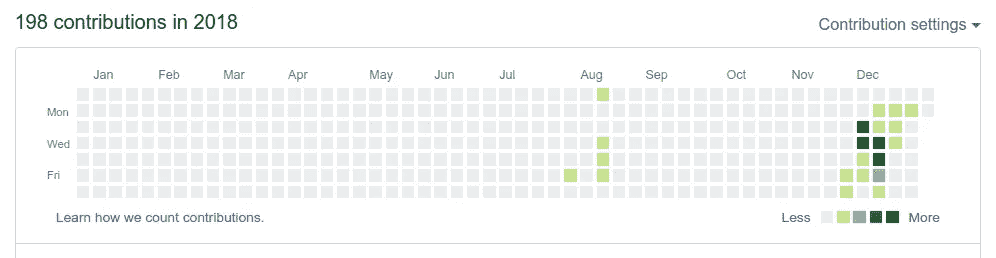

GitHub 贡献图

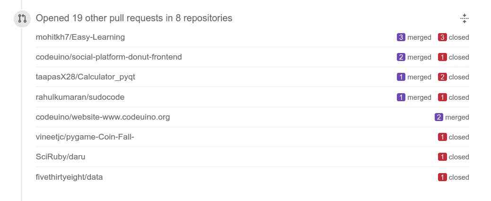

不是所有的事情都被合并，一些 PRs 将被关闭。不断学习。

# 2019

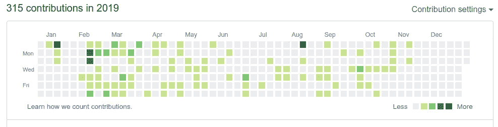

我以参与者的身份参加了 [GirlScript《代号](https://www.gssoc.tech/)的夏天》。这是一个为期三个月的竞赛，在这个竞赛中你要为开源项目做出贡献。对我来说，这是一次很大的学习，大约有 20 个 PRs 被合并了。

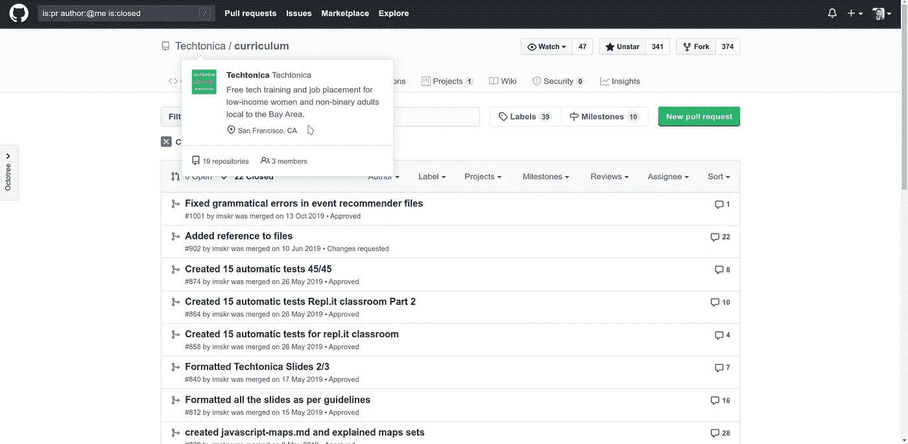

我收到了导师的推荐信，我太高兴了！

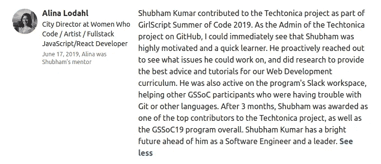

然后我开始关注更大的组织。我决定给 [*互联网档案馆*](https://github.com/internetarchive) 投稿。

我的导师杰森·巴克纳给了我很多帮助，我的第一份大代码被接受了。

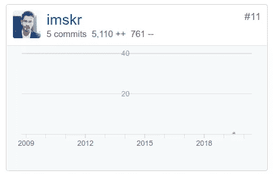

之后我就火了。我给很多大型组织做过贡献，比如 Mozilla，OpenMined，从前端，到后端，到机器学习！我在许多领域做出了贡献，帮助我提高了技能。

# 2020

一月份，我听说了[谷歌代码之夏](https://summerofcode.withgoogle.com/)，决定参加。

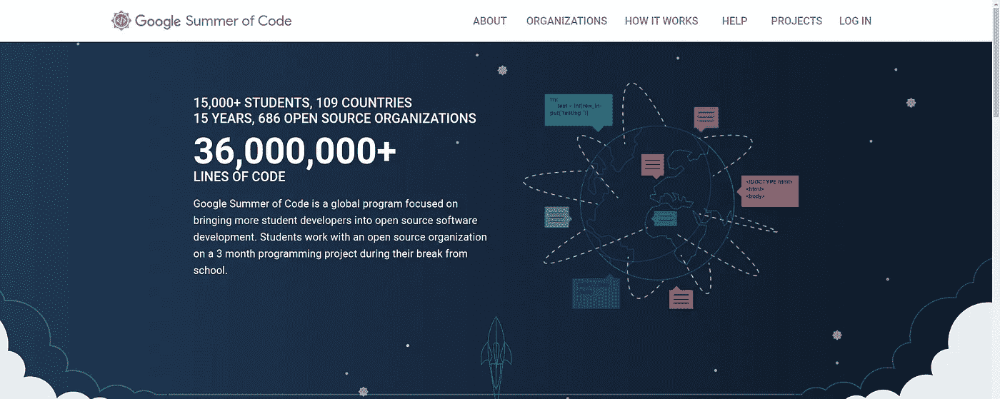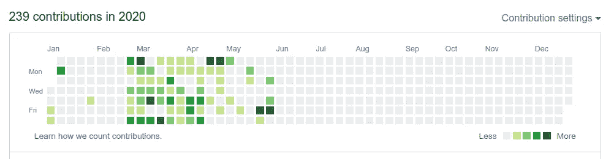

当谷歌宣布组织名单时，我对选择哪个组织感到困惑，因为你最多只能发送三个建议。

最后，我决定把我的提议发给 Mozilla 和 OpenMined 。

我一直在贡献和等待…

快进到 5 月 4 日(结果日)。时钟在滴答作响，我每 5 分钟检查一次邮件。IST 时间晚上 11 点 25 分，我收到了一封来自谷歌的邮件！

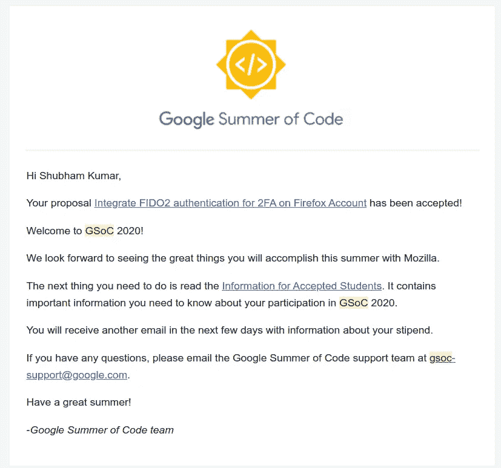

# 为什么要贡献开源？

*   **改善你所依赖的软件:**许多开源贡献者都是从成为他们所贡献的软件的用户开始的。当你在你使用的开源软件中发现一个 bug 时，你可能想看看源代码，看看你是否能自己修补它。
*   **提高现有技能:**无论是编码、用户界面设计、图形设计、写作，还是组织，如果你正在寻找实践，开源项目有一个任务给你。
*   **建立有助于你提高声誉(和职业生涯)的公共产品:**
    根据定义，你所有的开源工作都是公共的，这意味着你可以在任何地方获得免费的例子来演示你能做什么。
*   **能够做出改变，即使是很小的改变，也是一种授权:**
    你不必成为一名终身贡献者来享受参与开源的乐趣。你有没有在一个网站上看到一个错别字，希望有人来修正它？在开源项目中，你可以做到这一点。开源帮助人们感觉到他们的生活和他们如何体验这个世界，这本身就是令人满意的。

> [加入我的时事通讯，保持更新！](https://relentless-hustler-6722.ck.page/410dad83c2)