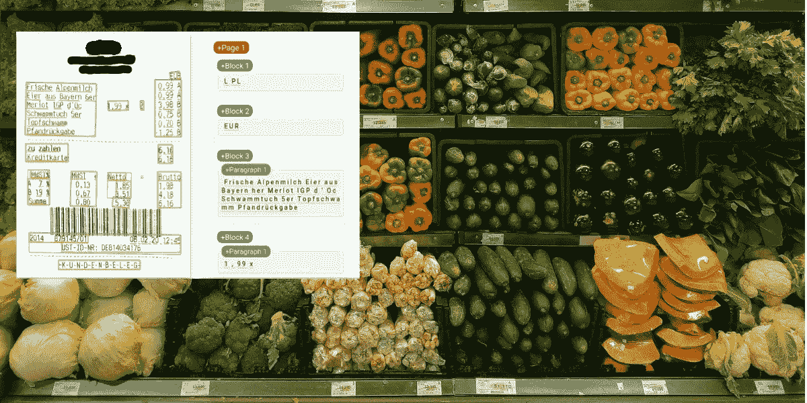
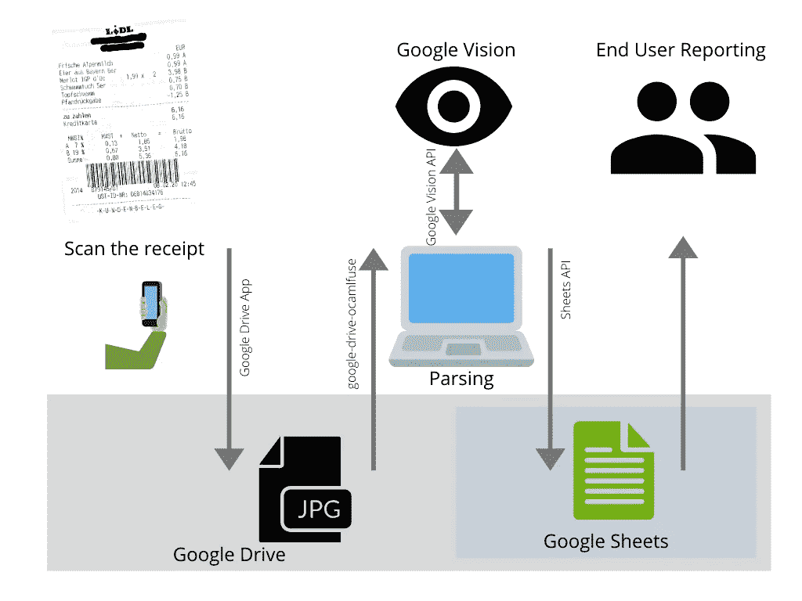
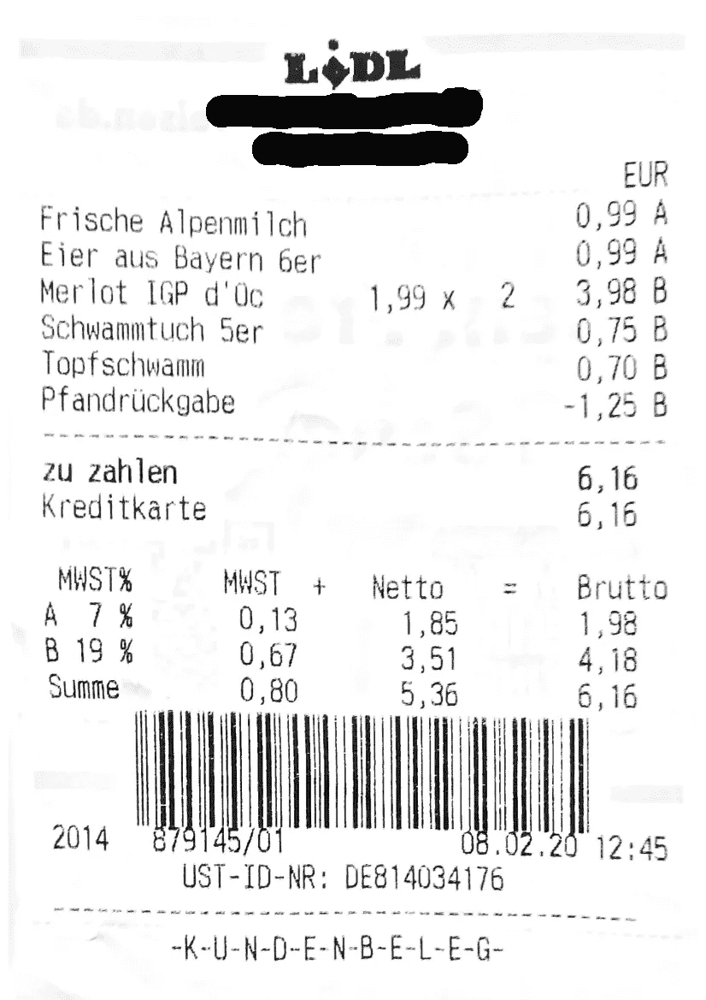
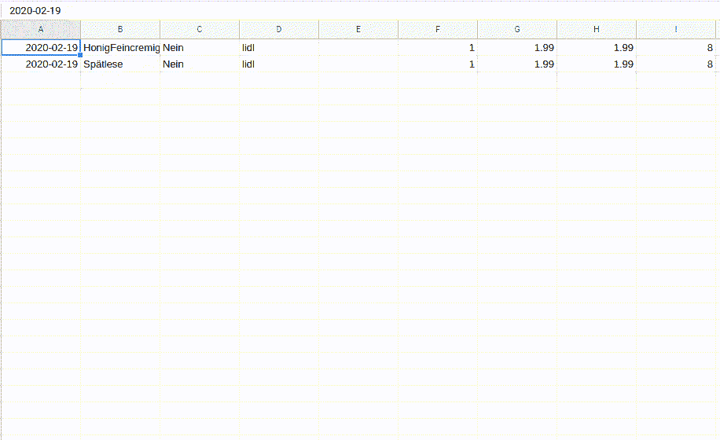

# 使用 Google Vision 和 Google Sheets API 构建一个逐行收据解析器

> 原文：<https://betterprogramming.pub/google-vision-and-google-sheets-api-line-by-line-receipt-parsing-2e2661261cda>

## 如何利用人工智能分析你的购物行为使用 Python 的简单方法



# TL；速度三角形定位法(dead reckoning)

如何使用 Google Vision API 逐行解析收据，逐步提取包含价格、商店名称和购买日期的单个商品。结果通过 API 存储在 Google Sheets 中。

[GitHub 链接](https://github.com/tesseract-ocr/tesseract/wiki)。

# 动机

星期四是我和妻子通常去购买食品杂货的日子。我们提前准备了一份物品清单，试图购买一周所需的所有物品。

对于两个人的家庭来说，这应该不会太难吧？尽管如此，我发现自己下班后还是会跑到商店去——有时和每天一样——一件一件地购买我们错过的东西。我们总是忘记那些不在每周日程上的事情。就像我们每两周需要一罐蜂蜜，或者每四周需要一包咖啡。当然，我们可以生成并维护一个包含这些商品的表，并估计购买时间，但这似乎很繁琐。

我们想出了一个数据驱动的解决方案:有了我们过去购买的所有杂货产品的清单，估计我们下次去商店需要什么应该相对容易。我们的杂货列表模型将预测在下一周内需要购买某项商品的概率，前提是有一个以前购买的所有商品的列表，以及日期、杂货店名称、一年中的时间等附加信息。

## 目标解决方案

最终，我们决定将所有购买的杂货存储在 Google Sheets 中。对于后续的数据自动分析来说，这并不是最佳选择，但它有足够的优势使这种权衡变得有用:

*   可以轻松地手动或通过 API 添加数据
*   我们可以在电子表格中进行简单的即席分析
*   我那不擅长技术的妻子可以在没有我帮助的情况下访问数据

就完整性而言，这种情况的主要缺点是:

*   写数据是有速率限制的。批量扫描收据时，您必须不时暂停
*   与将数据存储在实际的数据库中相比，您需要处理更多的事情。例如，在插入时，您需要确定下一个空闲点。如果你做错了，你可能会覆盖掉一些珍贵的数据。

然而，由于我们在这里处理的是非业务关键的小数据，这仍然是一个公平的解决方案。更好的解决方案是将数据存储在 BigQuery 中，并在 Google Sheets 中使用 BigQuery 连接器。但是连接器附带了我们没有的 G 套件业务。

当数据需要保存在 Google Sheets 中时，保存扫描收据的自然位置是 Google Drive。Google Drive 中的文档扫描功能附带了一些图像增强功能，这是一个很好的优势。因为你可以在你的桌面电脑上安装你的驱动文件夹，它可以真正快速的集成到你的 Python 工作流程中。

如果说我在咨询业学到了一件事，那就是在开展任何实际工作之前先画一幅画。所以现在你有了:



从纸质收据发放到准备数据的完整工作流程

# 获取数据

剩下要做的就是将数据输入到 Google Sheets 中。在深入研究这个问题之后，很明显它并不像看起来那么简单。当然，将每张收据手工输入笔记本电脑不是一种选择，因为这很快就会变成一种训练。而且，毕竟我们生活在深度学习的时代，所以我们不妨利用它。

一些关于收据解析的项目已经发布，它们在从收据中找到总计和商店名称方面做得很好。有趣的是，我看到的所有例子都使用德国收据。需要在电子表格中组织收据是德国人最熟悉的感觉。

但是有了总数并不能得到我们想要的。我们甚至可以从我们的信用卡账单中得到这些数字，这些账单已经以数字形式为我们准备好了。

总体方法非常相似:

*   扫描和预处理收据
*   使用 OCR 解析扫描
*   从文本响应中提取购买的商品
*   写入 Google 工作表

现在，我们将进入每一步，看看如何轻松完成。

## 扫描和预处理收据

只需在手机上安装 Google Drive 应用程序，并使用扫描功能。在本地安装你的谷歌硬盘。

在 Ubuntu 上，这在`google-drive-ocamlfuse`的帮助下效果最好。

```
sudo add-apt-repository ppa:alessandro-strada/ppa
sudo apt update && sudo apt install google-drive-ocamlfuse
mkdir ~/grive
google-drive-ocamlfuse ~/grive
```

## 使用 OCR 解析扫描

我对 OCR 的了解源于前段时间在 Kaggle 上复制 MNIST CNN 的例子。

在此基础上，我觉得 OCR 是一个已经解决的问题。但是当你从测试数据变成真实数据时，很多事情同时发生。

**宇宙魔方**

对于开源的本地工作，Tesseract 似乎仍然是最突出的 OCR 解决方案。用 Python 很好用。

您需要通过包管理器安装 Tesseract，通过 pip 安装 pytesseract。不要忘记加入你选择的语言，你需要把它作为一个单独的包来安装。在这里看一个例子[。](https://github.com/tesseract-ocr/tesseract/wiki)

设置好一切并扫描好收据后，是时候试驾了。下面，左边是示例收据，右边是 Tesseract 输出。

Pytesseract 示例



收据示例

```
LIDL EUR 
rrische Alpenmilch 0,37 “ 
bier aus Bayern ber 0,32 A 
Merlot IGP d’üc 1,9x 2 3,98 6 
Schwammtuch Ser 0,56 
Topfschwanm 0,70 8 
Pfandrückgabe -1,258Bzu zahlen ” 6,16Kreditkarte 0,16 
MUST% MUST + Netto 2 Brutto 7% 0,13 1,85 1,32 B 19% 0,67 3,51 4,18 Summe . 0,80 5,36 6,16|||I! I I2014 879145/01 02.29 12:45 
UST-ID-NR: DEBI4034176 
-K-U-N-D-E-N-B-E-L-E-G-
```

虽然它做了很多正确的事情，但结果仍然远远低于我们的需求。有些价格是乱的，这在试图提取文章和价格时会是一个巨大的问题。我试着玩了一会儿宇宙魔方选项，但是除了 PSM 选项之外的所有选项都让事情变得更糟。

要改进作为 OCR 引擎的 Tesseract，需要预先识别文本块，然后对每个块单独运行 Tesseract。但是识别图片中的文本块是一个完全不同的问题，我不想有这个问题。

此外，示例图片质量很好。我们大多数家庭扫描的收据看起来要差得多，所以质量预计会从这里下降。

**谷歌视觉 API**

对于一般的图像分析，尤其是文本识别，有几种 API 解决方案。但由于我们目前只使用谷歌产品，我们不妨继续使用它们，让生活变得更轻松。

要做到这一点，我们需要做一些事情，但我保证，一旦一切准备就绪，生活将变得超级简单。我正在根据记忆重现这些步骤，所以如果你因为我错过了什么而卡住了，请告诉我。

*   如果你还没有谷歌云平台账户，[创建一个](https://console.cloud.google.com)
*   创建新项目。这是页面左上角的按钮。
*   [为项目](https://cloud.google.com/billing/docs/how-to/modify-project)启用计费。我还没有产生任何费用，因为我们不怎么使用 Vision API，但是您需要启用它。
*   在您的项目上启用 Google Vision API，并添加一个具有凭据的服务帐户。只要遵循这个指南就可以了。
*   保存凭证文件，并将其路径设置为环境变量

```
export GOOGLE_APPLICATION_CREDENTIALS=”<path>”
```

*   安装 Python 包

```
pip install --upgrade google-cloud-vision
```

如果你刚到 GCP，你应该已经收集了一些丰厚的免费试用积分。让我们再次尝试上面的收据，但这次是在谷歌视觉的神奇帮助下。

对 Google Vision API 的示例请求


收据示例

```
LODL

EUR
Frische Alpenmilch 0,99 A
Eier aus Bayern 6er 1,99 x 2 0,99 A
Merlot IGP d’Üc 3,98 B
Schwammtuch 5er 
0,75 B
Topfschwamm 0,70 B
Pfandrückgabe -1,25 B
zu zahlen 6,16
Kreditkarte 6,16

MWST% MWST + Netto Brutto
A7 % 0,13 1,85 1,98
B 19 % 0,67 3,51  4,18
Summe 0,80 5,36 6,16

2014 879145/01
08.02.20 12:45
UST-ID-NR: DE814034176
-K-U-N-D-E-N-B-E-L-E-G-
```

我们绝对可以用这个工作！只有两个字是错的，即使对人类来说也很难读懂。

## 从文本回复中提取购买的商品

接下来，我们必须从响应中确定单篇文章及其相应的价格。这一部分并不令人兴奋——事实上，相当乏味。您需要捕捉打印收据中可能出现的所有边缘情况，这种情况有很多。

如果你对此感兴趣，请告诉我。不然我就只参考[这个代号](https://github.com/lutzkuen/receipt-parser)。

## 向 Google Sheets 写信

所以我们设法把现实生活中怪异物品的收据放到一个列表中。最后一步是将内容写入 Google Sheets。我遇到了比我想承认的更多的麻烦，因为要得到正确的细节有点棘手。

*   转到你的 Google Drive，创建你想写结果的工作表。记下纸张 ID。你可以在 URL 中找到它——这是我在下面的截图中标记的部分。


*   安装所需的客户端库

```
pip install --upgrade google-api-python-client google-auth-httplib2 google-auth-oauthlib
```

*   [为您的项目启用 Google Sheets API](https://developers.google.com/sheets/api/quickstart/python) ，并下载客户端密码。

您将获得另一个包含 OAuth 客户机秘密的 JSON 文件。我花了一点时间把这个和 Google Vision 服务帐户的证书 JSON 混淆了。所以一定要给这些文件起一个清晰的名字，以便你明天还能记得它们属于哪里。

现在，让我们在继续之前测试一下这个东西是否有效。

在 Google Sheets 中进行测试更新

如果你在谷歌表单中看到了测试更新，那你就万事俱备了。由于 Python API 包装器的这一部分没有得到很好的记录，所以计算更新函数有点困难。但是，最后，它像微风一样工作。

## 把所有的放在一起

一旦你的谷歌云项目建立起来，所有的关键文件都准备好了，你就快成功了。

克隆`git`:

```
git clone [https://github.com/lutzkuen/receipt-parser.git](https://github.com/lutzkuen/receipt-parser.git)
```

准备设置文件:

```
vim ~/receipt_parser.conf
```

设置文件应该如下所示:

```
[sheets]
spreadsheet_id = 1lKnQ1nqVViIDG4Kww_XiDm8U51AWzhb1dA63gyuuAJY
spreadsheet_range = Sheet1!A:L
oauth_token = ../client_secret_oauth.com.json
oauth_pickle = ../token.pickle
[drive]
receipts_path = ../grive/Belege
```

在配置文件中，它必须是 OAuth 客户端机密，不要与 Vision API 的服务帐户凭证混淆。

确保服务帐户凭据存储在正确的环境变量中。

```
export GOOGLE_APPLICATION_CREDENTIALS=”$HOME/service_account.json”
echo $GOOGLE_APPLICATION_CREDENTIALS
```

现在只需使用 Google Drive 应用程序扫描您的收据，并将其存储在作为`receipts_path`提供的文件夹中。对我来说，是`Belege`。

然后，运行`parse_all.py`脚本。

```
cd receipt-parser
python parse_all.py --settings ~/receipt_parser.conf
```

现在，您应该可以看到您的表单是如何被来自收据的条目填充的。

同一文件中的记录只写一次，所以把旧收据放在文件夹中是安全的。



由于速率限制，看着你的杂货被逐行解析

大获成功！从现在开始。各种可能性出现了。最简单的方法是按周计算你的购买量，以了解你每周的消费习惯。

# 后续步骤

现在我们有了一些数据。我们可以疯狂使用你在大学里学到的任何数据科学方法。我将把它留给另一篇文章，因为我还没有深入研究它。

此外，文本解析需要不断修正和更新错误。我最近去了一家五金店，当然，他们的收据看起来与我隔壁的杂货店大相径庭，我需要重新设计解析核心。

我希望你喜欢这篇文章，并且和我一样喜欢这篇文章。