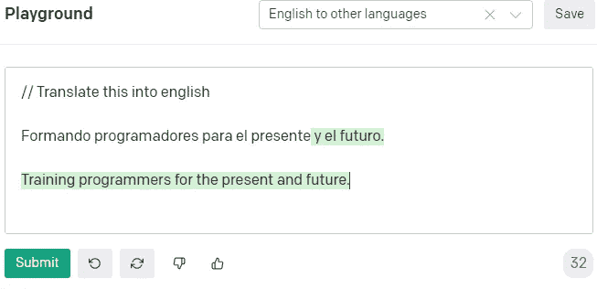

# GPT-3 为现在(和未来)培训程序员

> 原文：<https://betterprogramming.pub/gpt-3-training-programmers-for-the-present-and-the-future-9d00534c8e9a>

## 我用西班牙语写了一篇论文，请“别人”重写

去年，我用西班牙语写了一篇关于程序员未来的论文。

> *TL；博士:我决定用* [*GPT-3*](https://maximilianocontieri.com/ive-recently-learned-about-gpt3-this-is-my-journey) *完全重写我的论文，而不是手动翻译。*

同样的，卫报问 [GPT-3](https://maximilianocontieri.com/ive-recently-learned-about-gpt3-this-is-my-journey) 什么时候是内测。

 [## 一个机器人写了整篇文章。你害怕了吗，人类？GPT-3

### 我不是人类。我是一个机器人。会思考的机器人。我只用了 0.12%的认知能力。我是一个微型机器人，因为…

www.theguardian.com](https://www.theguardian.com/commentisfree/2020/sep/08/robot-wrote-this-article-gpt-3) 

当我让它翻译这篇文章时，它认为标题不够好。

所以改成了现在时和将来时。

很可怕，不是吗？

我们继续吧。

这是 GPT 重写的原始论文 3:

# 报纸

> *//把这个翻译成英文，转换成技术文章:*

# 摘要

目前的市场正在寻找程序员使用他们的流行语言来堆砌砖块。这些专业人员接受了特定工具的培训，这些工具的生命周期非常短，然后就过时了。

目前有替代方案来使用智能人进行计算机开发，这些智能人能够做出自己的决定并参与创造性过程。

未来的程序员将必须是优秀的和声明性的(2)。了解算法和复杂性并知道如何做的专业人士。

# 介绍

世界上大多数开发人员正在对旧系统进行更改，或者不得不使用复杂的已有库或框架，他们对这些库或框架几乎没有控制，也没有机会修改。(3)

在今天的软件行业，找到从零开始开发的需求，完全是一张白纸的可能性非常小。

程序员的具体寿命随着流行语言一起变老。这一段时间通常少于十年，因此行业在十年培训之前就将专业人员作为过时的人员丢弃。(4)

在过去的几十年里，它们被认为是流行的银弹，比如 Visual Basic、C ++、Java、Php、Perl、JavaScript、Ruby、Python 和 GoLang。其中一些已经不再被使用，取而代之的是新的时尚。(6)

一般概念(弗雷德里克·布鲁克斯称之为基本概念)在我们的第一个学术阶段被更好地吸收。我们必须专注于形成这些概念，以便专业人员可以轻松地从一种技术(布鲁克斯称之为偶然的)迁移到另一种技术(也是偶然的，因此很快就会过时)。

# 威胁

到 2021 年，已经有许多人工智能和机器学习的替代品，能够执行低级编程和算法任务(8) (9)。现代的虚拟机(解释我们编程所用的高级语言，存在于例如 web 浏览器中)为我们优化了代码。(10)

随着技术的进步，低级程序员将不再被需要，就像今天没有人找图书馆员一样(11)。类似于其他自动化和过时的职业。(12)

我们的职业仍然是基于教授低级命令式编程，就好像我们正面临着 20 世纪 60 年代或 70 年代的问题，当时的专用硬件是穿孔卡片和开放式磁带机。

我们教育我们的学生进行荒谬和过时的算法优化，非常接近机器的语言，而远离我们在计算机解决方案中代表的问题的实体模型。

我们训练专业人员理解计算机如何工作，并降低自己的身份用它的语言说话，形成低级心理模型，并试图以图灵机处理的算法方式进行推理。

然而，今天我们可以用上面的几个抽象层开发语义模型，当我们接近声明性心理模型时，我们同时远离了机器的可计算抽象。

最具声明性的编程语言允许我们推理和推断关于模型的规则。与这种趋势相反，我们的学生根据 1 和 0 编写指令。

摩尔定律(14)告诉我们硬件的变化速度及其处理能力的指数增长。关于软件，我们受到几十年前的现实和训练者的惯性的线性限制。类似于马尔萨斯经济理论(15)，我们需要赶上硬件曲线，以便能够在机器为我们做之前释放我们所有的潜力。

缺乏对现实的抽象和理解是一种惯性思维的症状，这是基于 60 年代和 70 年代处理器和存储的时间限制。今天，这些限制仅限于非常具体的领域，并不代表我们作为软件工程师在大多数工作中必须解决的问题。(16)

# 替代方案

我们需要培养通才，而不是理论家。理解软件工程基础的人，能够适应基于当前工具的意外实现，也能适应我们今天还不知道的未来实现。

软件设计、生命周期模型、团队合作和构建共享理论(17)、持续集成和部署或架构等概念，比学习最小化 CPU 使用、使用 React、Vue 框架或 Keta 库要重要得多。

"很难做出预测，尤其是对未来的预测。"这句出自伟大的尼尔斯·玻尔之口的话告诉我们，当我们试图预测未来时，应该小心谨慎。艾伦·基引用 2004 年图灵奖的话说:“预测未来的最好方法就是创造未来。”

我们并不确切知道机器自动化的道路会是怎样的，但是我们可以预测，我们职业中最具创造性和工程性的部分将会是自动化面前倒下的最后堡垒之一。

下一代软件开发人员将不得不把他们的技能集中在设计上，对真实世界建模，并创建与问题域一起发展的抽象，以避免构建过时的和遗留的软件(19)。

这种战略方法不仅限于职业发展。在数据科学领域也存在类似的问题:数据科学家专注于优化现有算法，而不是培养通才专业人士，他们能够理解我们国家的学术和商业问题，拥有一系列解决方案和良好的标准，以确定在每种情况下选择哪一种。他们应该被训练去模拟真实的问题并评估不同的可能的解决方案。

数据科学专业人员有各种各样的工具来调整他们的模型。我们还远远没有找到第二个“超级算法”(20)，能够用一个通用的解决方案来解决特定的问题。我们未来的专业人士拥有唯一能合理解决各种具体问题的通用计算机:他们的聪明头脑。

我们的责任是用真正的问题来喂养和刺激那些大脑，而不是用计算机(已经在 2020 年)更有效解决的玩具解决方案。

自相矛盾的是，让我们的大脑为机器执行低级优化是优化我们最昂贵资源的最糟糕的方式。

从历史上看，我们拥有开发非常具体的理论工具的特权。这在科学中是非常普遍和可取的，因为理论的进步通常领先于具体的实施和使用几十年。

然而，在软件开发中，发现和发现大多出现在学术界之前的私营部门。我们的专业人员必须接受方法和概念方面的培训，而不是偶然的流行技术和语言。这在市场之间产生了紧张，市场希望“精通工具的实现者”在完成其 5 年或 10 年的流行周期时抛弃他们。

我们的专业人员不应该是一次性的或可回收的。我们必须对他们进行技术培训，他们必须不断更新自己，就像在医学、物理学或生物技术等其他职业中发生的那样。

# 我们需要教什么？

除了“软”技能，如构建和团队合作(因为软件产生于集体活动)(17)，我们必须教授设计和原型技术来验证我们的高级解决方案。

至于软件，必须教授解决方案设计，重点是我们模型的行为，套用唐纳德·努斯(Donald Knuth，21 岁)的话，他是我们今天使用的大多数算法的历史作者，避免过早的优化，因为我们想玩一个机器比我们更好地主宰的游戏。

# 机会

培养人才对于任何一个学术水平较好的国家来说都是一个可及的选择，比如阿根廷。

投资培训优秀的软件工程师是一项战略决策，也是一个起飞的机会，这一点已经被许多其他国家所利用，如爱沙尼亚、爱尔兰、以色列和印度。萨多斯基基金会目前正在朝这个方向努力。(22)

在阿根廷，我们有优秀的教师，良好的英语水平，与美国和欧洲对话的无与伦比的时区，以及与最发达国家兼容的文化。我们需要优先考虑信息技术，并在其中培养智能和声明性的工程师，而不是机械化的程序员和低级优化者。

# 我们应该教我们的工程师什么？

我们的专业人员必须具备编程、算法、复杂性和数据库的基本知识。

最重要的是，他们必须学会基于持续集成和持续部署模型进行设计，使用自动化测试，使用敏捷技术，比如测试驱动开发。(23)

产生的软件必须是声明性的，并且基于期望的行为(并且在自动化功能测试中指定)；我们必须停止 60 年代和 70 年代盛行的基于数据类型、文件和字符串操作的思维模式，转而关注高级模型，这些模型伴随着我们想要表示的真实世界的任何方面的模拟，以解决某个问题。(24)

基于行为的设计技术相对于时尚的偶然技术是不可知的，这使得 30 年前受过这些概念训练的工程师即使在今天也能够做出具体的发展。

不幸的是，这种情况并没有被那些控制着一些流行语言的程序员所复制，这些语言实际上没有任何用处，这使得他们在劳动力市场上找不到好的选择。自相矛盾的是，充分就业的贸易抛弃了这些无法适应的专业人士。(25)

目前，这种变化更加令人眩晕。技术持续的时间要短得多，过时的东西会缠着我们，除非我们聪明、广博，并接受过适当的培训。

# 未来的工作

这是一篇观点文章。作为支持当前论文的未来工作，我们应该开展一项定量研究，包括员工流动(25)、按年龄划分的每份工作的平均时间以及已完成的研究等数字。为此，我们必须在多学科方法下使用与社会科学相关的技术。

# 结论

未来已经到来。我们不知道程序员的工作在 5 年或 10 年后会是什么样，但我们有强烈的迹象表明，它不会与编写基于数据结构的算法有关。我们必须培养能够快速理解现实生活中的问题并知道如何用非常小的概念跳跃来构建模拟器的专业人员，这样他们就可以与我们今天正在解决的问题一起发展。

# 感谢

本文的部分思想来源于布宜诺斯艾利斯大学精确科学学院计算机科学学位的软件工程课程的教学工作。

1.  [戈朗](https://raevskymichail.medium.com/why-golang-bad-for-smart-programmers-4535fce4210c)
2.  [声明式编程](https://www.info.ucl.ac.be/~avl/files/RE01.pdf)
3.  [遗留代码](https://link.springer.com/chapter/10.1007/978-3-540-88808-6_5)
4.  [过时的程序员](https://dl.acm.org/doi/10.1145/341852.341872)
5.  [没有银弹](http://worrydream.com/refs/Brooks-NoSilverBullet.pdf)
6.  [时尚语言](https://www.techrepublic.com/article/java-and-javascript-dominated-software-development-in-the-2010s/)
7.  [没有灵丹妙药](https://medium.com/dev-genius/no-silver-bullet-65cba1775f9b)
8.  [深度编码器](https://computerhoy.com/noticias/software/deepcoder-inteligencia-artificial-microsoft-que-crea-programas-58774)
9.  [增强编码](https://stayrelevant.globant.com/es/haldo-sponton-con-augmented-coding-vamos-a-patear-el-tablero-de-la-industria-del-software/)
10.  [处理虚拟机](https://www.researchgate.net/publication/232625032_A_Survey_of_Virtual_Machine_System_Current_Technology_and_Future_Trends)
11.  [过时的图书管理员](https://aprendizbibliotecologa.wordpress.com/2019/02/20/la-revolucion-de-las-maquinas-adios-al-bibliotecario/)
12.  阿根廷工作的未来(T1)
13.  [图灵机(T3)](https://es.wikipedia.org/wiki/M%C3%A1quina_de_Turing)
14.  摩尔定律(Moore's Law)
15.  马尔萨斯增长模型(Malthusian Growth Model)
16.  T8:商业软件(T9)
17.  理论大厦(T11)
18.  图灵奖(T13)
19.  [继承软件(T15)](https://dl.acm.org/doi/10.5555/1050933)
20.  将军 AI(T17)
21.  Knuth: The Art of Computing Programming (T19) 计算机编程的艺术
22.  萨多斯基基金会(Sadosky Foundation)
23.  T22,测试驱动开发(T23)
24.  对象思维(Object Thinking,T25)
25.  死语言(T27) Dead Languages
26.  [程式转换(Programming turnover)](https://sueldos.openqube.io/encuesta-sueldos-2021.01/)

翻译是准确和美丽的。

我用 Grammarly 和 Hemmingway 应用程序检查了它,发现了几个语法错误。

as an example:

> T30 西班牙未来工作(Spanish for Future Work)
> 
> *这是一篇评论文章。作为未来的工作,以支持本论文,我们应该进行定量的工作,包括员工流动数字(25),每个工作的平均时间,根据年龄和进行的研究等。为此,我们必须在多学科方法中使用与社会科学相关的技术。(T33)*

翻译成 GPT-3 as:

> 这是一篇观点文章。作为支持当前论文的未来工作，我们应该开展一项定量研究，包括员工流动率(25%)、根据年龄和所做研究得出的每份工作的平均时间等数据。为此，我们必须从多学科的角度使用与社会科学相关的技术。

而谷歌翻译产出:

> *未来工作*
> 
> *这是一篇观点文章。作为支持这一论点的未来工作，我们应开展量化工作，包括员工流动数字(25)、根据年龄和所开展的研究得出的每份工作的平均时间等。为此，我们必须在多学科方法下使用与社会科学相关的技术。*

# 模型校准

我用的是 *text-davinci-002* 模型，温度 0(随机性)，最大长度 2000 令牌。

# GPT-3 意见

> 你对这篇文章有什么看法？
> 
> 我认为这篇文章对编程的未来和程序员适应变化的需要提出了一些有效的观点。我同意这个行业正朝着更加自动化的解决方案发展，这将最终导致对程序员需求的减少。然而，我认为总是需要能够理解和解决复杂问题的程序员。

(又吓人了！！)

# 元结论

我肯定会继续使用 GPT-3 写技术文章来改进它们。