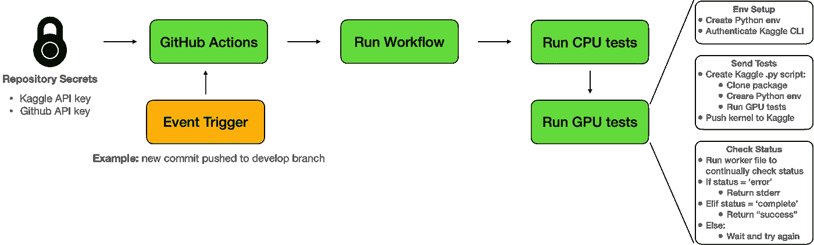

# 使用 Kaggle 的 GPU CI 测试

> 原文：<https://betterprogramming.pub/gpu-ci-tests-using-kaggle-90e4f88a43b3>

## 如何确保你的代码能在 GPU 环境下工作

图片来源于 [Unsplash](https://unsplash.com/photos/wX2L8L-fGeA) 拍摄的 [Roman Synkevych](https://unsplash.com/@synkevych) 。

> **TLDR:** 你可以在你的工作流程中使用 [action-kaggle-gpu-test](https://github.com/marketplace/actions/kaggle-gpu-test) 。这是一个早期访问发布版本。要关注变化，请观看 [GitHub](https://github.com/namiyousef/action-kaggle-gpu-test) 上的回购。

如果您对 GPU 的唯一访问是通过 Kaggle 和 Colab，那么很可能您永远不会编写使用 GPU 环境的单元测试。这是因为 a)很难将整个代码库迁移到 Kaggle/Colab，b)更难实现自动化。

在本文中，我介绍了一个使用 GitHub actions 和 Kaggle 自动进行 GPU 集成测试的简单解决方案。文章以问题陈述的简要描述开始，接着是建议的解决方案，最后是一些结论性的评论。单元测试和 GitHub 行为的知识将贯穿始终。

# 问题陈述

在没有本地 GPU 设备的情况下，我一般只在训练的最后一步使用 Colab/Kaggle。这意味着在开发时，我无法验证训练循环是否能在 GPU 运行时上工作。即使我经历了通过 Colab/Kaggle 调试的麻烦，我对离线代码库所做的任何进一步的更改都需要再次测试。在团队中工作会增加所有这些问题。在这个阶段，在 GPU 运行时上进行自动化测试变得非常方便。

理想情况下，应该有一个 CI/CD 服务，允许你连接到一个免费的 GPU 运行时。然而，在撰写本文时，还没有这样的服务。最接近的一个是 [Gradient](https://gradient.run) ，据称它允许您连接到一个[免费的 M4000 社区 GPU](https://gradient.run/free-gpu) ，但是文档并不清楚免费 GPU 是否也可用于他们的[工作流](https://docs.paperspace.com/gradient/workflows/)服务。当我尝试这种方法时，需要一张信用卡，所以我决定用其他方法。

这给我留下了一个直接与 Colab/Kaggle 接口的解决方案。两者都有独特的挑战:

*   **Colab:** 您可以通过 ssh 进入 Colab 并使用可用的 GPU，但是这不能自动完成，因为您不能以编程方式启动 Colab 运行时。您必须通过浏览器手动完成此操作。
*   **Kaggle:** 你也可以 ssh 到 Kaggle VM，但是你将看不到 GPU。这是因为在使用 GPU 之前，Kaggle 上的运行按钮会初始化某些命令。我不知道如何通过编程来做到这一点。

我选定的最终解决方案是启动一个支持 GPU 的 Kaggle 脚本来运行集成测试。

# 拟议解决方案

解决方案是在 GitHub Actions 运行时中执行以下操作:

*   **认证 Kaggle CLI:** 使用 Kaggle API 令牌来设置 Kaggle CLI。这将允许您直接与 Kaggle 接口，使用 GPU 运行时运行脚本/笔记本
*   **创建并发送测试:**创建将在 Kaggle GPU 运行时上运行的 Python 脚本。这个 Python 脚本将克隆您想要测试的存储库，设置虚拟环境并运行`pytest`。然后，Kaggle CLI 用于发送一个脚本，其中包含您正在测试的存储库的名称和标题。这是使用`kaggle kernels push $REPO_NAME`完成的
*   **检查卡格尔状态:**使用`kaggle kernels status $REPO_NAME`检查测试状态。如果状态有错误，这意味着测试失败，日志被返回(使用`kaggle kernels output $REPO_NAME`)。如果测试已经通过，则返回成功消息。否则，将定期检查状态。

下图显示了该解决方案的端到端工作方式:

所有这些都是作为一个独立的项目存在的单独的`action.yml`。我把它叫做`action-kaggle-gpu-test`。然后，您可以在任何 repository GitHub 工作流文件中使用它，以便使用 GPU 运行时进行测试。这是按如下方式完成的:

动作文件本身如下所示:

# 结束语

*   GPU 测试是必要的，以确保您的模型将正确利用资源。
*   鉴于缺乏 CI/CD GPU 集群，很难免费实现自动化
*   可以使用 Kaggle API 实现 GPU 测试，从而使用 GPU 运行时以编程方式创建笔记本/脚本
*   这种方法不是特别高效或优雅，但它达到了目的。

可以在 GitHub marketplace 中找到该操作:

 [## Kaggle GPU 测试- GitHub 市场

### GitHub 动作 GitHub 动作文件，用于针对 Kaggle GPU 测试贡献者 Kaggle GPU 测试执行集成测试…

github.com](https://github.com/marketplace/actions/kaggle-gpu-test) 

要查看使用此动作进行 GPU 测试的项目，请访问以下资源库:

 [## 开发 namiyousef/colab-utils 上的 colab-utils/python-package.yml

### 此文件包含双向 Unicode 文本，其解释或编译可能与下面显示的不同…

github.com](https://github.com/namiyousef/colab-utils/blob/develop/.github/workflows/python-package.yml) 

如果您对此操作的更新感兴趣，请查看资源库:

 [## GitHub-namiyousef/action-ka ggle-GPU-test:用于执行集成测试的 GitHub 操作文件…

### 此时您不能执行该操作。您已使用另一个标签页或窗口登录。您已在另一个选项卡中注销，或者…

github.com](https://github.com/namiyousef/action-kaggle-gpu-test) 

*所有图片均由作者提供，除非另有说明。*