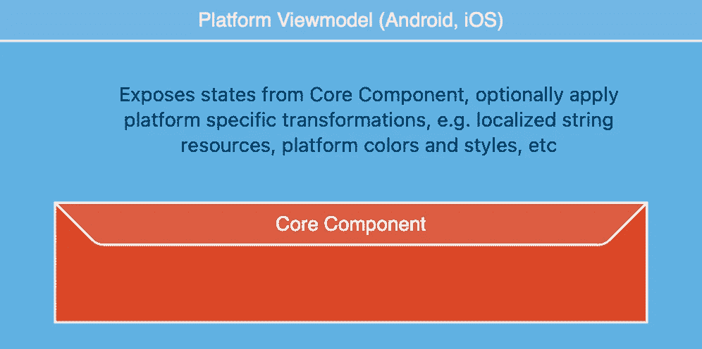
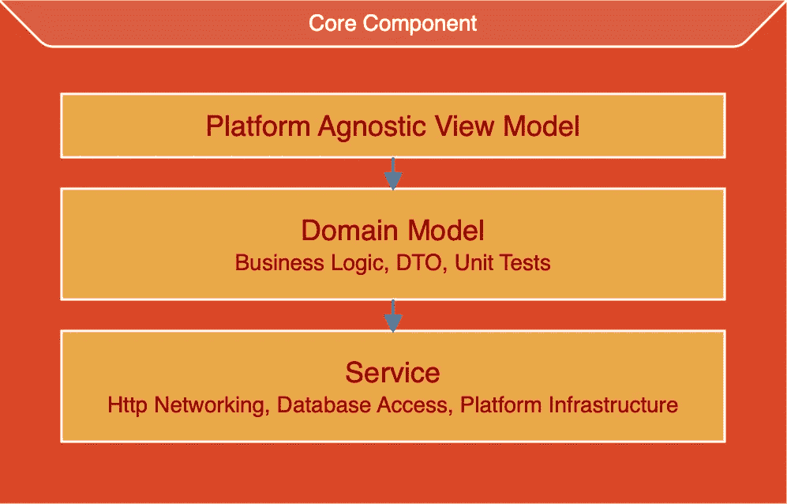

# 面向移动开发的 GraalVM 原生映像的现状

> 原文：<https://betterprogramming.pub/graalvm-native-image-for-mobile-development-49eb87a00eee>

## 随着 KMM 和即将到来的 Java 变化，未来看起来越来越本地化

弗朗切斯科在 [Unsplash](https://unsplash.com?utm_source=medium&utm_medium=referral) 上的照片

GraalVM 本机映像从 Java 字节码产生本机代码。它主要用于需要快速启动时间的应用或功能，即微服务。它使用 AOT(提前)编译。

在本文中，我们将简要探讨 GraalVM 上移动开发的现状。

在[的后续文章](https://medium.com/@philip.han_66842/making-multiplatform-mobile-apps-with-graalvm-native-image-7e9131fb185f)中，我们将创建一个可以驱动 Android 和 iOS 应用的共享核心组件。演示应用程序将包含本文中介绍的所有想法，并更详细地研究它们。

我们将看到 Android 和 iOS 之间共享逻辑的好处是否大于连接两个世界的互操作层的开销。

# 内部操作

首先，我将列举这一努力中最大的障碍:c。

是的，没错。C.

在完成这个项目的过程中，我了解到大多数语言的互操作特性都在 C 层。如果你多考虑一下，就有点道理了。还可以用什么？

GraalVM C API 使用 C 函数入口点生成机器可执行文件或库。虽然这可以用 Java 或 Kotlin 编写，但它只在 Java 中运行良好，对我来说用 Kotlin 就不行了。你可以用 Kotlin 编写你的应用程序代码，但是 C interop 代码必须用 Java 编写。也许，在科特林是有可能的，只是我还没管好。

最后，在这种情况下，消费者 Swift 必须使用 C 代码。幸运的是，Swift 有一个非常好的 C 互操作层。这个项目不需要 Objective-C。当然，如果需要，也可以使用 Objective-C。

总而言之，事情是这样的:

JVM 组件 GraalVM C APISwift C APISwift

JVM 组件可以用任何 JVM 语言编写，即 Java、Kotlin、Clojure 等。

最后，在某些情况下，您必须注意堆的分配和释放。

# 体系结构

该架构必须是平台无关的，以最大化平台之间的代码共享。主机平台上的 viewmodel 应该包含您的多平台组件和特定于平台的转换。在本文的其余部分，我们将这个组件称为核心组件。

# 核心组件

核心组件由 Android 和 iOS 之间通用的所有应用程序代码组成。它可能因情况而异，但最有可能包含域、视图模型(以平台不可知的方式)、数据访问和网络等。

此外，它需要抽象来访问主机平台的基础设施服务，如蓝牙、语音识别或用户偏好。这是通过将主机平台的服务公开为 C 函数指针和 C 数据结构来实现的。

理想情况下，这个组件应该是平台无关的。它将促进良好的架构，并提供针对其他环境的额外好处，例如桌面(Windows、macOS、Linux)和可能的 WebAssembly。

该组件可以用 Kotlin 或 Java 编写，用于 Android，也可以编译成 Xcode 的 iOS 对象文件。请注意，平台基础设施实现需要由主机提供，并在运行时连接。

# 穿线

如果您熟悉 Java 的线程和内存模型，那么您已经非常熟悉了。你不需要学习其他范例。Java 线程、ExecutorService 和 Kotlin 协同程序工作得很好。不需要特殊的库。

此外，当 Project Loom 发布后，它将立即或很快获得好处。或者如果你使用协同程序，只要 Kotlin 协同程序包含了 Loom。

然而，在 C 互操作层上，需要一种叫做 Isolate 的东西。Isolate 是一个小型的 Java 运行时环境，用于将 JVM 代码作为机器码执行，并驻留在创建它的线程上。它需要由调用者初始化并传递给所有导出的函数。

隔离可能会导致协程之类的问题，因为当延续恢复时，它们可能不在同一个调度程序线程上。当这种情况发生时，隔离将会丢失或不是正确的。

# 第三方库

理论上，迄今为止编写的所有 Java 库都是兼容的。不需要修改，但是您必须找出反射操作并提供一个配置文件来为您的最终对象或可执行文件保留所需的类。

幸运的是，GraalVM AOT 提供了解决这个问题的机制。

首先是代理。该检测监视代码的执行，记录所有反射调用，并为您生成一个配置文件。您需要执行您的代码，并确保在这个检测运行期间到达所有相关的代码。

其次是特色。这允许您在 AOT 编译阶段插入操作。你可以在这里包含一些被编译器排除的类。所以，这与其说是代理，不如说是人工操作。但是有了这两种机制，大多数库都可以与您的项目兼容。

同样值得一提的是，Oracle 最近创建了一个由用户驱动的库的反射配置库。希望库作者将开始把它包含在他们的发行版中，就像少数人已经做的那样。

以下是我到目前为止测试过的库，括号中是移动环境下的问题:

*   Java 11 HttpClient(安卓暂时不包含，在 iOS 中工作)
*   Moshi(工作正常，包括反射绑定，需要编译文件调整)
*   Kotlin(需要内置的配置文件)
*   Ktor(无问题)
*   Kotlin 序列化(工作正常，包括反射绑定)
*   Koin(无问题)
*   Kotlin 协程/流/通道(没有问题，缺少主调度程序)
*   SQLDelight(适用于 H2，而非 SQLite)
*   JDBC — SQLite(缺少 iOS 原生库，但可以在 macOS 目标上工作)
*   JDBC——H2/光(无问题)
*   OkHttp(退出延迟 60 秒，即隔离拆除)
*   改造(OkHttp 的问题，可能适用于其他 Http 客户端？)

# 构建问题

目标文件必须是可重定位的，这意味着所有的函数都有空的加载地址，然后在 Xcode 中完成最终的链接和汇编，以生成可执行代码。GraalVM AOT 编译器为此提供了`H:+ExitAfterRelocatableImageWrite`选项。您需要定制您的构建环境和一些其他特性标志来自动化这个过程。

用于链接最终框架的 iOS-Aarch64 和 iOS-x86_64 的 Java 静态库并不容易获得。它必须从一家私人公司下载，使其可用于基于 JavaFX 的多平台产品。

# 发展环境

目前唯一支持的 IDE 是 VS 代码。Oracle 提供了 [GraalVM 扩展包](https://marketplace.visualstudio.com/items?itemName=oracle-labs-graalvm.graalvm-pack)插件来支持开发。它包括自己的 Java 语言服务器(Apache NetBeans 语言服务器)，所以您需要禁用您可能正在使用的任何其他 Java 语言服务器。

Apache NetBeans 语言服务器不提供 Kotlin 的符号解析。当编写引用任何 Kotlin 组件的 Java 互操作代码时，它会使自动导入和代码完成中断。很烦人。由于符号解析问题，重构部分中断。

该插件还管理 GraalVM 中的 GraalVM 安装和插件，例如本机映像、LLVM 工具链、Python 和其他支持的语言。

它自带了一个原生模式的调试器，但到目前为止我根本没用过。

最后，它提供了与 Maven 和 Gradle 构建环境的集成。

# 将来的

在这一点上，移动开发环境中的 GraalVM 原生映像相当不确定。

甲骨文对这一领域还不太感兴趣。它非常专注于企业和微服务。而围绕它的移动社区几乎为零，虽然有企业社区，比如 Micronaut 和 Quarkus。

Java 本身也在进化。更具体地说，带来外来函数和内存 API 的 Project Panama 将与当前的 C API 重叠，并可能取代当前的实现。Oracle 最近表示，Project Panama 将允许访问除 c 之外的外部内存和函数，但这不会在 [Java 19 中作为](https://youtu.be/RBUP7DeyXsc?t=407)外部函数和内存 API 预览版提供。而 Swift 是否会被收录为目标语言在这一点上是完全未知的，在我看来，可能性非常小。

然后是项目 Valhalla 和 Loom，它们会给 Java 带来值类型和虚拟线程。

简而言之，您今天编写的互操作代码明天就可能过时。

# 与 Kotlin 多平台的比较

Kotlin Multiplatform (KMM)比 GraalVM mobile 更有优势。

首先，KMM 有一家实力雄厚的公司 JetBrains 的支持。甲骨文对移动领域没有表现出任何热情。信不信由你，他们的官方产品仍然是 Java ME。

KMM 周围有一个健康而热情的社区。由于 JetBrains 已经取消了对 KMM 内存管理器的限制，库支持可能会增加。

KMM 有直接的 Objective-C 接口，这意味着你不必处理 C 接口，尽管那个选项是可用的。Swift 界面正在开发中。

根据我的经验，KMM 上的反射支持不如 GraalVM 好。

对于 Java/JVM 在 KMM 的发展，同样的问题依然存在。它将如何采用虚拟线程、值类型和 FFI？

# 结论

核心组件拥有单一代码库的好处是不可否认的。同时两边 C 接口的负担也是实实在在的。

[过去为 Android/iOS 开发基于 C/C++的内核的尝试都失败了，因为随着时间的推移，开销变得越来越复杂和昂贵。](https://dropbox.tech/mobile/the-not-so-hidden-cost-of-sharing-code-between-ios-and-android)

平心而论，GraalVM 原生映像离共享 C++代码还很远。然而，这篇文章中的一些结论在这里也适用，依我看。

# 事后思考

我在研究和实现演示应用程序的过程中获得了很多乐趣。我想做这个项目纯粹是出于好奇。我知道在这个过程中我会学到很多东西。

随着 KMM 和即将到来的 Java 变化，未来看起来越来越本地化。至少在某种程度上，长期流程仍将由 JIT 主导，但 native 肯定会有一席之地。

我鼓励任何着眼于未来的 Java/Kotlin 开发人员更仔细地研究本机代码，即 C、C++和 LLVM。

LLVM 是实现 KMM 的核心，GraalVM AOT 也有一个 LLVM 后端作为选项。