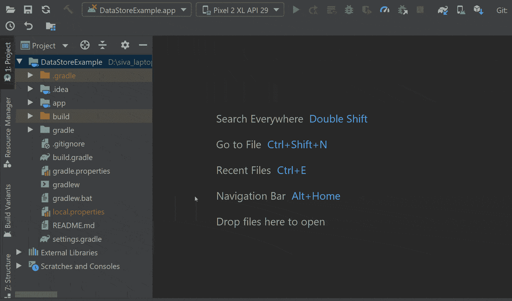
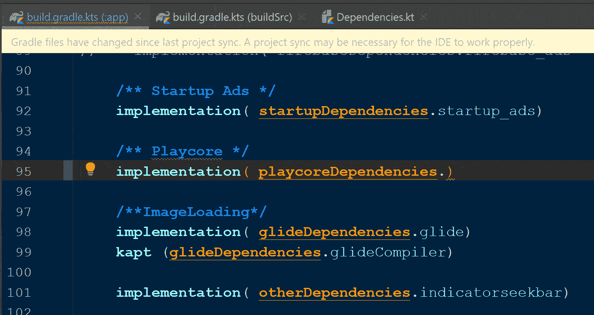

# 使用 BuildSrc 和 Kotlin DSL 进行梯度依赖管理

> 原文：<https://betterprogramming.pub/gradle-dependency-management-with-buildsrc-and-kotlin-dsl-1de958eab166>

## 在多模块项目中实现依赖关系的好方法

# 从文章中摘录

它主要关注于使用`buildSrc`目录和 Kotlin DSL 脚本构建一个梯度依赖管理系统。您还将了解到这样做相对于使用传统 Groovy 代码的优势。

如果你喜欢看这个博客的视频，YouTube 的视频会在文章的结尾嵌入。

# 问题

众所周知，在快速增长的项目中维护依赖关系是一项单调乏味的工作。传统的 Groovy 脚本没有代码导航、自动完成、性能问题和运行时错误，这让情况变得更糟。

最重要的是，绝大多数 android 开发人员在使用 Groovy 时不知道他们在写什么。在我职业生涯的早期，我甚至不知道在使用 Groovy 时做了什么。

感谢 Gradle 团队和社区努力提供一个平稳和安全的构建过程。他们提出的最好的解决方案之一是使用带有 Kotlin DSL 脚本的`buildSrc`目录。

# 解决办法

库实现和定制任务不应该存在于构建脚本中。它们应该在单独的文件中声明，以便在构建脚本中使用。在这个实现的早期阶段，开发人员通常创建一个 Gradle 文件来声明所有的库，并在构建脚本中使用它们。

的确，这在一定程度上解决了问题。你可以在这篇[文章](https://medium.com/@sgkantamani/next-level-of-dependencies-declaration-with-kotlin-dsl-scripits-48bfe1cb1f10)中读到。但是这种快速的解决方案没有解决像自动完成和代码导航这样的问题，从长远来看，这是一种不可靠的解决方案。在这次失败之后，`buildSrc`似乎是一个有希望的解决方案。

> 目录`buildSrc`被视为[包含的构建](https://docs.gradle.org/current/userguide/composite_builds.html#composite_build_intro)。发现目录后，Gradle 会自动编译和测试这段代码，并将其放入构建脚本的类路径中。多项目构建只能有一个`buildSrc`目录，它必须位于根项目目录中。`buildSrc`应该优先于[脚本插件](https://docs.gradle.org/current/userguide/plugins.html#sec:script_plugins)，因为它更容易维护、重构和测试代码。
> —格拉德团队

使用`buildSrc`和 Kotlin DSL 脚本不仅解决了构建脚本中的问题，还带来了增强的 IDE 支持、代码导航、编译时错误等等。最重要的是，我们不再需要使用 Groovy 了。

# 创建 buildSrc 目录

我们需要做的第一件事是创建一个 buildSrc 目录:

*   右键单击该项目。
*   点击新建并选择目录。
*   现在命名为`buildSrc`。

如果您对如何创建目录还有任何疑问，请查看:

然后我们需要在`buildSrc`目录下创建一个名为`build.gradle.kts`的文件。在这个文件中，我们需要导入`kotlin-dsl`插件和`jcenter` 库。说到语法，它看起来像这样:

一旦你完成了，按下 gradle 的“现在同步”按钮，因为 Gradle 认为这只是一个新目录中的普通文件。耶！现在您可以实现 Kotlin Dsl 脚本了。

下一步是创建一个类似的目录结构，即 src > main > java。一旦我们这样做了，它看起来如上图所示。

现在，我们可以创建 Kotlin 文件来声明库、维护版本或实现定制任务。

这里我们的目标是创建一个依赖管理系统，所以我们创建了一个名为`Dependencies.kt`的 Kotlin 文件(您可以使用任何名称)。

一旦我们完成了这些，我们就可以用 Kotlin 代码声明库和版本了。这里我们使用对象来声明特定的类型，比如版本、AndroidX 库等等。

首先，我们需要创建一个 versions 对象，并以 Kotlin 风格声明所有库的版本。看一看:

对象来存储所有依赖项的版本

一旦我们完成了这些，下一步就是为每个库类型创建单独的对象，比如 Kotlinlibraries、AndroidXLibraries、UiLibraries 等。看一看:

库声明

当我们把所有的部分放在一起时，它看起来像这样:

最后一步是在项目、应用程序和模块级 build.gradle 文件中使用这些依赖对象。这很简单。我们需要使用特定的对象名和变量名。看一看:

这种方法看起来很简单，但是它提供了更多的优势，比如代码导航、自动完成、运行时错误等等。看下面的 gif。除此之外，我们可以在项目的所有模块中使用它们。

gradle 文件中的自动完成、代码导航和编译时错误

# 我们可以做得更多

到目前为止，我们已经实现了与依赖项相关的所有东西，但是我们当然可以在构建脚本中做更多的事情，比如替换`defaultConfig`块。一般来说，它看起来是这样的:

正如我所说的，将常量从构建脚本中移走总是安全的。所以我们可以在`buildSrc`下创建另一个 Kotlin 文件，或者在依赖文件中创建一个新对象。然后像 min 一样声明所有常量，编译 SDK 版本等等。看一看:

现在，我们可以在`defaultConfig`块中使用这个对象。看一看:

假设您的项目有任何`BuildConfig`级别的字符串或常量来维护敏感的键和东西。在这种情况下，您可以创建一个单独的文件并单独保存它们，而不是将构建脚本弄得一团糟。

# 奖金

视频格式

要了解有关实现更好的依赖项管理和构建脚本的最佳实践的更多信息，请阅读以下文章:

*   [“使用 Kotlin DSL 脚本的下一级依赖关系声明](https://medium.com/@sgkantamani/next-level-of-dependencies-declaration-with-kotlin-dsl-scripits-48bfe1cb1f10)
*   [“探索 kot Lin DSL”](https://medium.com/better-programming/exploring-kotlin-dsl-4ab67ed13062)

要了解更多关于 Kotlin & coroutines 和 Kotlin 的其他高级特性，请阅读以下文章:

*   [“使用 Kotlin 进行高级编程](https://medium.com/better-programming/advanced-android-programming-with-kotlin-5e40b1be22bb)”
*   [“使用 Kotlin 进行高级编程—第 2 部分](https://medium.com/android-dev-hacks/advanced-android-programming-with-kotlin-part-2-aae2a15258b0)”
*   [“科特林协程，从基础到高级](https://medium.com/better-programming/kotlin-coroutines-from-basics-to-advanced-ad3eb1421006)
*   [“如何使用 Kotlin 密封类进行状态管理”](https://medium.com/better-programming/how-to-use-kotlin-sealed-classes-for-state-management-c1cfb81abc6a)
*   [“使用新 Kotlin 流异步加载数据](https://medium.com/better-programming/asynchronous-data-loading-with-new-kotlin-flow-233f85ae1d8b)
*   [“为什么以及如何使用 Kotlin 的原生序列化库](https://medium.com/better-programming/why-and-how-to-use-kotlins-native-serialization-library-c88c0f14f93d)”

目前就这些。希望你学到了有用的东西，感谢阅读。