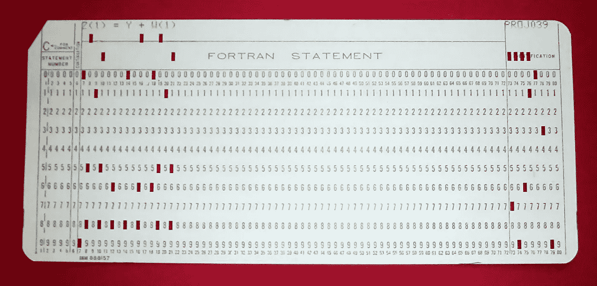
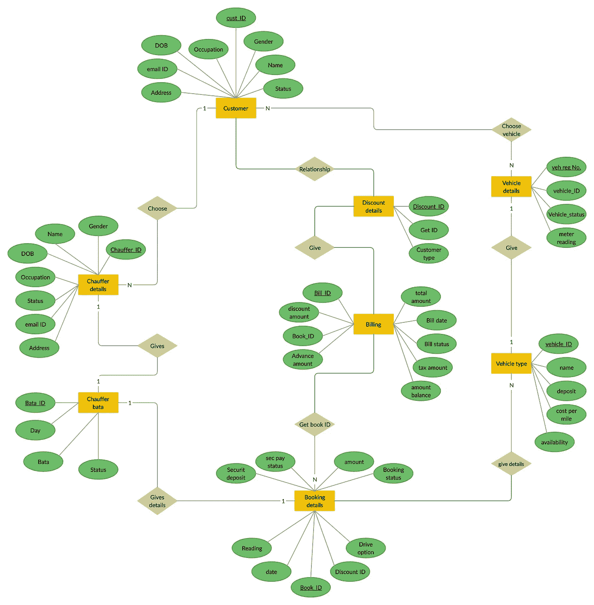
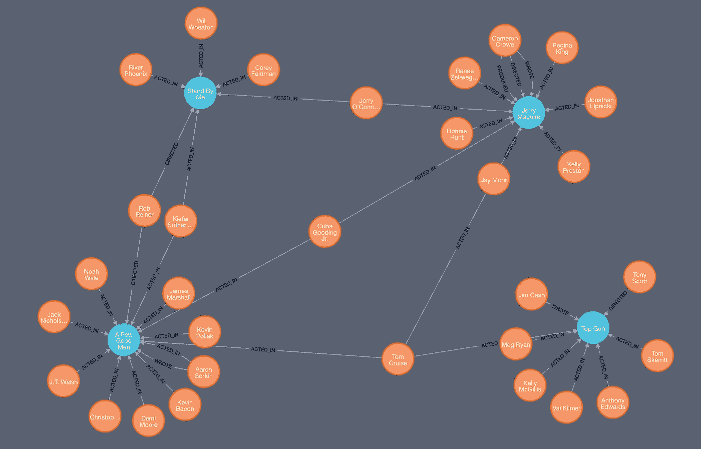

# 让我们了解一下图形数据库

> 原文：<https://betterprogramming.pub/graph-databases-ad2cbe1570df>

## 现代数据库简介

由[弗兰基·查马基](https://unsplash.com/@franki)在 [Unsplash](https://unsplash.com/) 上拍摄的照片

世界十大零售商中有超过七家使用图形数据库。像[易贝](https://neo4j.com/blog/ebay-shopbot-graph-powered-conversational-commerce/?ref=who-uses)和[沃尔玛](https://neo4j.com/case-studies/walmart/?ref=who-uses)这样的顶级零售商依靠图形数据库来推动推荐、促销和简化物流。

前十大保险公司中的八家，像 [die Bayerische](https://neo4j.com/case-studies/die-bayerische/?ref=who-uses) 、 [Optum Healthcare](https://neo4j.com/graphconnect-2018/session/connected-healthcare-optum/?ref=who-uses) 和 Allianz 这样的顶级保险公司，依靠图形数据库来打击欺诈和管理信息。

甚至像脸书和谷歌这样的公司几十年来也一直将他们的业务建立在某种形式的图形数据库上。

图形数据库正在推动全球众多企业的发展，在本文中，我们将讨论现代图形数据库以及是什么导致了数据库的发展。

# 从穿孔卡片到关系数据库

在最初的日子里，数据存储在穿孔卡片上，很难阅读或解释。不可能将数据编入索引以相互参照并消除不一致之处。

Fortran 程序中的穿孔卡片— [维基百科](https://en.wikipedia.org/wiki/Computer_programming_in_the_punched_card_era)

但是很快，行业发展了，数据被存储在关系数据库中。

这种格式在某种程度上是人类可读的，但是为了存储大量的数据，关系数据库需要规范化以消除重复和不一致。

它还需要相关数据的外键关系，如果没有复杂的`JOIN`查询，很难理解和维护。

汽车租赁系统的 ER 图

## 酸:原子性、一致性、孤立性和持久性

关系数据库支持现成的 ACID，这是一个很大的优势。

这意味着，如果数据被提交一次，它将可供后续查询使用，但查找数据的成本很高，并且随着数据大小的不断增长，成本也在不断攀升。

为了解决这个问题，我们给数据添加了索引，使得查找速度更快。

添加索引在一定程度上解决了这个问题，但是如果我们必须进行大量的连接，那么我们必须为每个连接执行查询时索引查找——随着表数量的增加，这种方法开始瓦解，并且变得昂贵。

# 云对数据库技术的影响

在过去的十年里，技术领域见证了云技术的巨大发展，事情变得有些模糊。

自从云出现以来，数据一直呈爆炸式增长，传统的数据库技术不足以处理如此庞大的数据量。这激发了创新，于是`NoSQL`革命诞生了。

NoSQL 革命让查询海量数据成为可能。

为了实现查询越来越多数据的目标，我们不得不讨论折衷方案，第一个方案是去掉`RDBMS`提供的`ACID`属性。

第二个是开发人员的体验，一个`key value`接口是对开发人员有意义的最简单的数据模型，我们用一个相应的键存储一个值，然后，我们可以用这个键访问这个值，但是这个值是不透明的，也就是说，它对数据库没有意义。

# 文档数据库

使用`key value`接口和不透明的`value`类型来讨论开发人员的体验是值得的，但是如果我们希望数据库索引`values`并使其易于基于内容进行查询呢？

这就是一个`document database`所做的，一个`document database`提供了一个`key`来查找一个`document`，但是我们也可以基于它的内容来查找一个`document`，这个内容被索引以便快速检索。

文档数据库中的文档可以引用其他文档，这在一定程度上破坏了开发人员的体验，并且不是很有性能。

根据亚马逊的说法—

> “文档数据库是一种非关系数据库，旨在将数据存储和查询为类似 JSON 的文档。文档模型适用于目录、用户配置文件和内容管理系统等用例，其中每个文档都是唯一的，并且会随着时间的推移而发展。”

如果我们不太关心那些离散的数据，而更关心数据之间的关系，那会怎么样呢？

# 图形数据库

图形数据库提供了一种*关系优先*的方法来存储和查询数据。

数据以更符合逻辑的方式存储，并非常接近真实世界的实体进行建模，这有助于确定数据关系的表示、可发现性和可维护性的优先级。

同时，对于关心数据关系的开发人员来说，数据完整性非常重要，这意味着要将 ACID 属性重新引入图形数据库。

一个提供完整图形优势、保证数据完整性的图形数据库是 [Neo4j](https://neo4j.com/) 。

现在，您可以将最关键的业务数据存储在图形数据库中，而不必担心数据丢失、不一致和其他恶意副作用。

## 图形数据库的结构

电影图形数据库

图形数据库由以下组件组成，如上图所示:

*   节点:类似于 RDBMS 中的行。
*   边/关系:将节点相互连接起来的线。关系或边在图形数据库中优先。
*   属性:与节点相关的信息，或者说，与类的属性相关的信息。如果一个节点是一行，那么属性可以是定义行中数据的所有列。

## 图形数据库的优势

对于关联数据集，图形数据库比关系数据库更快。它们直接映射到面向对象的应用程序的结构，并且可以自然伸缩，因为它们不必处理复杂的连接，并且具有动态行为。

另一方面，RDBMs 对于重复操作来说速度更快。

图形数据库非常适合性能、敏捷性和灵活性。

## 存储机制

不同的图形数据库存储数据的方式不同，有些使用原生图形存储，Neo4j 就属于这一类。其中一些基于关系引擎的顶层，并将数据存储在表中。

图形存储提供了更好的性能，因为图形的存储格式非常类似于数据库索引。

您可以将图形数据库想象成一个巨大的索引。

# 图形数据库的用例

*   网络和 IT 运营:考虑网络体系结构和图形数据库，通常会在两者之间建立直接的关联——网络有节点，节点有连接，类似于图形数据库中的关系，每个节点都有特定的属性。一切都是物理上相互联系的。
*   基于交易的应用:Paypal 使用图形数据库来管理幕后的交易和支付。
*   欺诈检测和分析:在检测和分类欺诈和其他复杂攻击时，实时分析可以为企业提供一些很好的见解。
*   社交网络:这是图形数据库的一个非常自然的用例，因为人们在系统上以不同的方式组成群体并建立与不同实体的关系，这很容易用图形数据库绘制出来。
*   基于图形的搜索:围绕数字资产之间的关系构建的媒体库，每个资产都有自己的属性或特性，这是图形数据库的一个非常好的用例。

正如我们前面提到的，图形数据库正在成功地为谷歌、脸书、LinkedIn、沃尔玛、易贝等公司提供支持。每天为数十亿用户提供尖端服务。

# 结论

在本文中，我们简要讨论了图形数据库、底层架构、一些用例、优点，并将其与市场上的其他类似技术进行了比较。

在接下来的文章中，我们将详细介绍图形数据库，了解如何使用图形数据库构建数据的工作模型，并介绍查询语言。

Cypher 是用于与图形数据库交互和执行操作的语言。

感谢阅读！