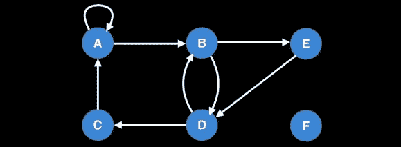
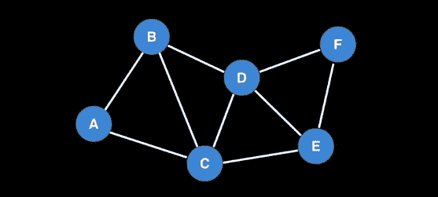
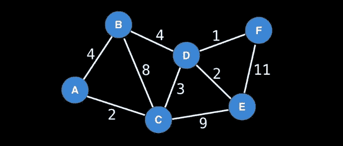
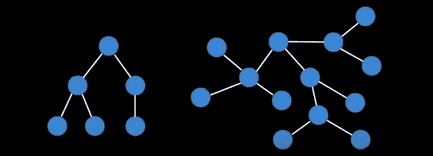
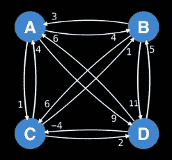

# “简化”的图论算法

> 原文：<https://betterprogramming.pub/graph-theory-algorithms-simplified-9a6868cc222>

## 图论 101

柯尼斯堡市，[历史名城研究项目](http://visualhistory.livejournal.com/39249.html)

图论是数学的一个非常广泛的分支，它在现实世界的问题中非常适用。最初，图论是为了解决现实世界的问题而“发明”的，在那之后，它像所有其他数学分支一样被抽象数学家所劫持。

在本教程和后续教程中，我们将研究一些图论算法及其在 Python 中的实现。现在，回到主题的实质。

# **什么是图形？**

简而言之，图是一组顶点/节点和边。如果您对“set”不满意，请用 collection 替换它。

显示人与人之间联系的简单图表。图片来自[威廉·费塞特](https://www.youtube.com/channel/UCD8yeTczadqdARzQUp29PJw)

## **什么是顶点/节点？**

在上图中，一个顶点/节点就是人。

顶点是图的基本单位。它可以表示几乎任何实体，通常表示为一个圆。

## **什么是优势？**

在上图中，连接人的线是边。

顶点之间的线或连接称为边。它可以表示顶点之间的任何类型的关系。

# **图形类型**

## **有向图**

边上有方向的图称为*有向图*。它可能用于显示与前辈(从父母到孩子的箭头)或祖先(从孩子到父母的箭头)的关系。

有向图。图片来自[威廉·费塞特](https://www.youtube.com/channel/UCD8yeTczadqdARzQUp29PJw)

## **无向图**

边上没有方向的图称为无向图。它可以用来显示双向道路。

无向图。图片来自[威廉·费塞特](https://www.youtube.com/channel/UCD8yeTczadqdARzQUp29PJw)

## **加权图**

一种图，其边上有一个数字来表示交易的费用、旅行的公平性、城市之间的距离等。它可以有任何类型的边缘。

加权图。图片来自[威廉·费塞特](https://www.youtube.com/channel/UCD8yeTczadqdARzQUp29PJw)

## **树**

没有圈的无向图是树。这里，循环意味着从给定的另一个节点沿着边到一个节点只有一条路。

一棵树的所有节点都通过一条边与另一个节点相连，它有 N 个节点，N-1 条边。

树木。图片来自[威廉·费塞特](https://www.youtube.com/channel/UCD8yeTczadqdARzQUp29PJw)

# **代表图形**

图表示例。图片来自[威廉·费塞特](https://www.youtube.com/channel/UCD8yeTczadqdARzQUp29PJw)

有许多方法来表示一个图形，最常见的两种方法是:

## **邻接矩阵**

假设我们在一个图中有 N 个节点。我们可以用一个具有 *N* 行和 *N* 列的矩阵来表示它，其中矩阵的一行和一列将表示一个节点，其中的条目表示一个有向边(有或没有权重)。

它们构成了代表行的节点到代表列的节点。通常，0 或无穷大用于表示节点之间没有边。在 Python 中，邻接矩阵可以表示为:

## **邻接表**

类似地，对于具有 *N* 个节点的图，我们可以使用邻接表来表示该图，其中节点的所有边都保存在元组(节点，权重)列表中。在 python 中，它可以表示为:

## **嵌套字典**

我使用嵌套字典(我称之为嵌套字典)和集合字典(如果节点没有带权重的边)来表示图。

在下一篇[文章](https://medium.com/swlh/vanilla-search-techniques-on-graphs-dfs-and-bfs-c5cff5d0937d)中，我将会用不同的方法发布一个复杂图形类的 Python 代码，我们将会用它来实现一个[深度优先搜索](https://medium.com/swlh/vanilla-search-techniques-on-graphs-dfs-and-bfs-c5cff5d0937d)。

 [## 图上的标准搜索技术:深度优先搜索

### 开始搜索

medium.com](https://medium.com/swlh/vanilla-search-techniques-on-graphs-dfs-and-bfs-c5cff5d0937d) 

欲知详情，请参见 YouTube 上由 freecodecamp 制作的视频，或者点击[此处](http://math.tut.fi/~ruohonen/GT_English.pdf)了解更多信息。