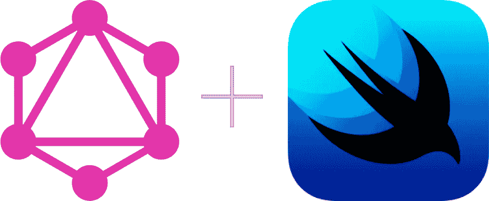
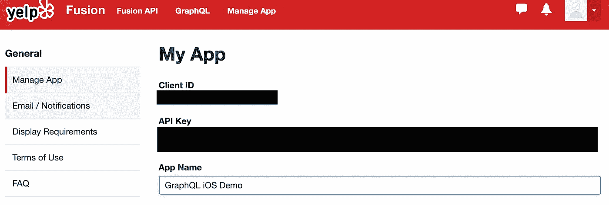
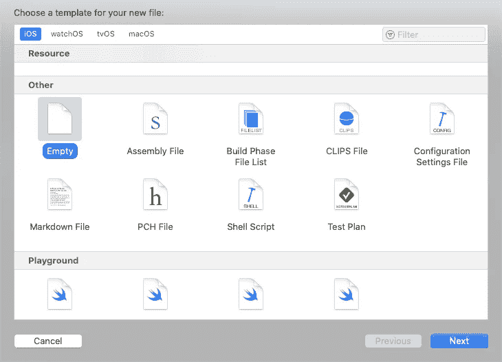
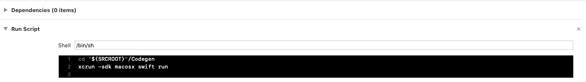
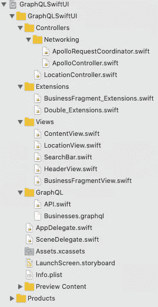
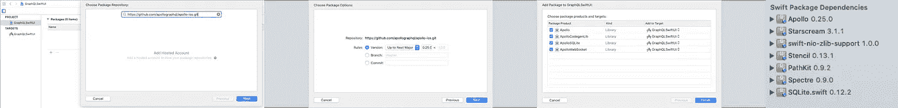

# GraphQL、Combine 和 SwiftUI

> 原文：<https://betterprogramming.pub/graphql-combine-and-swiftui-fe9ce615624f>

## *一个 iOS 开发者的前沿梦想*



作者照片。

# 目标

我们将使用 Swift 包和 Apollo iOS 库自省 Yelp GraphQL API。我们将在主项目中再次使用 Apollo 库来处理生成的网络和模型代码。该应用程序将通过 Combine 观察您的位置和搜索输入，以在 SwiftUI 中显示 YELP API 结果。


# **2020 年 4 月 29 日设置**

我用的是 Xcode 11，Apollo 0.25.0，SDWebImageSwiftUI 1.3.3。

如果您只想直接看代码，那么您可以克隆项目:

```
git clone [https://github.com](https://github.com)/joninsky/GraphQL-SwiftUI-Demo.git
```

## 获取 Yelp API 信息

你需要在 Yelp 上创建一个账户，然后导航到[开发者门户](https://www.yelp.com/developers)，为你的“应用”生成一个客户端 ID 和 API 密钥



## 设置 Xcode 项目

新建一个 app Xcode 项目，使用 SwiftUI。为了让代码生成工作，您需要一个名为`GraphQL`的文件夹。这个文件夹中需要两个文件。首先，通过添加一个“空”文件来创建`businesses.graphql`文件，然后创建一个名为`API.siwft`的文件。后一个文件将在稍后生成，但它不会成为项目的一部分，除非您在生成后将它添加到这里或拖动到项目中。



代码生成将需要`businesses.graphql`文件来完成它的工作，所以将我们的 GraphQL 查询添加到该文件中:

您可以对其他查询重复这种模式，但这是我们在这个演示中所需要的。我使用了这个文档来编写 GraphQL 查询。

## 添加代码生成

我用的是阿波罗的测试代码生成工具。他们的官方文档可以在这个链接找到[，但是我只是给你一个精简的演示。](https://www.apollographql.com/docs/ios/swift-scripting/)

我们将制作一个 Swift 包，可以运行我们用 Swift 编写的脚本。酷！我们将连接实际的应用程序来调用该脚本。我按照 Apollo 文档将这个包保存在与 Xcode 项目相同的目录下的文件夹`Codegen`。

您可以从终端设置代码生成 Swift 包。在您的终端中，`cd`指向 Xcode 项目目录，然后`mkdir Codegen`。然后`cd Codegen/`。进入新目录后，运行`swift package init --type executable`创建新的 Swift 包。

您需要修改`Package.swift`文件，如下所示:

然后将这段代码添加到您的`main.swift`文件中:

如果您查看代码中的注释，您会发现我们能够获得对我们首先创建的 Xcode 项目的`GraphQL`文件夹的引用。在那里，我们自省`schema.json`文件并生成`API.swift`文件。您可以通过键入`swift run`从命令行运行这个 Swift 包。

我们将通过在 Xcode 项目中添加一个“构建脚本”阶段来完成代码生成设置。确保脚本就在依赖项之后。



```
cd "${SRCROOT}"/Codegenxcrun -sdk macosx swift run
```

如果您现在清理(Shift + Command + K)并构建(Shift + Command + B)您的项目，您应该会看到一个填充的`API.swift`文件。

# 应用代码

我不打算把所有的代码都贴在文章里。相反，我将包括几个重要的部分。

下面列出了我的文件系统和完成项目所需的所有文件。我认为这能让你在继续阅读的时候保持头脑清醒，不至于迷失方向。



## 包装

该应用程序将依赖于两个软件包，这两个软件包都与 Swift Package Manager 一起安装。

第一个包是阿波罗库，你可以从[阿波罗 iOS repo](https://github.com/apollographql/apollo-ios) 中添加。以下是 Swift 包裹添加流程的快速视图，以供参考:



我们将获得 Yelp 的商业图片，我们需要一些帮助。如果你曾经接触过 iOS 开发，你可能会信任`SDWeImage`。幸运的是，他们有一个 [SwiftUI 兼容版本](https://github.com/SDWebImage/SDWebImageSwiftUI.git)，我们也可以将其添加为 Swift 包。补充一下。

## 信息列表

您需要在`info.plist`文件中添加两件东西:一个应用传输安全规则和使用时位置的权限描述。

## 网络层

如果你还不清楚，我们将尽可能使用 Apollo iOS 框架来处理。因为我们必须传递一个 API 键和 GraphQL 请求，所以我们需要使用 [Apollo 高级网络设置](https://www.apollographql.com/docs/ios/initialization/#example-advanced-client-setup)。

您可以在`ApolloController.swift`文件的适当常量中输入您的 Yelp API 密钥。

一旦有了设置 Apollo 客户机的代码，我们将继续处理请求和相关变量的文件:`ApolloRequestCoordinator.swift`文件。这个文件有几个关键部分。首先，它是一个具有`@Published`属性的可观察对象，利用 Combine 绑定到 UI 和订阅来发起网络请求。第二，它有一个位置控制器来处理它的同名物。最后，如果您查看`SceneDelegate.swift`文件，您会看到网络控制器和位置控制器都被添加为`@EnvironmentObjects`，这样 SwiftUI 视图就可以访问它们的属性和功能。以下是网络控制器的简略视图:

## 位置控制器

位置控制器是你能得到的最简单的东西。它只是在使用时询问位置，并通过 Combine 发布认证状态和实际位置。

有一个名为 Location view 的 SwiftUI 视图，可以为用户处理 UX 中与该位置相关的所有交互。它依赖于作为`@EnvironmentOvject`可用的位置控制器。

## 扩展ˌ扩张

如果您注意到了`businesses.graphql`文件，您会看到我们将返回的结果定义为一个 GraphQL 片段。这很方便，因为 Apollo 将在`API.swift`文件中为我们生成一个名为`BusinessesFragment`的结构。然后，我们可以通过扩展使它符合`Identifiable`协议，从而在 SwiftUI 中直接使用它。

在 Apollo GitHub 论坛上有一些关于在代码生成过程中让事情自动符合`Identifiable`的讨论，所以它可能会在某个时候发生。与此同时，扩展中没有什么可做的，因为`BusinessFragment`已经有了 Yelp 提供的一个`id`属性。太神奇了。现在我们可以使用 SwiftUI 了。

## 斯威夫特伊

我是 SwiftUI 的超级粉丝——即使它仍然有一些粗糙的边缘。它在消除构建 ui 的非区分性工作方面做得很好。

我已经将 UI 分解成对我有意义的视图。SwiftUI 可能非常简洁，以至于您会遇到“大规模视图控制器”类型的问题，但程度较轻。据我所知，弄清楚如何拆分你的 UI 实际上是一个挑战。

可以通过查看项目创建时附带的`ContentView.swift`文件来理解 UI:

`ApolloRequestController.swift`通过 Combine 观察文本字段和位置的变化，以便当您与 UI 交互时，一切都将开始工作。

如果你对子视图中的代码感兴趣，看看整个项目的。

# 总结

这里有一些有趣的待办事项。解决分页问题会很有趣。在图像加载方面也有一些不足。在实际的 SwiftUI 中制作一个可重用的列表会很有趣，而不是依赖于`List`视图，后者本质上是一个`UITableView`。

如果你看到这个项目有任何问题或有意见，让我知道！否则，就尽情享受吧。