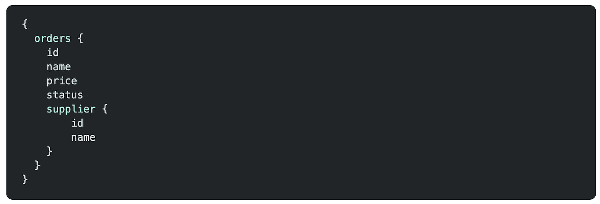
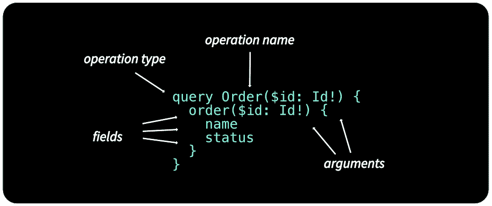
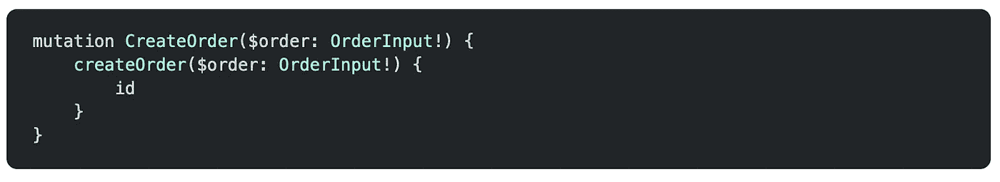
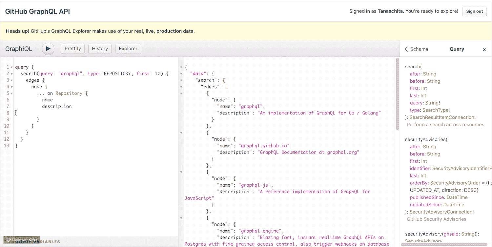
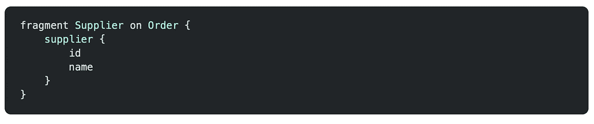
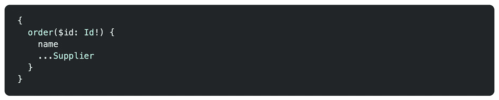
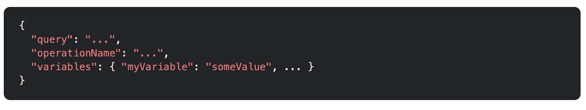
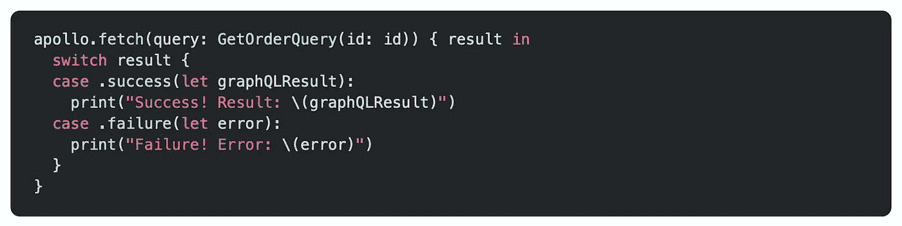

# 作为 iOS 开发人员，您需要了解的 GraphQL 基本知识

> 原文：<https://betterprogramming.pub/graphql-essentials-you-need-to-know-as-an-ios-developer-fe9c42bbbeb2>

## 作为移动开发者如何用好 GraphQL


刘易斯·恩古吉在 [Unsplash](https://unsplash.com?utm_source=medium&utm_medium=referral) 上的照片。

简而言之，GraphQL 是一种描述如何请求数据的 API 设计范例。它是目前更广为人知的 REST 方法的替代方案。最初，GraphQL 是由脸书在 2015 年开发并开源的。从那以后，它被许多公司采用。他们选择 GraphQL 而不是 REST 的原因是，GraphQL 通过让客户端能够定义他们需要的来自服务器的确切数据，消除了 REST 的低效。

本文将为您提供 GraphQL 的基本知识——尤其是作为一名 iOS 开发人员您需要知道的知识。

# GraphQL 的第一印象

对于 GraphQL 如何工作的第一印象，让我们看一个与 REST 相比如何使用 GraphQL 的例子。

假设您正在实现一家宠物店的前端，并且您想要显示一个用户所下订单的概览。

REST API 会公开多个端点，每个端点返回特定的信息。因此，通过使用 REST API，您可以拥有以下端点:

*   `/orders`获取所有订单的基本信息。
*   `/order/[id]`获取特定订单的详细信息。

您从`/orders`端点获得的信息可能不足以满足前端需求，因为您希望在订单概览中直接显示一些细节。要使用 REST 实现这一点，您可以:

1.  为每个订单发送一个额外的请求，将更多的细节加载到`/order/[id]`端点。
2.  或者要求后端团队向`/orders`端点添加更多数据。

两种方式都不理想。对于第一种方法，您最终会向服务器发送大量请求。对于第二种方法，每次前端需求改变时，您可能需要改变后端。

GraphQL 来拯救。

与 REST 相比，GraphQL APIs 只公开一个端点。您可以精确地指定您需要的数据。通过使用 GraphQL，您可以在 GraphQL 查询中定义订单所需的所有细节字段。



GraphQL 查询的示例。

然后，您将向服务器发送一个带有该查询的请求，并准确地获得您定义的数据——不多也不少。

# GraphQL 作为服务器端运行时

作为一名 iOS 开发人员，您不一定需要了解 GraphQL 如何在服务器端实现的所有细节。所以我在这里就不赘述了。

有趣的是，GraphQL 不依赖于任何特定的框架、编程语言或数据库。您可以将 GraphQL 更多地视为现有后端实现和客户端之间的一层。

许多不同的编程语言都支持 GraphQL，包括 Swift。例如， [Graphiti](https://github.com/GraphQLSwift/Graphiti) 是一个用于构建 GraphQL 模式的 Swift 库。要让 GraphQL 服务在服务器上运行，需要为每个可以访问的数据片段定义所谓的解析器。解析器是一种方法，它告诉 GraphQL 如何以及在哪里获取您所请求的数据(例如，通过访问现有的数据库)。

# GraphQL 基本概念

## 问题

在上面的例子中，我们已经看到了一个简短形式的 GraphQL 查询。查询用于从服务器获取数据，就像 REST 中的 get 请求一样。让我们看看查询的基本部分:



GraphQL 查询的基本部分。

我们在这里使用了长形式的查询，并将其命名为`Order`。在生产应用程序中，您通常会使用这种长格式来增加代码的可读性。

为了能够重用查询，GraphQL 提供了变量，您可以将这些变量作为参数传递到查询中。在我们的示例中，订单的`id`作为参数传入。参数后面的感叹号`!`表示它是必需的。没有它，参数将是可选的。

字段是您所请求的数据单元，最终作为字段出现在您的 JSON 响应数据中。因此，对于上面的查询，您将得到如下所示的 JSON 响应:


GraphQL 查询的 JSON 响应。

## 突变

当使用 API 时，您还需要改变、删除或创建新数据。作为 REST 中 POST、PUT 和 DELETE 请求的等价物，GraphQL 中使用了所谓的`mutations`。

突变由与查询相同的部分组成。创建新秩序的一个变种可能是这样的:



GraphQL 突变的例子。

这里，创建订单所需的订单数据作为类型为`OrderInput`的参数传入。与查询一样，您可以定义应该在响应中返回的字段。上面的变异将返回新创建的订单的`id`。

## GraphQL 模式和浏览器

作为一个前端开发人员，你需要知道你可以要求什么样的数据，你可以选择哪些字段。这就是模式的由来。每个 GraphQL 服务都定义了一组类型，这些类型完整地描述了您作为客户端可以查询或变更的所有可能的数据。当您向该服务发送查询时，它将根据该模式执行，以检查它是否有效。

为了探索这种模式，GraphQL 服务通常会提供一个类似 graph QL 的浏览器浏览器。使用 GraphiQL，您可以针对服务编写和测试您的查询。它提供文档并支持在您键入时进行调试，给出提示并指出错误。在下面的图片中，你可以看到 GitHub 的 GraphiQL 服务来探索他们的 API:



## 碎片

这是我想介绍的最后一个 GraphQL 概念。片段是可重用的单元，可以在构建更复杂的查询时使用。例如，您可以将订购产品背后的供应商提取到一个单独的片段中，以便在不同的查询中重用它。



GraphQL 片段的示例。

提取订单时，您现在可以像这样使用定义的片段:



GraphQL 片段的用法示例。

# iOS 中的 GraphQL

为了能够从 iOS 应用程序向 GraphQL 服务发送请求，您可以使用与发送 REST 请求相同的工具自己构建请求。

例如，为了发送 GraphQL 查询，您可以在 HTTP GET 请求的 query 参数中发送查询及其变量:

```
[http://myapi/graphql?query={me{name...}}&variables={...}](http://myapi/graphql?query={me{name...}}&variables={...})
```

或者在 POST 请求的正文中发送:



POST 请求正文中的 GraphQL 查询。

但是与 GraphQL 服务通信的一个更简单的方法是使用类似于 [Apollo iOS Client](https://github.com/apollographql/apollo-ios) 的库。这个网络库是专门为使用 GraphQL 而设计的。您需要做的只是提供 GraphQL 服务的模式文件。然后，该库将根据您定义的查询生成强类型的 Swift 文件，因此您可以轻松地使用它们进行请求。

下面是用 Apollo 发送请求的一个例子:



使用 Apollo iOS 客户端向 GraphQL 服务发送请求。

如果你感兴趣，你可以在下一篇文章中阅读更多关于如何使用 Apollo iOS 客户端的内容。

# 结论

我希望这是对 GraphQL 世界的良好介绍。如果你想采取下一步行动，我建议你试试 [GitHub 的 GraphQL explorer](https://developer.github.com/v4/explorer/) ，通读他们的文档，尝试不同类型的查询。这将让您很好地了解 GraphQL 在实践中是如何工作的。

当然，你也可以通过阅读[官方文档](https://graphql.org/learn/)来深入了解 GraphQL 的概念。

你有任何问题或反馈吗？请在评论中告诉我。