# 使用 Apollo 在 iOS 中集成 GraphQL

> 原文：<https://betterprogramming.pub/graphql-in-ios-app-using-apollo-2022-cd7e6e35d57f>

## 我用最少的努力将 GraphQL API 集成到 iOS 应用程序中——利用希腊神阿波罗的力量(开玩笑！)

由 [Dom Fou](https://unsplash.com/@domlafou?utm_source=medium&utm_medium=referral) 在 [Unsplash](https://unsplash.com?utm_source=medium&utm_medium=referral) 拍摄的照片

Apollo it 是一个用 Swift 编写的现代的、强类型的、用于 iOS 的缓存 GraphQL 客户端。如果您还在考虑是否在您的项目中使用 Apollo，那么支持使用它的理由是:

*   用`codegen`强打。你**不需要**:解析 JSON，传递字典，手动转换对象，自己写模型。阿波罗客户端会帮你处理。
*   灵活配置的缓存。您可以在内存中或者使用 SQLite 缓存数据。Apollo 使保持用户界面与后端同步所需的查询次数最少。此外，还有大量的[缓存策略](https://www.apollographql.com/docs/ios/caching#specifying-a-cache-policy)需要设置。
*   简单方便的🛋.如果你曾经提出过网络请求 URLSession，你会毫不怀疑地使用 Apollo。

我们开始吧！

让我们为本文使用公共的 GraphQL API — [Fruits API](https://fruits-api.netlify.app/graphql) 。它提供了关于果树的信息。这个 API 足够简单，非常适合学习 Apollo。

# 第一步。创建 Xcode 项目并连接 Apollo

文件>新建>项目…我想，你明白了😉。

创建新项目后，您应该连接 Apollo 依赖项。

通过您选择的任何软件包管理器安装它。Apollo 支持所有三大:SPM、CocoaPods 或 Carthage。

我将通过 SPM 继续安装。如果你选择不同的，[这里的](https://www.apollographql.com/docs/ios/installation#2-install-the-apollo-framework)是给你的说明。

文件>添加包>[粘贴此链接](https://github.com/apollographql/apollo-ios.git):

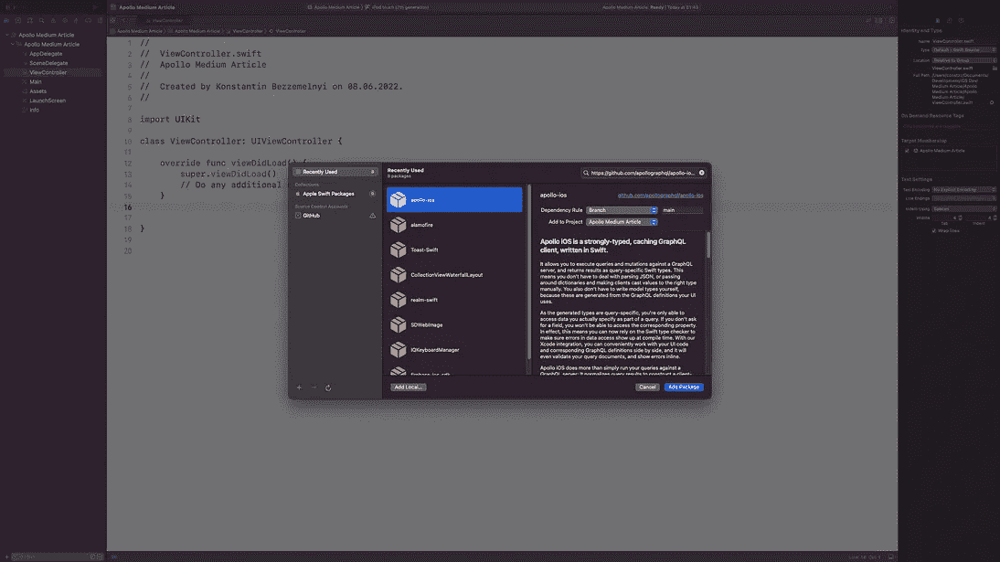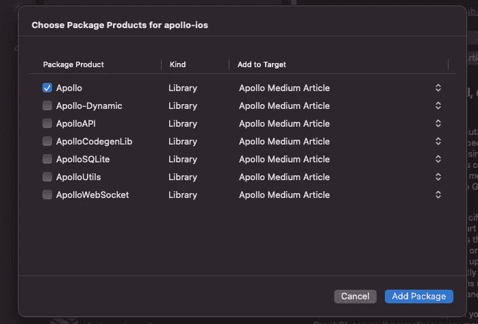

使用 SPM 连接 Apollo

除了 Apollo，SQLite 还会自动连接进行缓存

# 第二步。下载模式并设置构建阶段

点击链接进入[水果 API 游乐场](https://fruits-api.netlify.app/graphql)。

在右边的选项卡上，单击 SCHEMA，您可以查看 API 的模式类型和枚举。

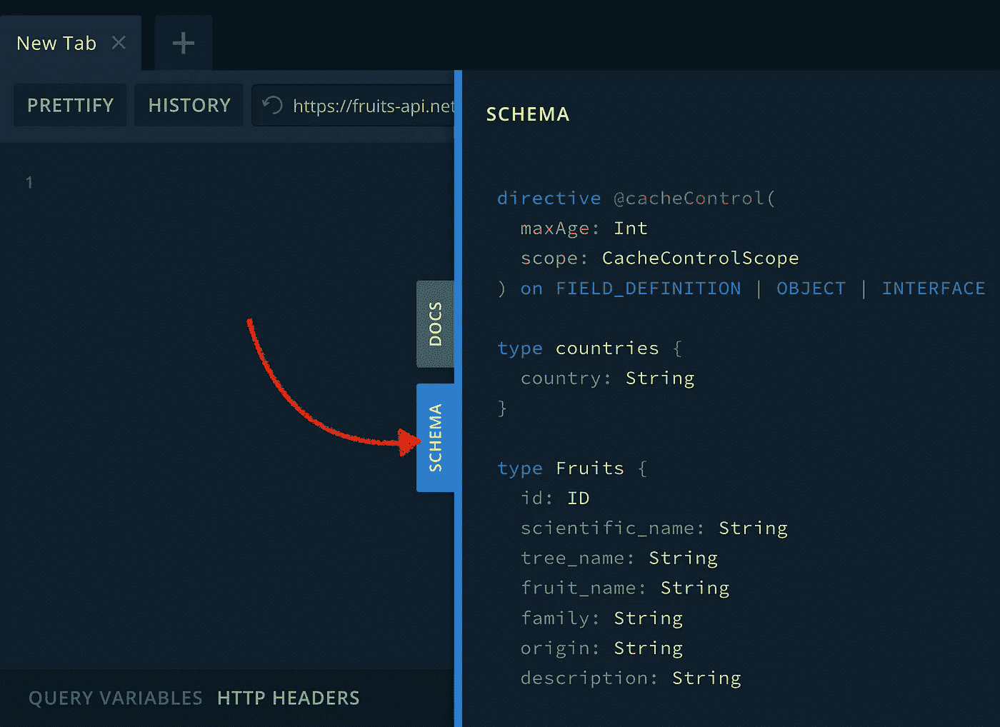

水果 API 游乐场

点按“下载”并将下载的文件添加到 Xcode 中。为方便起见，将其重命名为`schema.json`。

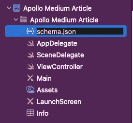

添加 schema.json

还有…还没有魔法😔。在使用 Apollo 之前，您已经设置了构建阶段。

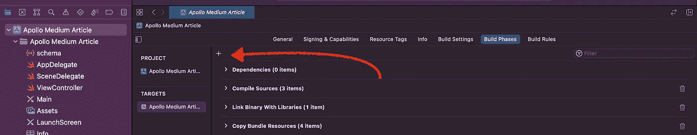

添加新脚本阶段

Go with: +>添加新的运行脚本阶段。将其重命名为阿波罗(或任何您喜欢的名称)。把它放在“编译源代码”阶段之前*。*

> 你可以从[这里](https://www.apollographql.com/docs/ios/installation/#5-add-a-code-generation-build-step:~:text=Add%20the%20contents,Manager%20Run%20Script)下载脚本，根据选择的包管理器。

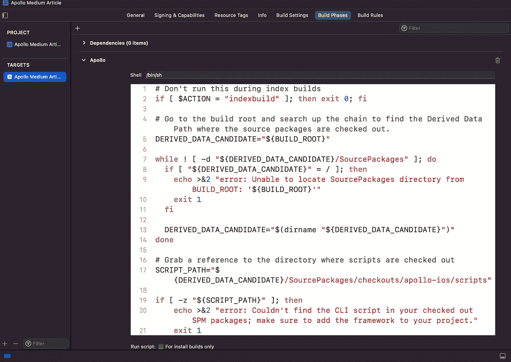

阿波罗运行脚本

最后一行(无论您使用哪个包管理器)是:

将模式转换为 Swift API 的命令

它将 JSON schema 转换成一个名为 API.swift 的 Swift 文件，带有数据类型和函数，您无需任何额外的设置就可以使用。

为了避免手动下载模式，让我们在 Apollo 运行阶段添加一个脚本。这将在我们每次构建项目时保持我们的模式与服务器同步。

在上面提到的将 schema 转换为 API.swift 的命令之前添加这一行:

构建我们的项目。它失败了…

照片由[马太·亨利](https://unsplash.com/@matthewhenry?utm_source=medium&utm_medium=referral)在 [Unsplash](https://unsplash.com?utm_source=medium&utm_medium=referral) 上拍摄

别担心，我们快到了。

要开始工作，Apollo 需要项目中至少有一个查询或变异。

# 第三步。在 API 的操场上设置查询

让我们回到水果 API 游乐场。这里有一个突变和查询列表，您可以创建:

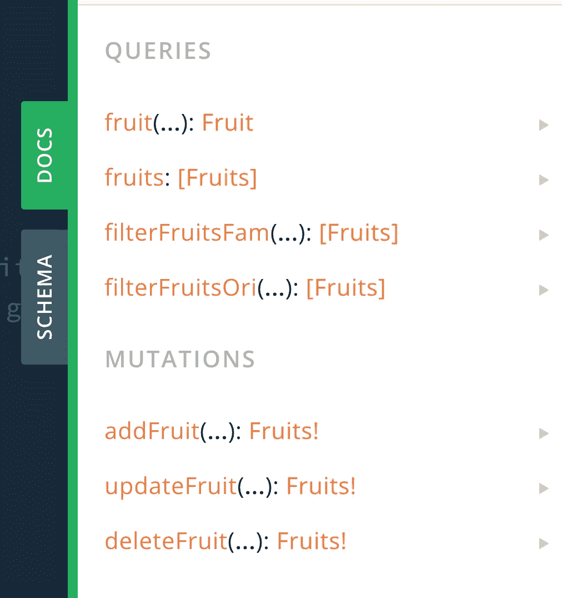

水果 API 游乐场(文件组)

我们假设需要获取 iOS 客户端上所有果树的列表。

开始编写一个*查询，*然后是一个您认为很好地描述了该查询将获得哪些数据的名称(我将使用 *GetAllFruits* )。

> 暗示💡:不要在查询名的末尾使用 query，因为 Apollo 会在生成 API.swift 文件时自动添加 query。

再次打开花括号，写下您想从水果对象中查询的所有字段。

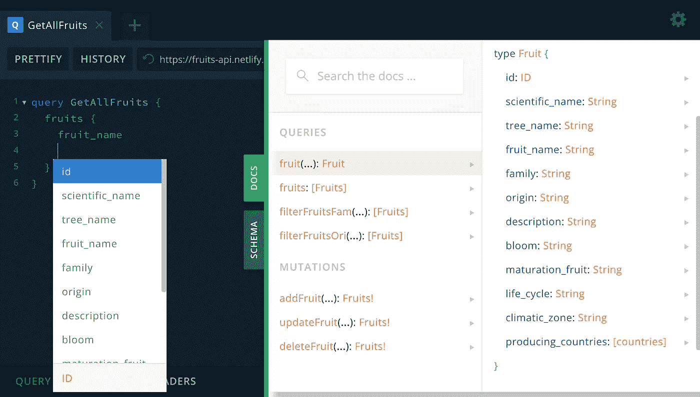

在水果 API 游乐场中设置查询

> 暗示💡:control +空格用于自动完成

我只想查询水果的名称。从操场上复制查询。

# 第四步。向 Xcode 添加查询

创建新的。Xcode 中包含查询的 graphql 文件。

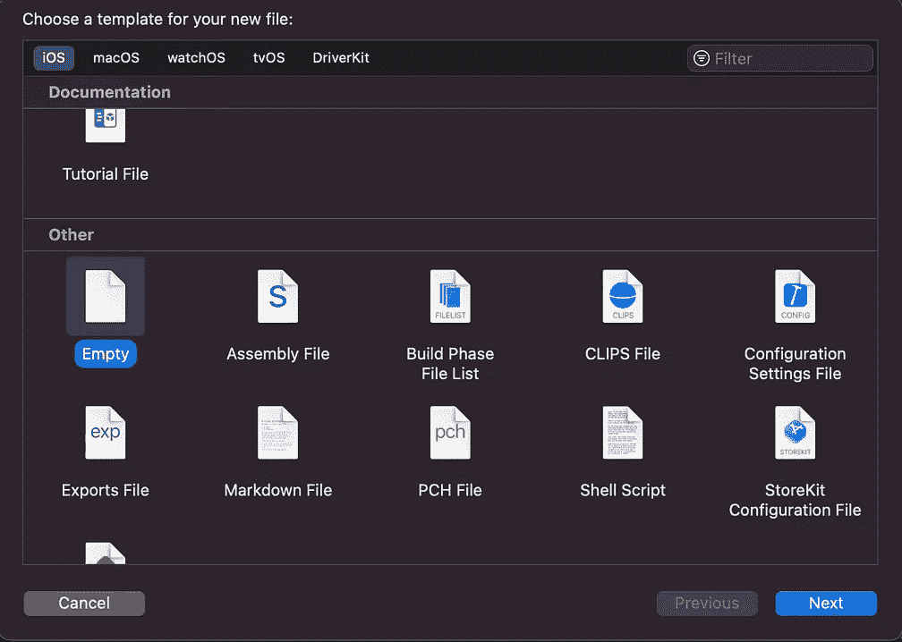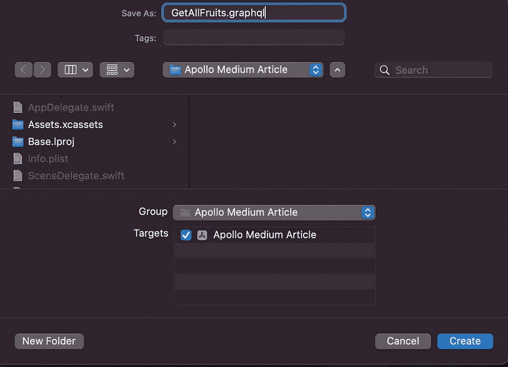

在 Xcode 中添加 GetAllFruits.graphql 文件

将查询粘贴到这里并构建项目。该建筑继承了🥳.

一切都很成功(如果你仔细按照说明做的话)。

但是`API.swift`文件在哪里？它已经在项目的根文件夹中。我们只需要将它添加到 Xcode 中(只需要手动添加一次)。

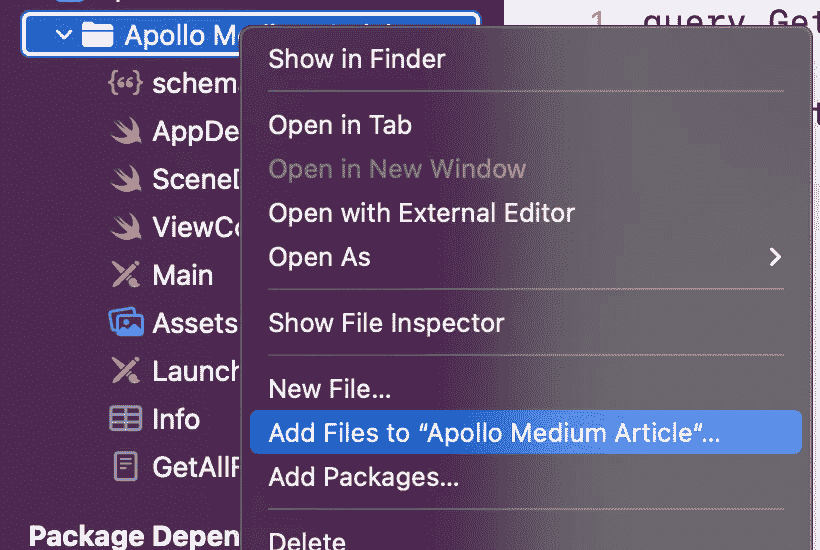

添加 API.swift 文件

按下添加文件…魔法就来了。您可以获得在 Swift 类和枚举中使用 API 所需的所有代码。

对于那些感兴趣的 API.swift 是自动生成的代码，基于所有。Xcode 项目中的 graphql 文件。

> 暗示💡:不要忘记将自动生成的文件添加到. gitingore 中。

# 第五步。用代码创建 Apollo 客户机并获取查询

是时候使用查询了。

让我们转到`ViewController`并编写一些代码:

代码简介:

1.  进口阿波罗。
2.  创建一个 Apollo 实例，并将端点(到 API 的链接)作为参数。
3.  使用 Apollo 客户端的 fetch 方法创建一个查询。
4.  处理结果。请求中可能有错误。或者当数据被接收，但是发生了 GraphQL 错误时的情况。
5.  展示结果。

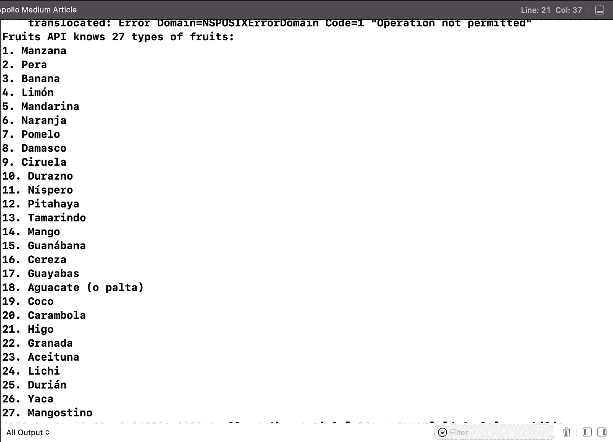

显示结果

我们成功地拿到了水果清单。

我希望你准备一个比 Xcode 控制台的日志更好的 UI。

我必须承认，我们没有手动添加任何数据类型，没有使用字典和不安全的数据类型转换。阿波罗客户做了所有的工作。

还有一个好处是，每次构建项目时，Apollo 都会检查服务器上是否有更改。如果是，它将下载模式并生成新的`API.swift`文件。当您处于开发的早期阶段并且模式在不断更新时，这尤其方便。

我希望你学到了一些新东西，这篇文章对你有用。

在我的下一篇文章中，我将介绍如何使用 Apollo 执行变异、使用订阅以及向请求添加头(以及令牌)。

如果您有任何不确定如何在 Apollo 中实现的问题，请告诉我，我会尽力帮助您。

感谢您的关注！