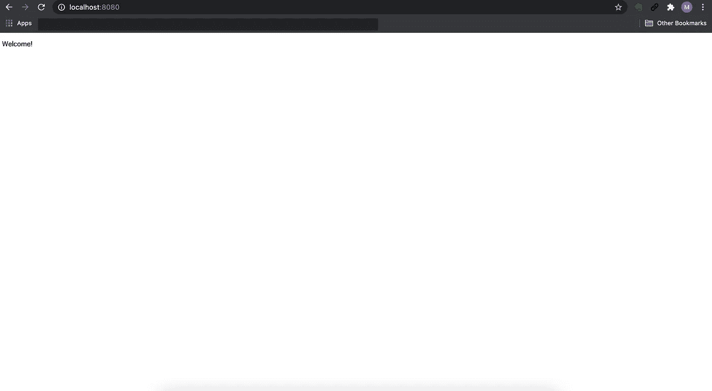
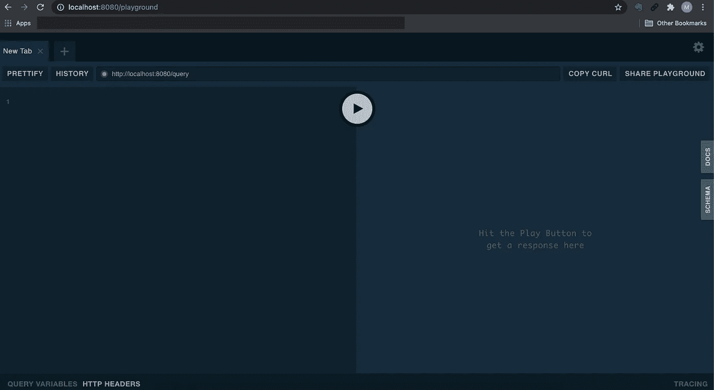
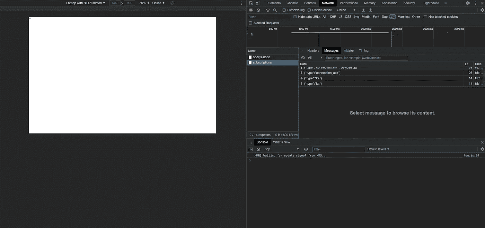
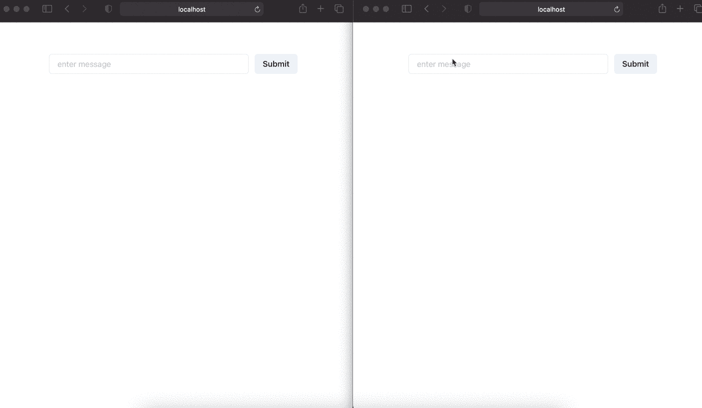

# 使用 Go 的 GraphQL 订阅

> 原文：<https://betterprogramming.pub/graphql-subscriptions-with-go-6eb25dec5cd1>

## 使用 GraphQL 订阅实现一个实时应用程序并运行


照片由 [Unsplash](https://unsplash.com/?utm_source=unsplash&utm_medium=referral&utm_content=creditCopyText) 上的 [israel palacio](https://unsplash.com/@othentikisra) 拍摄，经作者修改

在本文中，我将带您了解如何用 Go 实现 GraphQL 订阅。

# 属国

所需的依赖关系如下:

## 服务器端

*   [回声](https://github.com/labstack/echo)
*   [大猩猩/网络插座](https://github.com/gorilla/websocket)
*   [99 设计/gqlgen](https://github.com/99designs/gqlgen)

## 前端侧

*   [阿波罗/阿波罗客户端](https://github.com/apollographql/apollo-client)
*   [查克拉-ui/查克拉-ui](https://github.com/chakra-ui/chakra-ui)

# GraphQL 订阅

[GraphQL 订阅](https://www.apollographql.com/docs/react/data/subscriptions/)使您能够定期获取数据，而无需从客户端轮询。订阅通过 WebSockets 保持活动连接，并在检测到更新后立即通知您。

# Redis 流

在版本 2 中，Redis 提供了一个[发布/订阅](https://redis.io/topics/pubsub)特性，可以分离发布者和订阅者。通过使用这一点，发布者可以在一个通道上向任意数量的订阅者发送消息，而不需要知道有哪些订阅者。

在版本 5 中，Redis 提供了一个名为 [Redis Stream](https://redis.io/topics/streams-intro) 的新特性。

Redis 流的概念与 Redis 发布/订阅相关，但是在消费数据的方式上有一些基本的区别。它们之间的主要区别是存储消息的方式。在发布/订阅模式下，消息被发送，但从不存储。在流中，所有的消息都无限期地存储在流中，这允许不同的消费者通过记住上一个消息的 ID 来知道新消息是从哪个点开始的。

例如，在一个聊天应用程序中，你将能够从头看到所有的消息，并知道哪条消息是新的，即使你在中午进入房间。

在本文中，我们将把 Redis 流用于多个连接来共享数据。

# 实施概述

*   设置 Redis 服务器
*   设置回显服务器
*   设置图表 QL
*   在 GraphQL 中启用 WebSocket CORS
*   配置 Redis 客户端
*   实现 GraphQL 解析器
*   设置 React 应用程序

# 设置 Redis 服务器

首先，我们将使用 [Docker](https://www.docker.com/) 创建一个 Redis 服务器。

在`docker-compose.yml`中写入配置:

```
version: '3'
services:
  redis:
    image: redis:5.0.7
    volumes:
      - redis-data:/data
    ports:
      - '6379:6379'
volumes:
  redis-data:
    driver: local
```

并通过运行以下命令启动服务器:

```
docker-compose up
```

如果您遇到这样的消息:

```
...WARNING you have Transparent Huge Pages (THP) support enabled in your kernel. This will create latency and memory usage issues with Redis. To fix this issue run the command 'echo never > /sys/kernel/mm/transparent_hugepage/enabled' as root, and add it to your /etc/rc.local in order to retain the setting after a reboot. Redis must be restarted after THP is disabled....
```

您必须在一台虚拟机上为 Docker for Mac 配置它。

通过运行以下命令，在 Docker for Mac 上输入虚拟机:

```
docker run -it --privileged --pid=host debian nsenter -t 1 -m -u -n -i sh
```

把这个放到终端上:

```
echo never > /sys/kernel/mm/transparent_hugepage/enabled
echo never > /sys/kernel/mm/transparent_hugepage/defrag
```

退出终端并再次启动它:

```
docker-compose up
```

# 设置回显服务器

接下来，我们将使用 Echo 包设置一个服务器。

创建`main.go`并编写如下代码:

你可以在 [http://localhost:8080:](http://localhost:8080:) 看到`Welcome`页面



欢迎页面

# 设置 GraphQL

接下来，我们将使用 [gqlgen](https://github.com/99designs/gqlgen) 来设置 GraphQL。

要初始化包，请运行以下命令:

```
go run github.com/99designs/gqlgen init
```

这将在您的项目中生成以下布局:

```
├── go.mod
├── go.sum
├── gqlgen.yml
├── graph
│   ├── generated
│   │   └── generated.go
│   ├── model
│   │   └── models_gen.go
│   ├── resolver.go
│   ├── schema.graphqls
│   └── schema.resolvers.go
└── server.go
```

`server.go`应该是这个布局中的一个入口点，但是我们将删除它并将 gqlgen 处理程序放在`main.go`中:

导航到[http://localhost:8080/playground](http://localhost:8080/playground)，你会看到游乐场页面:



游乐场页面

为了简化`main.go`中的代码，我们将提取与路由到`infrastructure/router/router.go`相关的代码，并将其导入，如下所示:

# 在 GraphQL 中启用 WebSocket CORS

gqlgen 为 WebSocket 提供了现成的[传输，所以我们不需要配置它。](https://github.com/99designs/gqlgen/blob/3a31a752df764738b1f6e99408df3b169d514784/handler/handler.go#L28-L31)

然而，它不包括 CORS 实现，所以我们需要手动添加它。

为了做到这一点，让我们像这样添加`infrastructure/graphql/server.go`:

在本帖中，我们将接受来自客户的任何请求。

然后像这样导入到`main.go`中:

现在我们已经准备好在我们的服务器中建立一个 WebSocket 连接。

# 配置 Redis 客户端

接下来，我们将在应用程序中配置 Redis 客户机。

首先，像这样在`infrastructure/datastore/redis.go`中创建一个配置文件:

并在`main.go`中导入这个:

# 实现 Redis 流

接下来，我们将在应用程序中实现 Redis 流。

让我们像这样在`graph/resolver.go`中添加一些代码:

`SubscribeRedis`将通过一个通道监听 Redis 流并提供数据。

在本文中，我们将创建一个名为`room`的流来存储我们的数据。为了定期获取流中的数据，我们需要通过带有`BLOCK`选项的`XREAD`来监听流。使用 BLOCK 选项，流将在指定的时间内等待新的传入消息的添加。在这种情况下，我们指定了`0`，这意味着它将一直等到有消息进来。

要获取数据，我们需要指定 ID。在这种情况下，我们将为 ID 指定`$`，这意味着它将只在发出`XREAD`之后获得消息。

```
streams, err := r.RedisClient.XRead(&redis.XReadArgs{
   Streams: []string{"room", "$"},
   Block:   0,
}).Result()
```

转到`main.go`并运行订阅:

并在`infrastructure/router/router.go`中创建一条订阅路线，如下所示:

# 实现 GraphQL 解析器

对于服务器中的最后一步，我们将向模式中添加实现。

首先，转到`graph/schema.graphqls`，像这样添加模式:

并运行命令来生成解析程序。

```
go run github.com/99designs/gqlgen
```

这生成了基于我们上面定义的模式的函数`graph/schema.resolvers.go`。

让我们像这样给`graph/schema.resolvers.go`添加实现:

现在，我们已经准备好了服务器，可以定期向客户端提供消息。

# 设置客户端应用程序

为了快速开始，我们将使用 [Create React App](https://create-react-app.dev/docs/getting-started/) 来生成一个 React 应用程序。

在根目录下运行以下命令:

```
npx create-react-app frontend --template typescript
```

安装后，通过运行以下命令运行开发服务器:

```
yarn start
```

您将看到欢迎页面:


欢迎页面

# 建立一个阿波罗客户端

我们将使用 Apollo 客户端作为 GraphQL 的客户端模块。

让我们安装我们需要的软件包:

```
cd frontendyarn add @apollo/client graphql subscriptions-transport-ws
```

并在`frontend/src/lib/apolloClient.ts`创建一个 Apollo 客户端:

用`ApolloProvider`将`App`组件与客户端包装在一起:

当您启动前端服务器时，您将看到 HTTP 连接成功地升级了 WebSockets。



WebSockets 连接

# 实现组件

接下来，我们将创建一个组件来显示消息。

首先，我们将安装 Chakra UI 来创建我们的表单:

```
yarn add @chakra-ui/react @emotion/react @emotion/styled framer-motion
```

创建`src/Component.ts`并输入如下代码:

在第一次呈现中，我们将从查询中获取所有消息，然后启动订阅来获取新的消息。

并将其包含在`src/App.ts`中:

现在我们准备测试我们的应用程序。

让我们在浏览器中准备两个选项卡并提交一条消息。



测试

如您所见，两个选项卡同时显示消息。重新加载后，它显示 Redis 流中存储的所有消息。

现在我们已经实现了与 GraphQL 和 Redis Stream 的实时通信。

# 结论

现在我们已经介绍了如何使用 gqlgen 和 Redis Stream 实现 GraphQL 订阅。在前端，我们使用 Apollo 客户端实现了实时聊天服务。如果你按照那个教程，一步一步去实现，你会发现其实没那么复杂。

这里是[最终代码库](https://github.com/manakuro/golang-graphql-subscriptions)。

希望你觉得有用。