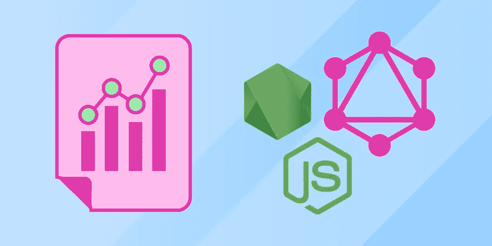

# GraphQL 教程:如何使用字段、片段等等

> 原文：<https://betterprogramming.pub/graphql-tutorial-how-to-use-fields-fragments-and-more-ec478896ede7>

## 使用 GraphQL 的基本和中级概念构建复杂的应用程序



来源:作者

随着现代公司越来越依赖数据来完成日常任务，数据查询和操作正经历着历史性的普及。企业正在寻找能够在大量复杂数据的情况下高效产生结果的候选人和技术。

GraphQL(图形查询语言)是许多公司正在寻找的答案。GraphQL 提供了用于复杂查询的工具和获取调用的少即是多方法，预计它将很快取代 REST API 格式，成为未来就业市场的查询语言。

今天，我们将探索 GraphQL 的关键部分，并向您展示如何在您自己的模式中实现每一部分。

**这是我们今天要讲的:**

*   GraphQL 是什么？
*   图表 QL 构建模块
*   中间 GraphQL 概念
*   接下来学什么

# 什么是 GraphQL

GraphQL 是一种用于 API 的查询语言，它包括一个服务器端运行时来执行查询。GraphQL 与 Node、Express 或 Apollo 等开源后端服务器软件一起使用。

GraphQL 由脸书在 2012 年开发，旨在减少 RESTful API 格式中常见的空字段和迂回提取调用的数量。

随着 GraphQL 的发展，该理念继续优先考虑减少任何行为的步骤数量。

REST API 在特定的 URL 存储对象，但是 GraphQL 有一个用户创建的**类型**系统，它通过定义该类型的每个对象将拥有的一组**字段**来充当模板。您可以创建许多相同类型的对象，每个对象在定义的字段中都有自己的值。

这类似于 Java 等 OOP 语言中类和对象的关系。

架构:

```
{
  data: {
    User: {
      name: "Jane Doe"
    }
  }
}
```

查询:

```
{
  query User {
    name
  }
}
```

在最简单的层面上，GraphQL 是向不同的对象询问特定字段的值。这里的优点是 GraphQL 总是确切地知道您需要什么信息，并且只返回您想要的数据。

GraphQL 允许您用复杂的查询超越这个简单的操作，这些查询可以导航嵌套的对象或使用对象突变修改获取的数据。

# GraphQL 构建模块

GraphQL 的基本构件是**模式**和**查询**。

**模式**:

GraphQL 模式概述了数据可以分成的类别或`type`。它还定义了每种类型将包含哪些信息。请将此视为显示数据库架构的蓝图。

```
type Book {
        id: ID
        title: String
        published: Date
        author: Author
    }
    type Author {
        id: ID
        name: String
        book: [Book]
    }
```

**查询**:

一旦你的数据被映射出来，你需要一种方法来获取它。GraphQL 查询通过遵循到数据端点的输入路由来请求数据。返回的信息被称为**有效载荷**。

这些可以是简单的请求，比如通过 ID 获取书名和作者。

```
type Query {
        book(id: ID): Book
        author(id: ID): Author
    }
```

查询也可能很复杂，比如询问姓名和简历，以及他们所写的所有书籍的名称。

```
{
        book(id: 100) {
            title
            isbn
            date
            author {
                name
                bio
                books {
                name
                }
            }
        }
    }
```

下面，通过学习 GraphQL 的一些更具体的元素来更深入地研究模式和查询。

## 菲尔茨

`field`本质上是一个保存值的特定于对象的属性。对象的父类型定义了对象必须具有的字段。每个字段在定义时都被设置为保存特定的数据类型，如`String`或`Enum`。

让我们来看一个例子:

```
type User {
   id: String!
   email: String!
   name: String
}
```

这里，我们有一个类型`User`，我们将使用它作为模板来表示单个用户。每个类型为`User`的对象都有三个字段:`id`、`email`和`name`。

字段还可以引用其他对象来创建不同类型对象之间的层次结构。例如，我们可以向我们的`User`添加一个`friends`字段，其中包含一个填充了其他用户姓名的列表。

```
type User {
   id: String!
   email: String!
   name: String
"friends": [
        {
          "name": "John Doe"
        },
        {
          "name": "Jane Doe"
        },
        {
          "name": "Guy Manson"
        }
}
```

> *这里的* `*!*` *表示该字段不能保存* `*null*` *的值。换句话说，每个用户必须有一个* `*id*` *和* `*email*` *，但是* `*name*` *是可选的。*

GraphQL 可以一次获取整个`friends`列表对象，或者遍历该对象来查找特定的数据。这个函数允许您在一个查询中获取大量相关的数据/对象。

## 争论

GraphQL 最有用的部分之一是可以将参数传递给查询中的任何字段或对象。与其他语言中的函数类似，字段接受参数，因为参数有一个名称和一个传递的值。然后，对象/字段将在引用参数名称的任何地方使用该值。

在 REST API 中，您只能发送查询参数和查询的 URL 段。GraphQL 的方法允许您跳过几个查询，将参数传递给任何东西，并在一个查询中接收所需的确切信息。

参数最常见的用途是过滤您在类型中查询的对象。例如，我们可以在接受`id`参数的`User`类型中包含`getUser`字段。由于每个用户都有一个特定的`id`，这将允许我们轻松地获取关于特定用户的信息。

```
{
  getName(id: "1010") {
    name
  }
}
```

## 别名

如果我们用不同的参数查询同一个字段，GraphQL 将抛出一个错误。假设我们有自己的`user`对象，并希望通过一个已实现的“subscriptionStatus”参数来过滤它们。

```
query getUsers {
  user(subscriptionStatus: SUBSCRIBED) {
  id
  email
  name
  }
  user(subscriptionStatus: UNSUBSCRIBED) {
  id
  email
  name
  }
}
```

这将抛出一个错误，因为后面对`users`类型的查询将覆盖前面的查询。

```
message: "Fields "user" conflict because they have differing arguments. Use different aliases on the fields to fetch both if this was intentional."
```

正如错误所说，我们需要为这些查询设置**别名**来同时获取这两个。您可以将别名视为一个类型中特定子组的昵称。

我们将为`subscriptionStatus`为`SUBSCRIBED`的用户对象设置别名`subscribers`:

```
query getUsers {
  subscribers: user(subscriptionStatus: SUBSCRIBED) {
  id
  email
  name
  }
```

我们可以稍后使用`subscribers`别名作为快捷方式，随时查询`user`的这个子组。别名是将更广泛的类型划分为更具体的组的有效方法，您将经常一起查询这些组。

# 中间 GraphQL 概念

## 碎片

在复杂的应用程序中，您可能会有几个引用相同字段的操作。简而言之，GraphQL 包含了**片段**，允许您包装一组字段，以便在不同的查询中重用。片段是为一个对象类型定义的，比如`User`，它们可以在任何以这些对象为特征的操作中使用。

下面，我们将重新制作之前的参数示例，但这次用我们的`AccountInfo`片段替换相同的字段。

没有碎片:

```
query getUsers {
     subscribers: user(subscriptionStatus: SUBSCRIBED) {
  id
  email
  name
  } nonSubscribers: user(subscriptionStatus: UNSUBSCRIBED) {
  id
  email
  name
  }
```

**带片段:**

```
query getUsers {
     subscribers: user(subscriptionStatus: SUBSCRIBED) {
  id
  ...AccountInfo nonSubscribers: user(subscriptionStatus: UNSUBSCRIBED) {
  id
  ...AccountInfo
  }fragment AccountInfo on User{
  email
  name
}
```

这两个代码段完成相同的行为。片段的优点是它们简化了我们的查询可读性，并允许我们模块化查询以便重用。

## 变量

有时，我们希望在查询中包含动态参数选项，比如在创建搜索栏时。GraphQL 允许使用**变量**的动态参数。变量充当占位符，指向成对的 JSON 文件中的一个字段。

要实现一个变量，我们必须做三个改变:

*   用可变锚点替换静态参数，`$subscriptionStatus: Subscription`
*   将`$subscriptionStatus`声明为查询接受的变量之一
*   在单独的变量字典文件(通常是 JSON)中传递`Subscription: value`

查询:

```
query getUsers ($subscriptionStatus: Subscription) {
    user(subscriptionStatus: $subscriptionStatus) {
  id
  ...AccountInfo
    }
}
```

变量字典:

```
"subscriptionStatus": "SUBSCRIBED"
```

现在，我们可以通过简单地改变变量字典中`subscriptionStatus`的值来改变我们在整个程序中分析的用户组。

因此，变量允许您的查询具有适应性，并拓宽了行为的可重用性。

## 突变

查询让您获取数据，而**突变**让您创建、更新或删除服务器端数据。您可以将突变视为来自 REST API 的`POST`的 GraphQL 等价物。

要实现变异，您需要设置字段名和它将接受的参数。想象一下，我们正试图添加一个突变，使我们能够创建更多的`User`对象。我们需要创建一个变异查询，它将接受帐户创建的所有基本信息:

```
mutation createUser(email: String!, password: String!) {
   createUser(email: $email, password: $password) {
      id
      email
      password
}
```

首先，我们声明`createUser`将是一个突变，并接受名为`email`和`password`的参数。然后在**第 2 行**中，我们声明这些参数将用于填充下面单独的`email`和`password`字段。

在*细粒度*和*粗粒度*之间存在变异，前者意味着它只编辑几个特定的字段，后者编辑整个类型。

## 指令

有时我们只想在特定条件下获取字段的值。为此，我们可以使用**指令**，它告诉服务器跳过或包含一个字段。指令总是包括一个类似`if`的条件语句和一个布尔变量。

有了这个特性，您可以跳过复杂的字符串操作，或者允许您在 UI 读数上实现“显示更多”按钮。

两种类型的基本指令充当逻辑开关。如果布尔值为真，则每个指令都激活，以避免双重否定；`include`表示当布尔值为`true`时显示该字段，当布尔值为`true`时`skip`表示不显示该字段。

*   `@include(if: Boolean)`仅当参数为`true`时，才在结果中包含该字段。
*   `@skip(if: Boolean)`如果参数为`true`，则跳过该字段。假设我们想获取用户数据，但只希望在特定设置被选中时包含电子邮件地址。

查询:

```
{
query getUsers {
User {   
   name
   email @include(if: $showEmail)
  }
}
```

变量字典:

```
"showEmail": true
```

# 接下来学什么

既然您已经看到了 GraphQL 的所有基本功能，那么您就可以探索更高级的概念了，比如解析器或者将 GraphQL 与后端软件相结合。

随着越来越多的企业采用数据驱动的方法，对 API 和数据操作的需求正在上升。现在是提升 GraphQL 技能的最佳时机。

*快乐学习！*