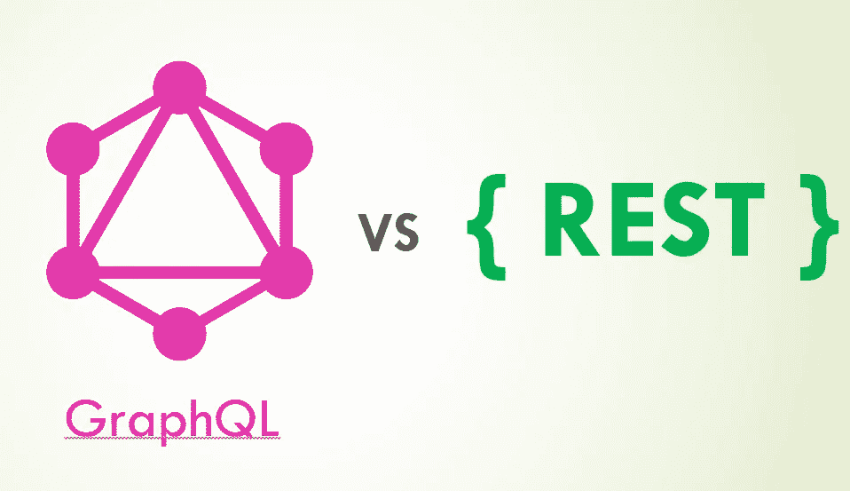
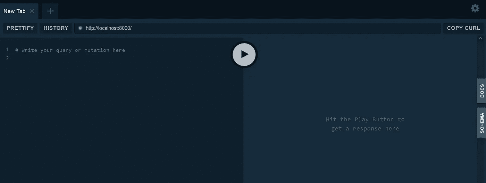

# GraphQL 与 Rest API:Python 中的数据提取

> 原文：<https://betterprogramming.pub/graphql-vs-rest-api-data-fetching-in-python-9df76d8eead7>

## 两种方法的对比



作者图片

在本文中，您将了解 GraphQL 和 REST 在获取数据方面的主要区别。代码片段将作为两种方法的并列参考提供。

供您参考，REST 指的是 API 中的`representational state transfer`架构，它遵循以下设计原则:

*   `uniform interface` —对相同资源的所有请求属于一个统一资源标识符(URI)。
*   `client-server decoupling` —客户端和服务器相互独立，通过 HTTP 端点连接。
*   `statelessness` —每个请求必须包含处理所需的相关信息。
*   `cacheability` —为了性能和可伸缩性，资源应该尽可能可缓存。
*   `layered system architecture` —它必须以这样一种方式设计，即客户机和服务器都不知道它是与终端应用程序通信还是与它们之间的中间中间件通信。

另一方面，开发 GraphQL 是为了解决通过 REST 架构获取数据时的一些主要问题。主要目标是在从各种数据源获取大量数据时需要更高的效率和灵活性。总的来说，它解决了以下问题:

*   `over-fetching of data`—指客户端下载的数据超过需求的情况。例如，调用`employee`端点将返回一个 JSON 数组，其中包含与雇员相关的所有信息(姓名、年龄等。).响应可能包含对客户端无用的不必要信息。
*   `under-fetching of data` —当特定端点没有提供所需的所有信息时发生。在这种情况下，客户端必须调用多个端点来检索所有相关信息。例如，为了获得雇员和供应商的信息，客户端可能需要调用`employee`和`supplier`端点。

GraphQL 不是 REST 的替代品，因为两者各有优缺点。它是一种替代架构，为某些用例提供了灵活性和效率。

# 问题陈述

假设您正在构建一个向客户端提供以下数据的后端:

*   员工的详细信息
*   所有可用产品的详细信息
*   供应商的详细信息

理论上，对于上面的问题陈述，在一个数据库中应该有三个表。为了保持简洁，让我们创建一个新的 Python 文件作为假数据库。将文件命名为`data.py`，并在其中添加以下代码:

它包含了我们问题陈述中每一项的三个列表。此外，代码还定义了三个相应的函数，可以直接从 GraphQL 和 REST 服务器调用。每个函数接受一个`id`输入参数并返回匹配的数据。如果没有定义`id`，它将返回列表中的所有数据。

# 设置

现在，让我们安装本教程所需的所有 Python 包。强烈建议您在继续安装之前创建一个新的虚拟环境。激活它，并按照以下说明操作:

## FastAPI

我们的 REST API 将使用 FastAPI 框架构建。运行以下命令进行安装:

```
pip install fastapi
```

## 阿里阿德涅

本教程使用 [Ariadne](https://ariadnegraphql.org/docs/intro) 来实现 GraphQL。您可以将其作为独立的 WSGI 或 ASGI 服务器。按照以下方式安装:

```
pip install ariadne
```

事实上，FastAPI 确实通过 graphene 提供了 GraphQL 支持，而 graphene 以前是由 Starlette 支持的。然而，正如[官方文档](https://www.starlette.io/graphql/)中所指出的，从 0.15 版本起，GraphQL 支持将被弃用。

Python 中提供 GraphQL 支持的其他第三方库如下:

*   [tartiflette-asgi](https://tartiflette.github.io/tartiflette-asgi/)
*   [草莓](https://strawberry.rocks/docs/integrations/asgi)
*   [星形石墨烯 3](https://github.com/ciscorn/starlette-graphene3)

## 紫玉米

除此之外，您还需要一个 ASGI 服务器来服务 FastAPI (REST)和 Ariadne (GraphQL)服务器。您可以通过以下命令安装它:

```
pip install fastapi
```

在接下来的小节中，您将实现 REST 和 GraphQL 服务器。它们提供相关的端点供假设的客户使用。让我们从 FastAPI 服务器开始。

# FastAPI (REST)

用下面的代码创建一个名为`restapp.py`的新文件:

数据是从我们之前定义的`data.py`中获得的。

它将有三个 GET HTTP 端点:

*   雇员
*   产品
*   供应者

每个`employee`数据点仅包含以下内容:

*   姓
*   名字
*   年龄

您可以进一步扩展`employee`端点，添加另一个名为`fullName`的字段，它表示雇员的全名。这将在后面用来说明 REST 和 GraphQL 在数据处理方面的区别。

## 运行服务器

保存文件并运行以下命令来启动 REST 服务器:

```
uvicorn restapp:app
```

## 测试 GET 端点

打开浏览器，转到以下 URL:

```
http://localhost:8000/employee
```

由于没有说明`id`，您应该得到所有员工的数据如下:

```
[
  {
    "id": 1001,
    "firstName": "John",
    "lastName": "Doe",
    "age": 28,
    "fullName": "John Doe"
  },
  {
    "id": 1002,
    "firstName": "Bob",
    "lastName": "McBobby",
    "age": 45,
    "fullName": "Bob McBobby"
  }
]
```

## 测试 id 为的 GET 端点

接下来，让我们尝试使用`id`进行访问:

```
http://localhost:8000/employee?id=1001
```

服务器将使用与给定的`id`相匹配的员工数据进行响应:

```
[
  {
    "id": 1001,
    "firstName": "John",
    "lastName": "Doe",
    "age": 28,
    "fullName": "John Doe"
  }
]
```

请注意，返回的响应包含与员工相关的所有信息。在实际的用例中，您可能有几十或几百个字段，如果客户端只打算获取几个特定的字段，这是一种资源浪费。这就是我们所说的数据过度提取。

此外，如果客户机应用程序需要雇员、产品和供应商的详细信息，它必须调用三个不同的端点。这个问题被称为数据提取不足。

# 阿里阿德涅语

让我们实现相应的 GraphQL API，它返回与 REST 服务器相同的数据。因为 GraphQL 是一个强类型系统，所以您必须定义模式作为客户机和服务器之间的契约。

## (计划或理论的)纲要

在这种情况下，您可以将其定义如下:

## 下决心者

在 GraphQL 中，只有一个端点，您必须创建[解析器](https://ariadnegraphql.org/docs/resolvers)来确定如何返回数据。看看下面的例子，它说明了`employee`的解析器:

```
# Map resolver functions to Query fields using QueryType
query = QueryType()# Resolvers are simple python functions
@query.field("employee")
def resolve_employee(_, info, id=0):
    return data.get_employee(id)
```

随后，您也可以为自定义字段构建解析器函数。例如，您可以使用以下代码片段创建一个名为`fullName`的新字段:

```
# Map resolver functions to custom type fields using ObjectType
employee = ObjectType("Employee")@employee.field("fullName")
def resolve_person_fullname(person, *_):
    return "%s %s" % (person["firstName"], person["lastName"])
```

完成所有解析器后，只需调用`make_executable_schema`并传入所有的`QueryType`和`ObjectType`变量:

```
# Create executable GraphQL schema
schema = make_executable_schema(type_defs, query, employee)# Create an ASGI app using the schema, running in debug mode
app = GraphQL(schema, debug=True)
```

您可以在以下要点中找到 GraphQL 服务器的完整代码:

## 运行服务器

将代码保存为`graphqlapp.py`，并在您的终端中运行以下命令:

```
uvicorn graphqlapp:app
```

如果您正在运行 REST 服务器，您可以选择关闭服务器并使用另一个端口运行 GraphQL:

```
uvicorn graphqlapp:app --port 8001
```

在浏览器中访问以下 URL，启动一个名为 GraphQL Playground 的交互式网页(相应地修改端口):

```
http://localhost:8000/
```

## GraphQL 游乐场

您应该会看到以下用户界面:



作者图片

它允许您在 GraphQL 服务器上测试任何查询。在左侧写下以下查询，并点击`play`按钮:

```
{ employee { fullName } }
```

您应该得到以下输出:

```
{
  "data": {
    "employee": [
      {
        "fullName": "John Doe"
      },
      {
        "fullName": "Bob McBobby"
      }
    ]
  }
}
```

服务器将只返回您指定的内容。在这种情况下，它只返回了`employee`的所有`fullName`。

让我们尝试另一个带有`id`的查询。这一次，设置为返回`fullName`和`age`为`id 1001`。

```
{ employee(id: 1001) { fullName age } }
```

输出如下所示:

```
{
  "data": {
    "employee": [
      {
        "fullName": "John Doe",
        "age": 28
      }
    ]
  }
}
```

如果您想获得员工、产品和供应商的数据，您可以在一个查询中完成:

```
{
  employee(id: 1001) { fullName age }
  product { name price }
  supplier { name address }
}
```

服务器将返回以下响应:

```
{
  "data": {
    "employee": [
      {
        "fullName": "John Doe",
        "age": 28
      }
    ],
    "product": [
      {
        "name": "Tofu",
        "price": 12.7
      },
      {
        "name": "Chocolate",
        "price": 18.2
      },
      {
        "name": "Pepper Sauce",
        "price": 23.3
      }
    ],
    "supplier": [
      {
        "name": "Tokyo Sweet",
        "address": "7-11 Akimai Mushi-shi"
      },
      {
        "name": "New England",
        "address": "85 King's Street"
      }
    ]
  }
}
```

如您所见，这就是本文前面提到的灵活性和效率。只有一个端点，客户端可以通过传入相应的查询来获得所需的所有数据。不会出现数据提取过量或不足的情况。

这类似于查询 SQL 数据库:

```
SELECT fullName, age from employee WHERE id=1001
```

但是，GraphQL 不支持通过其规范中的通配符查询某个类型的所有字段。在 SQL 中，您可以使用星号作为通配符来获取所有列，如下所示:

```
SELECT * from employee WHERE id=1001
```

在 GraphQL 中，您必须显式定义所有字段。这个问题很久以前就被提出来了，开发者之间也有过[激烈的争论](https://github.com/graphql/graphql-spec/issues/127)。在撰写本文时，该功能还没有解决方案。

## GraphQL 的缺点

与 REST 架构相比，GraphQL 确实有自己的缺点。如果输出数据的结构未知，或者您有非常复杂的嵌套结构数据，那么创建相应的模式和解析器将是一场噩梦。相比之下，在使用 REST 架构时，您可以简单地将整个字典返回给用户。客户端将自行决定如何使用它。

除此之外，GraphQL 的学习曲线比 REST 要高得多。如果您打算在 GraphQL 中构建用于创建、更新和删除数据的 API，您需要学习另一个名为`Mutation`的概念。

# 结论

让我们回顾一下你今天所学的内容。

本文首先简要解释了 GraphQL 和 REST 架构的基本概念和原理。

然后，它将重点放在一个简单的问题陈述上，并提供了一个示例假数据库，供本教程后面使用。

REST 和 GraphQL 服务器的实现将在随后的章节中介绍，并比较了 REST 和 GraphQL 查询数据的不同之处。

最后，探讨了 GraphQL 的不足之处。

感谢你阅读这篇文章。希望在我的下一篇文章中再次见到你。祝你有美好的一天！

# 参考

1.  IBM —什么是 REST API？
2.  [阿里阿德涅— Python GraphQL](https://ariadnegraphql.org/)