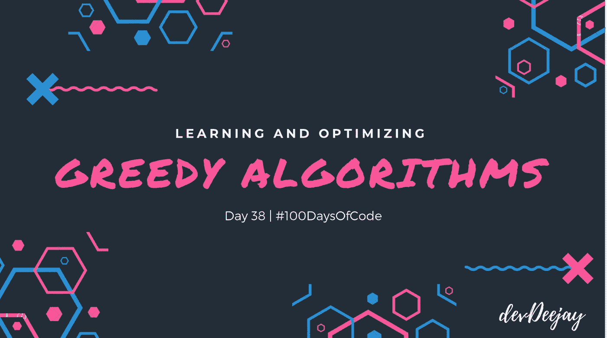
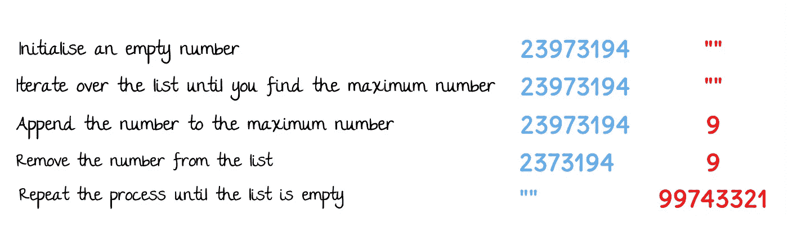
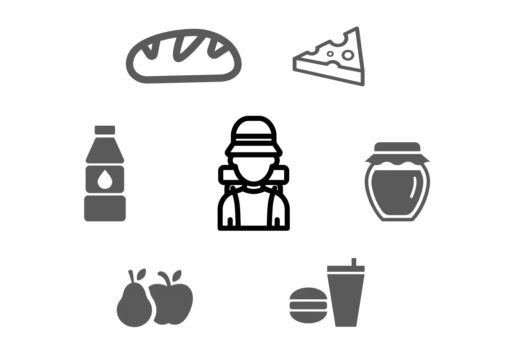

# 贪婪算法

> 原文：<https://betterprogramming.pub/greedy-algorithms-79d0ed19aef9>

## # 100 天代码的第 38 天

## 学习和优化算法——第 3 部分

嘿，很高兴看到你对这个话题感兴趣。我们将从简单到复杂的问题陈述，并按照贪婪的方法来解决它们，因此它们被称为*贪婪算法*。

# 1.最大数问题

问题陈述:给你一组数字，你必须找出通过重新排列这些数字可以得到的最大数字。

你会怎么做？

你可以简单地以递减的方式重新排列数字，因此你会得到最大的数字。

让我们创建一个算法来做同样的事情。

# 2.最低加油量

问题陈述:你的汽车加满油可以行驶 x 公里，你必须从 a 到达 B，你必须以最少的加油次数到达目的地。

如果你想这样做，你有三个选择。

第二个似乎是最好的，而不是冒险在我们的燃料将耗尽的地方找到一个加油站。

让我们看看算法，我们开始我们的旅程，并前往最远的加油站，我们可以做到这一点。

然后，从那里，我们再次重复上述过程，并达到尽可能最远的加油站。我们重复这个过程，直到我们到达目的地。

注意到这里发生了什么吗？

*   我们首先做出一个贪婪的选择(到达尽可能远的加油站)。
*   这样，我们把问题简化成子问题。(把我们的旅程分成多个加油站。)
*   然后，我们在给定的时间内迭代子问题(到达可能最远的加油站)。

## **实现算法**

为了便于理解，我已经初始化了变量的值，并且我已经尽可能地保持代码的可读性，因为我关心你。

如果你看到两个嵌套的循环，你会发现理论上的复杂度是 O(n)。有趣的是，结果是 O(n) 正如我们可以看到的，我们不会一遍又一遍地迭代和计算所有的子数组。

当我们在嵌套循环中迭代数组时，一旦我们打破它，我们从那里继续外部循环，因此两个循环一起在一次迭代中线性地覆盖整个数组，因此是 O(n)。

# 对贪婪方法的观察

正如我们所看到的，我们将问题分解成*个更小的类似子问题*并解决它们，直到整个问题得到解决。我们分析问题并提出一些安全策略。

如果我们的策略不安全，就像上面例子中的“旅行直到我们耗尽燃料”，我们的算法将失败，因此，在最初的分析之后，想出一个*被证明安全的*移动是必不可少的，否则你将会失败而一事无成。

让我们挑选一些更复杂的问题来更好地理解贪婪算法。

# 3.学生分组问题

问题陈述:你有一个大厅，里面坐满了不同年龄的孩子和不同的老师。

*   你必须把这些孩子/学生分成一组，其中任何两个学生的年龄差最大为 1。
*   你的老师数量也是有限的，因此，你应该组建尽可能少的小组。
*   然后，您将分配一名教师到一个小组进行教学。

## 简单的解决方案

*   你创建一个由所有可能的学生组合组成的小组。
*   迭代每个组，看看最大年龄和最小年龄之间的差是否为 1，否则我们丢弃该组。
*   这种方法将采取 2^n 运算，因此，我们的算法是非常缓慢的 0(2^n).

## 贪婪的方法

*   在数组 0(nLogn)中从最小到最大对年龄进行排序。
*   遍历数组，对每个元素加+1 来构建范围。
*   然后，迭代下一个元素，看看哪些数字落在这个范围内。把他们分成一组。
*   然后，从最后一组数字 0(n)向右移动到下一个数字。
*   重复这个过程。

因此，类似于前面的最小加油量问题，如果年龄以排序的方式给出，我们发现了一个 O(n)的方法，否则，如果你包括排序的数字，它是一个 O(nlogn ),这仍然是一个比 O(2^n 大的改进，这是一个巨大的差异。

# 4.分数背包

想象一下，你必须计划一次长途旅行，而你有一个背包来装你需要携带的多种物品。

由于你的背包容量有限，你决定携带不同数量的不同所需物品，但最终目标是最大限度地增加你从装满的背包中摄入的热量。

这又是一个最大化问题，我们试图找出能给我们带来最大价值的食物组合。

让我们假设 Q 代表体重，而 V 代表食物的价值，以卡路里的摄入量来表示。

*   我们重复以下步骤，直到我们的背包装满。
*   我们可以通过将重量除以价值，即 V/W，找出最有价值的水果。
*   用这个最有价值的产品(MVP)装满背包。
*   我们可以将该产品部分或全部装入背包。如果我们能够完全填满，并且仍然有空间存放其他物品，那么找出下一个最佳 MVP，并重复这些步骤。

理论上，我们已经找到了一个可行的解决方案，并且有一个将问题分解成小问题的重复过程，因此，我们有了一个贪婪算法。

## 实现算法

该算法的时间复杂度为 O(n)，因为在`indexOfMaxValue`和`findMVPs`中有一个`while`循环和一个`for`循环。

我们能对此进行优化吗？耶！

我们可以按价值/重量比的降序排列这些项目。这将花费 O(N log N)来对项目进行排序，然后我们可以简单地以降序选择项目，直到背包装满，因此，我们的解决方案为 O(N log N)。

# 结论

今天，我们学习了如何使用贪婪的方法将问题分解成相似的子问题，从而帮助你提出更有效的解决方案，而不是简单的暴力方法。

希望你觉得这篇文章有价值，内容丰富。感谢阅读。