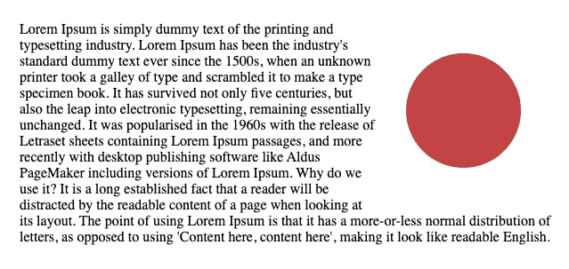
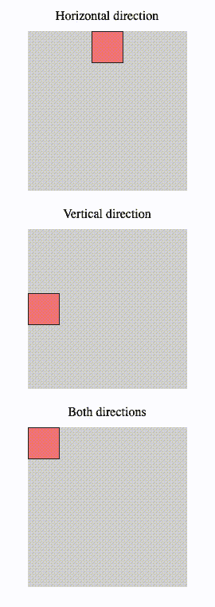
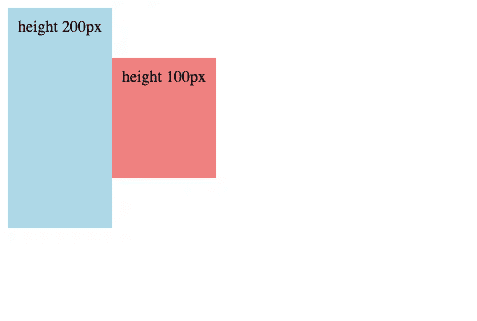
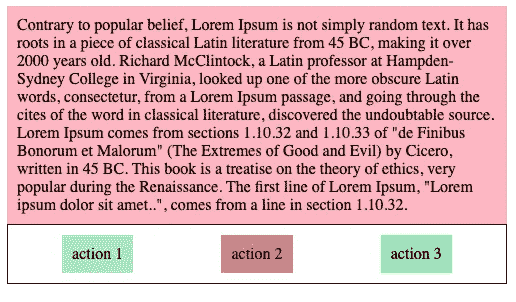
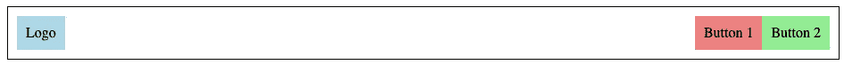
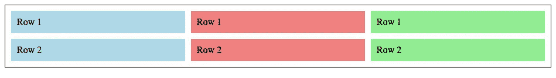
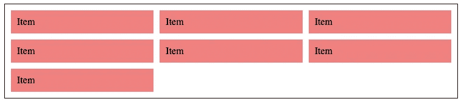
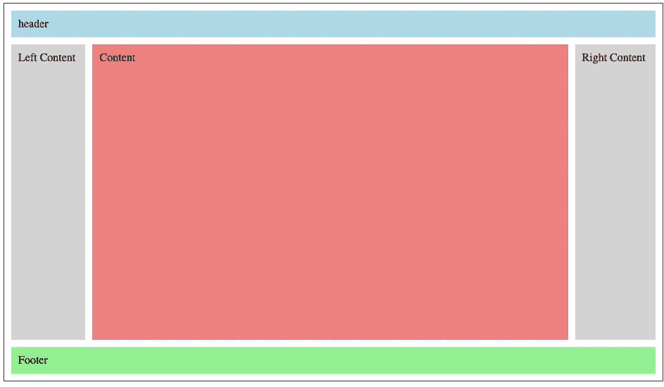
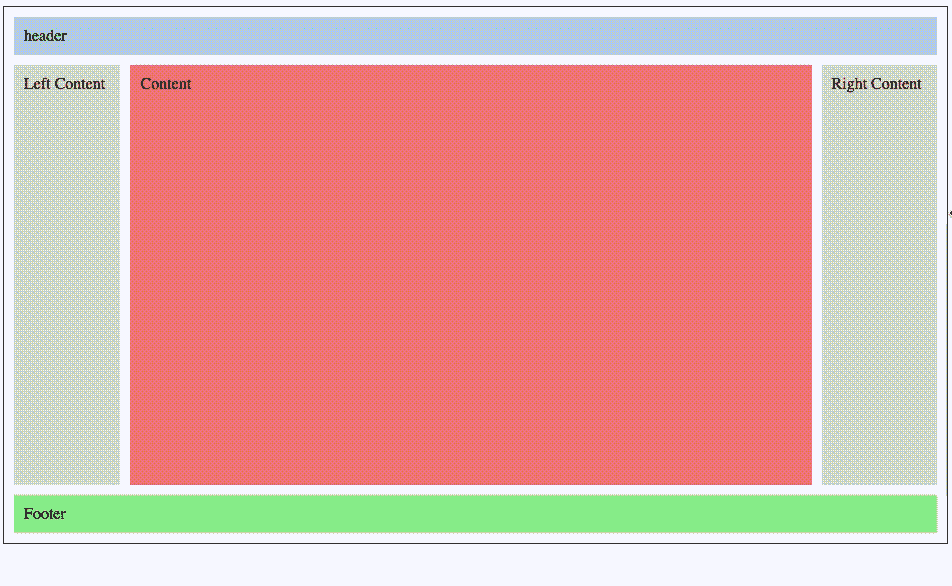
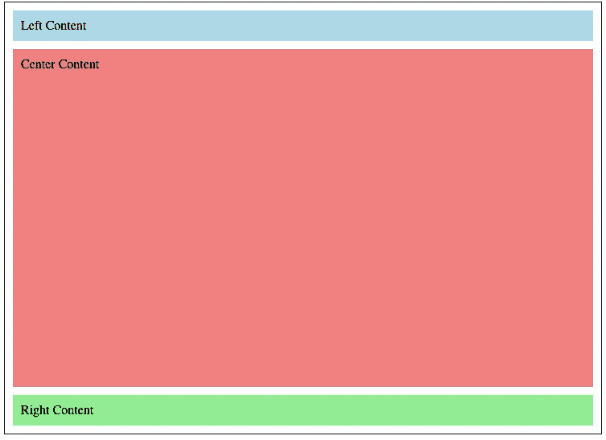

# Grid 和 Flexbox——你应该使用哪一个？

> 原文：<https://betterprogramming.pub/grid-vs-flexbox-which-one-should-you-be-using-471cb955d3b5>

## 为正确的工作寻找正确的工具的旅程

照片由[潘卡杰·帕特尔](https://unsplash.com/@pankajpatel?utm_source=medium&utm_medium=referral)在 [Unsplash](https://unsplash.com?utm_source=medium&utm_medium=referral) 上拍摄

Flex 和 Grid 是浏览器布局史上最受欢迎的变化:

*   Flexbox 第一份工作草案于 2009 年 7 月 23 日发布。11 年后，令人惊讶的是对它的支持直线上升:大约有`99.2%`种浏览器支持它的使用。
*   网格最初由微软团队起草，并于 2011 年发布到 Internet Explorer 10 中。如今它有强大的浏览器支持:`96%`。然而，网格在不断发展，增加了像`subgrid`这样的功能，这些功能可能只在一小部分浏览器中可用。检查您正在使用的所有网格特性以了解其支持级别总是明智的。

# Flex 和 Grid 出现之前的生活是怎样的？

简而言之:这是一场彻头彻尾的噩梦！如果没有这些，就需要许多黑客来实现非常简单的设计。最常用的工具是`Float`。它一直被用来将项目向右、向左、垂直等方向对齐。CSS 浮动本来是用于图像周围的文本的。现在这个单独的目的仍然有效，如果你想达到那个效果，你应该使用它。

CSS 浮动的完美用例

幸运的是，Grid 和 Flex 帮了大忙:Flex API 非常通用且易于使用，你可以看到它是少数移植到 React Native 的 CSS 特性之一。你可以查看 React Native [文档](https://reactnative.dev/docs/flexbox)，了解他们是如何实现的信息。Flex 的唯一问题是缺少了一些功能，即使你可以用它做几乎所有的事情，你仍然需要使用一些 UI 技巧来处理一些复杂的布局。当 CSS Grid 开始发挥作用时，那些黑客的日子已经结束了，就像不久前 float 发生的那样。现在我们手中拥有了所有我们能梦想到的工具。只是知道何时何地使用它们的问题。

# 何时在网格上使用 Flex

一般来说，Grid 是容器，Flex 是内容。Flex 是一维布局系统，而 Grid 是二维布局系统。那是什么意思？这意味着 Grid 可以在两个方向上排列项目，而 Flex 只能在一个方向上。简单地说，使用网格可以实现更复杂的布局。

在下面的例子中，你会明白我的意思:Flex 可以通过使用`flex-direction: column / row` *垂直或水平扩展。*(是的，项目可以换行到下一行或下一列，但这只是没有足够空间的副作用。)然而，网格可以在 X 和 Y 轴上随意扩展:

演示:水平使用 Flex，垂直使用 Flex，两个方向都使用 Grid

另一个关键区别是 Flex 是内容优先的，而 Grid 是布局优先的。那是什么意思？Flex 将根据内容决定位置，而 Grid 将根据给定的布局决定位置。Flex 更加严格，它的逻辑扩展到子节点，而 Grid 则全部放在父容器中。一些位置信息可以在子网格中找到，例如`grid-row`和`grid-column`，但是这并没有改变它的布局。

概括一下:我们已经看到网格更加动态、更加现代、功能更加丰富。那么，我们应该一直使用它吗？不，让我们来分解一下您希望使用 Flex 的最常见的场景。

# 推荐的 Flex 用例

## 1.内容对齐

在过去，垂直排列项目是相当费时费力的事情，而且非常脆弱。现在做起来超级简单。只要有一个 Flex 容器 div 并告诉项目如何对齐，就可以了！对于这个特殊的例子，您需要使用`align-items`属性。在这种情况下，它会将它们垂直居中。这对于带有图标的按钮、带有图标的文本等等非常方便。

使用 Flex 将两个项目居中对齐

要打败 Flex 和这个简单的对齐游戏是不可能的。你可以看到它是用很少的 CSS 代码完成的。根据经验，你使用的 CSS 越少，你就越有可能在正确的工作中使用正确的工具。

## 2.一维上均匀放置的项目

如果你想在一个方向上对齐元素，列或行，Flex 将是你最好的朋友。它只是简单到可以帮你做所有的重活。一个完美的例子是做一个动作卡片项目的布局。通过使用`justify-content: space-around`和`flex-direction: row`(如果没有指定，这是默认的`flex-direction`)，您可以轻松地在一行上均匀地放置项目。

使用 Flexbox 演示操作按钮

## 3.一维复杂项目定位

之前，我们看到了一个非常简单和容易的布局。我们可以在一个维度上做更复杂的事情。一个完美的 Flexbox 用例是 navbar。你可以用几行代码创建一个外观复杂的导航条:

仅使用 Flexbox 创建的 Navbar

这里的关键是使用`flex-grow`创建一个不可见的增长 div，它将占用所有剩余的空间，并在按钮和徽标之间创建一个分离。你可以用`space-between`或`space-around`达到同样的效果，但是你需要更多的 HTML divs。

## 4.多填充网格特征

使用 Grid 最常见的问题是浏览器支持不如 Flexbox，尤其是对最新特性的支持。它正在实现，但仍然是一个好主意，使用 polyfills。幸运的是，您可以使用一个`@supports`指令。当网格不可用时，您将使用什么？没错:Flexbox。

你可以在上面的代码示例中看到，只有当我们知道浏览器支持网格时，我们才使用`grid-template-columns`。否则，我们将退回到传统的旧 Flexbox。

注意:不要陷入为回退布局提供完全相同的设计的陷阱。对于那些在旧浏览器上的用户来说，看到更简单的布局是可以接受的——只要保持一致的 UX 体验就行了。

注意:`@supports`在 Explorer 11 上不可用，这意味着即使那里支持一些网格特性，您也将最终使用 polyfill fallback。不是什么大事情，但是你应该意识到。

# **推荐的网格用例**

我们已经看到，在一些非常特殊的场景中，Flexbox 比 Grid 更适合。现在让我们看几个 Grid 大放异彩的例子。

## 1.元素之间的间隙

如果你试图在 Flexbox 上的项目之间做间隔，你肯定是在使用负的边距，并且在填充等方面做了手脚。那些日子已经一去不复返了，因为 Grid 提供了三种不同的支持:

*   `row-gap`，将间隙应用于行
*   `column-gap`，为列做间隙
*   `gap`，将间隙应用于行和列

用非常少的 CSS，你可以实现相当复杂的间距:

使用网格-行间距和网格-列间距的示例

注意，在这个例子中，我们使用了`grid-column`来提示网格将条目放置在哪个列上。这确实是我们之前讨论的关于网格子节点如何保存定位信息的例子。

*更新:Flex 最近向 Flexbox 添加了 gap 特性。然而，请注意低支持率:75%。*

## 2.具有与列大小对齐的最小宽度的项

我们都知道 Flex 可以包装多列上的项目，但是您不能(或者至少以一种非黑客的方式)给这些项目一个最小和最大的宽度。例如，您希望项目的大小为 200 px，或者如果列的大小大于 200 px，则项目的大小为列的大小。这样，你可以让你的项目增长，以填补空白，或包装他们到下一行，如果他们少于 200 像素。

宽度为 745 px。它适合三个项目。

宽度为 580px。它适合两件物品。

这个惊人的布局仅用以下代码就完成了:

一定要看看`minmax`和`repeat`的功能——它们在那里为我们做着繁重的工作。使用`minmax`,我们指定希望网格列至少为 200 px，而`repeat(auto-fill...`会完成剩下的工作，试图在这个大小限制下挤进尽可能多的列。

正如你所看到的，我们通过“意外”实现了一个非常有用的、响应迅速的布局，没有任何媒体的质疑！我们将在后面介绍更多的响应性布局特性，但一定要记住这一点。

## 3.复杂的多维布局

如果你想实现一个复杂的布局，这应该是显而易见的:你肯定应该使用网格。有很多方法可以实现复杂的布局，每种方法都有缺点。在这里我们可以看看我最喜欢的:`grid-template-areas`。我喜欢它的直观性和可读性。

用网格模板区域构建的复杂布局

查看代码，自己看看`grid-template-areas`是如何对正在发生的事情进行自我描述的。定义完成后，现在每个 div 只需要告诉网格它想要在哪个`grid-area`中呈现。你可以走得更花哨，更复杂；这只是给你它的要点。我们接下来将讨论如何将该功能与媒体查询结合使用。

图片来源:[朱莉娅·埃文斯@ bork](https://twitter.com/b0rk?ref_src=twsrc%5Egoogle%7Ctwcamp%5Eserp%7Ctwgr%5Eauthor)

注意:尽管这个功能很酷，但它只在 93.05%的浏览器上受支持，所以现在，也许你想看看替代方案，比如手动放置，比如 Sing `grid-row`和`grid-column`。

## 4.响应式布局

由于几乎所有的布局信息都位于网格容器中，因此您可以轻松地调整网格布局。还记得我们之前讨论过子项目通常都有位置信息。只需添加一个媒体查询，您就可以完全改变您的布局以适应当前的屏幕大小。这里有两个非常简单的例子。

让我们看看我们的最后一个例子，用`grid-area`，让它响应迅速:

你可以看到，改变`grid-template-areas`分布来达到这个效果就这么简单！这有多简单易读？

具有网格区域和媒体查询的响应式布局

在另一个例子中，让我们重新塑造一下`grid-template-columns`:

响应式桌面设计

响应式移动设计

创建响应式布局从未像现在这样清晰直观。

## 5.在子元素上使用网格列大小

目前，Grid 和 Flexbox 只能在第一层的子节点上工作，这些子节点不能使用任何布局优势。这就是`sub-grid`发挥作用的地方。它赋予子项以父项的网格布局定位。那里的可能性是无穷的，但正如之前提到的，它只在 Firefox 上受支持，Firefox 占浏览器的 3%。现在使用这个功能还为时过早，但请保持警惕。我很快会专门写一篇关于这个的文章。

# 包裹

我们一直在一起寻找那些 CSS 布局真正闪光的地方，并得出结论，它们都有非常具体的有用的场景。恐怕你不能舍弃一个而选择另一个。主要的收获是，即使 Grid 的功能比 Flex **更丰富，它也不是要取代**，它只是**我们手中的另一个工具，用于设计**更复杂的布局设计。

我希望你和我一样喜欢这个旅程，并且现在对在你当前或下一个项目中使用什么和在哪里使用它有了更清晰的看法。

干杯！

你不是中等会员吗？支持我[在这里](http://dioxmio.medium.com/membership)成为一个。

# 有关系的

 [## 停止使用 CSS 中的像素单位

### 避免使用 px 装置的 3 个原因

better 编程. pub](/stop-using-the-pixel-unit-in-css-8b8788a1301f)  [## 使用 CSS 子网格实现像素完美

### 展示 CSS 的子网格特性的简单美丽

medium.com](https://medium.com/better-programming/using-css-subgrid-for-pixel-perfection-6d4343b057cd)