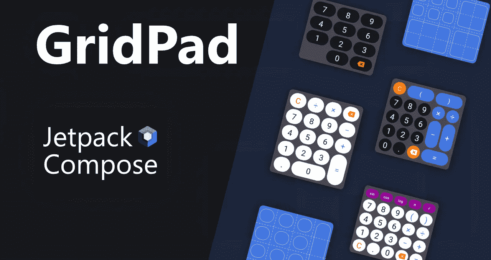
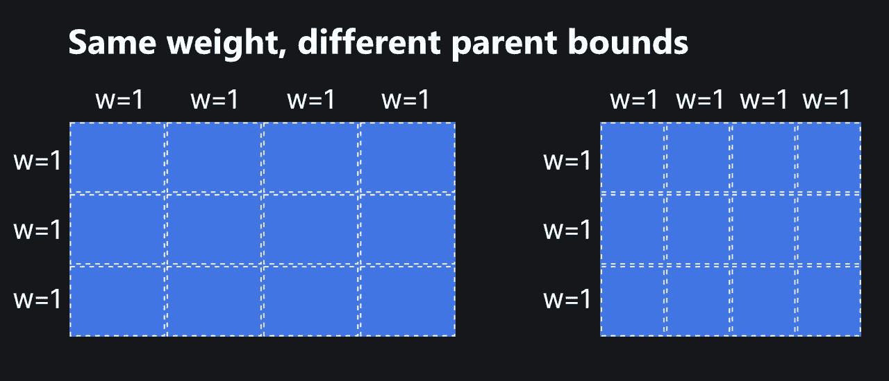
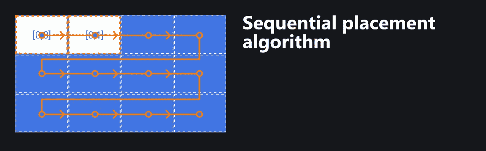
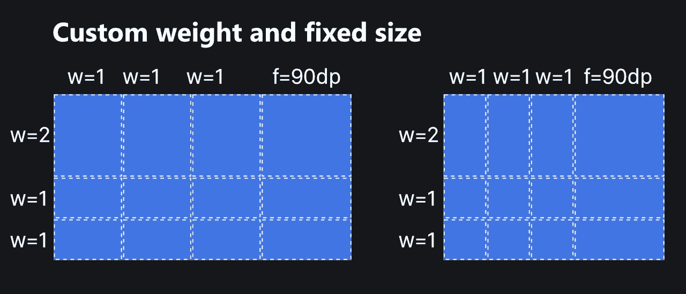
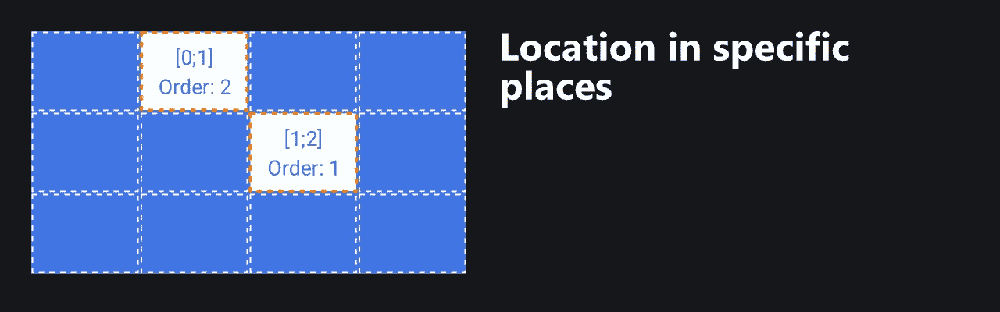
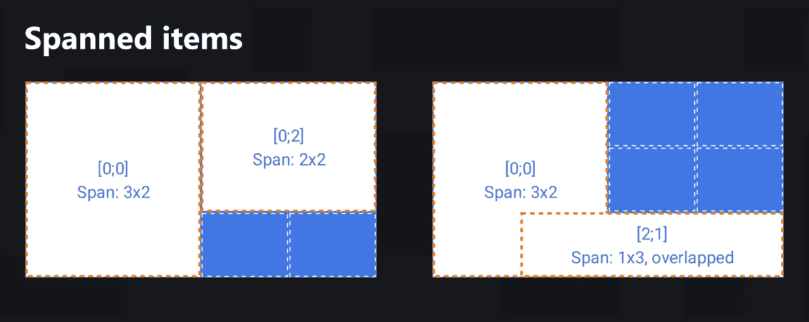

# 介绍 GridPad — Jetpack 为基于网格的 UI 构建布局

> 原文：<https://betterprogramming.pub/gridpad-jetpack-compose-layout-for-grid-based-ui-fef161d42d5b>

## GridPad 是一个 Jetpack Compose 库，有助于更自然、更方便地创建基于网格的 UI

作者提供的图片

很可能，每个开发人员都面临着实现基于网格的组件的任务，比如 pin pads、calendar cells 等等。当然，标准的 Jetpack Compose 库允许您通过`Row`和`Column`的组合来实现您需要的一切。`Row`和`Column`组合的问题是对行和列大小的不自然的控制。

此外，使用`Row`和`Column`扳手可能不太方便。为了避免引起注意的问题，我们让 GridPad — Jetpack 为基于网格的 UI 编写布局。所以，让我们来看看`GridPad`的行动。

# 开始

首先，将下面的依赖项添加到模块的`build.gradle`文件中:

要实现最简单的网格，您需要做的就是编写几行代码:

上面的代码初始化一个 3x4 的网格，行和列的权重等于 1。这意味着`GridPad`获取父边界，并在行和列之间平均分配它们。因此，`GridPad`必须从两方面进行限制:水平和垂直。不允许将其放入无限布局中。上面代码的结果将如下所示:

要将内容放入单元格，您应该用`item`包装它。可以显式和隐式放置`GridPad`中的项目。在上面的例子中，项目是隐式放置的。隐式放置将该项目放置在同一行中最后放置的项目(包括跨度大小)旁边。第一名将位于位置`[0;0]`。

当一个项目被放置在一行的最后一列时，下一个项目被放置在从第一列开始的下一行。

# 定义网格

需要指定精确的网格大小，但是指定每行和每列的大小是可选的。要定义行或列的特定大小，您需要使用`GridPadCells.Builder` API。下面是如何做到这一点:

该库支持两种类型大小:

*   `GridPadCellSize.Fixed`—DP 中的固定尺寸，当`GridPad`的边界改变时不变。
*   `GridPadCellSize.Weight` —相对，取决于其他权重、放置固定尺寸后的剩余空间以及`GridPad`边界。

上面的代码将绘制以下内容:

在单元格之间分配可用空间的算法:

1.  从可用空间中减去所有固定(`GridPadCellSize.Fixed`)值。
2.  剩余空间根据其权重值在剩余单元格之间分配(`GridPadCellSize.Weight`)。

# 放置物品

为了更灵活地控制绘制顺序和位置，每个单元格的内容都应该用一个项目包装起来。要显式放置一个项目，需要在项目中指定属性`row`和`column`中的一个或两个。当定义`row`和`column`属性时，也可以将所有项目以不同的顺序放置，而不考虑实际位置。

> 如果位置到达最后一行和最后一列，将忽略以下项目。不允许将项目放置在网格之外。

当指定时，只有`row`和`column`属性之一，逻辑将如下:

*   如果跳过`row`属性，该行将等于最后放置的项目的行。
*   如果跳过`column`属性，该行将是最后一个放置的项目之后的下一行(包括跨度大小)。当最后一项放在一行的最后一列时，下一项放在从第一列开始的下一行。

> 一个单元格可以包含多个项目。抽取顺序将与放置顺序相同。`*GridPad*`当子项具有明确的大小时，不限制该项的大小。这意味着该项可以超出单元格边界。

# 跨度

默认情况下，每个项目的跨度为 1x1。要更改它，请指定该项目的`rowSpan`和`columnSpan`属性中的一个或两个。重叠元素也是允许的。

当某个项目的范围超出网格时，该项目将被跳过，并且不会进行绘制。

> 当您有一个复杂的结构时，强烈建议使用一种明确的方法来放置所有的项目，以避免在放置项目时出现不可预测的行为和错误。

# 结论

现在您知道了一个使您的开发更有成效的库。您可以在库存储库中的示例应用程序中找到更多示例:

 [## GitHub—touch lane/grid pad-Android:grid pad Jetpack 撰写布局

### GridPad 是一个 Jetpack Compose 库，它允许您将 UI 元素放置在预定义的网格中，管理二维范围，…

github.com](https://github.com/touchlane/gridpad-android)