# 杂货店黑客:使用机器人框架自动化你的杂货店购物

> 原文：<https://betterprogramming.pub/grocery-hacking-automate-your-grocery-shopping-using-the-robot-framework-9444a553f8dc>

## 我使用机器人流程自动化(RPA)来自动化我的杂货店购物，以便我可以花更少的时间购物。

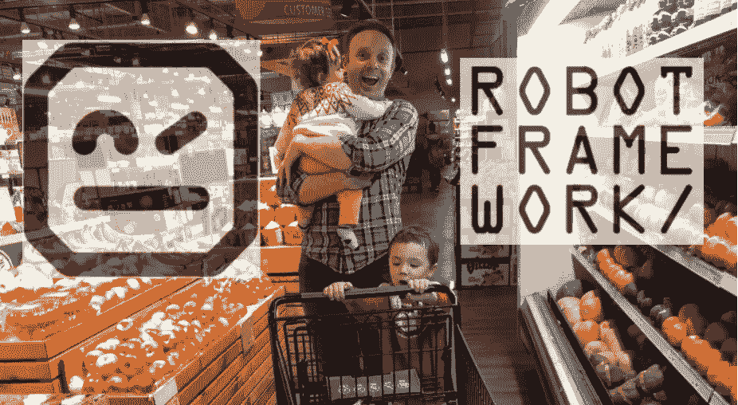

图片来源:作者

我和我的家人很幸运地住在西雅图的一个社区，那里有 7 家超市，每家都在步行距离之内。所以，直到疫情袭击，我们希望尽量减少与他人的接触，我们才开始尝试杂货店送货。像许多其他人一样，我们开始在家工作，现在我们可以在任何时间接收送货，尝试一下杂货店送货似乎是一件显而易见的事情。

当时，我们地区第一家提供送货服务的杂货店，不是亚马逊这样的大公司，是弗雷德·梅耶，通过与 Instacart 的合作。我们最初的体验非常好，我们认为额外支付总账单 15%的送货费用是值得的，因为免接触送货更安全。我们每周使用 Fred Meyer 的送货服务约 9 个月，在此期间，我们了解到它有其缺点。我们发现，Fred Meyer 的在线库存经常与实际库存不同步，这意味着我们可以轻松地收到替代品，或者商品会因为缺货而无法送达。送货后不得不亲自去商店取 20%没有送达的商品，这变得非常令人沮丧。

幸运的是，在 2021 年年中，我们的常规前 COVID 超市 Safeway 开始提供送货服务。只要 3.95 美元的送货费，我们习惯的产品，以及大量的储蓄，这项服务似乎很有前途。的确如此——以至于我们在过去的 9 个月里一直在使用它，并计划继续使用这项服务。

COVID 仍然是一个很重要的东西，但我的大多数家人都接种了疫苗(我们仍在等待我 2 岁孩子的疫苗)，我们发现戴着口罩在通风良好的室内购物是一个可接受的风险。那么是什么让我们回来使用杂货店送货服务呢？便利性和成本。虽然和我的孩子一起去超市很有趣，因为我们可以买一大堆美味的食物，我们都是一群傻瓜，但对我的孩子来说，在一个大商店里保持 45 分钟的注意力也很难。这意味着他们会到处跑，将购物速度减慢到爬行速度(看到我在那里做了什么吗？).相反，我和妻子可以在周日晚上做一些膳食计划，订购食品杂货，然后让他们送货上门，只需 3.95 美元！

还有呢？Safeway 送货司机是商店的员工，因此 Safeway 不会索要小费。有了像 Instacart 这样的竞争服务，你可以轻松地额外支付账单的 10-20%作为小费和送货费。当你谈论一家大商店时，那就加起来了。此外，我们的 Safeway 购物实际上节省了大量的汽油费，这是一个很好的额外奖励！

好了，已经有足够的背景知识了…让我们来谈谈在自动化之前我是如何购物的。

# 我过去是如何购物的

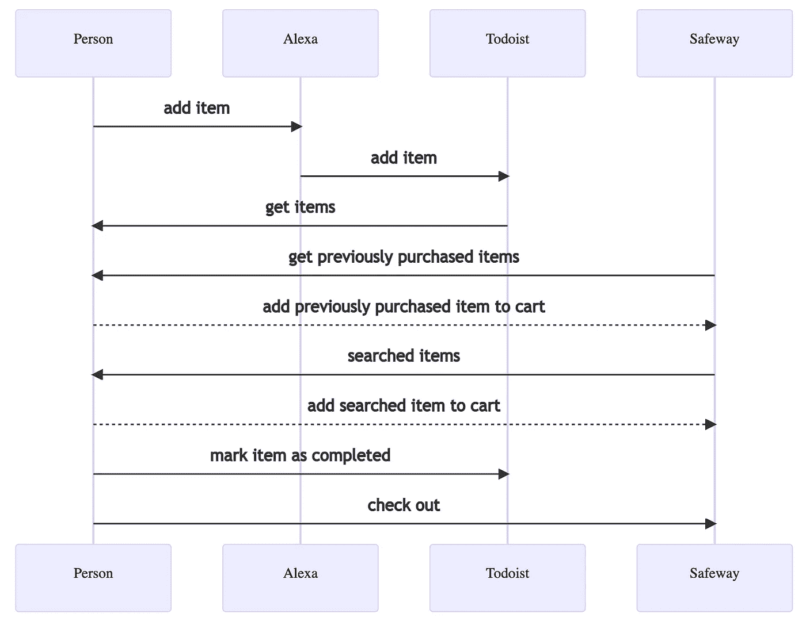

我以前是怎么去杂货店购物的。图片来源:作者

事情是这样的:

1.  在一周中，我和妻子(有时还有我们的孩子)会要求 Alexa 在我们的购物清单上添加一个项目。这很容易做到，只要你知道你会需要更多的东西，就把它添加到列表中。
2.  然后有一个由 Todoist 提供的集成，将 Alexa 中的项目同步到 Todoist。我们使用 Todoist 而不是 Alexa 应用程序来管理我们的列表，因为在 Alexa 的早期，我们发现我和妻子通过 Todoist 分享列表要容易得多。(这种情况可能不再存在，但 Todoist 对我们来说效果很好，而且是免费的，所以我们一直在使用它)。
3.  周日晚上，我和妻子坐下来做一些膳食计划，调查冰箱和橱柜，然后通过 Alexa 将物品添加到列表中。
4.  我打开电脑，在不同的浏览器标签中加载了《陶斯特和 Safeway.com》。
5.  然后我会一个接一个地检查待办事项列表中的项目。首先，我查看以前在 Safeway 上购买的商品，也就是*再次购买*商品，如果有匹配的，我就将该商品添加到我的购物车中。Safeway 在回忆我购买的最后 300 件左右的物品方面做得很好，我的物品很有可能会在这个列表中。
6.  如果我以前从未购买过该商品，或者我以前购买的商品缺货，我会使用 Safeway 搜索功能来搜索该商品，然后将其添加到购物车中。
7.  我在待办事项列表上将该项目标记为已完成
8.  我查看了我的 Safeway 购物车，并安排了送货时间

需要注意的是，步骤 4-7 的重复任务可能需要 **30 分钟**。你可能会问*这怎么可能*？好吧，每个项目需要大约 1 分钟的时间来手工处理，我可以很容易地在我的清单上有 30-40 个项目。这部分是因为浏览 Safeway 网站有点慢。在许多场合，我都认为每周花 30 分钟去买食品杂货是一件令人沮丧的事情。毕竟，我通常会点同样的东西，而且购物不需要太多智慧。一定有更好的方法，对吗？

你可能会想:

> 好吧，但 Alexa 不是已经提供了一种购买产品的方式吗？当然，这就是亚马逊创造 Alexa 的原因？

事实上，确实如此！最近，Alexa 应用程序开始允许你[购物清单](https://www.amazon.com/fmc/m/20190164?almBrandId=QW1hem9uIEZyZXNo)。您只需将商品添加到您的 Alexa 列表中，然后使用 Alexa 应用程序从新鲜或全食产品列表中进行选择:

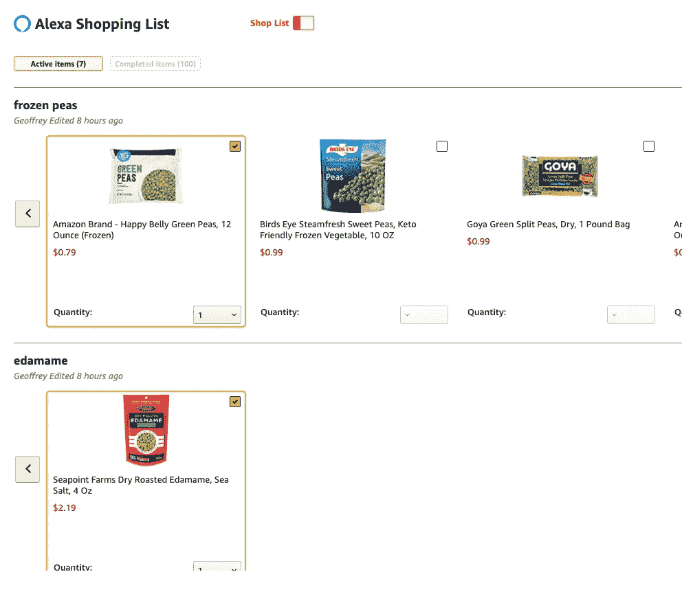

Alexa 的商店你的列表功能。图片来源:作者

这个界面非常漂亮，但是有一个问题。我妻子说:

> *我已经想过抵制亚马逊，因为他们不是最有社会责任感的公司。我们已经在亚马逊上买得太多了，我们需要支持其他杂货店。*

虽然我喜欢亚马逊的便利、速度和价格，但她是对的！所以，现在，我们将坚持在西夫韦购物。当然，Safeway(Albertsons 的子公司)是美国五大连锁杂货店之一，但至少它不是亚马逊。

我仍然想知道是 Safeway 还是亚马逊更便宜。因此，我在 Safeway 和 Amazon Fresh 的网站上建立了一个包含 32 种类似商品的购物车，对它们进行了快速成本比较。在此过程中，我发现他们对我的一篮子产品的定价大致相同，例如大约 150 美元:

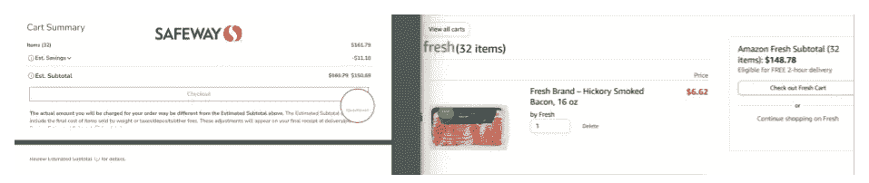

Safeway vs 亚马逊生鲜定价。图片来源:作者

知道我们想继续使用 Safeway 进行杂货配送，使用 Alexa 进行购物清单，我开始考虑如何实现购物自动化？进入:机器人过程自动化(RPA)

# 机器人过程自动化(RPA)

如果您没有听说过，RPA 只是一种自动化重复性任务的方式，通常由人用软件机器人来完成。这些通常是在图形用户界面(GUI)中完成的任务，如 web 浏览器、MS Excel、电子邮件客户端等

在过去几年里，我一直在随意阅读 RPA，甚至向工作中的非技术领导同事推销它，当时他们正在寻找一种方法来自动化运营流程，而不会分散我们已经分散的工程师的注意力。对我来说，这似乎是一个完美的机会，可以让我投入其中，制作一个 RPA 机器人。

在做了一些快速调查后，我很快了解到有许多昂贵的专有 RPA 供应商，如 UIPath 和 Automation Anywhere。我不怀疑这些系统的价值，因为它们最终可以降低您的劳动力成本。但是，也有一些开源解决方案，如[机器人框架](https://github.com/robotframework/robotframework)和[塔圭](https://github.com/kelaberetiv/TagUI)，作为开源的一个经常贡献者，我是开源的忠实粉丝。

目前，机器人框架拥有最多的 GitHub 明星，并得到广泛的社区支持。因此，我启动了一个机器人框架教程的快速入门[,发现构建一个可以导航网站的机器人非常简单。我发现机器人框架是 Python 之上的一层非常酷，因此，很容易将定制的 Python 代码插入到机器人中。而且，我发现特别酷的是，有](https://dev.to/thebadcoder/robot-framework-quick-start-ui-automation-4966)[社区提供的各种类型的图书馆](https://github.com/fkromer/awesome-robotframework#libraries)。

# 机器人的目标

在我们进入我如何建造我的机器人之前，让我们讨论一下我的目标。作为一名软件工程师，我知道我可以编写一些代码，向 Todoist 和 Safeway 后端发出 API 请求。然而，这将回避我玩机器人框架的愿望。相反，我选择使用带有机器人框架的 [SeleniumLibrary](https://robotframework.org/SeleniumLibrary/SeleniumLibrary.html) ，它允许我构建一个使用 Selenium 控制浏览器的机器人，这与我手动使用浏览器购物的方式非常相似。

稍后，我将提到我在 RPA 中发现的一些陷阱，以及为什么在将来，我会选择制作基于 API 的 bot 而不是基于 GUI 的 bot。事实上，Todoist 似乎有一个受支持的[开发者 API](https://developer.todoist.com/) 。Safeway/Albertsons 似乎没有开发者 API，但是它的网站可以进行后端调用，因此你可以对后端 API 进行逆向工程。

我的另一个目标是通过不引入另一个数据存储来简化部署架构。换句话说，我希望我的机器人只使用 Todoist 和 Safeway 中的数据，而不必在单独的数据存储中存储任何东西。最终，我能够在不写下任何额外内容的情况下购物，那么为什么没有额外的数据库，机器人就不能工作呢？

# 建造机器人

在接下来的几节中，我将浏览我的机器人代码的摘录。请在 github.com/redgeoff/grocery-shopping-bot[下载完整的源代码](https://github.com/redgeoff/grocery-shopping-bot)

如果你是机器人框架新手，请通读[机器人框架快速入门:UI 自动化教程](https://dev.to/thebadcoder/robot-framework-quick-start-ui-automation-4966)。

## 可重用的关键字

机器人框架将你典型的编程语言功能称为*关键字*。我们将定义一些关键字，这样我们就可以抽象出在浏览器中使用网站时会遇到的一些粗糙边缘。特别是，网站是异步加载许多元素的野兽，这意味着元素可能尚未可见或启用。机器人天生就比人快得多，所以如果你不小心，你的机器人很容易从 UI 中出错，因为还没有准备好或者因为其他竞争情况发生。当然，您可以在代码中插入`Sleep`语句，模拟人类可能遇到的计时，但这是一种反模式，因为:

1.  添加`Sleep`语句会让你的机器人慢很多
2.  根据网络、后端服务器，甚至您的计算能力，时间会有所不同。

相反，我们将创建一些帮助器关键字，等待元素可见并被启用，甚至引入一个重试循环，以应对页面加载时间过长或出现意外错误的情况。

我们的第一个关键词是`Wait Until Element Ready`:

接下来，我们将定义`Click Element When Ready`，它使用`Wait Until Element Ready`，然后单击元素。

为了使我们能够恢复同一个浏览器会话，这将有助于我们避免每次登录时都给我们发送电子邮件，我们将从[这篇文章](https://www.formulatedautomation.com/post/staying-logged-in-with-robot-framework-rpaframework-browser)中借用一个技巧。

最后，使用[这篇文章](https://stackoverflow.com/questions/53761393/no-keyword-with-name-get-child-webelement-found-in-robot/53763716#53763716)中的技巧，我们将定义一种获取子元素的方法。这将帮助我们做一些事情，比如获取一个食品清单，然后提取嵌套的属性。

实际的机器人有许多其他可重复使用的关键字，但是为了简洁起见，在本文中省略了它们。

我们现在已经抽象了一些不太有趣的东西，让我们开始让机器人做它的事情吧！

## 从 Todoist 获取列表

我们希望机器人做的第一件事是登录 Todoist，选择我们想要的列表，然后将列表保存到内存中。列出我们的项目的 Todoist 页面如下所示:

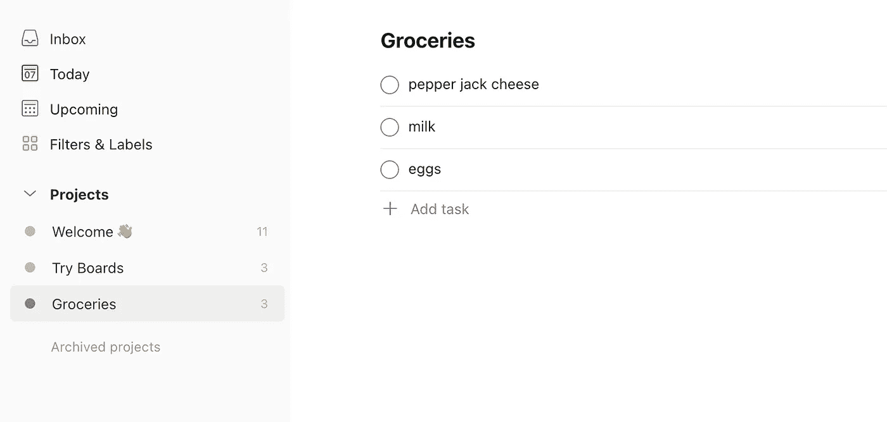

购物清单。图片来源:作者

为了避免进行额外的登录和触发来自 Todoist 的电子邮件，我们将使该机器人只在我们尚未登录时登录。在测试过程中，当您需要多次运行脚本来查找在浏览器中导航网站所产生的所有竞争条件时，这尤其有用。当然，如果您愿意，您可以在脚本每次运行时登录(和注销)。

如果您仔细观察一下`Get Todoist List Items`关键字，您会发现我们使用 XPath 查询来获取所有带有`task_list_item`类的`li`元素。然后我们提取`list_item`子元素，这样我们就可以得到项目`name`和`id`。(是的，这就是 Todoist 如何在他们的 HTML 中识别项目，如果你认为这看起来很脆弱…嗯，是的)

你可以在 [todoist.robot](https://github.com/redgeoff/grocery-shopping-bot/blob/main/robot/todoist.robot) 找到完整的代码。

## 再买一次

我们从 Todoist 获得商品后，下一步是将相应的商品添加到我们的 Safeway 购物车中。现在，我们可以转到 Safeway 搜索页面并搜索该商品，但搜索页面按最匹配的*排序，不允许您按最近购买的商品*排序。**

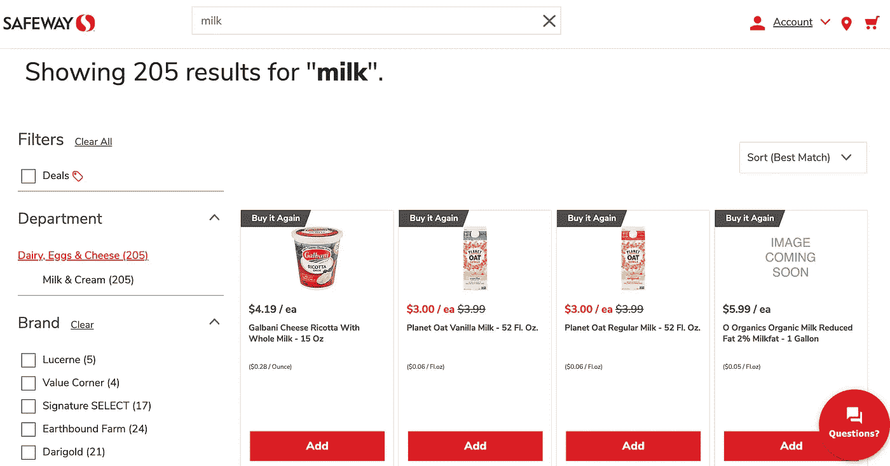

Safeway 的搜索页面。图片来源:作者

问题是，有时我们购买商品只是因为其他商品缺货，尽管我们更喜欢缺货的商品。相反，我想首先优先考虑我们经常购买的物品。这样，我们总是试图先买到我们喜欢的商品，即使它在下次购物前没有存货。当然，作为一个人，我可以简单地从列表中选择我想要的，但机器人并不那么聪明。对于机器人，我们可以转到*再次购买*页面，并按*经常购买的*进行分类:

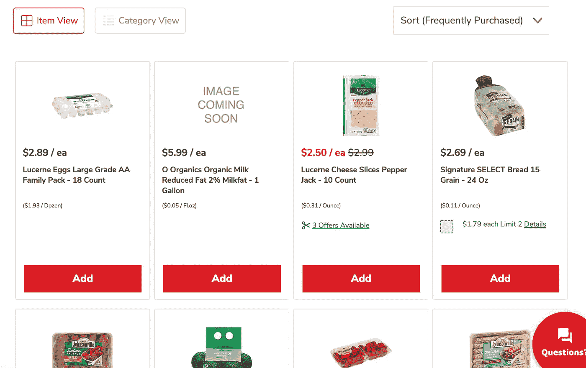

按频繁购买排序。图片来源:作者

然后，我们的机器人将遍历从 Todoist 获得的商品列表，并在 Safeway 的*再次购买*列表中寻找第一个匹配。然后，它会将该商品添加到 Safeway 购物车中。

你注意到发生在`Add To Cart`的趣事了吗？Safeway 网站要求您将鼠标悬停在某个商品上，然后点击它，才能将其添加到购物车中。至于`Wait Until Page Does Not Contain Element`，当商品被添加到购物车时，网站会闪烁一个装载图标，我们希望等到该图标不再显示，因为这确认了该商品在我们的购物车中。(专业提示:要检查 Chrome 中消失的元素，打开*源*标签，点击 *F8* 停止浏览器运行并保持图标显示)

您可以在 [safeway.robot](https://github.com/redgeoff/grocery-shopping-bot/blob/main/robot/safeway.robot) 查看完整的 Safeway 机器人代码。

## 搜索之前未购买的商品

如果你像我一样，并且你的大部分杂货店购物都包括同样的 300 件左右的商品，那么机器人只要从*再次购买*(最近购买)页面购物，就几乎完成了你的整个清单。清单上剩下的几样东西可能是你以前从未购买过的，例如，你正在尝试一种新的食谱，或者你的典型品牌缺货。

还有其他原因会让你在清单上留下剩余的项目:

1.  Safeway 截断长产品名称，例如*Signature Care Wipes Sensitive…*
2.  列表中项目的格式可能不匹配，例如*nutri grain vs nutri-grain*
3.  列表中的项目名称与 Safeway 项目名称不匹配。正如您所料，Safeway 会将隐藏的关键字与每个产品关联起来。例如，您的清单上可能有*胡椒杰克奶酪*，但 Safeway 产品可能被称为*奶酪片胡椒杰克*

为了处理这些情况，我们的机器人访问 Safeway 搜索页面，并简单地选择库存中的第一个商品添加到购物车中:

## 将待办事项标记为已完成

现在，我们的机器人创建了一个购物车，里面装着它能找到的所有物品。下一步是在我们的待办事项列表中将这些项目标记为已完成。

等等，那些`Sleep`声明是怎么回事？我们不应该避开他们吗？是的，但是 Todoist 似乎有某种速度限制。换句话说，如果我们的机器人太快，网站就会出错，因为人类不会那么快完成项目。在我的测试中，我发现当我在每批 10 件商品之间花 2 秒钟，然后等 10 秒钟时，我避免了这个速率限制。(你可能会再次说，*但是这个看起来很脆* …是的！😵‍💫)

## 发送一封电子邮件，列出添加到购物车的商品

我希望我的机器人做的最后一件事是发送一封电子邮件，列出所有添加到购物车的商品。该电子邮件应列出出现在我的 Todoist 列表和我的 Safeway 购物车中的商品名称。然后我就可以快速检查这封邮件，看看是否有什么地方不合适。我通常发现至少有几样东西看起来很时髦。

一个罕见的原因是，Safeway 的搜索可能会有一些问题。例如，如果你搜索*香蕉*，第一个结果是卷心菜:

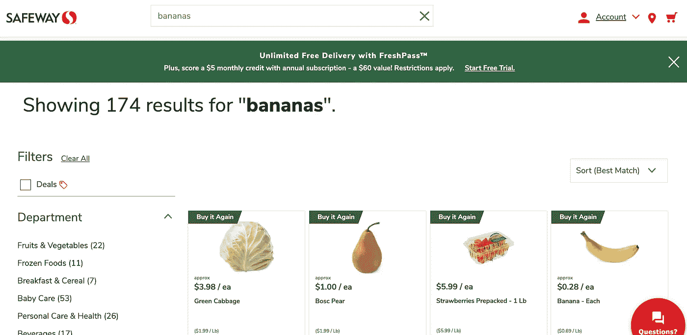

搜索“香蕉”，找到一棵卷心菜。图片来源:作者

另一件可能发生的事情是，像*洋葱*这样的简单 Todoist 项目实际上可以匹配*再买*列表中的*葱*和*黄洋葱*。我想在未来改进这一点的一个方法是有一个*替换*列表，我可以用它来训练机器人，这样每当我说*洋葱*时，我指的就是*黄洋葱。然而，对于我的机器人的 MVP 来说，一封简单的电子邮件就足以让我对我的购物车进行一些手动调整:*

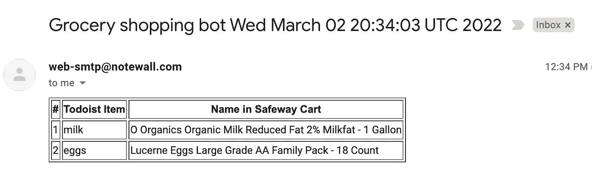

杂货店购物机器人电子邮件示例。图片来源:作者

据我所知，用机器人框架发送电子邮件并不像你希望的那样开箱即用。Robocorp 是一家非常酷的机器人框架机器人托管公司，它为[电子邮件](https://rpaframework.org/libraries/email_imapsmtp/)维护了一个 RPA 库，但我发现它与我用来在容器中运行我的机器人的`ppodgorsek/robot-framework` Docker 映像不匹配。此外，我很高兴在我的机器人中使用定制的 Python 脚本，并知道用 Python 发送电子邮件是微不足道的。所以，我简单地创建了一个自定义的 *Email.py* 文件:

并通过一个`Send Email`关键字将其公开:

`Email.py`脚本连接到一个 SMTP 服务器并发送一封 HTML 电子邮件。我简单地设置了一个新的 Gmail 账户，并通过启用[允许不太安全的应用选项](https://kb.synology.com/en-global/SRM/tutorial/How_to_use_Gmail_SMTP_server_to_send_emails_for_SRM)来启用 SMTP 访问。

注意:通过这种方式发送的电子邮件很可能会出现在您的垃圾邮件文件夹中，因此您可能需要创建一个过滤器来将它们排除在垃圾邮件文件夹之外。从一个合适的邮件主机发送非垃圾邮件是一个相当复杂的过程，超出了本文的范围。

# 运行机器人

这里有一个演示如何运行该机器人的快速视频:

杂货店购物机器人演示。视频鸣谢:作者

要在本地运行 bot，请遵循这里的步骤。

运行 bot 后，您将看到一个`output`目录被创建，它包含一些新的工件:


输出目录包含机器人框架日志。图片来源:作者

您可以打开`log.html`来查看 bot 的详细日志，例如

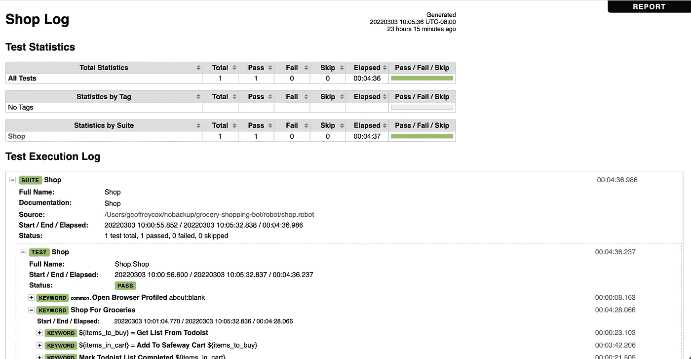

机器人框架日志。图片来源:作者

该日志和嵌入的屏幕截图对解决任何问题都很有帮助。

# 有用的工具

如果你是 Visual Studio (VS)代码用户，我发现[机器人框架 Intellisense](https://marketplace.visualstudio.com/items?itemName=TomiTurtiainen.rf-intellisense) 扩展会非常有帮助。

如果您还不熟悉浏览器控制台中的*检查*功能，我建议您尝试一下，因为它可以让您发现网页上元素的结构:

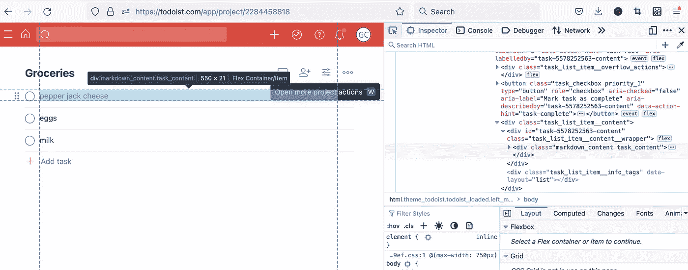

检查 Firefox 中的 HTML 元素。图片来源:作者

你可能在上面的代码中注意到了，因为 Todoist 和 Safeway 的网站不是最容易访问的，所以这个机器人使用 XPath 来导航网站。例如，我们使用以下选项选择所有 Todoist 项目:

```
Get WebElements    xpath=//li[contains(@class,'task_list_item')]
```

Chrome 和 Firefox 的一个鲜为人知的特性是，您可以使用`$x()`函数在控制台中测试 XPath 查询:

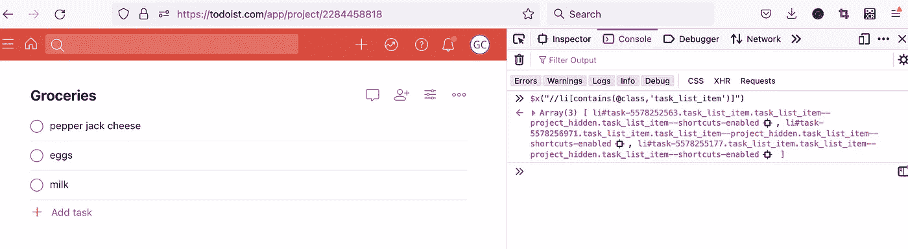

在 Firefox 中测试 XPath 查询。图片来源:作者

# 使用 Docker 在无头模式下运行 bot

如果要在后台运行没有 UI(无头)的 bot 怎么办？很简单，只要按照[的指示，用 Docker](https://github.com/redgeoff/grocery-shopping-bot/blob/main/README.md#run-locally-with-docker) 在本地运行即可。

如果要将 bot 部署到云上呢？我将在后面的帖子中详细介绍这一点，但现在，看看 [Deploy to AWS](https://github.com/redgeoff/grocery-shopping-bot#delpoy-to-aws) 中的步骤，看看我如何以每月几便士的价格运行这个机器人。

# 可能的增强

这个机器人只是一个最小可行产品(MVP)。以下是我认为可以添加的一些内容，以使其更加有用:

1.  如上所述，一个*替换*的列表可以用来用*黄洋葱*替换像*洋葱*这样它就不只是匹配*绿洋葱了。*
2.  假设机器人运行后，人类会对列表进行细微的调整，机器人应该可以从这些调整中学习。换句话说，如果机器人确定购买了一个*黄色洋葱*，当列表上的原始项目是*洋葱时，*它可以代表你将`onion => yellow onion` 添加到*替换*列表中。
3.  可以使用关键字扩展，以便单个单词可以表示一篮子项目。例如，你的家人可能会吃很多水果，并希望*水果*关键字包括草莓、覆盆子和蓝莓。这个特性对于订购一盘菜的所有杂货也很有用。或许，这是作为*替换*列表的一部分实现的，即`lasagne => ricotta, beef, eggs, ...`
4.  支持项目计数。例如， *7 根香蕉*会将 7 根香蕉加入购物车。目前，机器人只向购物车添加了一个香蕉，在机器人完成执行后，人必须手动增加数量。
5.  在 Safeway 的产品页面上，有时会有一个为特定产品剪贴优惠券的选项，也就是说，您可以在购买时节省一些钱。机器人应该为你做这件事。
6.  如上图所示，Alexa 的*购物清单*功能提供了一个用户界面，允许你从与购物清单上的项目匹配的顶级搜索结果列表中进行选择。在机器人运行后显示这样一个界面是有价值的，这样你就可以快速做出任何需要的调整。
7.  该机器人可以分析你的购买习惯，并在你消费物品的速度足够快时，以及批量购买可以省钱时，推荐你批量购买某些物品。
8.  使用机器学习，根据你对品牌、价格、味道和尺寸的现有偏好，推荐从未购买过的产品(新产品)。
9.  对其他杂货店的支持。现有的 bot 已经支持任何与 Todoist 集成的智能音箱，但它只支持杂货店 Safeway。

# RPA 是实现这个 bot 的最好方式吗？

大概不会。尽管玩机器人框架很有趣，但是通过浏览器使用框架导致了一个相当脆弱的解决方案。如果 Todoist 或 Safeway 决定改变他们的网站，这个机器人很可能会崩溃。

我认为实现这种机器人的最佳方式是使用官方支持的开发者 API，比如 Todoist(或者 Alexa)提供的 API。主要原因是这个 API 是一个 Todoist 试图遵守的契约。或者，换句话说，这将大大降低 Todoist 引入一个会破坏机器人的变化的可能性。

另一方面，Safeway 似乎没有支持的开发者 API。相反，你可以使用浏览器的*网络*标签来逆向工程他们的后端 API。使用此 API 将显著改进 bot，因为它将:

1.  让它不那么依赖网站的表示层(HTML)。换句话说，网站的外观可能会改变，但只要后端 API 不变，机器人就不会崩溃。尽管 Safeway 没有正式公开开发者 API，但他们可能有工程师团队在后端和前端工作，他们很可能会避免破坏 API，因为这可能会导致他们的网站不稳定，并降低他们团队的速度。
2.  让它更快，因为浏览图形用户界面很慢。
3.  减少 bot 消耗的资源量，因为进行 RESTful API 调用比运行浏览器消耗的资源少得多
4.  当机器人比人类更快地导航 GUI 时，减少在浏览器中遇到竞态条件的可能性
5.  避免使用弹出窗口的复杂性，弹出窗口可能会随时添加到 GUI 中，并且可能与机器人的主要目标没有什么关系

# 这个机器人为我工作得怎么样？

我已经使用这个机器人几个星期了。我发现它能准确地为我清单上 90%的物品建立一个购物车。然后我进去，通过 Safeway 移动应用程序对我的购物车做了一些小的调整，但总的来说，我已经将每周花在订购杂货上的时间从大约 30 分钟减少到了 5 分钟。所以，是的，它对我来说效果很好！

我在 AWS 上以每月几分钱的价格托管机器人，甚至创建了一个自定义的 Alexa 技能来启动机器人。这意味着在我的 Alexa 列表完成后，我只需说 o *pen 杂货店购物机器人*这个机器人就会施展它的魔法。在以后的文章中，我将深入研究这个部署是如何工作的，但是现在，你可以在这里[使用它](https://github.com/redgeoff/grocery-shopping-bot/blob/main/README.md#delpoy-to-aws)。

```
**Enjoyed this article?** If this bot were turned into an easy-to-use service and supported your preferred grocery store and smart speaker, would you pay for it? Please consider taking 3 minutes to [answer these 3 quick questions](https://docs.google.com/forms/d/e/1FAIpQLSeVdhAr3ucfz6YhLDKYeWUMTcJAB5woLiQqgjW80cYti9TdEw/viewform?usp=sf_link)
```

感谢你阅读这篇文章。

# 资源

以下是本文中提到的有用资源列表:

1.  [杂货店购物机器人调查](https://docs.google.com/forms/d/e/1FAIpQLSeVdhAr3ucfz6YhLDKYeWUMTcJAB5woLiQqgjW80cYti9TdEw/viewform?usp=sf_link)
2.  [github.com/redgeoff/grocery-shopping-bot](https://github.com/redgeoff/grocery-shopping-bot)
3.  [机器人框架快速入门:UI 自动化教程](https://dev.to/thebadcoder/robot-framework-quick-start-ui-automation-4966)
4.  [github.com/robotframework/robotframework](https://github.com/robotframework/robotframework)