# 使用 UIAlertController 和 SwiftUI 显示 iOS 警报

> 原文：<https://betterprogramming.pub/guide-how-to-display-modal-alert-on-ios-with-help-of-uialertcontroller-21c54812c9a2>

## **具有多个按钮的提醒，带有编辑字段、行动表、活动视图、iPad 上的弹出窗口和 SwiftUI evolution**

# 警报简介

在 iOS 中，有几种方法可以显示一些模态消息。向用户传递信息，并选择性地获得一些反馈。最常用的是警报和行动表。类似于次级选项的还有活动视图和弹出窗口。

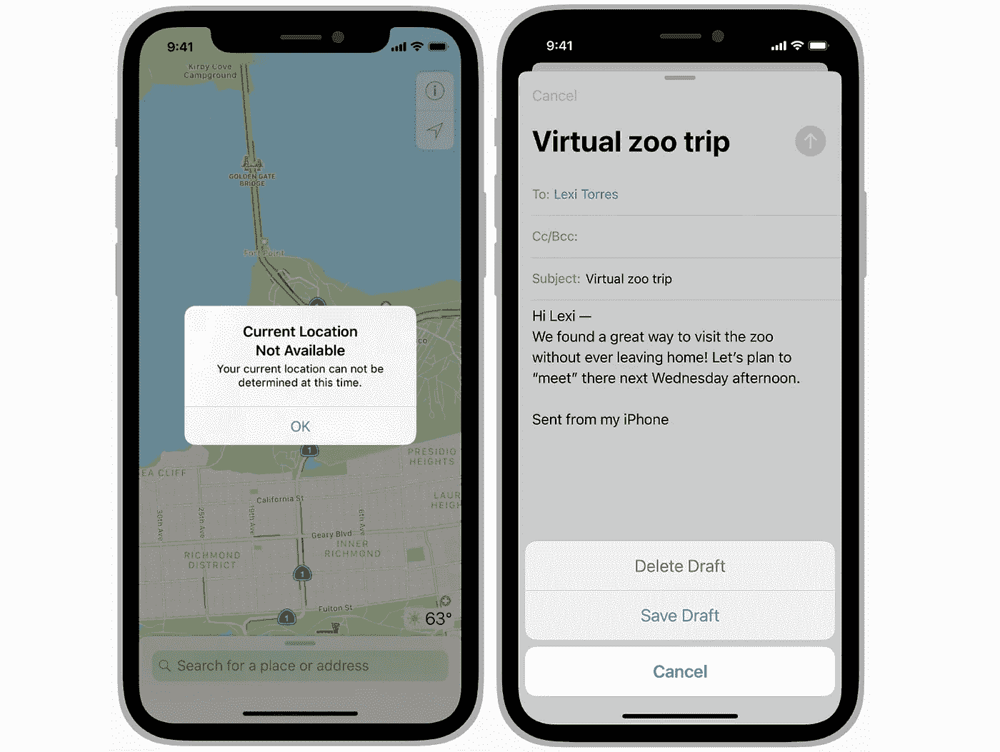

苹果公司的警告与行动表

# 警报

警报是最常用也是最简单的。`UIAlertController`是其中最重要的部分。

警报包含几个要素:

*   **标题**:代表标题。大概是什么内容
*   **消息**:表示警报更广泛的描述部分
*   **预警类型**:表示要显示的预警类型
*   **警报动作**:这些是用户可以与警报或动作表交互的动作选项。
*   **警告文本字段**:表示供用户输入的选项

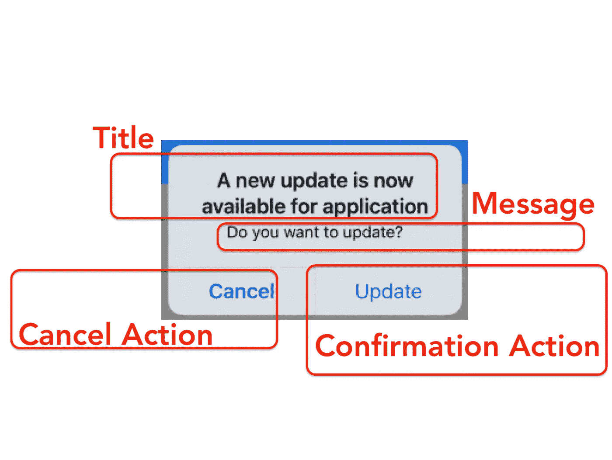

警报及其组件的示例

> 提醒传达与您的应用程序或设备状态相关的重要信息。警报由标题、可选消息、一个或多个按钮以及用于收集输入的可选文本字段组成。除了这些可配置的元素，您不能自定义警报的可视外观。—苹果人机界面指南

## 带有标题、副标题和一个按钮的简单警告

这种警报消息类型是最简单的。它的行为就像一些信息消息。

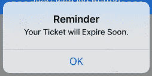

带有标题、副标题和一个按钮的简单提醒

如何创建简单警报的代码

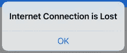

警报信息值为**零**

如果`message`参数得到`nil`作为值，那么只有一行，标题将被呈现。

## 带有两个按钮的警告消息

你可以注意到“取消**”**按钮是加粗的。这是通过选择`style`作为`cancel`来实现的。此外，如果你支持以前的 iOS 版本，那么这可能会有轻微的差异。

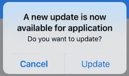

带有两个按钮的警告消息

如何用两个按钮创建警告消息的代码

## 带有 3 个按钮的警告消息

以前的警告让按钮垂直对齐。如果您添加 3 个按钮，系统会自动将它们在空间中垂直对齐。

在这个`Alert`中，我们还使用了`destructor`样式，将文本涂成红色。它主要用于删除、移除等操作。任何可以向用户表明这个操作可以做一些永久改变的东西。


带有 3 个按钮的警告消息

代码如何创建 3 个按钮的警告信息

## 带文本字段的警告消息

这是最有趣的警报。当你想在列表中添加一些项目时，可以使用这个。当你想编辑一些用户字段，如姓名，手机号码。任何编辑字段。

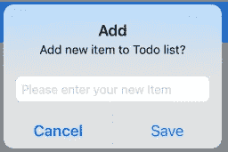

带文本字段的警告消息

如何用文本字段创建警告消息的代码

## 没有按钮的警告消息

这是可能的，但我没看到这有什么用。这将显示一条消息并阻止屏幕。你不能忽视它。

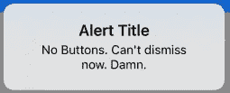

没有按钮的警告消息

# 行动表

行动单属于`UIAlertController`家族。但它是从屏幕底部呈现的。

> 动作表呈现与有意的用户动作相关的两个或更多选择。在较小的屏幕上，动作表从屏幕底部向上滑动；在更大的屏幕上，一个动作表会以弹出窗口的形式同时出现。—苹果人机界面指南

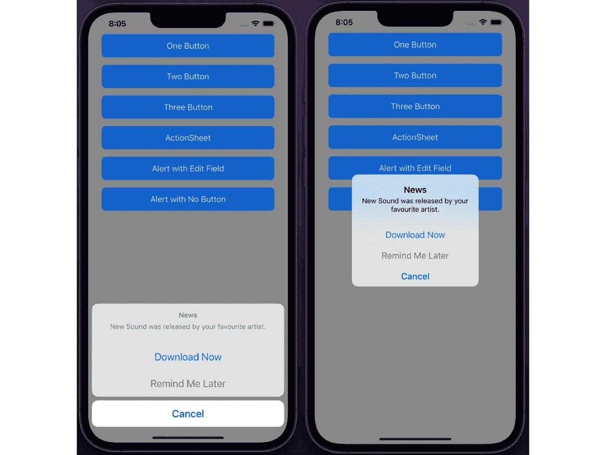

行动表与警报

如何创建动作表的代码

如果你在 iPad 上运行这段代码，它会崩溃。iPad 需要知道`UIAlertController`的位置，因为它出现在弹出控制器内部。要修复这个崩溃，我们需要在显示动作表之前添加下一行。

```
alert.popoverPresentationController?.sourceView = view
alert.popoverPresentationController?.sourceRect = button.frame
```

现在动作表将从源代码显示在按钮上。

# 活动视图

该系统提供了几种标准服务，如将项目复制到粘贴板，将内容发布到社交媒体网站，通过电子邮件或短信发送项目，等等。应用程序还可以定义自定义服务。它主要用于分享内容。可以处理共享文本，网址，图像等。这不是向用户呈现某些选项的常规方式，但仍然属于与用户交流的“模态”视图方式。

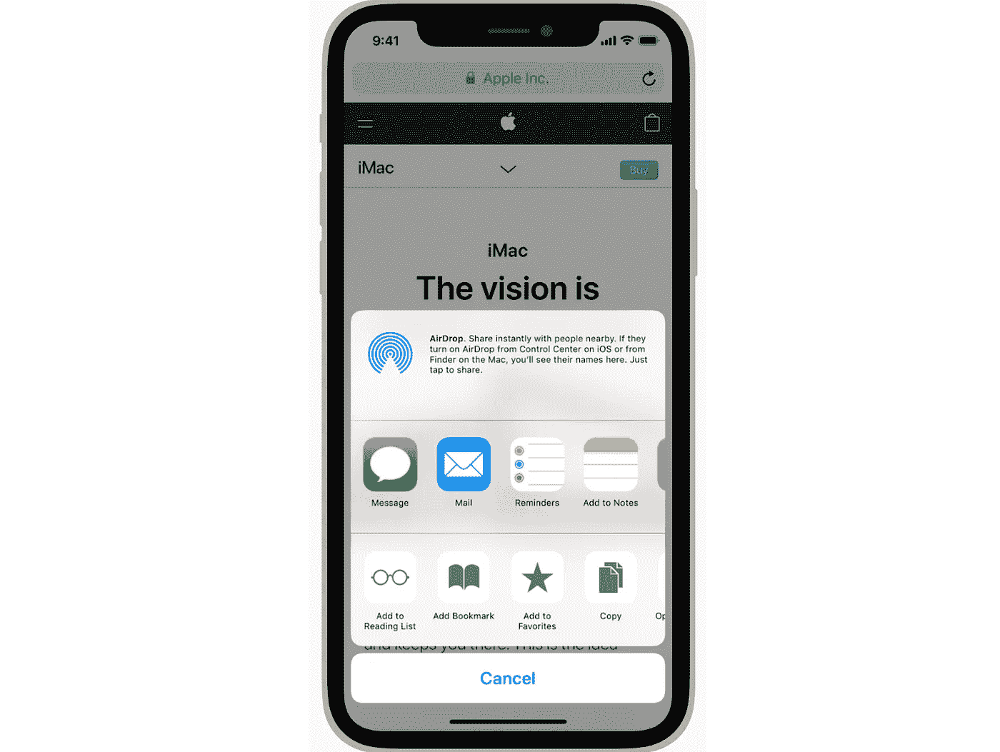

Apple 的活动视图

活动视图代码示例

# 松饼

弹出式菜单是在 iPad 上有模式地呈现内容的特殊方式。

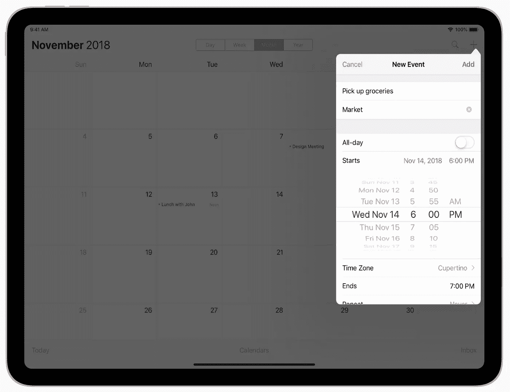

苹果在 iPad 上弹出的例子

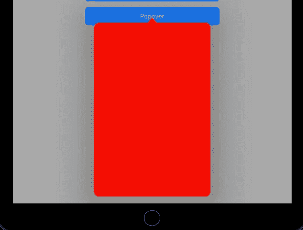

自定义弹出窗口示例

Popovers 代码示例

代码示例可以在下一个链接 [GitHub](https://github.com/skyspirit86/Alerts) 找到。

# SwiftUI 警报

**SwiftUI** 中的提醒和 UIKit 中的提醒非常相似，都是考虑 UI 的。至于 SwiftUI 开发，要看你用的是什么 iOS 版本。从 iOS 13 到 iOS 15，提醒在不断发展变化。但是原理是一样的。

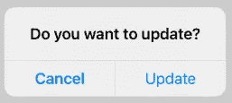

带两个按钮的 swift ui Alert IOs 13

带两个按钮的 SwiftUI 警报代码 iOS13

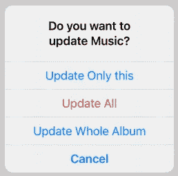

更多按钮的 SwiftUI 提醒 iOS13

带更多按钮的 SwiftUI 警报代码 iOS13


带 2 个按钮的 swift ui Alert IOs 14

带 2 个按钮的 swift ui Alert IOs 14

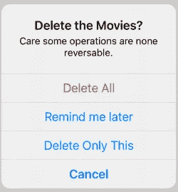

带两个按钮的 swift ui Alert IOs 15

SwiftUI 警报 iOS15

如你所见，它是随着 SwiftUI 发展起来的。我现在想强调的是，现在的提醒比 UIKit 的更加个性化。

# 结尾部分

我们已经学习了一些如何与用户进行模态交互的方法。警报、行动表、活动视图和弹出窗口。

如果你到了这一步，感谢你的阅读。你应该得到一杯咖啡☕️.🙂如果你喜欢的内容，请👏，分享，还有[跟着](https://varga-zolt.medium.com/)，对我来说就是 a 的意思。如果您有一些建议或问题，请随时发表评论。

**想要连接？你可以在 [LinkedIn](https://www.linkedin.com/in/varga-zolt/) 、 [Twitter](https://twitter.com/skyspirit86) 或[https://skyspiritlabs.com/](https://skyspiritlabs.com/)与我联系。还有更多文章和教程。**