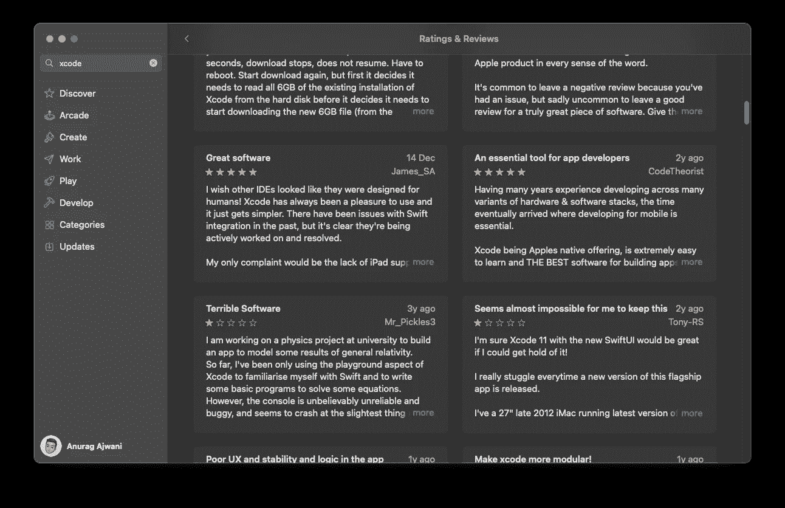

# xcode gen vs . Tuist vs . Bazel——比较这 3 个工具来增强您的 iOS 项目

> 原文：<https://betterprogramming.pub/guide-on-supercharging-ios-app-project-management-218d8e518582>

## iOS 开发工具

## 知道哪一个适合你


由[弗拉德·乔姆帕洛夫](https://unsplash.com/@tchompalov?utm_source=medium&utm_medium=referral)在 [Unsplash](https://unsplash.com?utm_source=medium&utm_medium=referral) 上拍摄的照片

讨厌 Xcode？你并不孤单。有些人喜欢它。有的对它又爱又恨；包括我自己。



App Store 中的 Xcode 评论

为什么有些开发者这么讨厌？原因可能有很多，以下是一些原因:

*   Xcodeproj 文件不可读且不可维护
*   缺乏项目目标类型的可配置性
*   缓慢构建

那么有没有什么方法可以让我们在 iOS 开发中摆脱 Xcode 呢？简单来说，答案是否定的。然而，有一些选项可以解决上述一个或多个问题。

在本帖中，我将回顾 3 个最受欢迎的选项来增强你的 iOS 应用程序项目能力。这些是:

1.  XcodeGen
2.  图伊斯特
3.  巴泽尔

我将介绍每一种方法的内容以及如何使用它们的指南。

在这篇文章中，我假设你熟悉 iOS 开发和 Xcode，并且对 iOS 应用项目中的[模块有很好的理解。](https://anuragajwani.medium.com/modular-ios-guide-60810f5a7f97)

# 1.XcodeGen

XcodeGen 是一个生成`xcodeproj`文件的命令行工具。为了指定 Xcode 项目[的配置，XcodeGen](https://github.com/yonaskolb/XcodeGen) 使用了一个 YAML 或 JSON 文件。然后 [XcodeGen](https://github.com/yonaskolb/XcodeGen) 将 JSON 或者 YAML 转换成`xcodeproj`文件。

这里有一个来自我的 Xcodegen 教程的 YAML 文件的例子:

```
name: SaladMaker
options:
  bundleIdPrefix: com.<YOUR_NAMESPACE>
targets:
  SaladMaker:
    type: application
    platform: iOS
    deploymentTarget: "14.0"
    sources:
      - SaladMaker
```

这些文件比 Xcodeproj 文件更具可读性。您可以为项目的不同配置创建多个这样的文件。或者，您也可以根据自己选择的语言生成这些文件。例如，您可以使用脚本语言来生成文件。

此外 [XcodeGen](https://github.com/yonaskolb/XcodeGen) 还[提供了一个 Swift 库，您可以在基于 Swift 的 CLI 工具](https://github.com/yonaskolb/XcodeGen#swift-package-manager)中导入和使用该库。

XcodeGen 支持 Swift 包管理器。

需要注意的是， [XcodeGen](https://github.com/yonaskolb/XcodeGen) 只是一个 Xcodeproj 文件生成器。它不提供任何其他功能。

## 好人

✅高度可读和简单的配置文件

可以根据您选择的语言轻松生成✅配置文件

## 坏事

❎缺乏缓存功能

要学习如何使用 [XcodeGen](https://github.com/yonaskolb/XcodeGen#swift-package-manager) 请查看我的教程[用 Xcodegen](/generating-xcodeprojs-with-xcodegen-7d291cfc2f46) 生成 xcodeproj:

[](/generating-xcodeprojs-with-xcodegen-7d291cfc2f46) [## 使用 Xcodegen 生成 xcodeproj

### 去掉不可读的 xcodeproj 文件，向可读的项目配置文件问好

better 编程. pub](/generating-xcodeprojs-with-xcodegen-7d291cfc2f46) 

# 2.图伊斯特

[Tuist](https://tuist.io) 是一个工具，也像 [XcodeGen](https://github.com/yonaskolb/XcodeGen) 一样生成 xcodeproj 文件。但是， [Tuist 的](https://tuist.io)项目配置文件是用 Swift 写的。此外，配置文件模仿了类似于 [Swift 的包管理器](https://www.swift.org/package-manager/) `Package.swift`的配置方法。

这里有一个例子:

```
import ProjectDescriptionlet project = Project(
    name: "SaladMaker",
    organizationName: "com.anuragajwani",
    targets: [
        Target(
            name: "SaladMaker",
            platform: .iOS,
            product: .app,
            bundleId: "com.anuragajwani.SaladMaker",
            deploymentTarget: .iOS(targetVersion: "14.0", devices: .iphone),
            infoPlist: "SaladMaker/Info.plist",
            sources: ["SaladMaker/**"],
            resources: ["SaladMaker/Assets.xcassets/"]
        )
    ]
)
```

以上实现与 [XcodeGen](https://github.com/yonaskolb/XcodeGen#swift-package-manager) 的示例相同。

另外 [Tuist](https://tuist.io) 支持 [Swift 包管理器](https://www.swift.org/package-manager/)依赖关系。

[Tuist](https://tuist.io) 还允许您在配置中缓存模块——包括内部模块和 [SPM](https://www.swift.org/package-manager/) 管理的模块。这有助于加快构建时间。

最重要的是，Tuist 允许你将注意力集中在你需要处理的模块上，同时所有的东西都被隐藏起来并缓存起来。然而，开发人员需要事先了解哪些模块需要修改，并相应地配置项目。

**注意** [Tuist](https://tuist.io) 通过名为 [Tuist](https://tuist.io) Cloud 的集中式服务提供远程缓存，目前是免费的。然而，在写这篇文章的时候，这还处于初级阶段。

> Tuist Cloud 现在是 alpha 版本，可以供第一批测试人员使用。你可以按照这里[的步骤](https://docs.tuist.io/cloud/get-started)开始。我们感谢任何反馈，但也要记住，该功能仍处于早期开发阶段。该功能目前是免费的，但可以考虑在这里捐赠[来支持开发，并帮助我们支付保持 Tuist Cloud 正常运行的费用。—](https://opencollective.com/tuistapp) [发布 Tuist 3.0](https://tuist.io/blog/2022/03/28/tuist-3.0/)

## 好人

✅高度可读和更简单的配置文件

基于✅ Swift 的配置文件，与生态系统的其他部分保持一致

✅缓存模块以加快构建速度的能力

✅能够专注于需要改进的模块

## 坏事

❎配置文件比 [XcodeGen 的](https://github.com/yonaskolb/XcodeGen)大

与 [XcodeGen](https://github.com/yonaskolb/XcodeGen) 相比，❎的配置文件可能可读性较差

❎缓存并不是无缝的

❎远程缓存需要集中服务

要了解如何使用 Tuist，请查看我的教程“[使用 Tuist 生成 xcode proj](/generating-xcodeprojs-with-tuist-4f11134e9f5a)”:

[](/generating-xcodeprojs-with-tuist-4f11134e9f5a) [## 使用 Tuist 生成 Xcodeproj

### 去掉不可读的 xcodeproj 文件，向可读的项目配置文件问好

better 编程. pub](/generating-xcodeprojs-with-tuist-4f11134e9f5a) 

# 3.巴泽尔

[巴泽尔](https://bazel.build)不同于 [XcodeGen](https://github.com/yonaskolb/XcodeGen) 和 [Tuist](https://tuist.io) 。之前的工具是在 Xcode 的基础上构建的。Bazel 没有增强 Xcode 项目管理。更确切地说，Bazel 是一个构建系统。Bazel 构建配置是用一种叫做 Starlank 的语言编写的，它是 Python 的一种方言。

Bazel 的好处在于它是一个第三方开源工具。任何人都可以对这个工具做出贡献并创建插件。

已经有相当多的 [Bazel](https://bazel.build) 插件可以帮助你构建 iOS 应用。但是如果构建产生与 Xcode 相同的输出，为什么还要使用 [Bazel](https://bazel.build) ？

你不能修复 Xcode 构建系统，它有时会很脆弱。但是你可以为 Bazel 修复或者创建你自己的插件。

此外，像 [Tuist](https://tuist.io) ， [Bazel](https://bazel.build) 提供缓存。然而 [Bazel](https://bazel.build) 可以无缝缓存和构建。此外，您可以在服务器控制器中远程缓存您的构建。

然而，巴泽尔只做建筑。这是一个构建系统。那么如何才能进行调试等其他操作呢？我们习惯通过 Xcode 执行的操作。你仍然需要 Xcode。为此，你可以通过使用一个叫做 [Tulsi](https://tulsi.bazel.build) 的工具或者使用一个叫做 [XCHammer](https://github.com/pinterest/xchammer) 的 [Bazel](https://bazel.build) 插件，从 [Bazel](https://bazel.build) 构建文件中生成 xcodeproj 文件。

## 好人

✅缓存构建的能力

✅无缝本地缓存–开发人员几乎不需要配置

✅远程缓存可用

## 坏事

与 [XcodeGen](https://github.com/yonaskolb/XcodeGen) 和 [Tuist](https://tuist.io) 相比，❎需要使用更复杂的迁移工具

❎开发者可能需要学习一门新的语言

❎该工具提供更新以匹配 Xcode 提供的功能可能会很慢

❎文件质量差

要了解如何使用 Bazel，请查看我的教程“[使用 Bazel 更快地构建 iOS 应用](/building-ios-apps-faster-using-bazel-b960f6788fab)”:

[](/building-ios-apps-faster-using-bazel-b960f6788fab) [## 使用 Bazel 更快地构建 iOS 应用

### 了解如何在没有 Xcode 的情况下更快地构建 iOS 应用程序

better 编程. pub](/building-ios-apps-faster-using-bazel-b960f6788fab) 

# 摘要

*   通过 Xcode 管理复杂的项目可能会令人沮丧
*   XcodeGen 、 [Tuist](https://tuist.io) 和 [Bazel](https://tuist.io) 都提供了不同的能力来使用不同的方法处理项目管理
*   没有工具是万能的，请根据您的需求和能力选择您的工具

# 最后的想法

虽然这些工具可以相互比较，但是它们存在的原因各不相同。因此，很难说一种工具比另一种好。我建议您了解您的 iOS 项目中的主要难点是什么，以及这些工具中的哪一个能以最少的工作量为您解决问题。

选择适合您的工具。

```
**Want to Connect?**For more on iOS development follow me on [Twitter](https://twitter.com/anuragajwani?source=post_page---------------------------)!
```