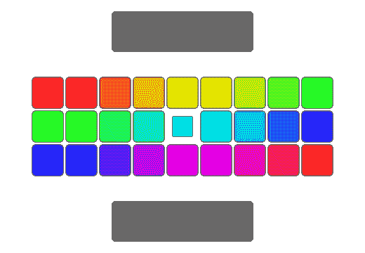
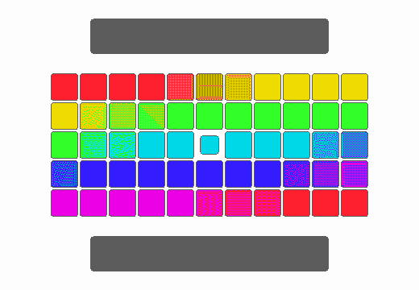
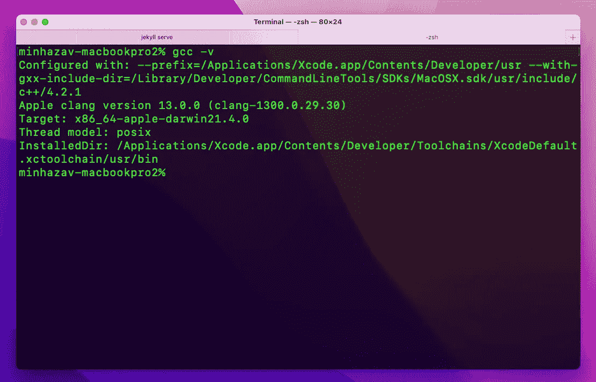
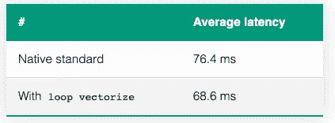
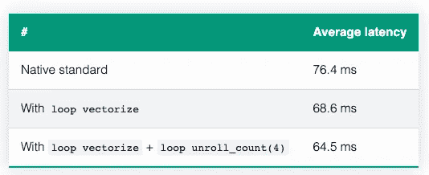

# 如何引导编译器加速你的代码

> 原文：<https://betterprogramming.pub/guide-the-compiler-to-speed-up-your-code-655c1902b262>

## 现代编译器相当聪明。但有时，他们很难找到最佳的优化方案。这对我们有好处，我们可以在这方面进一步指导他们


在 [Unsplash](https://unsplash.com/photos/ioYwosPYC0U) 上 [Daniil Sitantev](https://unsplash.com/@betagamma) 拍摄的照片。

现代编译器不只是编译我们的代码，从某种高级语言到汇编语言(或机器可读指令)都是如此。他们花费大量的时间和精力来优化我们的代码，以达到最佳性能。

当正确的标志被提供给编译器时，这当然是允许的。相反，您可以指示编译器针对二进制文件大小或编译延迟进行优化([阅读更多信息](https://stackoverflow.com/a/15548189/2614250))。

本文将重点关注优化运行时性能。

> 免责声明:
> 
> 本文中的大多数例子都使用 C++，但我相信内容对每个人都有用。
> 
> 这篇文章的内容并不反映我工作的组织，而是我自己的。

# 现代 CPU


Francesco Vantini 在 [Unsplash](https://unsplash.com/photos/ZavLsrP4CDI) 上拍摄的照片。

先说一点现代的 CPU。这是学校经常教的，但我们往往会忘记。

## SIMD 对 SISD

[SISD](https://en.wikipedia.org/wiki/SISD) 代表**单指令流，单数据流**。通常，程序代码是按顺序执行的，即一个接一个地执行。假设我们有两个数组`a`和`b`，我们想写一个程序，用下面的操作转换`a`中的每个元素:

```
a[i] = a[i] + b[i];
```

对于数组中的每个索引`i`。



如何交换算法的可视化将在 SISD CPU 上工作。来源:Github 上的开源库—[Wunkolo/qreverse](https://github.com/Wunkolo/qreverse)(MIT 许可证)。

这就是我们经常看到的代码在 CPU 上执行的方式。我们倾向于优化大欧米茄-是的，这是正确的做法。

但是现代的 CPU 可以做的更好！

现代 CPU 具备支持 [SIMD](https://en.wikipedia.org/wiki/SIMD) 的能力，后者代表单指令多数据。这样的机器可以表现出数据级的并行性(不同于并发性)。他们可以一次对多个数据执行相同的指令。

对于上面的示例，SIMD CPU 可以分组并在一个批处理中执行操作，如下所示:

```
a[0] = a[0] + b[0];
a[1] = a[1] + b[1];
a[2] = a[2] + b[2];
a[3] = a[3] + b[3];
```

+的 SIMD 指令在 [SSE](https://en.wikipedia.org/wiki/Streaming_SIMD_Extensions) 中被称为`*addps*`或者在 [AVX](https://en.wikipedia.org/wiki/Advanced_Vector_Extensions) 中被称为`*vaddps*`，它们分别支持 4 元素和 8 元素的分组(整型)。



如何交换算法的可视化将在 SIMD CPU 上工作。来源:Github 上的开源库—[Wunkolo/qreverse](https://github.com/Wunkolo/qreverse)(MIT 许可证)。

> 你看，如果你能告诉 CPU 以这种方式运行算法，你的代码运行速度会提高 K 倍。

不要担心！你可以——有一些内部函数允许你告诉机器去做向量运算(SIMD ),而不是标量运算。

下面是一个代码示例

使用 Neon 内部函数将两个数组的和计算到“target”数组中的代码示例。

告诉我谁不想这样写代码——看起来绝对可爱！

好吧，我没有！

这需要获得更多的领域知识，并且通常不容易维护。有一种方法既可以编写可维护的代码，又可以编写高性能的代码——但这是另一个晚上的主题(将在此更新)！

好的一面是，通常你不需要直接用向量内部函数来编写代码来实现性能目标。这就把我带到了下一个话题——“向量化**”。**

## **…向量化…**

**SIMD 支持可以对向量数据类型进行操作的指令。在上面的例子中，一组像`a[0...3]`或`b[4...7]`这样的数组元素可以称为向量。**

**向量化是使用向量指令来加速程序执行。**

**矢量化既可以由程序员通过显式编写矢量指令来完成，也可以由编译器直接完成。后一种情况被称为`Auto Vectorization`。**

**自动矢量化可以由提前(AOT)编译器在编译时完成，也可以由实时(JIT)编译器在执行时完成。**

## **循环展开**

**[循环展开](https://en.wikipedia.org/wiki/Loop_unrolling)或循环展开是一种循环转换技术，试图以二进制大小为代价优化程序的执行速度。**

**循环展开的目标是通过减少或消除控制循环的指令来提高程序的速度，例如指针算法和每次迭代的循环结束测试。**

**循环展开的一个简单示例是:**

**循环展开——展开的循环看起来很糟糕，对吗？它们通常有助于提高性能！**

**在本文的后半部分，我将分享这两个方面的一些性能数据。**

# **现代编译器**

****

**Mac 上的 gcc 图片由作者提供。**

**现代 C++编译器拥有代码优化技术，如[循环矢量器](https://llvm.org/docs/Vectorizers.html#loop-vectorizer)，它允许编译器为以标量格式编写的代码生成矢量指令。**

**我们的标量代码经常在 CPU 中作为向量指令运行！Phewww！**

**然而，这取决于代码是如何编写的——让编译器理解它是否能`auto-vectorize`代码。有时，编译器无法确定对某个循环进行矢量化是否安全。循环展开也是如此。**

**但是，不用担心！有一些方法可以指导你的编译器使用这些优化进行编译是安全的。**

**下面的技术应该适用于能够生成 Neon 代码的特定编译器组(阅读下文更多内容)，如 [GCC](https://gcc.gnu.org/onlinedocs/) 、 [LLVM-clang](https://clang.llvm.org/) (用于 Android NDK)和 [Arm C/C++编译器](https://developer.arm.com/documentation/101458/2100)。**

# **指导编译器更好地自动矢量化**

**为了演示，我将使用问题陈述—将 YUV 图像格式的图像转换为 ARGB 图像格式。为了评估性能，我将使用 [Pixel 4a](https://www.gsmarena.com/google_pixel_4a-10123.php) (一个 Android 设备)。**

**代码示例:**

**将 YUV 图像转换为 ARGB 的代码示例。默认情况下，该算法以行为主的方式迭代图像上的每个像素。**

**在 Pixel 4a 设备上，对于一个 8 MP 的图像(`3264x2448 = ~8 million pixels`)——运行上面的代码，我得到了以下数字作为平均运行时延迟。**

****

**在 800 万像素图像的像素 4A 上运行上述代码的平均延迟。**

**值得注意的是，编译器已经在尝试优化代码了。它使用`-O3`编译标志运行(即针对二进制大小或编译时间的速度进行了优化)。此标志启用了自动矢量化。**

## **杂注声明— `loop vectorize`**

**在 for 循环之前使用下面的`#pragma`声明向编译器表明，下面的循环不包含会阻止自动向量化的数据依赖:**

```
#pragma clang loop vectorize(assume_safety)
```

> ***重要提示:确保仅在安全的情况下使用此编译指示，否则可能会导致争用情况。***

**所以如果我们像这样把它放到上面的例子中**

**如何在循环顶部添加#pragma 指令的示例**

**我们得到以下平均延迟数字:**

****

**通过在循环顶部添加这条单行指令，速度提高了 11.4%。**

## **杂注声明— `loop unroll`**

**类似地，我们可以指示编译器在用下面的语句编译时展开循环:**

```
#pragma clang loop unroll_count(2)
```

**所以如果我们像这样把它放到上面的例子中**

**如何在 for 循环的不同阶段添加#pragma 指令的示例。**

**我们得到以下平均延迟数字:**

****

**通过添加循环向量化和循环展开指令(增加 2 行代码)，速度提高了 18.5%。**

**`unroll_count(N)`中的整数基本上指导编译器展开多少——你可以用不同的数字进行基准测试，找出最好的一个。**

**在这个例子中，用 2 行代码和不到 1 个小时的努力，整体速度提高了 18+%!生成的代码易于阅读和维护。**

## **其他一些提示:**

1.  **与`<=`或`!=`相比，更喜欢使用`<`来构建循环。**
2.  **使用`-ffast-math`选项可以显著提高生成代码的性能，只要算法能够容忍潜在的不准确性，因为它违反了 IEEE 和 ISO 数学运算标准。**

## **TL；DR；**

**通过使用这些指导编译器更好地优化代码的指令，您可以在代码中获得有意义的全面加速。**

**在所用的例子中，我可以用 2 行额外的代码获得大约`18%+`的加速，并且代码比直接使用矢量语法的代码更容易阅读和维护。**

# **结束语**

**这种方法的最终加速取决于数据相对于算法的独立性。**

**最好的方法是总是尝试和基准。性能提升(如果有的话)绝对值得工程时间成本。**

**我计划写更多关于在不牺牲代码可维护性的情况下提高性能的方法。其中很多都来自于我在谷歌学到的东西和我的爱好项目。**

# **【额外奖励】附加阅读！**

**在这一节中，我将对一些无法解释的概念进行更多的描述。**

## **氖**

***不是我们的贵气哥们！* Neon 是 Arm 高级 SIMD 架构的实现。Neon 的目的是通过提供以下功能来加速数据操作:**

1.  **32 个 128 位向量寄存器，每个能够包含多个数据通道。**
2.  **SIMD 指令来同时操作这些多路数据。**

**[来源:developer.arm.com](https://developer.arm.com/documentation/102467/0100/What-is-Neon-)**

**根据文档，有多种方法可以利用该技术:**

1.  **使用支持 Neon 的开源库。我们都喜欢这个！**
2.  **编译器中的自动向量化特性可以利用 Neon。**
3.  **使用 [Neon 内部函数](https://developer.arm.com/architectures/instruction-sets/intrinsics/) —编译器会用适当的 Neon 指令替换它们。这给了我们从`C/C++`代码中直接低级访问我们想要的 Neon 指令的机会。**
4.  **直接用 Neon 写汇编代码，只对真正有经验的程序员有效。**

# **参考**

1.  **[霓虹是什么？](https://developer.arm.com/documentation/102467/0100/What-is-Neon-)**
2.  **[自动矢量化的编码最佳实践](https://developer.arm.com/documentation/102525/0100/Coding-best-practices-for-auto-vectorization)**

***原发布于*[*https://blog . minhazav . dev*](https://blog.minhazav.dev/guide-compiler-to-auto-vectorise/)*。***