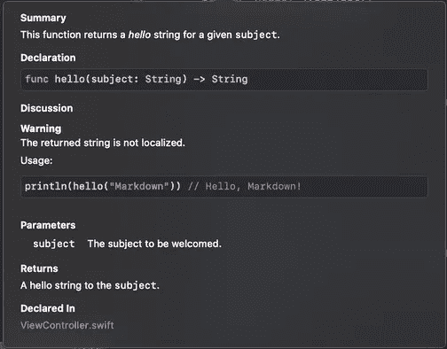
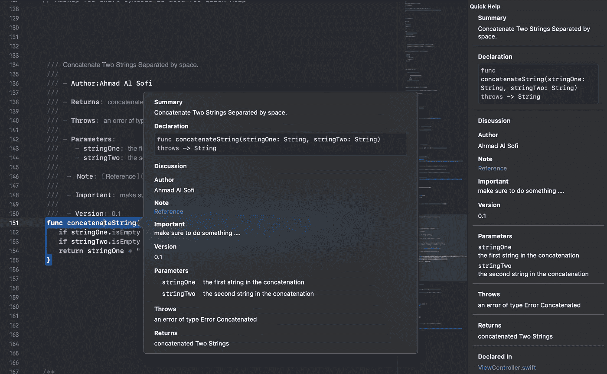
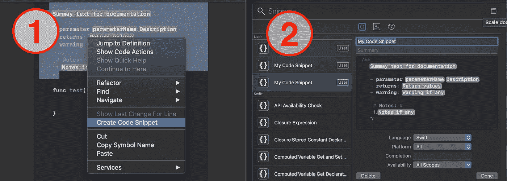

# 用 Xcode 编写代码的指南

> 原文：<https://betterprogramming.pub/guide-to-documenting-code-in-xcode-8075a382e245>

## 注释、多行注释、代码样式的注释等等


在本文中，我将解释在您使用 Swift 编写代码时，向您的代码中添加文档/注释的最有效和最简单的方法。

# 评论

使用代码中的注释来阐明正在发生的事情。它不会与您的代码一起执行—它只是为了文档的目的而编写的，

行内注释:

```
// storing user name**var** userName: String?
```

多行注释:

```
/*multi
line
comments*/
```

# 代码文档

您可以使用标记来编写操场和代码文档注释。根据[苹果文件](https://developer.apple.com/library/archive/documentation/Xcode/Reference/xcode_markup_formatting_ref/):

> 操场的标记包括标题和其他元素的页面级格式、字符的格式跨度、显示内嵌图像以及其他一些功能。
> 
> Swift 符号的标记用于快速帮助和符号完成”中显示的描述

好的，为了更清楚起见，我将举一些例子:

```
/// This function returns a *hello* string for a given `subject`.
///
/// - Warning: The returned string is not localized.
///
/// Usage:
///
///     print(hello("Markdown")) // Hello, Markdown!
///
/// - Parameter subject: The subject to be welcomed.
///
/// - Returns: A hello string to the `subject`.
func hello(subject: String) -> String {
    return "Hello, \(subject)!"
}
```



```
/// Concatenate Two Strings Separated by space.
///
/// - Author: Ahmad Al Sofi
///
/// - Returns: concatenated Two Strings
///
/// - Throws: an error of type Error Concatenated
///
/// - Parameters:
///     - stringOne: the first string in the concatenation
///     - stringTwo: the second string in the concatenation
///
///  - Note:[Reference](https://stackoverflow.com)
///
///  - **Important**: make sure to do something ....
///
///  - Version: 0.1func concatenateString(stringOne: String, stringTwo: String) **throws** -> String { **if** stringOne.isEmpty {**throw** ErrorConcatenated.EmptyString1}
   **if** stringTwo.isEmpty {**throw** ErrorConcatenated.EmptyString2} **return** stringOne + " " + stringTwo
}
```



# 解决方案

想象一下，我们有大量的代码需要记录。那总是令人讨厌的，对吗？

这里是解决方案:我将解释你如何在做文档时使用 Snippet，以便节省你的时间，使过程更快更容易。此外，这将有助于确保整个项目只有一个标准。

将以下代码复制并粘贴到 Xcode 中。您可以自定义它来满足您的需求。

```
/**
<#Summay text for documentation#>

- parameter <#parameterName#>: <#Description#>.
- returns: <#Return values#>
- warning: <#Warning if any#>

 # Notes: #
 1\. <#Notes if any#>*/
```



您可以使用`cmd + shift + L`打开代码片段。

# 结论

要在网页(HTML)中生成你的文档，我强烈推荐 [Jazzy，](https://github.com/realm/jazzy)就是为此而建的。

感谢阅读！