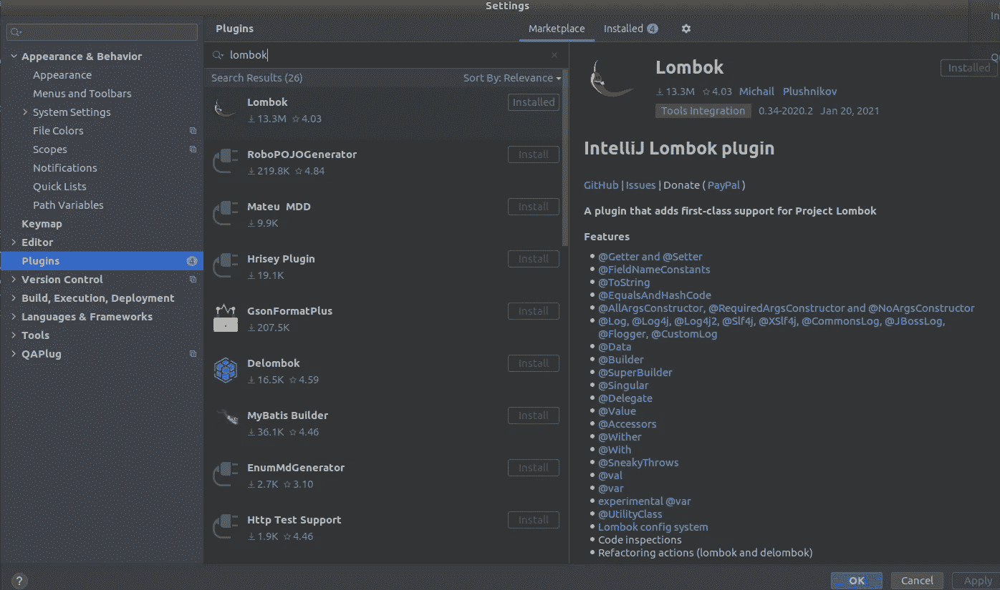
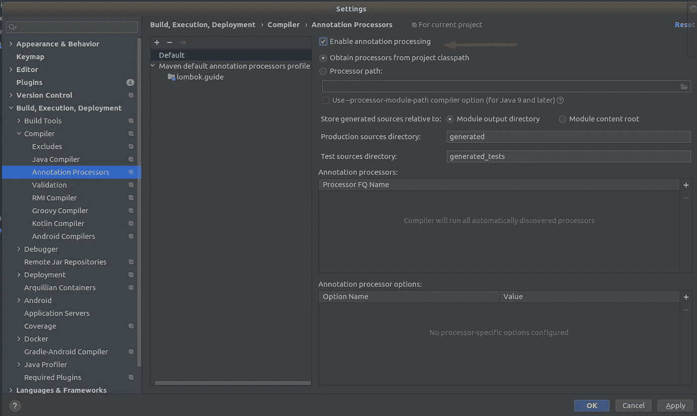
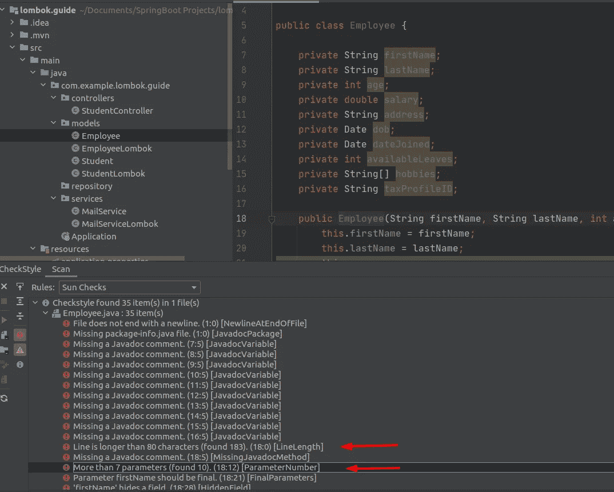
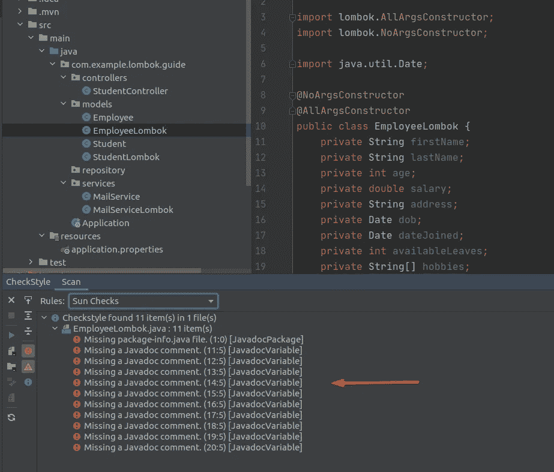
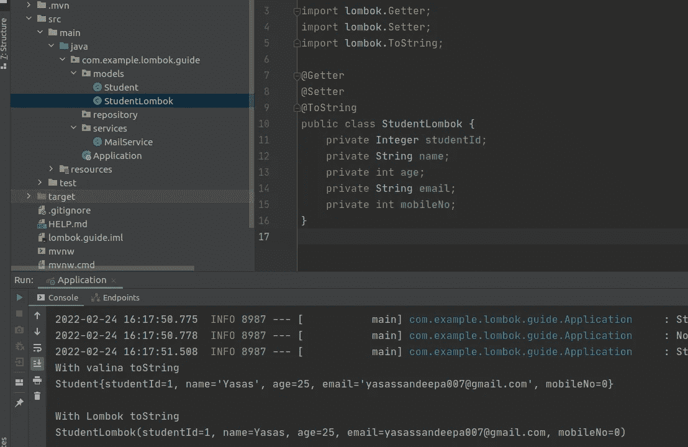
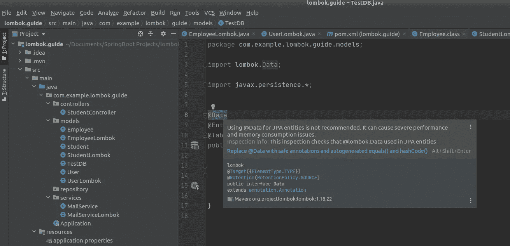
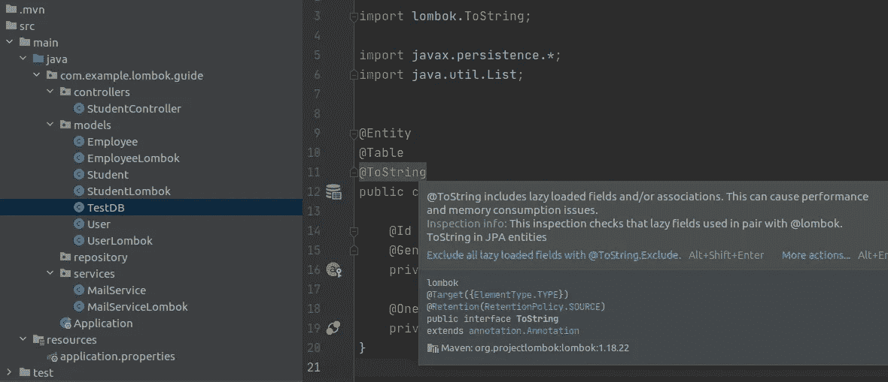
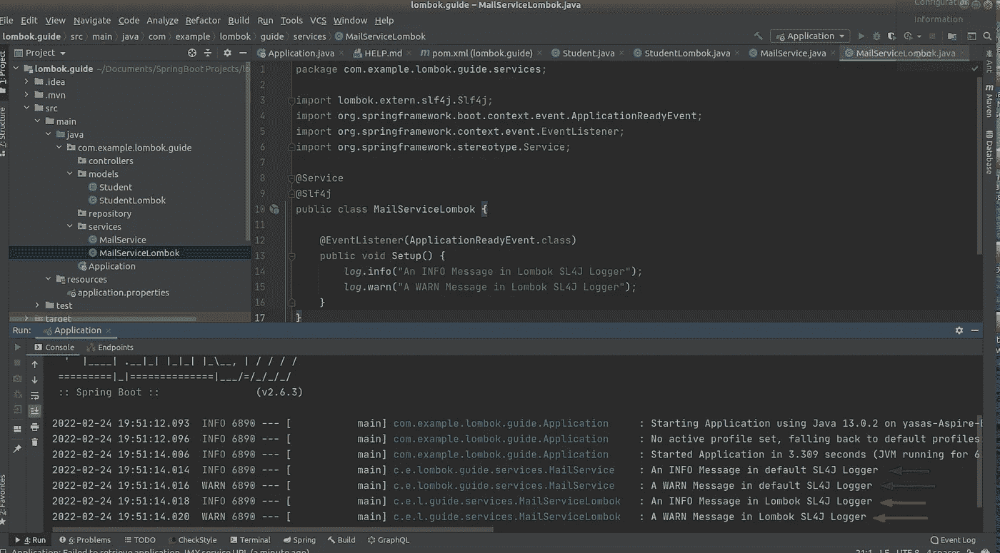
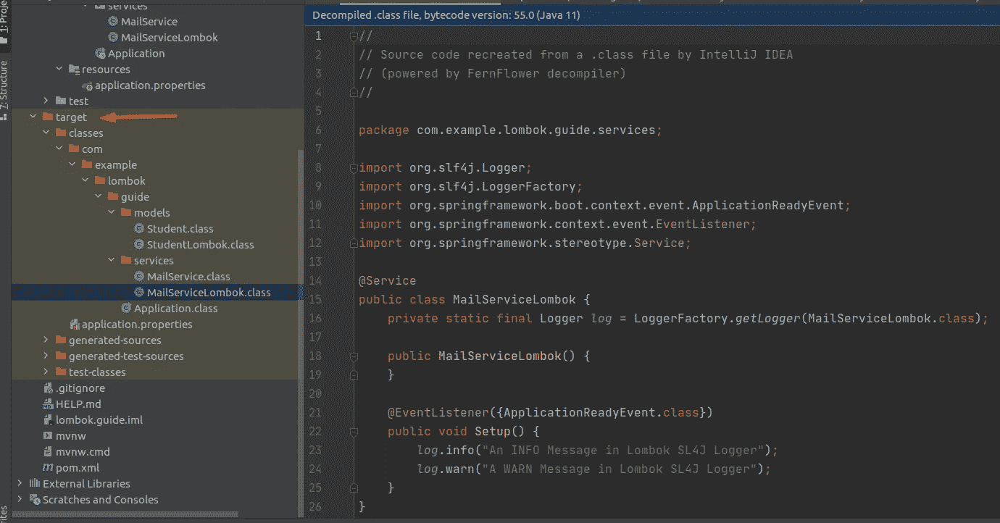

# Spring Boot 龙目岛旅游指南

> 原文：<https://betterprogramming.pub/guide-to-lombok-with-spring-boot-164f9970c9fa>

## 最常用的 5 个注释和隐藏问题


由 Yasas Sandeepa(作者)设计的图像

想象一下，你在一个新创建的应用程序中看到一堆样板代码，你需要清理它们。如果你知道龙目岛，你一定会尝试一下。但是要小心！你可能不知道用那个会有什么后果！

所以今天，我打算给你带来 Lombok 中最重要和最广泛使用的注释以及它们的局限性。这将使您清楚地了解如何在您的项目中使用 Lombok。

对于那些不熟悉 project Lombok 的人，我将简单介绍一下。

# 什么是龙目岛？

根据官方文档，“Project Lombok 是一个 java 库，可以自动插入到你的编辑器和构建工具中，为你的 Java 增添趣味。”它基本上是一个注释处理器，在编译时向类中添加代码。

# 为什么是龙目岛？

Lombok 的主要优势是它最小化/删除了样板代码，节省了开发人员在开发过程中的宝贵时间。在最好的情况下，它可以将数百行代码替换为仅五行。

它增加了源代码的可读性(干净的编码)，并通过减少代码行来节省空间。此外，它还可以消除应用程序中误导性的日志问题。

# 如何安装

Lombok 支持所有主要的 ide，比如 IntelliJ、Eclipse、Netbeans，甚至在 VS 代码中。这里我使用 IntelliJ，因为它是最广泛使用的 Java IDE。如果你想知道如何设置一个不同的 IDE，请阅读官方文档[这里](https://projectlombok.org/setup/overview)。

从 IntelliJ 版本 [2020.3](https://www.jetbrains.com/idea/whatsnew/2020-3/#other) 开始，你不再需要配置 IDE 来使用 Lombok。但是对于旧版本**，**你需要有 IntelliJ Lombok 插件。



IntelliJ 中的 Lombok 插件(图片来自作者)

您还需要启用注释处理。在 IntelliJ 中，转到文件->设置->构建、执行、部署->编译器->注释处理器。选择“启用注释处理”复选框。



启用注释处理(按作者分类的图像)

如果您在 spring boot 项目中使用它，您还需要将这个 maven 依赖项添加到项目的 pom 文件中。

好吧！我们来看看 Lombok 中使用最多的注释有哪些。

# 1.@Getter 和@Setter

当你需要一个封装时，你显然会选择 getters 和 setters。但是您知道每个字段需要多少样板代码。

Lombok 解决了这个问题。如果想生成 getters 和 setters，只需用`@Getter`和`@Setter`注释对类进行注释。

不带 Lombok(普通 Java):

与龙目岛:

看看 Lombok 如何减少样板代码。此外，您可以根据自己的意愿将 getters 和 setters 逐个添加到每个变量中。

Lombok 还引入了一个惰性 getter，可以用来缓存一次数据，并允许通过 getter 进行访问。它将检索一次数据，然后缓存数据以允许在应用程序中进行内存读取。

```
@Getter(lazy = true)
private final Map<String, Long> transactions = getTransactions();
```

但是在生成 getters 和 setters 时，Lombok 中有一个已知的问题。Lombok 为变量/属性生成了错误的 getters 和 setters，它们被命名为第一个 char 小写和下一个 char 大写。

假设你的类中有一个实例变量`pCodeNo`。因此，如果我们手动生成 getters 和 setters，它们将如下所示。

*注意:这是正确的做法！*

但是对于 Lombok，它也会大写第一个字母。它生成如下内容:

虽然这是正常的行为，但这是不正确的，当您使用 Spring Boot 定义 API 时，可能会出现问题。

此外，在具有业务逻辑的类中使用带注释的 getters 和 setters 没有任何好处。所以根据你的要求，明智地使用 Lombok。

# 2.@NoArgsConstructor 和 **@AllArgsConstructor**

构造函数是一种用于初始化对象的特殊方法。Lombok 提供了三个注释来创建构造函数，但其中两个是常用的。

*   `@NoArgsConstructor`生成一个没有参数的默认构造函数。
*   `@AllArgsConstructor`生成一个构造函数，它要求注释类中的每个字段都有一个参数。

但是如果需要自定义的参数化构造函数，就需要显式编写。

此外，Lombok 提供了一个`@RequiredArgsConstructor`来生成一个带有必需参数的构造函数。必需的参数是最终字段和带有约束(如 not null)的字段。

不带龙目岛:

与龙目岛:

所以，如你所见，我们可以用更少的代码用 Lombok 写同样的类。此外，您不需要为新创建的字段生成新的 getters 和 setters。

但缺点是:它不提供任何代码违规错误。

作为优秀的开发人员，我们总是需要确保代码是标准格式的。您可以使用分析工具，如 [Checkstyle](https://checkstyle.sourceforge.io/) 、 [Sonar](https://docs.sonarqube.org/latest/) 等。，检查 Java 源代码是否符合指定的编码规则，并持续检查代码质量。

参见下面的`Employee`类作为例子。Checkstyle 工具给出分析，并显示错误和警告。



普通 Java 类中的 Checkstyle 错误(图片由作者提供)

但是 Lombok 注释隐藏了这些错误和警告。



Lombok 注释类中的 Checkstyle 错误(图片由作者提供)

所以在添加 Lombok 之前，你需要确保你的代码是符合标准的。不要隐藏 Checkstyle 或 Sonar 违例，而要修复它们。这就是为什么在实现任何东西之前，不应该在类中添加 Lombok 注释。

# **3。@ToString**

方法用来返回一个对象的字符串表示。

默认情况下，它返回一个字符串，该字符串由类名、后跟`@` 符号以及对象散列码的无符号十六进制表示组成。所以，我们需要覆盖`toString()`方法来打印对象的实际值。

不带 Lombok(IntelliJ 生成的 Vanilla `toString()`方法):

与龙目岛:



@ToString 方法有无 Lombok(图片由作者提供)

两者都提供相似的输出，但是 Lombok 减少了样板代码。代码更少，复杂性更低！但是在某些情况下使用这个注释有一个问题。我会在下面的`Data`注释之后再解释。

# 4.@数据

该注释是一个一体化的特殊注释，它将`@RequiredArgsConstructor`、`@Getter`、`@Setter`、`@ToString`和`@EqualsAndHashCode`注释的功能捆绑在一个注释中。

它为所有字段生成`getters`，为所有非最终字段生成`setters`，一个初始化所有最终字段的构造函数，以及适当的`toString`、`equals`和`hashCode`方法。

不带龙目岛:

与龙目岛:

看看减少了多少行代码！

有一个缺点就是有时候我们真的不会用这些方法。例如，我们可能不需要 equals 和 hashcode 实现。

作为一个最佳实践，我们的代码库不应该有任何我们不使用的东西。无论我们写什么代码都必须有存在的理由。如果没有，我们应该删除它们。因此，如果您没有使用大多数方法，就不要盲目地添加这个注释。您可以通过分解`@Data`注释来单独使用注释。

此外，当您将 Lombok 与 JPA 一起使用时，它可能会引入一些危险的陷阱。误用 Lombok 会影响 JPA 应用程序的性能，甚至使它们崩溃。



IntelliJ JPA Buddy 插件向开发者发出警告(图片由作者提供)

这个警告来自于`hashCode()`实现，因为没有我们可以依赖的字段来计算 hashCode。

在懒惰的`@OneToMany`上调用`hashCode()`可能会获取它包含的所有实体。这很容易影响应用程序的性能。

这也适用于前面提到的`@ToString`注解。



IntelliJ JPA 好友插件警报(图片由作者提供)

通过排除所有惰性字段，`@ToString`注释仍然可以使用。但是我建议您避免在 JPA 实体中使用`@Data`、`@EqualsAndHashCode`和`@ToString`注释，因为您不需要意外地影响应用程序的性能。

# 5.用 sl4j 记录— @sl4j

日志记录是开发的一个重要部分，它记录系统在任何给定时间点执行的事件。您需要正确地写日志，以便识别问题并查看是否一切都按预期运行。

但是设置日志记录非常麻烦，因为我们每次都需要在类中定义日志记录器来访问日志记录器。

```
Logger log = LoggerFactory.getLogger(Example.class)
```

在大多数情况下，开发人员会将代码从一个类复制并粘贴到另一个类。但是有时他们会忘记更改类名，从而导致错误的日志。

Lombok 提供了一个更好的解决方案。您可以使用`@Sl4j`注释来删除样板代码。此外，Lombok 还支持其他日志框架，如`Log`、`Log4j`、`@JBossLog`、`@Flogger`等。

希望大家注意到最近曝光的`log4j`零日漏洞问题。所以你应该更加小心地使用这些记录器。

不带龙目岛:

与龙目岛:

看看这有多简单。您只需要添加注释。



Sl4j 注释(图片由作者提供)

在实现构建器模式时，会用到更多类似于`@Builder`的注释。但我个人会建议不要用，因为重构非常困难。

另外，小心使用`@UtilityClass`注释，因为它对静态导入无效。因为静态导入是在注释处理器运行之前解析的。

您可以随时对代码进行解耦，以检查注释是否给出了预期的结果。运行应用程序后，检查目标文件夹中由 Lombok 生成的代码。



目标文件夹中解除锁定的代码(图片由作者提供)

# 资源

*   龙目岛官方文件— [龙目岛项目](https://projectlombok.org/)。
*   GitHub 上的[提供了示例的源代码。](https://github.com/Yasas4D/LombokGuide)

# 结论

Lombok 是一个由大型社区支持的非凡项目，在减少现有实现的样板代码方面做得很好。但是这种权力伴随着巨大的责任。在添加注释之前，您必须先学习它。

所以我的建议是先写普通的 Java 代码。它会让你对大局有一个清晰的认识。然后检查声纳或任何其他工具的任何违规行为。如果一切顺利，您可以添加 Lombok 来减少样板代码。

不要一味的加，要聪明的用。让世界变得更美好的更好的编程！

感谢阅读。我希望这有所帮助。如果您有问题或反馈，请随时回复。

编码快乐！👨‍💻❤️