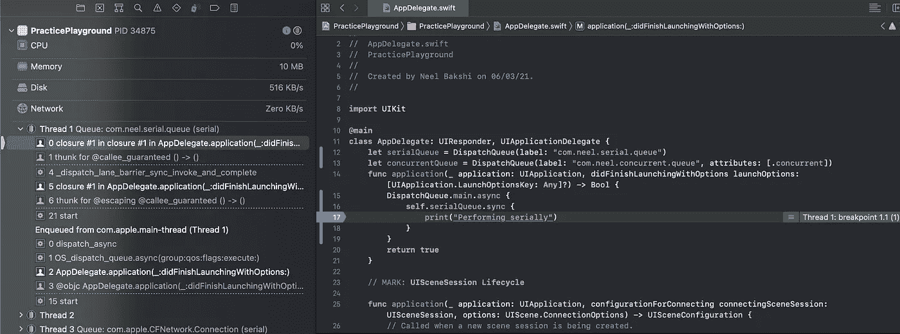
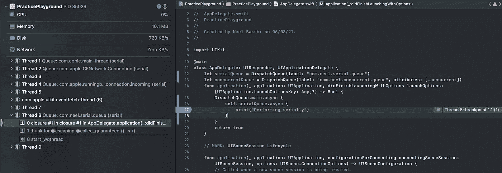

# 多线程指南 iOS 中的 GCD

> 原文：<https://betterprogramming.pub/guide-to-multi-threading-gcd-83009f5d62cb>

## 编写并发代码

约翰·安维克在 Unsplash[上的照片。](https://unsplash.com?utm_source=medium&utm_medium=referral)

如今，移动设备配备了大量强大的 CPU 供其使用。这让你有能力制作高性能的应用程序。想象你的应用程序是一个图片库应用程序，你必须建立一个光滑的用户界面，用户可以与它互动，同时上传和下载他们的 25MB 高清图像。

你绝不会希望你的应用程序在上传或下载图像时停止响应用户的触摸(反之亦然)。因此，为了确保你不会在这种情况下结束，你需要确保这两者可以发生而不会相互影响。这就是多线程概念的由来。

多线程是一个广泛的概念，它使开发人员能够将*并发性*或*并行性*注入到我们的软件中，以便我们的软件需要执行的任务可以通过优化使用 CPU 的时间来执行。

*   并行性:多个任务并行一起运行的过程。
*   并发:这是一个给人多个任务并行运行错觉的过程。任务以这样一种方式被划分，它们被时间分片，以一种优化的方式占用 CPU 的时间，但是它们实际上并不是并行运行的。

在实际场景中，实现纯粹的并行性是不可实现的，因为有许多后台进程一直在设备中运行。因此，有时任务会并行运行，有时会并发运行。

通常有三种方法可以在 iOS 应用中实现多线程:

1.  线
2.  [GCD —大中央调度](https://developer.apple.com/documentation/DISPATCH)
3.  操作和`OperationQueues`

在本文中，我们将探索 Grand Central Dispatch，让您的应用程序充分利用多线程。

# 中央调度中心

这可能是在您的应用程序中支持多线程的最常用的工具包。Grand Central Dispatch(或 GCD **)** 是一个面向开发人员的低级 API，用于创建管理线程池的队列，或者为我们提供一些系统生成的队列来同步或异步执行任务。让我们把这个描述分成三个部分:

*   创建队列或使用系统生成的队列。
*   管理线程池。
*   同步或异步执行任务。

句子的第一部分使用了术语*队列*。什么是队列，队列是用来做什么的？

队列是一种数据结构，其行为类似于现实生活中的队列。你排在队伍的最后，在你前面的人都离开队伍后你才出来。

在 GCD 的上下文中，这些队列用于调度计算密集型任务。您将一个任务放入队列中，它就会被执行(稍后将详细介绍)。

GCD 跟踪所有由您创建或由系统提供的队列。

# 创建队列

在此之前，让我们先弄清楚:队列不是线程！

可以创建两种类型的队列:

1.  串行队列—一次只能运行一个任务。他们通常以先进先出的方式工作。理想情况下，只有一个线程与串行队列相关联。
2.  并发队列—可以同时并发或并行运行多个任务。根据系统限制，可能有一个或多个线程池。

您可以通过以下方式创建队列:

*   `label` —队列的名称。
*   `[qos](https://developer.apple.com/documentation/dispatch/dispatchqos/qosclass)` —也称为服务质量。按照优先级顺序，有五个级别的 QoS:

1.  `userInteractive`
2.  `userInititated`
3.  `default`
4.  `utility`
5.  `background`

*   `attributes` —您可以指定队列是否需要并发。如果没有指定，它是一个串行队列。
*   `[autoreleaseFrequency](https://developer.apple.com/documentation/dispatch/dispatchqueue/autoreleasefrequency)` —指定如何自动释放由提交到队列的操作块创建的对象。
*   `target` —指定可能是最适合运行任务的队列的目标队列。

您还可以使用一些系统生成的队列来执行您的任务。

*   `DispatchQueue.main` —管理应用程序主线程的串行队列。
*   `DispatchQueue.global` —管理线程池的并发队列，其中任务可以基于`qos`参数被调度运行。

# 执行任务

有两种方法可以执行分派队列中的任务:

1.  `async` —块被提交到队列并立即返回。然后，当系统有资源执行该块时，将执行该块。
2.  `sync` —提交到队列的块就像一段内嵌代码一样被执行。它将阻塞当前线程的执行，执行提交给它的代码块(在调用线程上——稍后将详细介绍),然后继续执行剩余的代码。

队列总是以 FIFO 的方式执行任务。不管是串行队列还是并发队列。较早提交的块在随后提交的块之前开始执行，尽管它们可能在不同的时间结束。

# 调度组

一个`DispatchGroup`用于并行执行不相关的任务，然后在所有任务完成后对它们做出反应。尽管这与 GCD、线程和队列的一般主题无关，但是了解这个类是很重要的，因为您可能会非常频繁地使用它。

使用`DispatchGroup`时，你需要记住三个主要功能:

1.  `enter`
2.  `leave`
3.  `notify`

当您调用`enter`时，`DispatchGroup`递增计数器，当您调用`leave`时递减计数器，如果计数器值为`0`则调用`notify`。

这是如何使用一个`DispatchGroup`:

1.  在每一个需要执行的`DispatchWorkItem`(代码块的别称)之前调用`enter`。
2.  当你的`DispatchWorkItem`完成后，呼叫`leave`。
3.  设置一个`notify`块，该块将在`DispatchGroup`执行完所有`DispatchWorkItems`后执行。

只是注意不要在调用`enter`之前声明`notify`块。否则，将立即调用`notify`模块(因为`DispatchGroup`中的计数器从`0`开始计数)。

# 竞赛条件

没有对竞争条件以及如何避免它们的讨论，任何线程主题都是不完整的。但是首先，让我们了解一下竞争条件。

让我们举一个简单的例子，你运行一个电子商务网站管理面板，有一个功能，通过它你可以为有效投诉的客户退款。

客户向您要求退款，您按照以下基本步骤进行退款:

1.  投诉有效吗？
2.  退款已经处理了吗？
3.  处理银行退款。
4.  通知客户退款状态。

有一天，你注意到你已经为同一个订单给一个顾客退了两次款。这种情况的原因很容易是一个竞争条件。假设客户分别发出两个退款请求。

*   退款请求 1 →第一次收到订单退款→处理退款。
*   退款请求 2(当`Refund Request 1`仍在处理中)→ `order.refund.isProcessed`仍在`false` →处理第二次退款。

由于这两个请求都是在多线程环境中处理的，很有可能在处理第一个退款请求时，第二个退款请求进来并检查了`order.refund.isProcessed`仍然是`false`，即使您已经准备好了所有的当前检查，也需要为客户启动退款。

因此，您可以看到`order`是一个跨线程共享的资源(即它是一个“共享资源”)。

当多个线程试图在并发或并行执行中访问同一资源时，就会发生争用情况。

既然知道这样的问题可以存在，那就来看看怎么解决吧。

# 解决方案 1 —串行队列

第一种选择是连续处理操作(在我们的例子中是退款)(即只有在第一次退款完成后才会处理第二次退款)。我们可以修改我们的代码，通过将所有退款代码放入一个串行队列中来串行处理退款。

## 僵局

这里要注意的一点是，串行队列带来了额外的缺点，即您仍然可能在串行队列上以死锁告终。

调用串行队列操作中的`sync`调用操作会导致死锁。

例如:

上面死锁的原因是由于`Block 2`是在`serialQueue`中执行的，它在等待`Block 1`完成执行，但是`Block 1`无法完成其执行，因为`Block 2`正在试图运行。采访中经常被问到的一个最好的例子是在主线程上调用一个`DispatchQueue.main.sync`。这将导致应用程序因死锁而崩溃。

始终确保不要在运行于同一串行队列的任务中调用该串行队列的`sync`。并发队列不存在这个问题。

## 同步

我想讨论在队列中同步运行代码块的效果，但在此之前，我们需要理解当前/调用线程的概念。

当前或调用线程是在其上调用同步任务的线程。

假设您执行了以下任务:

在这段代码中，`serialQueue.sync`代码运行在`main` `DispatchQueue`内部。我们知道主队列将被阻塞，直到`serialQueue`完成执行它的`print("Performing serially")`语句，因为同步调用本质上是阻塞的。

因此，执行此操作的当前线程是主线程。

DispatchQueue 上的同步调用

我执行了前面提到的代码片段，从左边的线程分析器面板可以看到，`print`语句实际上运行在主线程(当前线程)上，但它是通过我创建的`serialQueue`执行的。

让我们对比一下同一队列上的一个`async`调用:

DispatchQueue 上的异步调用

对于`async`调用，您可以看到`print`不再在主线程中执行，而是在其他一些后台线程(本次运行中的线程 8)中执行。

`sync`调用总是在当前/调用线程上执行，而`async`调用可能在当前/调用线程上被调用，也可能不被调用。

上面的语句是一个优化，使得`sync`块中的代码可以在同一个线程中执行(因此使其阻塞)。

这里一个自然的问题可能是“如果要在同一个线程上调用，为什么还要使用一个`sync`调用呢？为什么我不能直接内联编写代码，而不必将它放在不同队列的`sync`调用中？”

这样做的原因是为了防止数据竞争问题。您通常不在主调度队列上进行同步调用，而是在您创建的调度队列上进行同步调用，以确保您同步了对特定资源的读/写访问。这样，您可以确保您的资源是线程安全的。

在后面的部分中，我们将讨论一个关于访问资源的小案例研究。

尽管如果你从当前线程中调用`DispatchQueue.main.sync`，它总是在主线程中执行。

这是我们之前讨论的一个小例外，我们看到`sync`调用通常在调用/当前线程上执行。但是通过主队列`sync`调用执行的代码将总是在主线程上运行，而不是在调用线程上运行。

# 锁和信号量

锁是确保对“共享资源”的访问是同步的并且不能被同时访问的另一种方式。

这是使用`NSLock`类完成的:

# 调度障碍

屏障是队列中唯一执行的代码块(即，在屏障块需要完成执行之前提交到队列的所有块，然后屏障块执行，然后所有其他块执行)。

屏障在串行队列中没有意义，因为在串行队列中一次只有一个块执行。

在并发队列中，您可以使用屏障标志来调度屏障块。因此，我们的退款示例将如下所示:

# 案例研究—单身

singleton 模式是 iOS 开发中非常常见的模式，也是可能出现竞争情况的最佳案例之一。我将在这里讨论一个非常简单的 setter/getter(而不是 singleton 模式到底是什么):

在上面的类中，`assets`数组是一个共享资源，当前可以从任何队列中读取和写入，这可能会导致竞争情况。一个常见的竞争条件问题被称为[读者-作者问题](https://www.google.com/url?sa=t&rct=j&q=&esrc=s&source=web&cd=&cad=rja&uact=8&ved=2ahUKEwiU6O3S9dHuAhUHzTgGHXK4Dz8QFjAXegQIGxAC&url=https%3A%2F%2Fen.wikipedia.org%2Fwiki%2FReaders%25E2%2580%2593writers_problem&usg=AOvVaw1btL84VFOmqtbhQmZ_BjoG)。

为了解决读写问题，我们需要序列化对共享变量`assets`的访问。

我们已经有三种方法可以序列化对资源的访问，但是对于这里的情况，我们将使用 barrier 解决方案(您可以继续使用任何最适合您的用例的解决方案)。

1.  首先，将变量设为私有变量，这样外部的任何人都不能访问它。
2.  然后为这个单例类创建一个私有队列。
3.  提供序列化对该资源的访问的函数(`assets`)。

关于这个类需要注意一些事情:

*   这里，我们必须调度对线程的同步调用，因为读取通常必须是同步的。根据您的使用情况，您也可以随时进行`async`呼叫。
*   如果您仔细观察，`getAssets()`将在`async`块中发出一个`sync`调用，这是允许的，因为这是一个并发队列。

假设这是一个并发队列，在`async`块内调用`sync`块(或`sync`块)不会有任何问题，但是如果这是一个串行队列在`async/sync`块内调用`sync`块，就会导致死锁！

# 结论

在本文中，我们了解了以下内容:

*   多线程与并行性
*   `DispatchQueues`
*   `DispatchGroups`
*   `sync`对`async`
*   竞态条件以及如何解决它们
*   同步调用中实际发生了什么
*   一个

在阅读`sync`和`async`在串行队列和并发队列中执行时的行为时要特别小心。此外，请确保您了解这两种队列中任务的执行顺序。

打开一个游戏场，执行你能想到的所有不同的组合，尝试推理执行的顺序和它们被执行的线程，然后回来用你在这里读到的理论进行验证。这会让你更好地理解主题，也有助于你记忆。