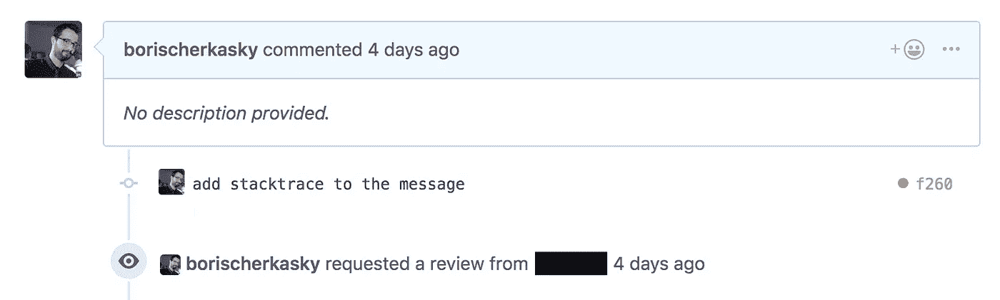
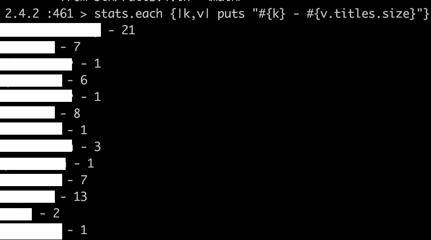

# 黑客和自动化！从 GitHub 收集拉请求统计信息

> 原文：<https://betterprogramming.pub/hack-and-automate-scripting-pull-request-statistics-from-github-3e949ebd5faa>

## 有时候，快速修改的脚本比完美的代码更有趣

令人惊讶的是，我最喜欢的职业是*而不是*设计需要处理数千个并发请求的超级复杂系统。

它是编写小的、大多是粗糙的脚本来解决和自动化我遇到的简单的日常问题。

在过去的一个月里，我开始对我们团队中处理的代码审查的数量以及一个简单的事实感兴趣，即在我们的计划中，它不一定被计划和划分为一个工作负载。

知道你要做多少工作，并估计所需的努力是敏捷方法的基石之一。要真正理解它，需要实际的数据和统计，并且您可能会猜到手工计算拉取请求是不可能的。

我欢迎你和我一起，利用 [GitHub API](https://developer.github.com/v3/pulls/) ，简单回顾一下我使用 Ruby 的四小时黑客之旅。我们将从“只是一个想法”到我们团队的拉请求负载的具体统计。

我并不认为建议的解决方案是最优的，但是它确实有效，并为我提供了我需要的数据。我希望这篇短文能启发你使用可用的 API 来做一些很酷的事情。

# 开始:认证

我们从创建一个[个人访问令牌](https://help.github.com/en/articles/creating-a-personal-access-token-for-the-command-line)开始，即使在早期我也有一些问题。

我们应该注意到，出于良好的安全相关原因，当我创建的令牌没有足够的权限时，GitHub API 不会返回 401 未授权响应。相反，[它返回含糊的“404 未找到”响应](https://developer.github.com/v3/troubleshooting/)。

我花了一段时间才明白我调用了正确的端点，只是使用了一个权限不足的令牌。因此，创建一个具有更多权限的新令牌帮助我通过了第一个障碍。

# 脚本 101 和 Github API 101

大多数时候，我需要写一些我不熟悉的东西，我只是开始玩结果。所以我做的第一件事是执行对拉请求 API 的调用并得到结果。这个简短的脚本涵盖了它:

从 GitHub API 获取一个拉请求

为了更好地理解结果，您可以使用 [API 文档](https://developer.github.com/v3/pulls/)，或者通过打印结果散列的键并使用它来熟悉结果。这就是我所做的，因为这比阅读文档有趣得多。

既然我知道了单个拉请求的结果是什么样的，那么是时候弄清楚如何获得所有的结果了。

# 页码

熟悉 web APIs 并知道 GitHub 可能正确地实现了它，我知道我将使用[分页](https://developer.github.com/v3/guides/traversing-with-pagination/)——通常，它在标题中。
幸运的是，GitHub 真的让我们开发人员很容易做到这一点，我们可以浏览我们持有的当前响应页面。

我们可以很容易地提取下一页的端点:

从当前结果解析下一页 URL

对由此方法提取的端点执行 HTTP GET 请求将返回下一页结果。

我们现在准备尝试并实现从 GitHub 获取 pull 请求数据的完整过程。

# 尝试 1:如此接近，却又如此遥远

我最初的设计非常简单:

1.  从[的拉取请求 API](https://developer.github.com/v3/pulls/#list-pull-requests) 获取过去一个月的所有拉取请求。
2.  放弃所有与我的团队无关的请求。
3.  对于每个拉取请求，获取请求的审阅者列表。

这个设计的问题是，当我在我们团队的主回购上执行我的脚本后，结果说我们几乎没有审查任何东西，我知道这不是真的，因为这次冒险的催化剂是量化和测量我们已经很大的审查工作量。

原因是当一个评审者接受评审请求时，[它们被 pull 请求的被请求评审者](https://stackoverflow.com/questions/44965073/how-do-i-get-the-list-of-reviewers-for-a-pull-request-using-github-api)丢弃。那真是令人失望，给我留下了白白浪费周末下午的坏印象。

# 尝试 2:利用时间轴 API

这需要一些挖掘，但 GitHub 不久前发布了一个新的预览 API—[时间轴 API](https://developer.github.com/v3/issues/timeline/) 。本质上，它是您在拉请求的主页上看到的内容，对我来说，这意味着我可以找到作者请求用户审阅的事件:

问题时间表示例

因为它是一个预览 API，所以我需要在我的 HTTP GET 请求中添加一个 accept 头来实现这个功能:

预览标题

我的工作设计变成了:

1.  从[拉请求 API](https://developer.github.com/v3/pulls/#list-pull-requests) 获取上个月的所有拉请求。
2.  放弃所有与我的团队无关的请求。
3.  对于每个拉取请求，从[时间线 API](https://developer.github.com/v3/issues/timeline/) 获取发布时间线。
4.  从时间轴中，获取类型为`review_requested`的事件。
5.  算上审稿人。
6.  利润！

在给脚本运行几分钟后，我得到了我的团队的评审负载统计数据。

# 结果呢

每个团队成员的代码审查——我设法收集的度量之一

在上面的截图中，您可以看到每个团队成员的评审指标。正如所怀疑的，我们正在做大量的代码审查，现在我们可以估计工作量并将其添加到我们的春季计划中。另一个意想不到的发现是审查工作量分布不均匀——有了数据，我们可以解决这个问题。

在度过了一个有趣的周六下午编写这个解决方案后，我们的一个团队领导展示了一个更健康的解决方案:[拉提醒](https://pullreminders.com/)。挺牛逼的。

# 最后的想法

现在来看一个不可避免的问题:我们能用这些指标做什么？为什么我把一半的周末都花在了黑客上(除了超级有趣之外)？

首先，我重复我自己，现在我们可以量化(从真实数据和真实数字)我们正在做多少审查，因为代码质量、标准和知识共享并不便宜，我们可以将其添加到我们的 sprint 估计中——并且在我们的交付估计中更加准确。

其次，我们可以在 sprint 期间测量这些指标，并确保工作负载均匀分布——并且不会产生评审/知识瓶颈。

最后，我们可以为我们团队对代码质量的协作和奉献感到非常高兴——我们都在其他人的代码上投入了大量的时间。

# 完整代码

至于我用的[全剧本](https://gist.github.com/borischerkasky/7acc8b19e7b5c6b044bf92ab6f467126)，就这样吧:

完整的统计计算脚本