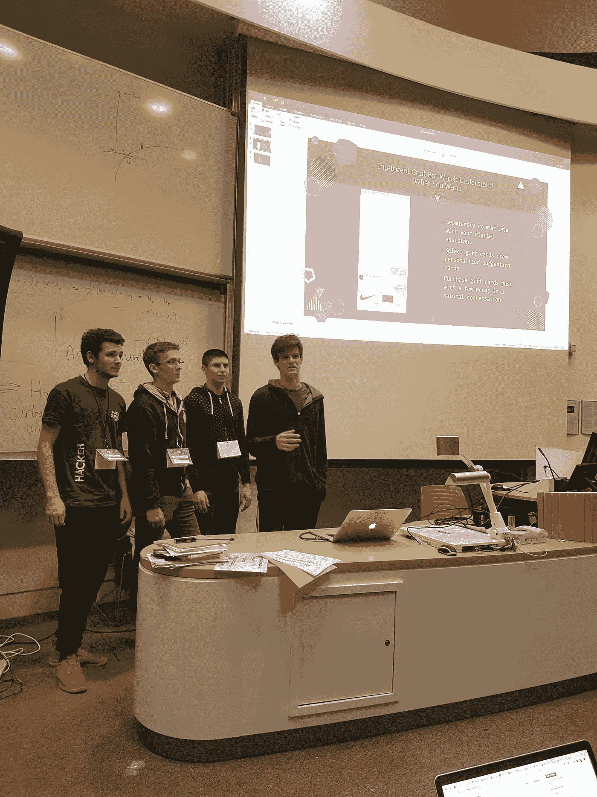
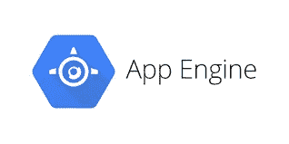
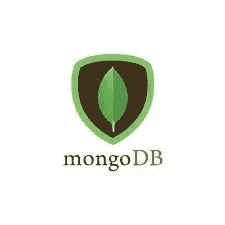

# 黑客马拉松赛季清单

> 原文：<https://betterprogramming.pub/hackathon-season-checklist-b348f0f5e5fb>

Alex Kotliarskyi 在 [Unsplash](https://unsplash.com/search/photos/hacker?utm_source=unsplash&utm_medium=referral&utm_content=creditCopyText) 上的照片

我在 HackSussex，这是我在 2018-2019 赛季的第一次黑客马拉松。我干劲十足，希望也更大。我们走进大教室，那里的椅子形成了一个半月形，等待着被赞助公司为我们准备的惊人挑战弄得眼花缭乱。尽管有许多有趣的挑战，特别是劳斯莱斯星光头条挑战，我们还是决定参加 [RewardCloud 的](https://reward.cloud/)送礼机器人挑战。

挑战的重点是创造某种形式的聊天机器人，可以向人们建议礼品卡。由于一位朋友( [Kacper Kubara](https://github.com/KacperKubara) )对机器学习和通过训练有素的模型缓解人类生活的热情，我们对这个挑战很感兴趣。开发进行得相当顺利，但是，在集成和部署过程中出现了一系列问题，导致大部分应用程序无法使用。事实上，当我们去展示的时候，我们所有的实际工作是一个微不足道的命令行工具。

你可以看到在那 24 小时的紧张工作后，我们是多么的疲惫不堪

我之所以告诉你这个关于我们的错误的故事，是因为我们遇到的每一个问题都可以通过适当的工具和团队内部的沟通来解决。我无法教你如何更好地沟通。这是我们所有人都在不断经历的努力，但至少我可以为您提供正确的工具来抓住这个黑客马拉松季节的角，偷走所有您可能想要的“演示”和“赢家”贴纸。

**免责声明:**这不是关于如何使用这些技术的指南。这只是我用来让我的黑客马拉松项目尽快上线的工具列表。

这也是非常固执己见的，所以把你在这里看到的一切都全盘否定。这里介绍的每种工具都值得为其写一整篇文章，在我写这篇文章之前，许多人已经写了关于它们的文章。我将为我提供的每项服务提供进一步的阅读材料。本文还假设您可以访问 shell，并且知道如何使用 GitHub。如果没有，请查阅[官方文档](https://git-scm.com/doc)。

# 反应

React 徽标

你可能在想，“反应？哦，太好了。又一个盲目跳上宣传列车的假人。为什么我会选择 React 而不是任何其他前端框架？”

我理解你的沮丧。在过去的几年中，React 已经成为主流，你可能已经听到每个人和他们的母亲向你推荐它——如果你不使用它，声音似乎在说，你甚至是一个 web 开发人员吗？我将对此采取不同的观点，并从程序员的角度忽略 React 为您提供的好处。

我只想告诉你，我建议 React 的主要原因是因为你想要实现的大多数东西已经作为 React 组件存在于 npm 注册表中的某个地方。不相信我？查看 [Ant Design](https://ant.design/docs/react/introduce) 和这个[棒极了的 GitHub 库](http://github.com/brillout/awesome-react-components)，了解 React 组件的美丽世界。你想为 iPhone 和 Android 开发一个聊天应用程序，但又担心时间不够吗？只需使用【天赋聊天】(在此插入 npm reg)。

最后一句话引出了我对 React 作为黑客马拉松工具的第二点支持。一旦你掌握了它的窍门，你就离构建移动应用程序不远了。这就像一石二鸟。

开始就像安装节点并运行一样简单:

`npx create-react-app my-app
cd my-app`

然后，您可以通过修改`src`目录中的代码来破解。试着用`npm run start`运行这个应用，看看会发生什么。对于快速反应的初级读本，我建议你浏览一下官方文档。

# 网络生活

好吧，好吧，好吧…我已经建立了我的惊人的反应应用程序，每个人都会喜欢。但是我如何让公众可以使用它呢？我的朋友，Netlify 会掩护你的。他们提供免费服务，直接从 GitHub 库自动将 React 应用程序部署到他们的平台上。

使用 Netlify 很容易，因为它们提供了一个 CLI 工具。可以通过:`npm i -g netlify-cli`安装。在这之后，你所要做的就是用`netlify init`在你的应用目录中初始化 Netlify。确保选择`npm run build`作为构建命令，选择`./build`作为发布路径。如果您需要更多帮助来启动和运行它，请查看本[快速入门指南](https://www.freecodecamp.org/news/how-to-deploy-a-react-application-to-netlify-363b8a98a985/)。

# 表达

因为我们是从前端的 JavaScript 开始的，所以我认为最简单的前进方式是也在后端运行 JavaScript。为此，我们将使用 Express.js 作为我们的路由框架。

Express，顾名思义，只不过是一个路由微框架。这意味着它可以帮助您设计 REST API，并允许您通过在到达正确路线之前运行的中间件来扩展它。

您可以通过启动一个新的节点项目并将其添加为依赖项来开始使用 Express:

`mkdir my-app
cd my-app
npm init -y
npm i — save express
touch index.js`

之后，编辑您的`index.js`,如下所示:

用`node index.js`运行你的 app，访问 [http://localhost:3000/](http://localhost:3000/) 。你应该看到一个美好而友好的“你好，世界！”您现在已经准备好进行黑客攻击了。

# 应用引擎

我已经设计了一个很酷的 API，可以根据你的心情提供 cat GIFs，但是我现在在哪里托管它呢？这就是谷歌应用引擎发挥作用的地方。

在人们开始对我大喊大叫之前，我决定使用谷歌应用引擎而不是 AWS Elastic Beanstalk，因为许多 MLH 黑客马拉松都是由 GCP 赞助的，这可以转化为大量的免费积分(每人 100 美元)，可以在他们的平台上使用。

谷歌应用引擎是一项令人惊叹的服务，它让你专注于编码，并让 GCP 的好人们确保你的应用程序处理负载。在初始设置之后，它减少了部署一个应用程序的麻烦，只需要一个命令:`gcloud app deploy`。我可以给你演示一下这个服务，但是官方文档已经很好的完成了。

如果你们喜欢在后端运行其他东西，谷歌应用引擎为许多其他语言提供了[文档](https://cloud.google.com/appengine/docs/)。对于 Python，我会使用 [Flask](https://flask.palletsprojects.com/en/1.1.x/) 作为后端框架，对于 Ruby，我的建议是 [Sinatra](http://sinatrarb.com/) 。 [Rails](https://rubyonrails.org/) 有它的优势，但是它有更大的学习曲线。如果你决定走上 Rails 这条路，我会跟随迈克尔哈特尔的书。

# MongoDB

MongoDB 是一个非关系的、基于文档的数据库，允许您将文档存储为 JSON 对象。这使得从 Express API 与它交互变得非常容易。我建议使用 Mongoose，一个 MongoDB 对象文档映射器，使定义模型和与模型的交互变得更加容易和结构化。

对于 Mongoose，定义一个模型应该是这样的:

然后，您可以像这样在代码中使用它:

当你的应用上线时，你需要一些地方来存放你的数据库。我建议你使用的服务是 [MongoDB Atlas](https://www.mongodb.com/cloud/atlas) ，因为它易于使用和部署。它由所有主要的云提供商(AWS、GCP 和 Azure)提供服务，所以你可以选择存储数据的位置。

既然我们已经用 Express 设计了我们的 API，我建议你查看一下[这个关于将 MongoDB Atlas 数据库连接到你的 Google App Engine 服务的指南](https://cloud.google.com/community/tutorials/mongodb-atlas-appengineflex-nodejs-app)。它很长，但每一个字都值得。当你玩的时候，确保使用免费层，以避免破产。

# 重火力点

Firebase 徽标

我还应该提到[火焰基地](https://firebase.google.com/)作为荣誉奖。这是一个惊人的全栈解决方案，可满足您的大多数后端需求。这不是本文中较大部分的原因是我缺乏使用该工具的知识，但是在去年的[校园黑客大会上看到 Alexandru Rosianu 如此好地使用它之后，](https://www.facebook.com/events/ecs-mountbatten-building/campus-hack/191836594905187/)不提及它是一个非常可行的选择会感觉不对。

# 结论

我知道这是很多的信息，我想感谢每一个到这一步的人。我希望当你等待黑客马拉松开始的时候，这给了你一些思考的东西。