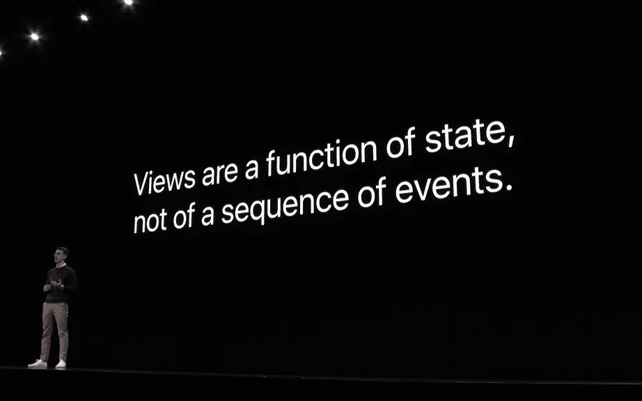

# 谁说我们不能对 SwiftUI 视图进行单元测试？

> 原文：<https://betterprogramming.pub/hacking-swiftui-for-unit-testing-and-runtime-inspection-5f6329ff1697>

## 创建单元测试框架背后的故事


美国宇航局在 [Unsplash](https://unsplash.com?utm_source=medium&utm_medium=referral) 拍摄的[照片](https://unsplash.com/@nasa?utm_source=medium&utm_medium=referral)

维克多·切尔诺梅尔金，一位 90 年代的俄罗斯政治家，曾经说过:

> 这种事以前从未发生过，现在又发生了

这让我想起了我们发现自己在 SwiftUI 中的处境:我们有一个全新的、令人兴奋的技术——但是有稳定性问题、不完整的 API 和稀缺的文档。这种事以前从未发生过，现在又发生了。

无论如何，事情并没有想象的那么糟糕，团队已经开始在生产项目中采用 SwiftUI。尽管如此，反对在生产中使用它的一个主要理由是完全没有能力对 UI 进行单元测试。



[swift ui-WWDC 2019 数据流程](https://developer.apple.com/videos/play/wwdc2019/226/)

状态函数应该很容易测试——只需一个`if` 。我们需要访问该函数的输出。

SwiftUI 中的视图相互嵌套，形成了一个静态类型的结构层次结构，没有 API 来检查视图的内容。

有一天苹果可能会发布 SwiftUI 的单元测试工具，但谁知道这是否/何时会发生。

所以我决定造一个。

# 该工具

由于无法访问 SwiftUI 的内部[阴影属性图](https://worthdoingbadly.com/swiftui-html/)，我尝试使用 Swift 的反射 API。当我们在调试器中的断点处停止时，Xcode 用它来打印变量的内容。SwiftUI 视图中可用的信息之多让我感到惊讶。

原来 SwiftUI 视图有一个非常分支的内部结构，所以我必须实现的第一件事是内部属性的递归遍历:

如果您为简单的视图层次结构调用此函数，如下所示:

…你会得到一个相当长的输出。但是，可以用更易读、更简洁的方式对其进行重组:

```
"view" of type AnyView
  ↳ "storage" of type AnyViewStorage<Text>
      ↳ "view" of type Text
          ↳ "modifiers" of type Array<Modifier>
              ↳ value = []
          ↳ "storage" of type Storage
              ↳ "verbatim" of type String
                  ↳ value = "Hello, world!"
```

我有一种直觉，那就是事情不可能这么简单——肯定有一堵墙，我不能仅仅通过反射来穿过它，但我很好奇我能挖多远。

事实证明，在前进的道路上有许多陷阱在等待着我:

1.  反射中的所有类型都被擦除到`Any`
2.  计算属性，如`var body: some View`，在反射中不可用
3.  有一些通用的私有结构和函数类型，很难将值转换为这些类型
4.  很难初始化所有`init`方法都是私有的结构
5.  SwiftUI 依赖需要通过`Environment`注入
6.  在对输入进行微小的调整后，层次结构会有显著的变化——例如，`Text("Hi")`与`Text(hiValue)`
7.  总的来说，有很多关于私人建筑的模糊和信息的缺乏

在本文中，我将讨论我遇到的有趣的用例以及我应对挑战的方法，但在此之前，让我向您展示我经过几天的反复试验后得到的结果:

[](https://github.com/nalexn/ViewInspector) [## nalexn/ViewInspector

### ViewInspector 是一个用于对基于 SwiftUI 的项目进行单元测试的库。它允许在…中遍历 SwiftUI 视图层次结构

github.com](https://github.com/nalexn/ViewInspector) 

使用这个库，您可以从层次结构中提取您的自定义视图，并在单元测试中评估它的状态:

您可以从标准 SwiftUI 视图中读取实际值，例如`Text`的`String`值。

还可以代表用户以编程方式触发副作用:

到目前为止，该框架支持 iOS 和 macOS 的 SwiftUI 中可用的大多数视图，以及使用`UIViewRepresentable`从 UIKit 移植的视图:

> `*AnyView*`*`*Button*`*`*DatePicker*`*`*Divider*``*EquatableView*`*`*ForEach*`*`*Form*`*`*GeometryReader*`*`*Group*``*GroupBox*`*`*HSplitView*`*`*HStack*`*`*Image*` `*SecureField*`*`*Slider*`*`*Stepper*`*`*TabView*`*`*Text*`*`*TextField*`*`*Toggle*`*`*VSplitView*`*`*VStack*`*`*ZStack*`*******************

**我最终确实撞上了几堵牢不可破的墙，但总的来说，我对结果很满意。**

**好了，是时候讲一些黑客故事了。**

# **在不调用`init()`的情况下创建结构**

**有一个有趣的 SwiftUI 视图提供了关于视图容器大小的信息:`GeometryReader`。**

**反射显示该视图不直接存储包含的视图。相反，它为构建封闭视图提供了一个闭包。闭包有一个参数——`GeometryProxy`值。**

**这意味着在上面的例子中获得`Text`视图的唯一方法是用`GeometryProxy`调用这个闭包。**

**好吧，幸运的是，`GeometryProxy`是一个公共结构，但是它没有任何公共初始化器。**

**没有工厂，怎么构建价值？**

**与对象相反，值类型不需要存储指向父类的指针来进行自我标识，这意味着即使内部没有`isa`指针，它们也能保持功能...我有一个疯狂的想法，我决定尝试一下。**

**起初，我想找出`GeometryProxy`占用的字节数。Swift 为此提供了`MemoryLayout`:**

```
**MemoryLayout<GeometryProxy>.size
>> 48**
```

**有两种方法可以分配内存:在堆栈上和在堆上。**

**后者更加灵活，因为您可以指定所需的字节数:**

```
**let pointer = UnsafeMutableRawBufferPointer
                  .allocate(byteCount: 48, alignment: 8)**
```

**但是动态内存需要用`deallocate()`手动释放，并且比在堆栈上分配要慢，所以我决定用第一个选项，这更奇怪。**

**我需要声明一个取相同字节数的值类型:48。我给`MemoryLayout`打了一个`Double`的电话，不出所料，得到了以下消息:**

```
**MemoryLayout<Double>.size
>> 8**
```

**所以如果我声明了一个结构体，比如说，它保存了六个 doubles。它的总内存大小应该是 48:**

```
**struct Allocator {
    let data: (Double, Double, Double, 
               Double, Double, Double) = (0, 0, 0, 0, 0, 0)
}
MemoryLayout<Allocator>.size
>> 48**
```

**太好了！最后一步是转换类型:**

```
**let proxy = unsafeBitCast(Allocator(), to: GeometryProxy.self)**
```

**它还活着。活着！**

**当然，不能保证假的`GeometryProxy`会正确工作，因为内部变量可能不期望为零，但是，幸运的是，这工作得很好:**

```
**proxy.size
>> CGSize(0, 0)**
```

**我有一个想法，找到负责存储`CGSize`的字节的位置，并用自定义值初始化它们。但是反射表明`size`，就像`GeometryProxy`上的所有其他公共变量都是计算出来的，所以没有办法实现这一点。**

**所以在我用这个 Frankenstein 结构调用了`GeometryReader`上的工厂闭包之后，我得到了包含的视图，没有任何问题。当然，视图的布局是混乱的，但是至少可以安全地提取值，比如`Text`上的字符串。**

# **强制转换为未知的泛型类型**

**另一个值得注意的案例是`ForEach`。为了探索内部机制，我做了一个简单的设置，将一组字符串转换为`Text`视图:**

```
**let array = ["0", "1", "2"]
let view = ForEach(array, id: \.self) { Text($0) }**
```

**我的 BFG10K 函数`attributesTree(value:)`显示如下:**

```
**"view" of type ForEach<Array<String>, String, Text>
  ↳ "data" of type Array<String>
      ↳ value = ["0", "1", "2"]
  ↳ "content" of type (String) -> Text
  ↳ "idGenerator" of type WritableKeyPath<String, String>
      ↳ value = WritableKeyPath<String, String>
  ↳ "contentID" of type Int
      ↳ value = 0**
```

**所以我可以使用内容构建器闭包`content: (String) -> Text`提取`Text`视图，方法是向它提供一个`data: [String]`数组的元素。**

**我需要做的就是将`data`和`content`从反射的默认类型`Any`转换成正确的类型:**

**当然，硬编码类型`String`和`Text`不会为任意的`ForEach`工作，所以我需要从别处获取类型。**

**用`type(of: value)`动态获取类型的天真尝试并没有让编译器高兴——它需要在编译时知道类型。基本上这不是一个有效的代码:`let casted = value as? type(of: value)`。**

**好了，类型信息应该在编译时就知道了。我们能从哪里得到它？**

**我想到的第一个可行的解决方案是从调用者端提供类型:**

**我不喜欢这种方法，因为它体积大，不方便使用，所以我求助于下面的方法。**

**我已经声明了一个删除类型的中间件协议，并扩展了`ForEach`以符合该协议。诀窍在于，在`ForEach`的扩展中，我们有内容提取所需的内部类型信息:**

**所以最初的提取函数现在只需要将`view: Any`转换成中间件协议并调用`extractContent()`。因为`ForEach`现在符合该协议，所以转换成功，并且提取按预期工作:**

# **SwiftUI 的原生环境注入**

**SwiftUI 通过`@ObservedObject`、`@EnvironmentObject`和`@Environment`属性提供了一个非常方便的依赖注入机制。**

**虽然在检查框架中支持`@ObservedObject`没有任何实际问题，但我不得不花相当多的时间试图找出如何注入`@EnvironmentObject`。**

**当一个视图通过`.environmentObject(...)`接收到一个传统的 DI 注入时，它被包装到一个`ModifiedContent`类型的视图中。这种类型的视图在 SwiftUI 中广泛使用，用于对视图进行各种调整，例如`.padding()`、`.blur(radius:)`等。**

**`ModifiedContent`是相当透明的——它的一个属性`content`提供了封闭的视图，可以很容易地提取出来。**

**问题出在另一个属性`modifier`，它通常指的是一个*半私有*类型的值，比如`_PaddingLayout`。我称它们为半私有，因为如果你将它们粘贴到源代码中，Xcode 会识别这些类型，但是它们的符号被排除在公共头文件之外。如果您按住 control 键点按并选择“跳到定义”，Xcode 将无法找到它们。**

**对于某些类型，Xcode Autocomplete 会显示一些实例变量——例如，`_PaddingLayout`有`var edges: Edge.Set`和`var insets: EdgeInsets?`。**

**所以回到注入`@EnvironmentObject`的问题:视图被包装在`ModifiedContent`中，其中`modifier`具有类型`_EnvironmentKeyWritingModifier<InjectedObject?>`。**

**这个修饰符没有公共方法，下面是当我们注入一个类型为`InjectedObject`的对象时，反射显示的内容:**

```
**"modifier" of type _EnvironmentKeyWritingModifier<InjectedObject?>
   ↳ "keyPath" of type WritableKeyPath
       ↳ value = WritableKeyPath<EnvironmentValues, InjectedObject?>
   ↳ "value" of type InjectedObject?
       ↳ value = InjectedObject(...)**
```

**它确实保留了对`InjectedObject`的引用，并且还有一个`WritableKeyPath`用于`EnvironmentValues`。**

**那些`EnvironmentValues`很神秘。到目前为止，我知道`@EnvironmentObject`和`@Environment`都在使用它来存储 SwiftUI 视图使用的值，但是我的实验表明`EnvironmentValues`只在渲染时提供给视图层次结构——并且在渲染后被撤回。**

**尝试运行以下代码:**

**您将看到在渲染周期之外异步读取`@EnvironmentObject`是被禁止的——您将得到相同的崩溃，就好像您从未在`.environmentObject(...)`调用中提供过`InjectedObject`。**

# **检查框架背后的设计决策**

**我想让图书馆安全又方便使用。我只知道调用者端的语法应该是什么样子:它应该被链接到像`view.anyView.hStack.button`这样的调用。**

**很明显，每个中间元素都应该返回一个静态类型的值来限制可用选项:为`AnyView`调用`.tap()`或为`Text`调用`.hStack`是没有意义的。**

**其中一个选择是创建一个面向对象的类层次结构，但是在使用了几年面向函数和面向协议的编程之后，我对 OOP 产生了强烈的过敏。**

**所以我决定使用一个统一的结构`InspectableView`，并将多态行为封装在它的泛型参数`View`中:**

```
**struct InspectableView<View> {
    let view: Any
}**
```

**起初，我以为我会使用 SwiftUI 视图作为`View`参数，但我很快意识到大多数 SwiftUI 视图也有通用参数。像`InspectableView<HStack<VStach<Text>>>`这样的结构操作起来会过于笨重和脆弱。**

**相反，我创建了一个空的`struct ViewType { }`作为未来视图类型的基本名称空间，例如，`ViewType.Button`代表`Button`视图。**

**我认为库的用户可能会错误地认为他们可以在那个参数中替换 SwiftUI 视图。为了帮助他们快速识别这是错误的路径，我对泛型类型进行了限制，以符合一个简单的协议`KnownViewType`，SwiftUI 视图默认不符合该协议:**

**现在已经准备好开始用泛型构建多态行为了。**

**SwiftUI 中的视图可以包含单个视图(`AnyView`)、一组视图(`HStack`)，或者不包含其他视图(`Text`)。**

**为了封装这个行为，我定义了两个协议:`SingleViewContent`和`MultipleViewContent`。**

**现在，任何`ViewType`都能够根据其性质采用内容提取策略:**

**对于像`Text`这样没有包含视图的视图，它的同伴`ViewType.Text`简单地选择不遵守这些协议。**

**现在每个`ViewType`都可以宣布其提取内容的策略。**

**难题的最后一部分是添加方法，比如从父节点中提取*的`.hStack`。***

**这个很简单——我只是用一个以要提取的视图类型命名的方法扩展了`InspectableView where View: SingleViewContent`,允许这样的视图用`.hStack`继续这个链，例如:**

**为`MultipleViewContent`也定义了类似的扩展。**

**最后，对于像`ViewType.Button`这样的类型，我可以添加对像`.tap()`这样的方法的独占支持。**

**通过这种方法，`InspectableView`获得了一组可用于特定`ViewType`的受控方法，消除了使用视图提取库时可能出现的逻辑错误。**

# **结论**

**这就是创建 ViewInspector 框架背后的故事。如果你有一个 SwiftUI 项目，你想用 unit yests 来覆盖它——考虑尝试一下。**

**[](https://github.com/nalexn/ViewInspector) [## nalexn/ViewInspector

### ViewInspector 是一个用于对基于 SwiftUI 的项目进行单元测试的库。它允许在…中遍历 SwiftUI 视图层次结构

github.com](https://github.com/nalexn/ViewInspector) 

如果你想更好地理解内部使用的 SwiftUI 机制，使用那个函数`attributesTree(value:)`，破解那些黑盒视图。**