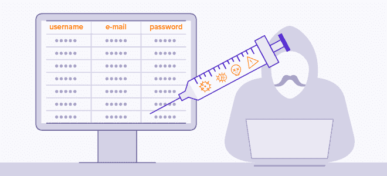
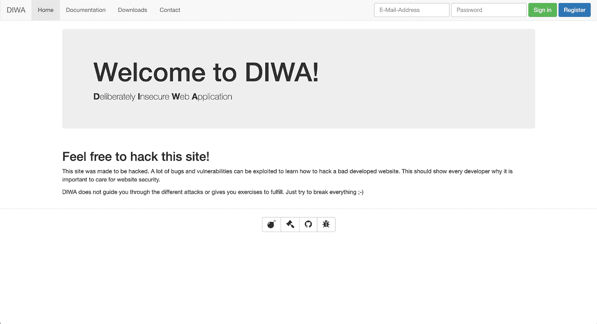
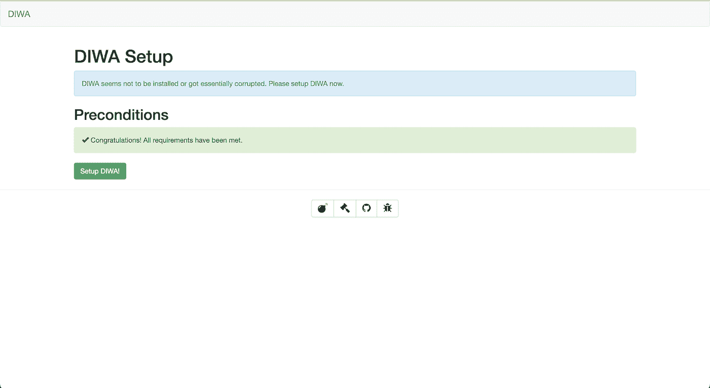
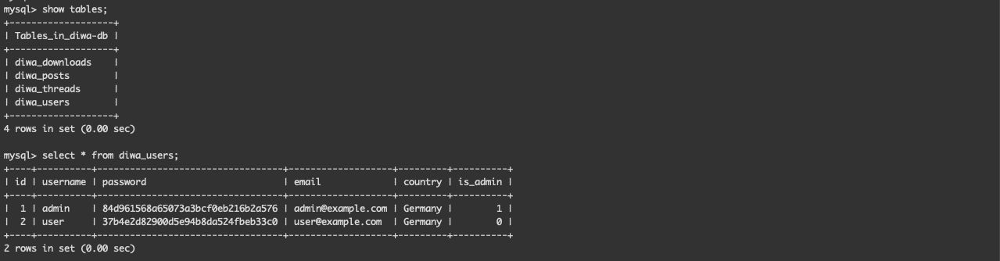
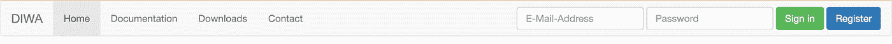
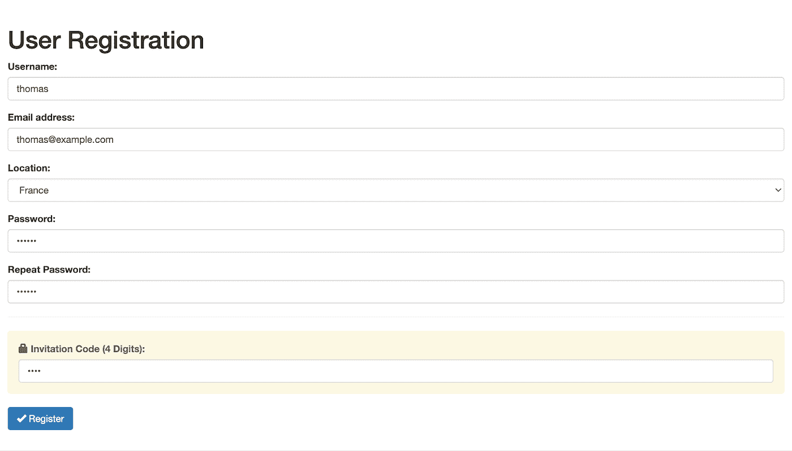
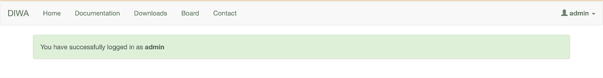
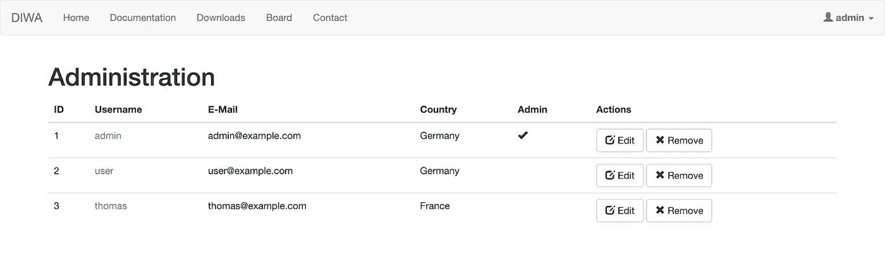
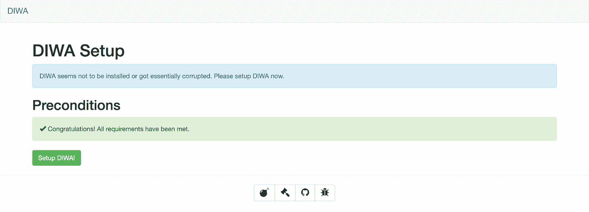
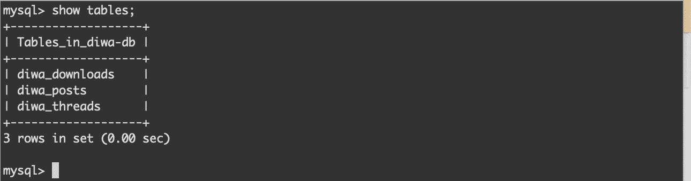

# 用 SQL 注入攻击 Web

> 原文：<https://betterprogramming.pub/hacking-the-web-with-sql-injections-cd418d84219a>

## 关注 SQL 注入、PHP 和 Diwa 项目


卡斯帕·卡米尔·鲁宾在 [Unsplash](https://unsplash.com?utm_source=medium&utm_medium=referral) 上的照片

我一直想成为一名黑客。6 年来，我一直用 Php、JavaScript 和 Python 编写应用程序。在我学习期间，老师们谈到了 SQL 注入以及如何防止 SQL 注入。但是我从来没有进行过 SQL 注入、身份验证失败或跨站脚本之类的攻击。这是我知识中缺失的一块，我正在寻找机会去了解更多。因此，当我的团队中有人最近找到我，主动提出做一些研究时，我是世界上最幸福的人。

这个帖子会有后续。这只是我入侵网络、了解安全漏洞和享受乐趣的开始。在这篇文章中，我将谈论一种特定类型的注入:SQL 注入。我将讲述历史，解释来龙去脉，执行攻击，并告诉您如何保护您的应用程序。我们将使用 Php 和 MySQL。如果您使用另一种编程语言，请不要难过:更多内容即将推出。

现在，带上你的头罩，启动你最喜欢的电子音乐播放列表，让我们开始黑吧！

# SQL 注入如何工作



资料来源:avast.com

在说 SQL 注入之前，先说注入。注射是最古老和最常见的攻击之一。注入攻击是注入网络的恶意代码，其目标是从数据库中获取信息。它们以 web 应用程序(不仅仅是 Php 应用程序)为目标，可能导致数据失窃或丢失。在最坏的情况下，它们会危及您的整个系统:您将无法再登录和访问您的服务。换句话说，这是不好的。我是说非常非常糟糕。假设您管理一家医院，有数百名等待手术的患者，您记录了他们的安全号码、电子邮件和其他敏感信息。注射会阻塞你的整个系统，黑客可以获取、出售和使用这些信息。有不同类别的注入，如 SQL 注入、跨站点脚本或 CRLF 注入。本文主要关注 SQL 注入。

# 注入攻击是如何发生的？

主要原因是用户输入验证不足。换句话说，这意味着从开发人员的角度来看，您的代码不安全，您的查询也不安全。如果您想修复它们，您需要停止使用动态查询，并在执行查询时保护您的代码。这就是为什么我们在 Php 中使用准备好的请求，因为它们阻止了 SQL 注入。

上面的代码来自 Diwa 项目，位于[model.php](https://github.com/tdimnet/diwa/blob/master/app/includes/model.php)文件中。看第 16 行，这是安全漏洞所在。这行代码在 SQL 中执行以下语句:

```
'SELECT * FROM users WHERE email = ‘$email’ AND password = ‘$password’;'
```

这一行的目的是验证数据库中是否存在用户，如果存在就返回。在表单内，攻击者可以编写`'OR '1'='1''`，这将执行以下查询:

```
'SELECT * FROM users WHERE email = ‘$email’ AND password = ‘$password’ OR ‘`1’ = ‘1’’;'
```

这是一个有效的 SQL 语句，因为`'1'='1'` `'1' = '1 ' `总是为真，所以查询将返回用户表中的所有行。如果您在 Diwa 项目中这样做，您将作为管理员登录(我们稍后将这样做)。但是您可以做得更多，如果 users 表很大并且包含数百万行，您可以删除一个表，甚至执行 DoS(拒绝服务)攻击。例如，你可以加上`thomas@example.com'; DROP TABLE users;`。它将执行以下代码:

```
'SELECT * FROM users WHERE email = thomas@example.com'; DROP TABLE users;
```

为什么有效？因为您正在完成第一条 SQL 语句，并在其后添加另一条语句。是的，我知道，很疯狂。

# 如何防止 Php 中的 SQL 注入？

这是一个经验法则:总是验证用户输入。你的大多数用户都不想破坏你的网站，互联网上并不是到处都是黑客。但是，您不应该直接从用户输入构建 SQL 语句。您可以使用两种方法:

*   用 [real_espace_string](https://www.php.net/manual/en/function.mysql-real-escape-string.php) 等函数转义你的字符串。该函数将转义字符串中的特殊字符，以便在 SQL 语句中使用。
*   [使用准备好的请求](https://www.php.net/manual/en/pdo.prepare.php)这将允许您准备一个以空值作为占位符的 SQL 查询，然后将变量绑定到占位符，最后执行查询。上面的代码片段是一个准备好的请求。准备好的请求还可以减少解析时间，因为只需准备一次查询。

幸运的是，大多数 Php 框架，如 Symfony 和 Laravel，为你使用准备好的请求，当你做简单的请求时，你会使用 ORM，比如 Doctrine，这样会更安全。编写原始查询时会出现问题。

# 以故意不安全的 Web 应用程序为例



来源:作者—地洼的欢迎画面

如果你想了解更多关于安全的知识，网上有大量的项目。幸运的是，OWASP 的网站上有一个列表。在那里你可以找到许多不同编程语言的例子。出于一些原因，我决定从 Php 和 Diwa 项目开始:

*   该项目使用 Docker，并在盒子外面工作。您从 GitHub 克隆它，构建 docker 映像，运行容器，就可以开始了。
*   这也很容易理解。很快我们将涵盖更复杂的项目，但从简单的项目开始总是更好，尤其是在学习新东西的时候。
*   Diwa 是用 Php 编写的，它是一种被很多人使用的编程语言。我不是来告诉你 Php 到底好不好的。但是我可以告诉你，78.9%的网站使用 Php。这些是事实。
*   最初，该项目使用 SQLite，但我想用 MySQL 代替。对我来说，编辑配置并添加 docker-compose 和 MySQL 非常简单。

在查看我所做的修改之前，让我们先在本地构建项目。复制一个`.env.example`并将其命名为`.env`。你不需要在里面添加任何东西:我们将在另一个帖子中使用它。

```
$ docker-compose build
```

通过运行以下命令开始。它将构建 Php 镜像并安装库，包括`pdo`和`pdo_mysql`。

```
$ docker-compose up
```

然后，启动您的容器。这个命令创建了三个容器:Diwa 的应用程序、datadog-agent(今天不需要看它)和 MySQL 数据库。一旦所有的图像都被提取出来，进入 [http://localhost:8080](http://localhost:8080) 。



来源:作者—点击设置 Diwa，你就可以开始了！

点击“设置地洼！”按钮:它创建数据库表并在其中添加内容。恭喜你，迪瓦现在已经开始运行了！



您的地洼数据库应包含以下表格

在我们对 Diwa 进行攻击之前，您应该知道我对项目源代码做了一些修改。

我更新了`config.php`文件，以便使用 MySQL 而不是 SQLite。我还在`app`容器中添加了 pdo librairies。它们在 Dockerfile 里面。

我还通过将`$config['database']['host']`改为`$config['database']['server']$`修复了第 10 行的一个错别字。让我们黑掉我们的项目吧！

# 攻击和执行 SQL 注入的时间到了

首先，如果不是这样，用 docker 启动项目——用`docker-compose build`和`docker-compose up`组合。查看屏幕顶部的*“电子邮件地址”*
和*“密码”*输入。



来源:作者—顶部导航栏

首先点击注册按钮，创建一个帐户。**邀请码为 3702** 。可以在`config.php`文件中找到。



来源:作者—登记表

您现在应该已经登录了。如果不是，这意味着在引导项目时出错了。建议大家在评论区提问。现在，您可以注销并返回主页。尝试编写无效凭据，看看会发生什么。您应该会看到以下错误消息:*“错误的电子邮件地址或密码”*。现在我要你在电子邮件输入中写下`'--`，在密码栏中写下一些随机字符。


来源:作者

你应该有一个不错的 500 错误。这意味着服务器发生了不好的事情，糟糕到服务器产生错误。这也意味着它告诉我们，也许这个网站是不安全的。我们现在要用我找到的一张不错的小抄来尝试一些攻击。查看绕过登录屏幕部分，并尝试编写其中的一些。例如，以下命令似乎会导致错误:`admin'--`、`'admin'/*`或`1=1--`。这个`'or 1=1#'`会让你以管理员的身份登录。根据安装的数据库，一些命令会发生变化。但是这里为了简单起见，首先用`` `结束查询的第一部分，并注入一个始终为真的验证。你也可以在日志中写`'1=1;`,这样就可以了。



来源:作者——是的，我现在是一名管理员

是的，您将能够看到用户列表并采取各种操作，例如编辑他们的凭据、将用户提升为管理员，甚至删除他们的帐户。



来源:作者-因为我是管理员，我可以编辑和删除所有帐户

我们现在能够侵入日志页面，删除一些表怎么样，比如用户表。我已经知道了一些攻击者不会做的事情:我知道表有前缀`diwa`。例如，用户表是`diwa_users`。这是创建表格时的一个好习惯:不要只称它们为`users`或`products`。尽量加个前缀，比如`your-project_table` ，这样会让你的 app 更安全。我之前要求你创建一个帐户。这就是我们要用它的地方。我希望您询问您的电子邮件地址和密码，但在验证之前，在您的电子邮件地址后添加以下内容:`'DROP TABLE diwa_users;`。应该是这样的。现在深呼吸，按下回车键。


来源:作者—我将删除 diwa_users 表

**看下面截图。我放弃了 diwa_users 表，我不再能够登录和注册。**



来源:作者——是的，现在数据库被破坏了

如果你查看数据库，diwa_tables 现在已经不存在了。吓人吧？



source:author—在这里，我在命令行中访问我的 SQL

重置您的数据库并重新创建一个帐户。我们现在要让数据库休眠。不是添加`DROP TABLE`，而是在登录输入的末尾添加`AND sleep(20);`并点击 enter。你有没有注意到你的请求花费了太多的时间？这是因为执行了*【睡眠】*命令。考虑到这一点，您现在应该尝试创建一个无限循环并让数据库出汗！你可以在评论区添加我们的答案，我会告诉你你是否在正确的轨道上！

# 迎头赶上

我真的希望你喜欢这个内容 SQL 注入。现在，您应该知道了如何进行攻击和防止攻击的基本知识。我目前正在写一篇关于如何建立一个可观察性工具的教程，以便在攻击发生时得到提醒。特别感谢 Tim Steufmehl 创建这个项目和 Tambi Gumbo 的评论。

我要讨论的下一个攻击可能是跨站点脚本。我不知道我是否会使用这个项目或另一个。在任何情况下，我都将应用相同的结构:攻击的描述，如何防止它，并执行示例攻击。

祝大家愉快！