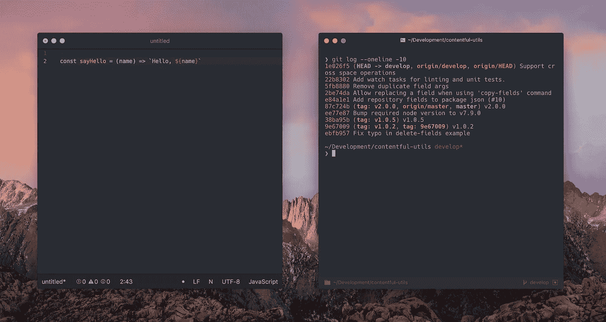
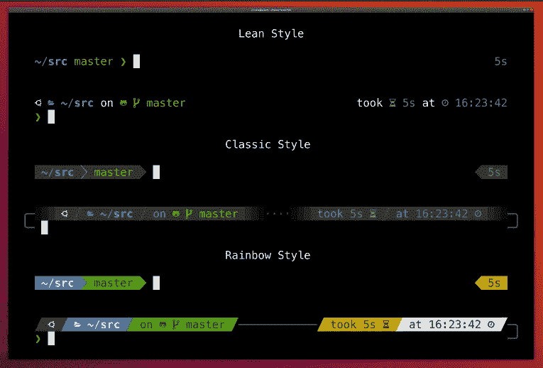
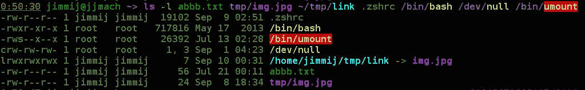
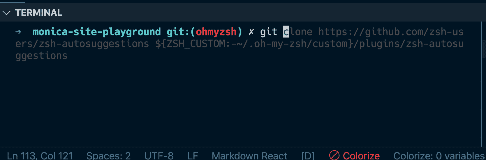
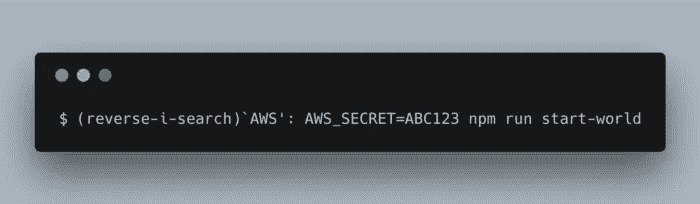
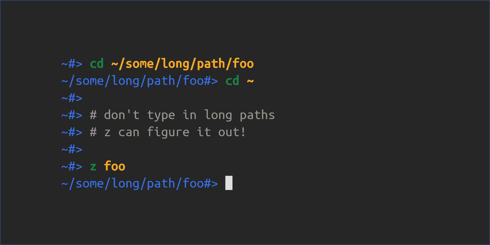

# 入侵你的项目

> 原文：<https://betterprogramming.pub/hacking-your-iterm-5d2bdacdaccf>

## 通过定制 iTerm 提高您的命令行效率

图片来源——谷歌

> 一些开发人员一想到打开终端窗口就畏缩不前。对于门外汉来说，这可能是令人生畏的，有压力的，甚至是令人讨厌的。但是了解命令行的开发人员会说它是你可以使用的最好的工具之一。— [杰克·罗切罗](https://www.hongkiat.com/blog/author/jake/)

那么有必要进行现代软件开发吗？不完全是！你仍然可以做所有的事情，但是你可能会错过随之而来的乐趣和效率。

没错，这是有部分原因的。就像你不会到处都有 UI 一样。例如，许多工具现在正转向内部部署。此外，这是容器的世界，你必须使用命令行。如果你不太了解命令行，那么无论你在 UI 上有多高效，你都可能会受到影响。

开发人员应该尽量减少鼠标的使用——从长远来看，为了提高工作效率，必须增加对快捷键的依赖。

用户界面的使用不仅让你每次浏览的速度慢了几秒钟，还让你有了不去记很多快捷方式的自由，这些快捷方式让你的工作生活更加轻松。这不仅适用于命令行，也适用于使用任何类型的编辑器。

一个简单的例子是导航到一个文件，在编辑器中打开它，而不是使用一个快捷方式，在这里你可以简单地键入文件名来打开它，当你这样做时，你知道哪一个更快。

现在我们再回到正题。以下是我对这篇文章的安排:

1.  iTerm
2.  功率级 10k
3.  语法突出显示
4.  自动建议
5.  反向搜索
6.  自动跳转
7.  导航到命令行
8.  控制你的大写字母锁定

# iTerm

Mac 带有内置终端，这是基本的，可以定制。

iTerm 就像它的一个包装器——更像是一个定制版本，给了我们更多的功能——比如在命令行上提供一些花哨的东西，比如颜色。

图像来源— iTerm

参见安装链接—【https://iterm2.com/ 

# 功率级 10k

一旦您准备好将 iTerm 作为您的默认终端，让我们使用 powerlevel10k 进一步定制它。

图片来源— powerlevel10k github

请参考安装指南—[https://github.com/romkatv/powerlevel10k](https://github.com/romkatv/powerlevel10k)

# 语法突出显示

powerline10k 将允许您以多种方式定制您的命令行，但是您将在终端中执行的实际命令将仍然与现在相同，并且您在键入或执行它时不会看到任何差异。

启用语法突出显示会给你一种类似编辑器的感觉，你知道你是否键入了正确的命令。

图片来源——谷歌

请参考安装指南—[https://github . com/zsh-users/zsh-syntax-highlighting/blob/master/install . MD](https://github.com/zsh-users/zsh-syntax-highlighting/blob/master/INSTALL.md)

# 自我暗示

如果 IDE 能给你自动提示，为什么你的终端不能呢？自动建议插件将使用您的`zsh`历史来建议您键入的命令。

图片来源——谷歌

参考安装指南—[https://github . com/zsh-users/zsh-auto suggestions/blob/master/install . MD](https://github.com/zsh-users/zsh-autosuggestions/blob/master/INSTALL.md)

# 反向搜索

您可以在终端中按上下箭头来浏览您的历史记录。这是按时间顺序浏览你的历史。

按下向上箭头将在您的历史记录中提前一个条目。按下向下箭头将在您的历史记录中稍后进入一个条目。

图片来源——谷歌

这对于您 5 分钟前运行的命令来说很方便。但是当你在搜索一个你 5 天前用过的晦涩的命令时，它会变得难以使用。

相反，我们可以使用`reverse-i-search`。

> `*reverse-i-search*` *:从当前行开始向后搜索，必要时在历史中“向上”移动。这是一个增量搜索。(* [*来源*](https://www.gnu.org/software/bash/manual/html_node/Commands-For-History.html) *)*

再次按下`ctrl + r`，浏览`history`中与您的搜索词匹配的早期条目。

# 自动跳转

自动跳转是导航文件系统的一种更快的方式。它的工作原理是通过命令行维护一个包含您最常用的目录的数据库。

图片来源——谷歌

*必须先访问目录，然后才能跳转到这些目录。*

参见安装指南—[https://github.com/wting/autojump](https://github.com/wting/autojump)

# 导航到命令行

我见过人们在终端中一个字符一个字符地输入，这有时真的很慢很烦人，当你可以一个字一个字地导航或者使用快捷键跳到一行的开头或结尾时，为什么还要这样做呢

我可以手动键入文章中的所有快捷方式，但我们正在谈论生产力，已经有一些优秀的人创建了一个不错的小备忘单，你可以遵循。

命令行备忘单—【https://gist.github.com/squarism/ae3613daf5c01a98ba3a 

最好还能突出几个常用的:

*   新标签— `⌘` + `T`
*   关闭标签或窗口— `⌘` + `W`(与许多 mac 应用程序相同)
*   转到选项卡`⌘`+`Number Key`——(即:`⌘2`是第二个选项卡)
*   垂直分割窗口(相同轮廓)——`⌘`+`D`
*   水平分割窗口(相同轮廓)— `⌘` + `Shift` + `D`(助记:shift 是宽水平键)
*   按使用顺序转到拆分窗格— `⌘` + `]`，`⌘` + `[`
*   前一个标签`⌘`+`Left Arrow`——(我通常按标签号移动)
*   下一个标签`⌘` + `Right Arrow`
*   最大化一个窗格`⌘` + `Shift` + `Enter`(使用全屏来临时全屏一个窗格！)

# 控制你的大写字母锁定

由于许多快捷键使用 ctrl 作为它们的首字母，并且 caps-lock 是键盘上最不用的键，或者至少对我来说，我已经改变了它到控制键的映射。

> **MacOS** :在**系统偏好>键盘**中，你会发现右下角有一个底部标有**修饰键**。单击此处并转到大写锁定下拉列表。如果您想将 Caps Lock 键更改为 Control、Option 或 Shift，请使用下拉列表中的选项。如果要退格，**设置为无动作**。

现在，当我使用它时，控制就在我的手指附近，这让我的生活变得轻松。

做这项工作没有最好的方法。符合你需求的就是最适合你的。我提倡命令行的这种定制和快捷方式，因为它们在提高我的生产率和熟悉命令行方面帮助了我很多。

感谢阅读。